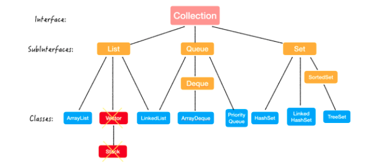
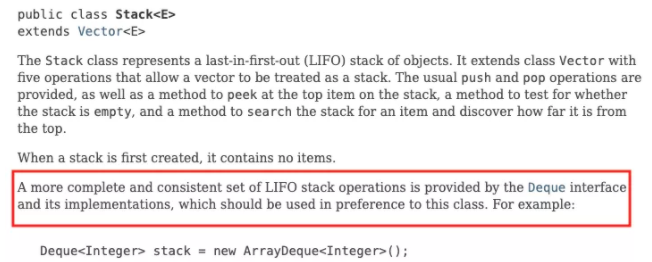

> 创建于 2021年5月25日
>
> 作者：[敖丙](https://mp.weixin.qq.com/s?__biz=MzAwNDA2OTM1Ng==&mid=2453144514&idx=2&sn=3b14fa92bd3d129d5c60a2eea0c5869f&scene=21#wechat_redirect)

[toc]



# 集合

Java 集合，也称为容器，主要由两大接口（Interface）派生出来的，Collection 和 Map

Collection 用来存放单一元素（单身狗），Map存放 Key-value键值对（情侣）


## 1、Collection

```sh
Collection
｜- List
｜
｜- Queue
｜
｜- Set
```

操作集合 无非是「增删改查」四大类

| 功能 |            方法             |
| :--- | :-------------------------: |
| 增   |       add()/addAll()        |
| 删   |    remove()/ removeAll()    |
| 改   | Collection Interface 里没有 |
| 查   |  contains()/ containsAll()  |
| 其他 | isEmpty()/size()/toArray()  |

具体操作：

**增：**

```java
boolean add(E e);
```

传入的数据类型必须是 Object 会自动拆装箱

```java
boolean addAll(Collection<? extends E> c);
```

把另外一个集合新增进去

**删：**

```java
boolean remove(Object o);
```

删除指定元素

```java
boolean remove(Collection<?> o);
```

删除一个集合中的所有元素

**查**

```java
boolean contains(Object o);
```

判断容器是否包含这个元素

```java
boolean contains(Object o);
```

是否包含了这个集合

**对空集合的操作**

```java
boolean isEmpty();
```

判断是否为空

```java
int size();
```

集合的大小

```java
Object[] toArray();
```

集合转数组

> 这些都在接口中定义好了，子类不要也得要

### 1.1、List

```sh
List
|-- ArrayList
|
|-- Vector\Stack
|
|-- LinkedList
```

List 最大的特点就是有序、可重复

这一下把 Set 的特点也说出来了，和 List 完全相反，Set 是 `无序`，`不重复`的。

List 的实现方式有 LinkedList 和 ArrayList 两种，那面试时最常问的就是这两个数据结构如何选择。

| 功能 |        方法         | ArrayList | LinkedList |
| :--- | :-----------------: | :-------: | :--------: |
| 增   |      add(E e)       |   O(1)    |    O(1)    |
| 增   | add(int index, E e) |   O(n)    |    O(n)    |
| 删   |  remove(int index)  |   O(n)    |    O(n)    |
| 删   |     remove(E e)     |   O(n)    |    O(n)    |
| 改   | set(int index, E e) |   O(1)    |    O(n)    |
| 查   |   get(int index)    |   O(1)    |    O(n)    |

- 而数组和链表的最大区别就是**数组是可以随机访问的（random access）**。

**所以说：**

1. **改查选择 ArrayList；**
2. **增删在尾部的选择 ArrayList；**
3. **其他情况下，如果时间复杂度一样，推荐选择 ArrayList，因为 overhead 更小，或者说内存使用更有效率。**

如果说 ArrayList 和 LinekList有什么区别，除了结构上，

+ 一个是线程安全的问题

+ 二个是扩容时扩容多少的问题

  + ArrayList 1.5倍  

    ```java
    int new = old + (old >> 1);
    ```

  + LinkedList 2倍

    ```java
    int new. = old + ((capacityIncrement>0)? capacityIncrement:old);
    ```


### 1.2、Queue & Deque

```sh
Queue
|-- LinkedList
|
|-- Deque
|   |-- ArrayDeque
|
|-- PriorityQueue
```


Queue 是一端进另一端出的线程数据结构，而Deque 是两端都可以进出的

一般的队列都是 FIFO（先进先出）但是又个例外，PriorityQueue 也叫 heap，并不是按照进去的时间顺序，而是按照规定的优先级出去，这个的算法就有点复杂了。

| 功能 |  抛异常   |  返回值  |
| :--- | :-------: | :------: |
| 增   |  add(e)   | offer(e) |
| 删   | remove()  |  poll()  |
| 瞧   | element() |  peek()  |

> 为什么会抛异常呢？

​		比如队列空了，那 remove() 就会抛异常，但是 poll() 就返回 null；element() 就会抛异常，而 peek() 就返回 null 就好了

**那 add(e) 怎么会抛异常呢？**

有些 Queue 它会有容量的限制，比如 **BlockingQueue**，那如果已经达到了它最大的容量且不会扩容的，就会抛异常；但如果 offer(e)，就会 return false.

**那怎么选择呢？：**

- 首先，要用就用**同一组 API**，前后要统一；
- 其次，根据需求。如果你需要它抛异常，那就是用抛异常的；不过做算法题时基本不用，所以选那组返回特殊值的就好了。

Deque 是两端都可以进出的，那自然是有针对 First 端的操作和对 Last 端的操作，那每端都有两组，一组抛异常，一组返回特殊值：

| 功能 |           抛异常            |           返回值            |
| :--- | :-------------------------: | :-------------------------: |
| 增   |   addFirst(e)/ addLast(e)   | offerFirst(e)/ offerLast(e) |
| 删   | removeFirst()/ removeLast() |   pollFirst()/ pollLast()   |
| 瞧   |    getFirst()/ getLast()    |   peekFirst()/ peekLast()   |

使用时同理，要用就用同一组。

Queue 和 Deque 的这些 API 都是 O(1) 的时间复杂度，准确来说是均摊时间复杂度。

实现类有：

+ LinkedList
+ ArrayDeque
+ PriorityQueue


1. 如果想实现「普通队列-先进先出」的，就是用 LinkedList 或者 ArrayDeque 来实现
2. 如果想实现「优先队列」的，就是用PriorityQueue
3. 如果想实现「栈」的，就泗洪 ArrayDeque

在实现普通队列时，**如何选择用 LinkedList 还是 ArrayDeque 呢？**

先说说区别：

1. ArrayDeque 是一个可扩容的数组，LinkedList 是链表结构
2. ArrayDeque 里不可以 null 值，但是 LinkedList 可以
3. ArrayDeque 在操作头尾端的增删改更高效，但是 LinkedList 只要先找到这个元素，再移除的时候才是 O（1）的

4. ArrayDeque 在内存使用方面更高效

==所以，只要不是存null 值，就用 ArrayDeque 吧！==

如果一个资深面试官问你，什么情况下选用。LinkedList 的呢？

==答：Java 6以前，因为 ArrayDeque 在 Java6以后才有的... 因为版本兼容问题，实际工作中不得不做一些妥协==  

> 想想问：什么妥协？

#### 1.2.1、Stack

Stack 的语义是 后进先出 （LIFO）的线性数据结构

虽然 Java 中有 Stack 这个类，但是呢，官方文档都说不让用了！



原因也很简单，因为 Vector 已经过被弃用了，而 Stack 是继承 Vector 的。

那么想实现 Stack 的语义，就用 ArrayDeque 吧：

```java
Deque<Integer> stack = new ArrayDeque<>();
```

### 1.3、Set

```txt
Set
|-- HashSet
|
|-- LinkedHashSet
|
|-- SortedSet
		|-- TreeSet
```

Set 的常用实现类有三个：

**HashSet**: 采用 Hashmap 的 key 来储存元素，主要特点是无序的，基本操作都是 O(1) 的时间复杂度，很快。

**LinkedHashSet**: 这个是一个 HashSet + LinkedList 的结构，特点就是既拥有了 O(1) 的时间复杂度，又能够保留插入的顺序。==可以插入null==

**TreeSet**: 采用红黑树结构，特点是可以有序，可以用自然排序或者自定义比较器来排序；缺点就是查询速度没有 HashSet 快。==不能插入null==

那每个 Set 的**底层实现**其实就是对应的 Map：

**数值放在 map 中的 key 上，value 上放了个 PRESENT，是一个静态的 Object，相当于 place holder，每个 key 都指向这个 object。**

那么具体的**实现原理**、**增删改查**四种操作，以及**哈希冲突**、**hashCode()/equals()** 等问题都在 HashMap 那篇文章里讲过了，这里就不赘述了。

