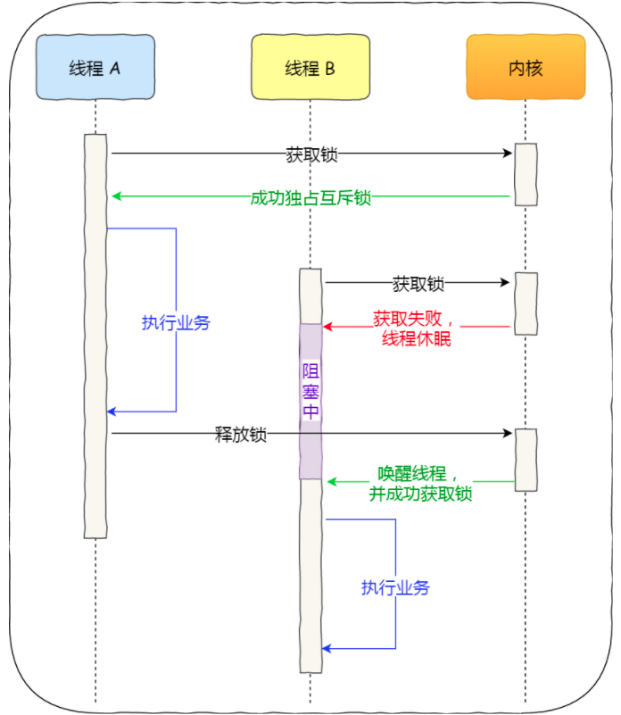
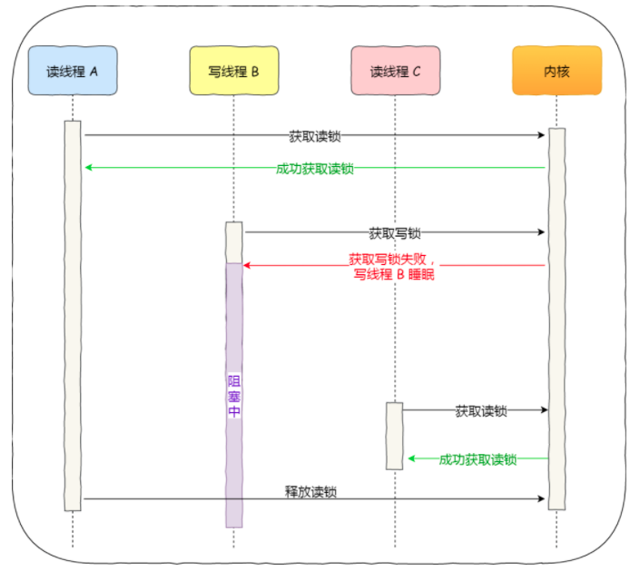
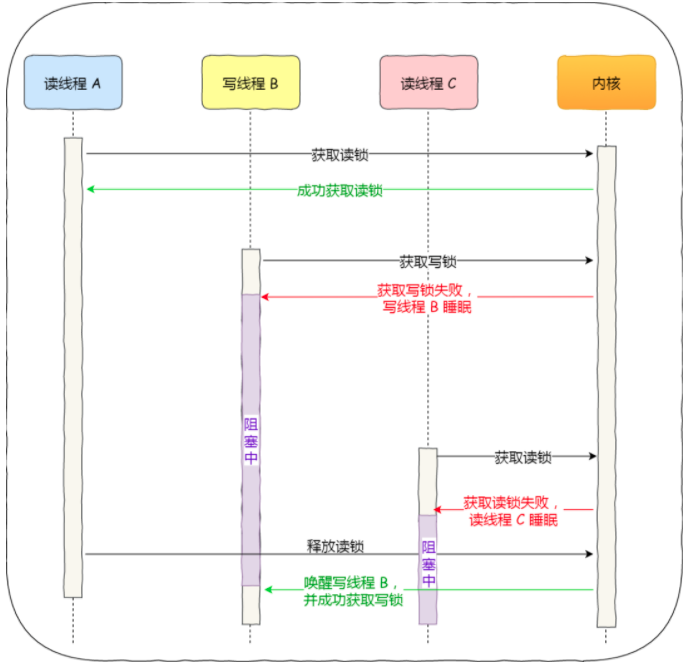

> 创建于 2021年5月31日
>
> 作者：

[toc]

> And in the end,the greatest thief of all is time

## 锁🔒

​		多线程访问共享资源的生活，避免不了资源竞争而导致错乱的问题，所以我们通常为了解决这一问题，都会在访问共享资源之前加锁。最常用的就互斥锁，当然，还有不同的锁==自旋锁==，==读写锁==，==乐观锁==等，不同种类的锁使用场景自然不同，如果选择了错误的锁，在高并发的场景下，可能会降低系统的性能，这样用户体验就非常差了。

​		所以，为了选择合适的锁，我们不仅需要清楚知道加锁的成本开销有多大，还有分析业务场景中访问的共享资源的方式，再来还要考虑并发访问共享资源时的冲突概率。

### 1、互斥锁、自旋锁

​		最底层的两种「互斥锁和自旋锁」很多高级的锁都是基于他们实现的，可以理解为锁基，加锁的目的就是保证共享资源在任意时间里，只有一个线程访问，这样就可以避免多线程导致共享数据错乱的问题。

​		当已经有一个线程加锁后，其他线程加锁则就会失败，互斥锁和自旋锁对于加锁失败后的处理方式是不一样的：

- **互斥锁**加锁失败后，线程会**释放 CPU** ，给其他线程；
- **自旋锁**加锁失败后，线程会**忙等待**，直到它拿到锁；

互斥锁是一种「独占锁」，比如当线程 A 加锁成功后，此时互斥锁已经被线程 A 独占了，只要线程 A 没有释放手中的锁，线程 B 加锁就会失败，于是就会释放 CPU 让给其他线程，**既然线程 B 释放掉了 CPU，自然线程 B 加锁的代码就会被阻塞**。

​		**对于互斥锁加锁失败而阻塞的现象，是由操作系统内核实现的**。当加锁失败时，内核会将线程置为「睡眠」状态，等到锁被释放后，内核会在合适的时机唤醒线程，当这个线程成功获取到锁后，于是就可以继续执行。如下图：

​		互斥锁加锁失败后，用户会陷入内核态，让内核帮忙切换线程，虽然简化使用锁的难度，但是存在一定的开销，开销成本就是：==会有两次线程上下文切换的成本==

+ 当线程加锁失败，内核会把线程的状态从「运行」状态设置为「睡眠」状态，然后把CPU切换给其他线程执行。
+ 接着，当锁被释放时，之前「睡眠」状态的线程又会变成「就绪」状态，然后内核会在合适的时间，把CPU交给他

> ​		线程的上下文切换的是什么?

​		当两个线程属于同一个进程，==因为虚拟内存是共享的，所以在切换时，虚拟内存这些资源就保持不动，只需要切换线程的私有数据、寄存器等不共享的数据。==

​		上下问切换的时间可能就在十几纳米到几微秒之间，但是如果你锁住的代码执行时间比较短，那可能切换上下文切换的时间比你锁住代码执行的时间还要长。

​		所以，如果你能确保锁住的代码执行时间很短，就不应该用互斥锁，而应该用自旋锁。否则就使用自旋锁

**自旋锁：**

​		通过 CPU 提供的 ==CAS== 函数（Compare And Swap），在「用户态」完成加锁和解锁操作，不会主动产生线程切换上下文，所以相比互斥锁来说，会快一些，开销也会小一些。

​		一般加锁的过程，包含两个步骤：

1. 查看锁的状态、如果是空闲，则执行第二步

2. 将锁设置为当前线程持有

   CAS 函数就把两个步骤合并成 一条 硬件级指令，形成==原子指令==，这样就保证了这两个步骤锁不可分割的，要么一次性执行完两个步骤，要么两个步骤都不执行。

​		使用自旋锁的生活，当发生多线程竞争锁的情况，加锁失败的线程会「忙等待」，直到它拿到🔒，这里的「忙等待」可用 ==while== 循环等待实现，不过最好是使用 CPU 提供的 ==PAUSE== 指令来实现「忙等待」因为可以减少循环等待时的耗电量

​		自旋锁上最比较简单的一种锁，一直自旋，利用CPU周期，知道锁可用， 需要注意，在单核 CPU 上，需要抢占式的调度器（即不断通过时钟中断一个线程，运行其他线程）。否则，自旋在单CPU上无法使用，因为一个自旋永远不会放弃 CPU

​		自旋锁开销小，在多核系统下一般不会主动产生线程切换，适合异步、协程等在用户态切换请求的编程方式，但如果被锁住的代码执行时间是成「正比」关系，我们需要清楚的知道这一点。

​		它俩是锁的基本处理方式，跟高级的锁都会选择其中一个来实现，比如读写锁即可选择互斥锁实现，也可以基于自旋锁实现。

### 2、读写锁：读写的优先级

​		读写锁从字面意思我们也可以知道，它由「读锁」和「写锁」两部分构成，如果只读取共享资源用「读锁」加锁，如果要修改共享资源用「写锁」加锁

​		==所以，读写锁适用于能明确却分读写操作场景==

**工作原理：**

+ 当「写锁」没有被线程持有时，多个线程能并发持有读锁，这大大提高了共享资源访问效率，因为「读锁」用于读取共享资源的场景，所以多个线程同时持有读锁也不会破坏共享资源的数据
+ 但是，一旦「写锁」被线程持有，读线程的获取读锁的操作会被阻塞，而且其他写线程的写锁操作也会被堵塞

​		所以说，写锁上独占锁，因为任何时刻，只能由一个线程持有写锁，类似互斥锁和自旋锁，而读锁上共享锁，因为读锁可以被多个线程同时持有。

​		知道了读写锁的工作原理后，我们可以发现，==读写锁在读多写少的场景，能发挥出优势==

​		另外，根据实现的不同，读写锁可以分为「读优先锁」和「写优先锁」

**「读优先锁」** 期望的是，读锁能被更多的线程持有，以便提高读写的并发性，它的工作方式是：当读线程 A 先持有了读锁，写线程 B 在获取写锁的时候，会被阻塞，并且在阻塞过程中，后续来的读线程 C 仍然可以成功获取读锁，最后直到线程 A 和 C 释放读锁，写线程 B 才可以获取到写锁。

**「写优先锁」**是优先服务写程序，当线程 A 先持有读锁，写线程 B 在获取写锁的时候，会被阻塞，并且在阻塞过程中，后续又来了 C获取读锁时会失败，于时读锁 C 被阻塞，这样只要等读锁 A 释放读锁后， 写线程 B 就可以成功获取读锁。

​		读优先锁对于读线程并发性更好，但也不是没有问题，我们试像一下，如果一直有读线程获取读锁，那么写线程将永远获取不到写锁，这就造成了写线程「饥饿」到现象

​		写优先锁可以保证写线程不会饿死，但是如果一直有写线程获取写锁，读线程也会被「饿死」

​		既然不管优先读锁还是优先写锁，对方可能都会「饿死」，那么我们就不偏袒任何一方，搞个「公平读写锁」

**「公平读写锁」**比较简单的一种方法锁：用队列把获取锁的线程排队，不管是写线程还是读线程都安装先进先出的原则加锁即可，这样读线程仍然可以并发，也不会出现「饥饿」的现象

### 3、乐观锁和悲观锁

前面提到的 互斥锁、自旋锁、读写锁、都属于悲观锁

悲观锁做事比较悲观，它认为多线程同时修改共享资源的概率比较高，于是很容易出现冲突，所以访问共享资源前，要先上锁。

乐观锁，假定冲突概率很低，它的工作方式是，先修改完共享资源，再验证这段时间内没有发生冲突，如果没有其他线程在修改资源，那么操作完成，如果发现有其他线程操作，就放弃本次操作

​		常见的 SVN 和 Git 就是用了乐观锁，先让用户代码，只有在提交的时候，才会判断是否冲突

==乐观锁碎安去除了加锁的操作，但是一旦发生冲突，重试的成本非常高，所以只在冲突概非常低，且加锁成本非常高的场景下，才考虑使用乐观锁==

### 总结：

开发过程中，最常见的就是互斥锁的了，互斥锁加锁失败时，会用「线程切换」来应对，当加锁失败的线程再次加锁成功后的这一过程，会有两次线程上下文切换的成本，性能损耗比较大。

如果我们明确知道被锁住的代码的执行时间很短，那我们应该选择开销比较小的自旋锁，因为自旋锁加锁失败时，并不会主动产生线程切换，而是一直忙等待，直到获取到锁，那么如果被锁住的代码执行时间很短，那这个忙等待的时间相对应也很短。

如果能区分读操作和写操作的场景，那读写锁就更合适了，它允许多个读线程可以同时持有读锁，提高了读的并发性。根据偏袒读方还是写方，可以分为读优先锁和写优先锁，读优先锁并发性很强，但是写线程会被饿死，而写优先锁会优先服务写线程，读线程也可能会被饿死，那为了避免饥饿的问题，于是就有了公平读写锁，它是用队列把请求锁的线程排队，并保证先入先出的原则来对线程加锁，这样便保证了某种线程不会被饿死，通用性也更好点。

互斥锁和自旋锁都是最基本的锁，读写锁可以根据场景来选择这两种锁其中的一个进行实现。

另外，互斥锁、自旋锁、读写锁都属于悲观锁，悲观锁认为并发访问共享资源时，冲突概率可能非常高，所以在访问共享资源前，都需要先加锁。

相反的，如果并发访问共享资源时，冲突概率非常低的话，就可以使用乐观锁，它的工作方式是，在访问共享资源时，不用先加锁，修改完共享资源后，再验证这段时间内有没有发生冲突，如果没有其他线程在修改资源，那么操作完成，如果发现有其他线程已经修改过这个资源，就放弃本次操作。