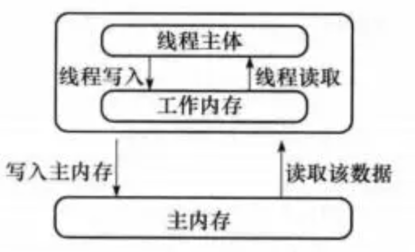
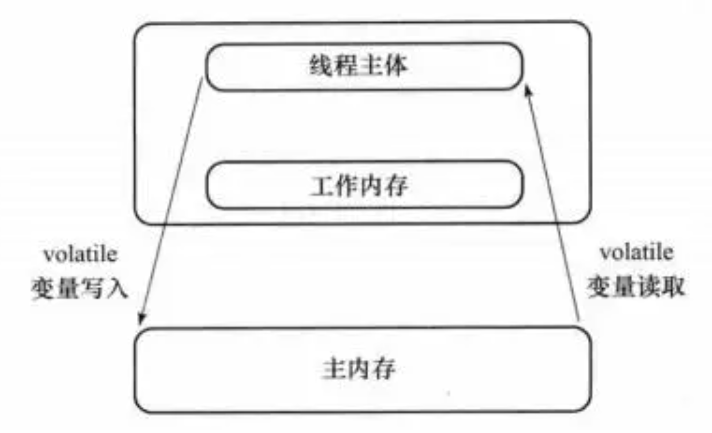
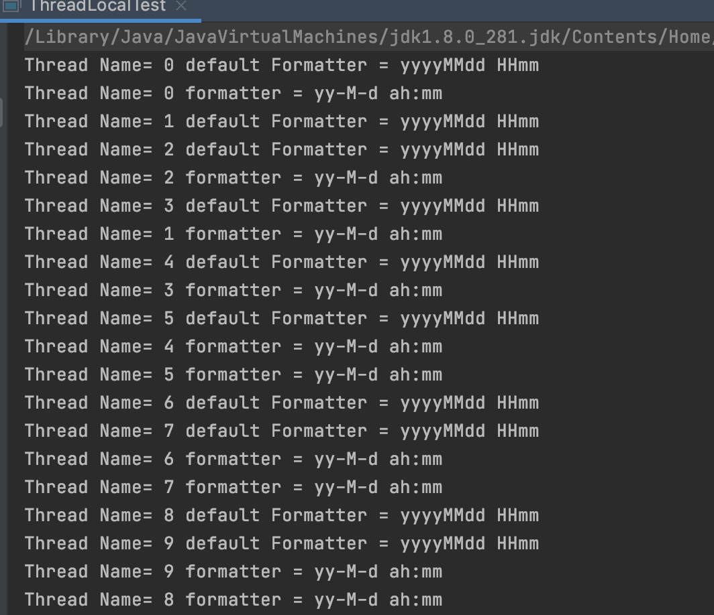
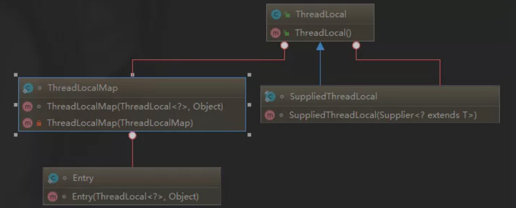
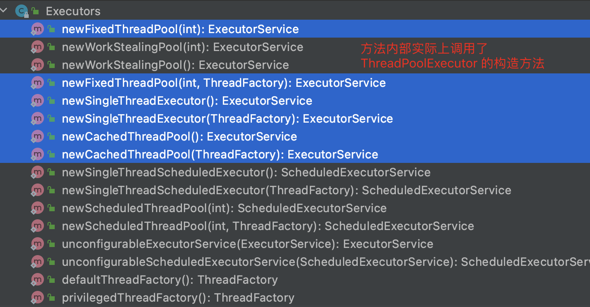
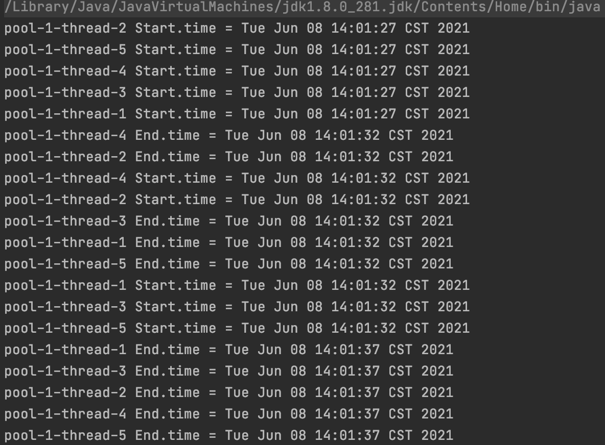
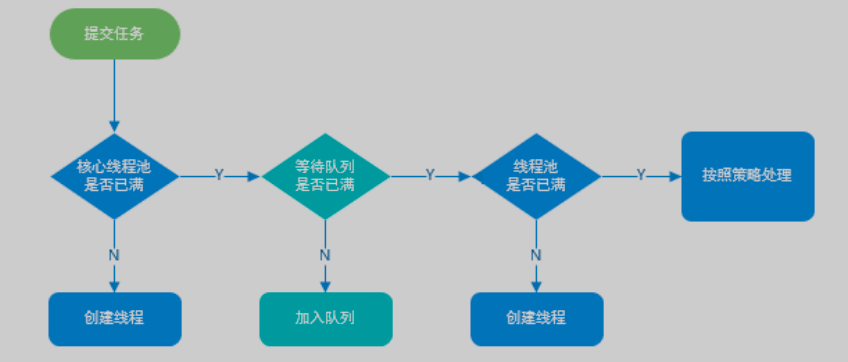
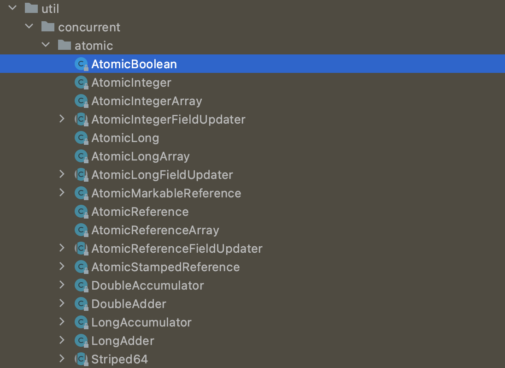
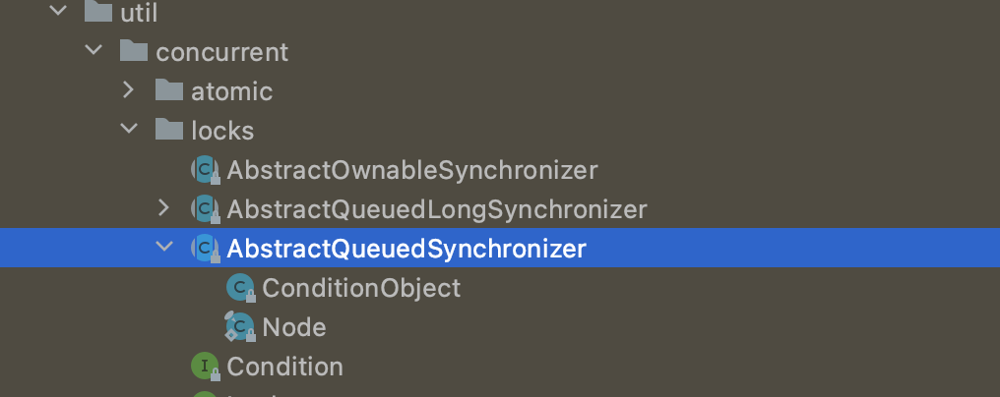
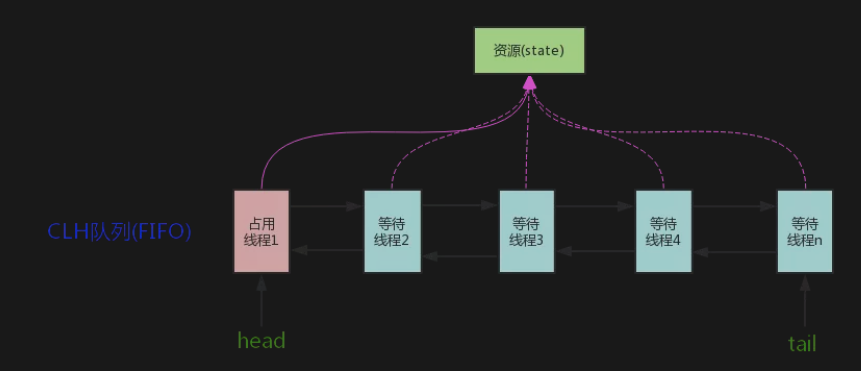

> 创建2021年6月3日
>
> 作者：[敖丙](https://mp.weixin.qq.com/s?__biz=MzAwNDA2OTM1Ng==&mid=2453141018&idx=1&sn=d9241ddc0a9d253c0a061da3aadc2abf&scene=21#wechat_redirect)


[toc]

## Java并发进阶常见面试题

### 1、Synchronized关键字

#### 1.1、对 Synchronized的理解

​		synchroniezd 关键字解决的是多线程之间访问资源的同步性，synchronized 关键字可以保证被修饰的方法或者代码块任意时刻只能有一个线程执行！

​		另外，在Java早期版本中，synchronized 属于重量级锁，效率低下，因为监视器锁（monitor）是依赖底层的操作系统 Mutex Lock 来实现的，Java的线程是映射到操作系统的原生线程之上，如果要挂起火灾唤醒一个线程，都需要操作系统帮忙，而操作系统实现线程之间的切换需要用户到内核态，这个状态之间的切换需要相对较长时间，时间成本非常高，这也是为什么早期的 synchroniezd 效率低的原因，在 Jdk 1.6 之后，java官方在 JVM 层面 对 synchroniezd 较大优化，所以现在对 sychornezd 效率也优化的不错了， jdk1.6 对锁的实现引入了大量优化，比如 自旋锁、消除锁、锁粗化、偏向锁、轻量级锁等技术减少锁操作的开销


#### 1.2、怎么使用的 synchronized 关键字

​		sychronized 关键字最主要的三种使用方法

+ 静态实例方法：作用于当前对象实例加锁，进入同步代码前要获得对象实例锁
+ 静态修饰方法，也就是给当前类加锁，会作用类的所有对象实例，因为静态成员不属于任何一个实例对象，是类成员（static 表明这是该类的静态资源，不管 new 了多少个对象，只有一份）。所以如果一个线程A调用了实例对象的非晶态 synchronize 方法，而线程B需要调用这个实例对象所属的静态 synchronize 方法，是允许的，不会发生互斥现象，==因为访问静态 synchroniezd 方法占用的锁事当前类的锁，而访问非静态synchronized方法占用的锁事当前实例对象锁==
+ 修饰代码块：指定加锁对象，对给定对象加锁，进入同步代码库前要获得给定对象的锁

> 总结：synchronezd 关键字加到 static 静态方法和 synchronize(class) 代码块上都是给 class 类上锁，synchrinezd 关键字驾到实例方法上锁给对象上锁，尽量不要使用 synchronezd(string a)因为 JVM 中，字符串常量池具有缓存功能！

```java
publicclass Singleton {

    private volatile static Singleton uniqueInstance;

    private Singleton() {
    }

    public static Singleton getUniqueInstance() {
       //先判断对象是否已经实例过，没有实例化过才进入加锁代码
        if (uniqueInstance == null) {
            //类对象加锁
            synchronized (Singleton.class) {
                if (uniqueInstance == null) {
                    uniqueInstance = new Singleton();
                }
            }
        }
        return uniqueInstance;
    }
}
```

另外需要注意， uniqueInstatnce 采用 volatile 关键字修饰也很有必要

uniquenInstance 采用 volatile 关键字也很有必要， uniqueInstance = new Singleton() 这段代码其实是分为三步执行

1. 为 uniqenInstance 分配内存空间

2. 初始化 uniquenInstance 

3. 将 uniquenInstance 指向分配的内存地址

   ​	但是JVM具有指令重拍的特性执行顺序可能变为 1 -> 3 -> 2 。指令重拍在单线程不会出现问题，但是在多线程环境下会导致一个线程获得还没初始化实例，例如，线程 T1 执行了 1、3 此时 T2 调用 getUniqueInstance() 后发现 uniquenInstacne 不为空，因为返回 uniquenInstance 但是，uniqueInstance 还未被初始化

> 使用 volatile 可以禁止 JVM 指令重排，保证在多线程下也能正常运行

#### 1.3、讲一下 synchronized 关键字底层原理

==synchronized 关键字底层属于 JVM 层面==


##### 1.3.1、synchronized 同步语句块的情况

```java
public class SynchronizedTest {
    public void method(){
        synchronized (this){
            System.out.println("synchronzed 代码块");
        }
    }
}
```

​		通过 jdk 自带的 javap 命令查看 SynchronizedTest 类，先切换到其目录，`javac SynchronizedTest.java` 编译出 .class 文件

再 执行 `javap -c -s -v -l SynchronizedTest.class`

```sh
xiang@xiaocencen synchroniezd % javap -c -s -v -l SynchronizedTest.class 
Classfile 
...
..
... 
# 这里省略了很多 

  public void method();
    descriptor: ()V
    flags: ACC_PUBLIC
    Code:
      stack=2, locals=3, args_size=1
         0: aload_0
         1: dup
         2: astore_1
         3: monitorenter
         4: getstatic     #2                  // Field java/lang/System.out:Ljava/io/PrintStream;
         7: ldc           #3                  // String synchronzed 代码块
         9: invokevirtual #4                  // Method java/io/PrintStream.println:(Ljava/lang/String;)V
        12: aload_1
        13: monitorexit
        14: goto          22
        17: astore_2
        18: aload_1
        19: monitorexit
        20: aload_2
        21: athrow
        22: return
      Exception table:
         from    to  target type
             4    14    17   any
            17    20    17   any
      LineNumberTable:
        line 5: 0
        line 6: 4
        line 7: 12
        line 8: 22
      StackMapTable: number_of_entries = 2
        frame_type = 255 /* full_frame */
          offset_delta = 17
          locals = [ class SynchronizedTest, class java/lang/Object ]
          stack = [ class java/lang/Throwable ]
        frame_type = 250 /* chop */
          offset_delta = 4
}
SourceFile: "SynchronizedTest.java"

```

从上面我们可以看出，

​		==synchronized 同步语句代码的实现使用的是 monitorenter 和 monitorexit 指令，其中 monitorenter 指令指向同步代码的开始位置，monitorexit 指令则指明同步代码的结束为止== 当执行 monitorenter 指令时，线程试图获取锁，也就是获取 monitor 的持有权（monitor 对象存在于每个 java 对象的对象头中，synchronized 锁边说通过这种方式获取的，也就是为什么 java 中任何对象可以作为锁的原因） 。当计数器为0则可以成功获取，获取后将锁计数器设为1也就是加1。相应的在执行 monitorexit 指令后，将锁计数器设为0，表明锁被释放。如果获取锁对象失败，那当前线程就要阻塞等待。知道锁被另一个线程释放为止。


##### 1.3.2、synchroniezd 修饰方法的情况

```java
public class SynchronizedTest {
    public synchronized void method(){
        System.out.println("synchronzed 代码块");
    }
}
```


```sh
....
# 上面省略
{
  public SynchronizedTest();
    descriptor: ()V
    flags: ACC_PUBLIC
    Code:
      stack=1, locals=1, args_size=1
         0: aload_0
         1: invokespecial #1                  // Method java/lang/Object."<init>":()V
         4: return
      LineNumberTable:
        line 2: 0

  public synchronized void method();
    descriptor: ()V
    flags: ACC_PUBLIC, ACC_SYNCHRONIZED
    Code:
      stack=2, locals=1, args_size=1
         0: getstatic     #2                  // Field java/lang/System.out:Ljava/io/PrintStream;
         3: ldc           #3                  // String synchronzed 代码块
         5: invokevirtual #4                  // Method java/io/PrintStream.println:(Ljava/lang/String;)V
         8: return
      LineNumberTable:
        line 4: 0
        line 5: 8
}
SourceFile: "SynchronizedTest.java"

```

​			此时，synchronized 修饰的方法并没有 monitorenter 和 monitorexit 指令，取之代之的却是 ==ACC_SYNCHRONIZED== 标识，该标识指明了该方向锁一个同步方法， JVM 通过该 ACC_SYNCHRONIZED 访问标志来辨别一个方法是否声明为同步方法，从而执行相应的同步调用


#### 1.4、jdk1.6 之后 synchronized 做了哪些优化

​		jdk1.6 对锁的实现引入了大量优化，偏向锁、轻量级锁，自旋锁、适应性锁、锁消除，锁粗化等技术来减少锁的开销，锁住要存在四种状态，依次是 无锁状态、偏向锁、轻量级锁、重量级锁，她们会随着竞争的激烈而逐渐升级，只能升级不能降级，这种策略就锁为了提高获得锁和释放锁的效率


#### 1.5、synchronized 和 ReentrantLock 区别

1. 两者都是可重入锁

   两者都是可重入锁。“可重入锁”概念是：自己可以在此获取自己的内部锁，比如一个线程获得了某个对象的锁，此时这个对象的锁还没释放，当其再次想要获取这个对象的锁的时候还是可以获取的，如果不可锁重入的话，就会造成死锁。同一个线程每次获取锁，锁的计数器都自增1，所以要等到锁的计数器下降为0才能释放锁

2. Synchronized 依赖 JVM 而 ReentrantLock 依赖于 API

   Synchronezed 是依赖于 JVM 实现的，前面我们也讲到了，虚拟机团队在 JDK 1.6 为 synchronized 关键字优化很多，但这些优化都是在 虚拟机层面实现的，并没有暴露给我们。ReentrantLock 是 JDK 层面的优化，（也就是API层面，需要 lock（） 和 unlock（）方法配置 try/finally 语句块来完成）所以我们可以通过查看它的源代码，来看如何实现的

3. ReentrantLock 和 synchronized 增加了一些高级功能

   相比 synchronized , ReentrantLock 增加了高级功能主要三个点 1、等待可中断 2、可实现公平锁 3、可实现选择性同志（锁可以绑定多个条件）

   1. ReentrantLock 提供了一种能够中断等待线程的机制，通过 lock.lockInterruptibly（）来实现这个机制，也就是说正在等待的线程可以选择放弃等待，改为处理其他事情。
   2. ReentrantLock 可以指定说公平锁和非公平锁，而 synchronized 只能是非公平锁，所谓的公平锁就是先等待的线程先获得锁。ReentantLock 默认情况下是非公平的，可以通过 ReenrantLock(boolean fair)构造方法来指定是否公平
   3. synchronized 关键字于 wait（) 和 notify（）/notifyAll（）方法结合可以实现等/通知机制，ReentrantLock 类实现也可以实现，但是需要借助于 Condition 接口与 newCondition（）方法Condition 是 JDK1.5 之后才有的，它具有很好的灵活性，比如可以实现多路通知功能也就是在 一个 Lock 对象中可以创建多个 Condition 实例（即对象监视器）==线程对象可以注册在 Condition 中，从而可以选择性的进行线程通知，在调度线程上更加论货，在使用 notify（）/notifyAll（）方法进行通知时，被通知的线程上由JVM选择的，用 ReentrantLock 类结合 Condition 实例可以实现“选择性通知”== 这个功能非常重要，而且是 Condition 接口默认提供的，如果执行 notifyAll（）方法的话就会通知所有处于等待状态的线程这样会造成很大的效率问题。而且Condition 实例的 singalAll（）方法只会唤醒注册在该 Condition 实例中的所有等待线程
   4. 性能已经不是选择标准

### 2、Volatile 关键字

#### 2.1、Java内存模型	

​		在 jdk1.2 之前，Java的内存模型实现是从 主存（即共享内存）读取变量，是不需要进行特别的注意，而在当前的 Java 内存模型下，线程可以吧变量保存本地内存（比如机器的寄存器）中，而不是直接在主存中进行读写，这就可能造成一个线程在主存中修改了一个变量的值，而另一个线程还继续使用它在寄存器中的变量值的拷贝，造成数据的不一致



要解决这个问题，就需要声明变量为 vlatile 这就指示 JVM 这个变量不是稳定的，每次使用它都要到主存中进行读取，说白了，volatile 关键字到主要作用就是保证变量的可见性，然后还有一个作用就是防止指令重排



#### 2.2、sychronized 与 volaitle 区别

synchronized 关键字和 volatile 关键字比较

+ Volatile 关键字是线程同步的 轻量级实现，所以 volatile 性能肯定要比 sychronized 要好，但是 volatile 关键字只能用于变量，而synchronized 可以修饰方法及代码块， synchronized 在 jdk1.6后进行主要包括减少获得锁和释放锁带来的性能消耗而引入偏向锁和轻量级锁以及各种优化后执行效率有了显著提升，实际开发中使用 synchronized 关键字的场景还是更多一些
+ 多线程访问 volatile 关键字不会发生阻塞，而 synchronized 可能会发生阻塞
+ volatile 能保证数据可见性，但不能保证数据的原则性， synchronized 可以两者都保证
+ volatile 主要解决变量在多线程之间的可见性，syncronized 解决的是多个线程之间访问资源的同步性


### 3、ThreadLocal

#### 3.1、ThreadLocal

通常情况下，我们创建的变量是可以被任何一个线程访问并修改的，如果想实现每一个线程都有自己的专属本地变量改如何解决？ JDK 提供了 TheadLocal 类正是为了解决这样的问题，ThreadLocl 类主要解决的就是让每个线程绑定自己的值，可以将 ThreadLocal 类形象的比喻成存放数据的盒子，盒子中可以存储每个线程的私有数据，

​		如果你创建了一个 ThreadLocal变量，那么访问这个变量的每个线程都会有这个变量的本地副本，这也是 ThreadLocal 变量名的由来，他们可以使用 get（）和 set（）方法来获得默认值或者将其更改为当前线程所存的副本的值，从而避免了线程安全问题。

​		再举个简单的例子；

​	如果两个人宝屋里收集宝物，这两个人共用一个袋子肯定会产生争执，但是给他们每个人分配一个袋子，就不会出现的这样的问题，如果把这两个人比作线程，那么ThreadLocal就是用来避免这两个线程竞争的

### 3.2、ThreadLocal 示例

```java
public class ThreadLocalTest implements Runnable{

    private static final ThreadLocal<SimpleDateFormat> formatter = ThreadLocal.withInitial(() -> new SimpleDateFormat("yyyyMMdd HHmm"));

    public static void main(String[] args) throws InterruptedException {
        ThreadLocalTest obj = new ThreadLocalTest();
        for(int i=0 ; i<10; i++){
            Thread t = new Thread(obj, ""+i);
            Thread.sleep(new Random().nextInt(1000));
            t.start();
        }
    }

    public void run() {
        System.out.println("Thread Name= "+Thread.currentThread().getName()+" default Formatter = "+formatter.get().toPattern());
        try {
            Thread.sleep(new Random().nextInt(1000));
        } catch (InterruptedException e) {
            e.printStackTrace();
        }
        //formatter pattern is changed here by thread, but it won't reflect to other threads
        formatter.set(new SimpleDateFormat());

        System.out.println("Thread Name= "+Thread.currentThread().getName()+" formatter = "+formatter.get().toPattern());
    }
}
```

OutPut:



从输出可以看出，Thread-0 已经改变了 formater 的值，但仍然是 Thread-2 默认格式化程序与初始化相同，其他线程也一样，上面有一段代码创建了 ThreadLocal 变量的那段代码用到了 java8的知识，它等于下面这块代码，如果你写了下面这段话，IDEA 会提示你转哈为 Java8 的格式，因为 ThreadLocal 类再 Java8 中扩展，使用一个新的方法 witeInital() 将Supplier 功能接口作为参数

```java
private static final ThreadLocal<SimpleDateFormat> format = new ThreadLocal<SimpleDateFormat>(){
        @Override
        protected SimpleDateFormat initialValue() {
            return super.initialValue();
        }
    };
```


### 3.3、ThreadLocal 原理

从 Thread 类源代码入手

```java
publicclass Thread implements Runnable {
 ......
//与此线程有关的ThreadLocal值。由ThreadLocal类维护
ThreadLocal.ThreadLocalMap threadLocals = null;

//与此线程有关的InheritableThreadLocal值。由InheritableThreadLocal类维护
ThreadLocal.ThreadLocalMap inheritableThreadLocals = null;
 ......
}
```

​		从上面 Thread 类源代码可以看出 Thread 类中有一个 threadLocals 和一个 inheritableThreadLocals 变量，他们都是 ThreadLocalMap 类型的变量，我们可以把 ThreadLocalMap 理解为 ThreadLocal 类型实现的定制化的 HashMap。默认情况下这两个变量都是null，只有当前线程调用 ThreadLocal 类，set 或者 get方法才创建他们，实际上调用这两个方法的生活，我们调用的是 ThreadLocalMap 类对应的 get（）、set（） 方法

​		ThreadLocal 类和 set（）方法

```java
public void set(T value) {
        Thread t = Thread.currentThread();
        ThreadLocalMap map = getMap(t);
        if (map != null)
            map.set(this, value);
        else
            createMap(t, value);
    }
    ThreadLocalMap getMap(Thread t) {
        return t.threadLocals;
    }
```

​		通过上面这些内容，我们足以通过猜测得出结论，最终的变量是放在了当前程序的 ThreadLocalMap 中，并不是存在 ThreadLocal 上，ThreadLocal 可以理解为只是 ThreadLocalMap 的封装，传递了变量值，ThreadLocal 类中可以通过 Thread.currentThread() 获取得到当前线程对象后，直接通过 getMap（Thread t) 可以访问到该线程的 ThreadLocalMap 对象。

​		每个 Thread 中都具备一个 ThradLocalMap ，而ThreadLocalMap 可以存储 以 ThreadLocal 为 key 的键值对。比如我们再同一个线程中声明了两个 ThreadLocal 对象的话，会使用 Thread 内部都是使用仅有那个 ThreadLocalMap 存放数据的，ThreadLocalMap 的key 就说 ThreadLocal 对象，value 就是 ThreadLocal 对象调用 set 方法的值，ThreadLocal 是map结构是为了让每个线程可以关联多个 ThreadLocal 变量，这个也解释了 ThreadLocal 声明的变量为什么在每个线程都有自己的专属本地变量

ThreadLocalMap 是 ThreadLocal 的静态内部类



### 3.4、ThreadLocal 内存泄漏问题

​		ThreadLocalMap 中使用的 key 为 ThreadLocal 的弱引用，而 value 是强引用，所以 ThreadLocal 没有被外部强引用的情况下，在GC的时候，key就会被清理掉，而value不会被清理掉，这样一来，ThreadLocalMap 中就会出现 key 为null 的 Entry，假如我们不做任何措施的话，value 永远无法被GC回收，这个时候就可能产生内存泄漏。ThreadLocalMap 实现中已经考虑这种情况，在调用 set（）、get（）、remove（）方法的时候，会清理掉 key 为 null 的技术，使用完 ThreadLocal 方法后，最好手动调用 remove（）方法

```java
static class Entry extends WeakReference<ThreadLocal<?>> {
            /** The value associated with this ThreadLocal. */
            Object value;

            Entry(ThreadLocal<?> k, Object v) {
                super(k);
                value = v;
            }
        }
```

若引用介绍：

假如一个对象只具有弱引用，那就类似于可有可无的生活用品。弱引用与软引用的区别在于：只具有弱引用的对象拥有更短暂的生命周期，在垃圾回收线程扫描它，所管辖的内存区域过程中，一旦发现了只具有弱引用的对象，不管当前内存空间足够与否，都会回收它的内存，不过，由于垃圾回收器所一个优先级很低的线程，因此不一定会很快发现那些只具有弱引用的对象

弱引用可以和一个引用队列（RefereceQuence ）联合使用，如果弱引用所引用的对象被GC回收，Java虚拟机就会把这个弱引用假如到关联的引用队列中


## 4、线程池

### 4.1、为什么要用线程池

> 池化技术相比大家已经屡见不鲜了，线程池、数据库连接池、Http 连接池等等都是对这个思想的应用。池化技术的思想主要是为了减少每次获取资源的消耗、提高对资源的利用率

线程池提供了一种限制和管理资源（包括执行一个任务）。每个线程池还维护了一些基本统计信息，例如已完成任务的数量。这里借用《Java并发编程的艺术》提到的来说一下使用线程池的好处

+ 降低资源消耗：通过重复利用已创建的线程降低线程创建和销毁造成的消耗。
+ 提高响应速度，当任务到达时，任务可以不需要等到线程创建就能立即执行
+ 提高线程的可管理性，线程数稀缺资源，如果无限制的创建，不仅会消耗系统资源，还会降低系统的稳定性，使用线程池可以进行统一的分配，调优和监控

### 4.2、实现Runnable接口和Callable接口的区别

​		Runnable 自 java 1.0 以来一直存在，但 Callable 仅在 Java 1.5 中引入，目的就说为了处理Runnable 不支持的用例，Runnable 接口不会返回结果或抛出异常检查。但是 Callable 接口可以，所以，如果任务不需要返回结果抛出异常使用 Runnable 接口，这样代码看起来更简洁

​		工具类 Exectors 可以实现 Runnable 对象和 Callable 对象之间的相互转换（Executors.callable(Runnable task)) 或者 Executors.callable(Runnable task,Object result)).

Runnable.java

```java
@FunctionalInterface
publicinterface Runnable {
   /**
    * 被线程执行，没有返回值也无法抛出异常
    */
    public abstract void run();
}
```

Callable.java

```java
@FunctionalInterface
publicinterface Callable<V> {
    /**
     * 计算结果，或在无法这样做时抛出异常。
     * @return 计算得出的结果
     * @throws 如果无法计算结果，则抛出异常
     */
    V call() throws Exception;
}
```

### 4.3、执行 exectute（）方法和 submit（）方法的区别是什么

1. execute（）方法用于提交不需要返回的任务，所以无法判断任务是否被线程池执行成功
2. submit（）方法用于提交需要返回值的任务。线程会返回一个 Futrue 类型的对象，通过 Future 对象可以判断任务是否执行成功，并可以通过 Future 的 get（） 方法获取当前返回值，get（）方法会阻塞当前线程直到任务完成。而使用 get（long timeout，TimeUnit unit）方法则会阻塞当前线程一段时间立即返回，这个时候有可能任务没有执行完成。

我们以 AbstractExecutorService 接口中的一个 submi 方法为例子来看看源代码

```java
public Future<?> submit(Runnable task) {
        if (task == null) thrownew NullPointerException();
        RunnableFuture<Void> ftask = newTaskFor(task, null);
        execute(ftask);
        return ftask;
    }
```

上面方法调用的 `newTaskFor` 方法返回了一个 `FutureTask` 对象。

```java
protected <T> RunnableFuture<T> newTaskFor(Runnable runnable, T value) {
        returnnew FutureTask<T>(runnable, value);
    }
```

我们再来看看`execute()`方法：

```java
public void execute(Runnable command) {
      ...
    }
```

### 4.4、如何创建线程池

《阿里巴巴Java开发手册》中强制线程不允许使用 Executors 去创建，而是通过 ThreadPoolExecutor 的方式,这样的处理方式让写的同学更加明确线程的运行规则，规避资源耗尽的风险

> Executors 返回线程池对象的弊端如下：
>
> + FixedThreadPool 和 SinggleThreadExecutor：允许请求队列长度为 Inter.MAX_VALUE 可能堆积大量的请求，从而导致 OOM
> + CachedThreadPool 和 ScheduledThreadPool ：允许创建的线程数量为 Interger.MAX_VALUE 可能创建大量线程，从而导致 OOM

方法一：通过构造方法


方法二：通过 Executor 框架的工具类 Executors 来实现我们可以创建三种类型的 ThreadPoolExecutor

+ FixedThreadPool：该方法返回一个固定线程数量的线程池，该线程池中的线程数量始终不变。当有一个新的任务提交时，线程中若有空闲线程，则立即执行，若没有，则新的任务会被暂存在一个任务队列中，待油线程空闲时，便处理在任务队列中的任务
+ SingleThreadExecutor：方法返回一个只有一个线程的线程池，若多余一个任务被提交到该线程池，任务会被保留在一个任务队列中，等待线程空闲，按先入先出的顺序执行队列中的任务
+ CachedThreadPool：该方法返回一个可根据实际情况调整线程数量的线程池，线程池的线程数量不确定，但若有空闲线程可以复用，则会优先使用可复用的线程，若所有线程均在工作，又有新的任务提交，则会创建新的新的线程处理任务，所有线程在当前任务执行完成后，将返回线程进行复用。



### 4.5、ThreadPoolExecutor 类分析

​		ThreadPoolExecutor 类中提供的四个构造方法，我们来看最长的那个，其余三个都是在这个构造方法的基础上产生的，

```java
/**
     * 用给定的初始参数创建一个新的ThreadPoolExecutor。
     */
    public ThreadPoolExecutor(int corePoolSize,
                              int maximumPoolSize,
                              long keepAliveTime,
                              TimeUnit unit,
                              BlockingQueue<Runnable> workQueue,
                              ThreadFactory threadFactory,
                              RejectedExecutionHandler handler) {
        if (corePoolSize < 0 ||
            maximumPoolSize <= 0 ||
            maximumPoolSize < corePoolSize ||
            keepAliveTime < 0)
            thrownew IllegalArgumentException();
        if (workQueue == null || threadFactory == null || handler == null)
            thrownew NullPointerException();
        this.corePoolSize = corePoolSize;
        this.maximumPoolSize = maximumPoolSize;
        this.workQueue = workQueue;
        this.keepAliveTime = unit.toNanos(keepAliveTime);
        this.threadFactory = threadFactory;
        this.handler = handler;
    }
```

##### 4.5.1、ThreadPoolExecutor 构造函数的重要参数分析

ThreadPoolExecutor 3 个最重要的参数：

+ corePoolSzie ：核心线程数定义了最小可以同时运行的线程数量
+ maxmumPoolSize：当队列存放的任务达到队伍容量时，当前可用同时允许的线程变为最大线程数
+ workQueue：当新任务的时候会判断当前任务的线程是否达到核心线程数，如果达到，信任就会被存放在队列中

ThreadPoolExecutor 其他常见参数：

1. keepAliveTime ：当线程池中的线程数量大于 corePoolSize 的时候，如果这时没有新的任务提交，核心线程外的线程不会立即销毁，而是会等待，直到等待的时间超过了 keepAliveTime 才会回收销毁
2. unit：keepAliveTime 参数的时间单位
3. threadFactory：executor创建新线程的时候会使用到
4. handler：饱和策略

##### 4.5.2、ThreadPoolExecutor 饱和策略

​		如果当前同时运行的线程数量达到最大线程数量并且队列已经被放满时，ThreadPoolTaskExecutor 定义了一些策略

+ ThreadPoolExecutor.AbortPolicy：抛出 RejectedExectuionExection 来拒绝新任务的处理
+ ThreadPoolExecutor.CallerRunsPolicy：调用执行之间的线程运行任务，您不会任务请求，但是这张策略会降低对新任务对提交速度，影响程序的整体性能，另外，这个策略喜欢增加队列容量，如果您的应用程序可以承受此延迟并且您不能丢失任何一个任务请求的话，你可以选择这个策略
+ ThreadPoolExecutor.DiscardPolicy：不处理新任务，直接丢掉
+ ThreadPoolExecutor.DiscardOldestPolicy：丢弃最早未完成的处理，来执行新的任务

举个例子：Spring 通过 ThreadPoolExecutor 或者我们直接通过 ThreadPoolExecuor 的构造函数创建线程池的时候，我们不指定 RejectedExecutionHandler 饱和策略的话配置线程池的时候默认使用 ThreadPoolExecutor.AbortPolicy。在默认情况下，将抛出 RejectedExecutionException 来拒绝新的任务，这代表你将丢失这个任务的处理，对于可伸缩性的程序，建议使用 ThreadPoolExecutor.CallerRunpolicy ，当最大池被填满时，此策略为我们提供了伸缩对队列。

### 4.6、一个简单的线程池Demo:`Runnable`+`ThreadPoolExecutor`

为了让大家更清楚上面的面试题中的一些概念，我写了一个简单的线程池 Demo。

首先创建一个 `Runnable` 接口的实现类（当然也可以是 `Callable` 接口，我们上面也说了两者的区别。）

MyRunnable.java

```java
/**
 * 这是一个简单的Runnable类，需要大约5秒钟来执行其任务。
 * @author shuang.kou
 */
publicclass MyRunnable implements Runnable {

    private String command;

    public MyRunnable(String s) {
        this.command = s;
    }

    @Override
    public void run() {
        System.out.println(Thread.currentThread().getName() + " Start. Time = " + new Date());
        processCommand();
        System.out.println(Thread.currentThread().getName() + " End. Time = " + new Date());
    }

    private void processCommand() {
        try {
            Thread.sleep(5000);
        } catch (InterruptedException e) {
            e.printStackTrace();
        }
    }

    @Override
    public String toString() {
        returnthis.command;
    }
}
```

可以看到我们上面的代码指定了：

1. `corePoolSize`: 核心线程数为 5。
2. `maximumPoolSize` ：最大线程数 10
3. `keepAliveTime` : 等待时间为 1L。
4. `unit`: 等待时间的单位为 TimeUnit.SECONDS。
5. `workQueue`：任务队列为 `ArrayBlockingQueue`，并且容量为 100;
6. `handler`:饱和策略为 `CallerRunsPolicy`。

**Output：**



### 4.7、线程池原理分析

为了搞定线程池的原理，我们先分析 execute 方法，上面我们用到了 executor.execute（worker）来提交一个任务到线程池中，这个方法非常重要

```java
// 存放线程池的运行状态 (runState) 和线程池内有效线程的数量 (workerCount)
   privatefinal AtomicInteger ctl = new AtomicInteger(ctlOf(RUNNING, 0));

    private static int workerCountOf(int c) {
        return c & CAPACITY;
    }

    privatefinal BlockingQueue<Runnable> workQueue;

    public void execute(Runnable command) {
        // 如果任务为null，则抛出异常。
        if (command == null)
            thrownew NullPointerException();
        // ctl 中保存的线程池当前的一些状态信息
        int c = ctl.get();

        //  下面会涉及到 3 步 操作
        // 1.首先判断当前线程池中之行的任务数量是否小于 corePoolSize
        // 如果小于的话，通过addWorker(command, true)新建一个线程，并将任务(command)添加到该线程中；然后，启动该线程从而执行任务。
        if (workerCountOf(c) < corePoolSize) {
            if (addWorker(command, true))
                return;
            c = ctl.get();
        }
        // 2.如果当前之行的任务数量大于等于 corePoolSize 的时候就会走到这里
        // 通过 isRunning 方法判断线程池状态，线程池处于 RUNNING 状态才会被并且队列可以加入任务，该任务才会被加入进去
        if (isRunning(c) && workQueue.offer(command)) {
            int recheck = ctl.get();
            // 再次获取线程池状态，如果线程池状态不是 RUNNING 状态就需要从任务队列中移除任务，并尝试判断线程是否全部执行完毕。同时执行拒绝策略。
            if (!isRunning(recheck) && remove(command))
                reject(command);
                // 如果当前线程池为空就新创建一个线程并执行。
            elseif (workerCountOf(recheck) == 0)
                addWorker(null, false);
        }
        //3. 通过addWorker(command, false)新建一个线程，并将任务(command)添加到该线程中；然后，启动该线程从而执行任务。
        //如果addWorker(command, false)执行失败，则通过reject()执行相应的拒绝策略的内容。
        elseif (!addWorker(command, false))
            reject(command);
    }
```



> 我们在代码中模拟了 10 个任务，我们配置的核心线程数为 5 、等待队列容量为 100 ，所以每次只可能存在 5 个任务同时执行，剩下的 5 个任务会被放到等待队列中去。当前的 5 个任务之行完成后，才会之行剩下的 5 个任务。

## 5、Atomic原子类

### 	5.1、介绍一下 Atomic 原子类



### 5.2、JUC包含原子类种类

基本类型

+ AtomicInterger：整形原子类
+ AtomicLong：长整型原子类
+ AtomicBoolean：布尔型原子类

数组类型

- AtomicIntegerArray：整形数组原子类
- AtomicLongArray：长整形数组原子类
- AtomicReferenceArray：引用类型数组原子类

引用类型

- AtomicReference：引用类型原子类
- AtomicStampedReference：原子更新引用类型里的字段原子类
- AtomicMarkableReference ：原子更新带有标记位的引用类型

对象的属性修改类型

- AtomicIntegerFieldUpdater：原子更新整形字段的更新器
- AtomicLongFieldUpdater：原子更新长整形字段的更新器
- AtomicStampedReference：原子更新带有版本号的引用类型。该类将整数值与引用关联起来，可用于解决原子的更新数据和数据的版本号，可以解决使用 CAS 进行原子更新时可能出现的 ABA 问题。

### 5.3、AtomicInteger 的使用

AtomicInterger 类常用方法

```java
public final int get() //获取当前的值
public final int getAndSet(int newValue)//获取当前的值，并设置新的值
public final int getAndIncrement()//获取当前的值，并自增
public final int getAndDecrement() //获取当前的值，并自减
public final int getAndAdd(int delta) //获取当前的值，并加上预期的值
boolean compareAndSet(int expect, int update) //如果输入的数值等于预期值，则以原子方式将该值设置为输入值（update）
public final void lazySet(int newValue)//最终设置为newValue,使用 lazySet 设置之后可能导致其他线程在之后的一小段时间内还是可以读到旧的值。
```

AtomicInteger 类的使用示例

使用 AtomicInteger 之后，不用对 increment() 方法加锁也可以保证线程安全。

```java
class AtomicIntegerTest {
        private AtomicInteger count = new AtomicInteger();
      //使用AtomicInteger之后，不需要对该方法加锁，也可以实现线程安全。
        public void increment() {
                  count.incrementAndGet();
        }
     
       public int getCount() {
                return count.get();
        }
}
```

### 5.4、AtomicInteger 类原理

```java
// setup to use Unsafe.compareAndSwapInt for updates（更新操作时提供“比较并替换”的作用）
    private static final Unsafe unsafe = Unsafe.getUnsafe();
    private static final long valueOffset;

    static {
        try {
            valueOffset = unsafe.objectFieldOffset
                (AtomicInteger.class.getDeclaredField("value"));
        } catch (Exception ex) { thrownew Error(ex); }
    }

    private volatile int value;
```

AtomicInteger 类主要利用 CAS (compare and swap) + volatile 和 native 方法来保证原子操作，从而避免 synchronized 的高开销，执行效率大为提升。

CAS的原理是拿期望的值和原本的一个值作比较，如果相同则更新成新的值。UnSafe 类的 objectFieldOffset() 方法是一个本地方法，这个方法是用来拿到“原来的值”的内存地址，返回值是 valueOffset。另外 value 是一个volatile变量，在内存中可见，因此 JVM 可以保证任何时刻任何线程总能拿到该变量的最新值。

## 6、AQS

​		AQS的全称为（AbstractQueuedSynchronizer），这个类在java.util.concurrent.locks包下面。



​		AQS是一个用来构建锁和同步器的框架，使用AQS能简单且高效地构造出应用广泛的大量的同步器，比如我们提到的ReentrantLock，Semaphore，其他的诸如ReentrantReadWriteLock，SynchronousQueue，FutureTask等等皆是基于AQS的。当然，我们自己也能利用AQS非常轻松容易地构造出符合我们自己需求的同步器。

### 6.2、原理分析

> 在面试中被问到并发知识的时候，大多都会被问到“请你说一下自己对于AQS原理的理解”。下面给大家一个示例供大家参加，面试不是背题，大家一定要加入自己的思想，即使加入不了自己的思想也要保证自己能够通俗的讲出来而不是背出来。

#### 6.2.1、原理概述

​		**AQS核心思想是，如果被请求的共享资源空闲，则将当前请求资源的线程设置为有效的工作线程，并且将共享资源设置为锁定状态。如果被请求的共享资源被占用，那么就需要一套线程阻塞等待以及被唤醒时锁分配的机制，这个机制AQS是用CLH队列锁实现的，即将暂时获取不到锁的线程加入到队列中。**

> CLH(Craig,Landin,and Hagersten)队列是一个虚拟的双向队列（虚拟的双向队列即不存在队列实例，仅存在结点之间的关联关系）。AQS是将每条请求共享资源的线程封装成一个CLH锁队列的一个结点（Node）来实现锁的分配。

看个AQS(AbstractQueuedSynchronizer)原理图：



​		AQS使用一个int成员变量来表示同步状态，通过内置的FIFO队列来完成获取资源线程的排队工作。AQS使用CAS对该同步状态进行原子操作实现对其值的修改。

```java
private volatile int state;//共享变量，使用volatile修饰保证线程可见性
```

状态信息通过protected类型的getState，setState，compareAndSetState进行操作

```java

//返回同步状态的当前值
protected final int getState() {
        return state;
}
 // 设置同步状态的值
protected final void setState(int newState) {
        state = newState;
}
//原子地（CAS操作）将同步状态值设置为给定值update如果当前同步状态的值等于expect（期望值）
protected final boolean compareAndSetState(int expect, int update) {
        return unsafe.compareAndSwapInt(this, stateOffset, expect, update);
}
```

#### 6.2.2. AQS 对资源的共享方式

**AQS定义两种资源共享方式**

- **Exclusive**（独占）：只有一个线程能执行，如ReentrantLock。又可分为公平锁和非公平锁：

- - 公平锁：按照线程在队列中的排队顺序，先到者先拿到锁
  - 非公平锁：当线程要获取锁时，无视队列顺序直接去抢锁，谁抢到就是谁的

- **Share**（共享）：多个线程可同时执行，如Semaphore/CountDownLatch。Semaphore、CountDownLatch、 CyclicBarrier、ReadWriteLock 我们都会在后面讲到。

ReentrantReadWriteLock 可以看成是组合式，因为ReentrantReadWriteLock也就是读写锁允许多个线程同时对某一资源进行读。

不同的自定义同步器争用共享资源的方式也不同。自定义同步器在实现时只需要实现共享资源 state 的获取与释放方式即可，至于具体线程等待队列的维护（如获取资源失败入队/唤醒出队等），AQS已经在顶层实现好了。

#### 6.2.3. AQS底层使用了模板方法模式

同步器的设计是基于模板方法模式的，如果需要自定义同步器一般的方式是这样（模板方法模式很经典的一个应用）：

1. 使用者继承AbstractQueuedSynchronizer并重写指定的方法。（这些重写方法很简单，无非是对于共享资源state的获取和释放）
2. 将AQS组合在自定义同步组件的实现中，并调用其模板方法，而这些模板方法会调用使用者重写的方法。

这和我们以往通过实现接口的方式有很大区别，这是模板方法模式很经典的一个运用。

**AQS使用了模板方法模式，自定义同步器时需要重写下面几个AQS提供的模板方法：**

```
isHeldExclusively()//该线程是否正在独占资源。只有用到condition才需要去实现它。
tryAcquire(int)//独占方式。尝试获取资源，成功则返回true，失败则返回false。
tryRelease(int)//独占方式。尝试释放资源，成功则返回true，失败则返回false。
tryAcquireShared(int)//共享方式。尝试获取资源。负数表示失败；0表示成功，但没有剩余可用资源；正数表示成功，且有剩余资源。
tryReleaseShared(int)//共享方式。尝试释放资源，成功则返回true，失败则返回false。
```

默认情况下，每个方法都抛出 `UnsupportedOperationException`。这些方法的实现必须是内部线程安全的，并且通常应该简短而不是阻塞。AQS类中的其他方法都是final ，所以无法被其他类使用，只有这几个方法可以被其他类使用。

以ReentrantLock为例，state初始化为0，表示未锁定状态。A线程lock()时，会调用tryAcquire()独占该锁并将state+1。此后，其他线程再tryAcquire()时就会失败，直到A线程unlock()到state=0（即释放锁）为止，其它线程才有机会获取该锁。当然，释放锁之前，A线程自己是可以重复获取此锁的（state会累加），这就是可重入的概念。但要注意，获取多少次就要释放多么次，这样才能保证state是能回到零态的。

再以CountDownLatch以例，任务分为N个子线程去执行，state也初始化为N（注意N要与线程个数一致）。这N个子线程是并行执行的，每个子线程执行完后countDown()一次，state会CAS(Compare and Swap)减1。等到所有子线程都执行完后(即state=0)，会unpark()主调用线程，然后主调用线程就会从await()函数返回，继续后余动作。

一般来说，自定义同步器要么是独占方法，要么是共享方式，他们也只需实现`tryAcquire-tryRelease`、`tryAcquireShared-tryReleaseShared`中的一种即可。但AQS也支持自定义同步器同时实现独占和共享两种方式，如`ReentrantReadWriteLock`。

推荐两篇 AQS 原理和相关源码分析的文章：

- [http://www.cnblogs.com/waterystone/p/4920797.html](http://www.cnblogs.com/waterystone/p/4920797.html)
- [https://www.cnblogs.com/chengxiao/archive/2017/07/24/7141160.html](https://www.cnblogs.com/chengxiao/archive/2017/07/24/7141160.html)

### 6.3. AQS 组件总结

- **Semaphore(信号量)-允许多个线程同时访问：** synchronized 和 ReentrantLock 都是一次只允许一个线程访问某个资源，Semaphore(信号量)可以指定多个线程同时访问某个资源。
- **CountDownLatch （倒计时器）：** CountDownLatch是一个同步工具类，用来协调多个线程之间的同步。这个工具通常用来控制线程等待，它可以让某一个线程等待直到倒计时结束，再开始执行。
- **CyclicBarrier(循环栅栏)：** CyclicBarrier 和 CountDownLatch 非常类似，它也可以实现线程间的技术等待，但是它的功能比 CountDownLatch 更加复杂和强大。主要应用场景和 CountDownLatch 类似。CyclicBarrier 的字面意思是可循环使用（Cyclic）的屏障（Barrier）。它要做的事情是，让一组线程到达一个屏障（也可以叫同步点）时被阻塞，直到最后一个线程到达屏障时，屏障才会开门，所有被屏障拦截的线程才会继续干活。CyclicBarrier默认的构造方法是 CyclicBarrier(int parties)，其参数表示屏障拦截的线程数量，每个线程调用await()方法告诉 CyclicBarrier 我已经到达了屏障，然后当前线程被阻塞。