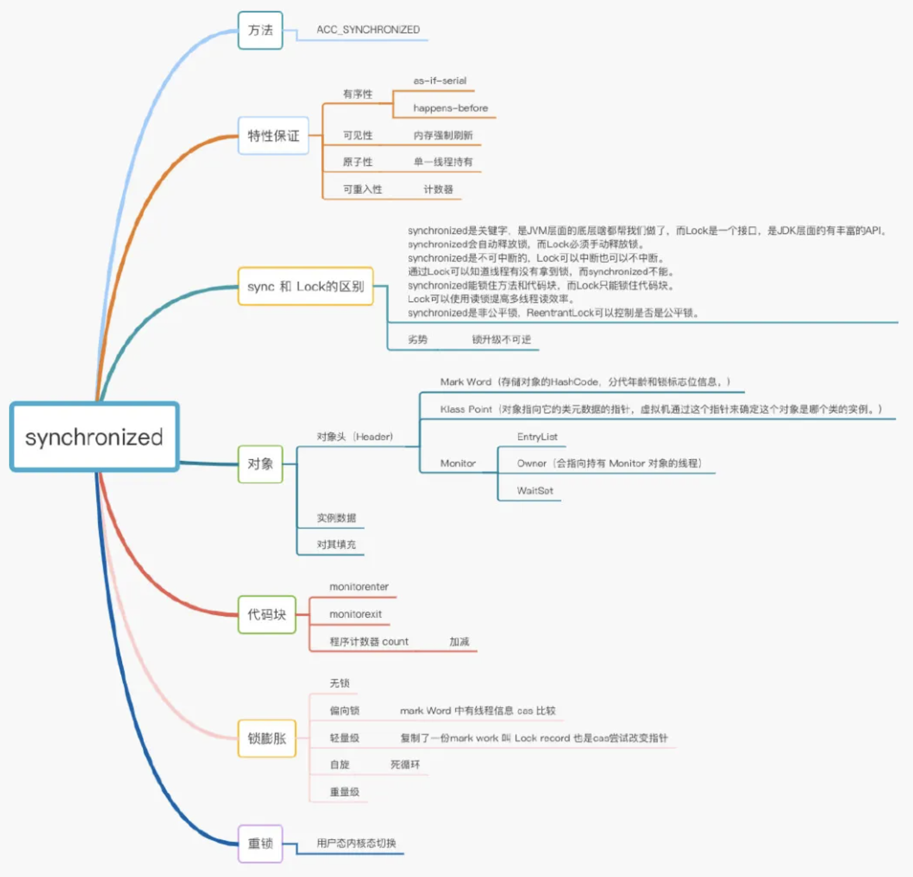
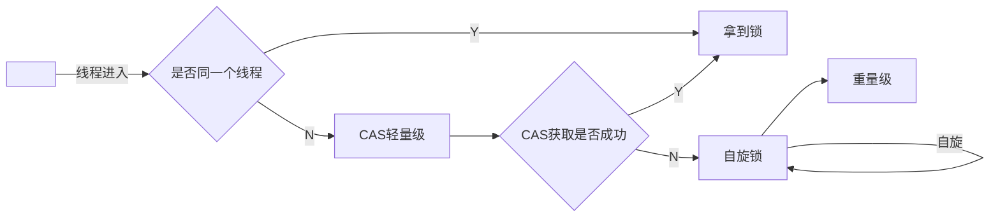

> 创建于2021年6月16日
>
> 作者：[敖丙](https://mp.weixin.qq.com/s?__biz=MzAwNDA2OTM1Ng==&mid=2453142528&idx=1&sn=34b26e408e1f8adcd8d8257522705171&scene=21#wechat_redirect)

[toc]




# 死磕Synchronized 底层实现


## 一、使用场景

### 1.1、修饰实例

对当前实例对象 this 加锁

```java
public class Synchronized{
  public synchronized void husband(){
    
  }
}
```

### 1.2、修饰静态方法

对当前类的Class 对象加锁

```java
public class Synchronized{
  public void husband(){
    synchronized(Synchronized.class){
      
    }
  }
}
```

### 1.3、修饰代码块

指定一个加锁对象，给对象加锁

```java
public class Synchronized{
  public void husband(){
    synchronized(new test()){
      
    }
  }
}
```

其本质就是锁方法、锁代码、锁对象

> 那他们锁怎么实现加锁的呢？

### 1.4、Java对象的构成

​		在JVM 中，对象在内存中分为三块区域

+ 对象头：
  + Mark Word（标记字段）：默认存储对象的 HashCode ，分代年龄和锁标志位信息。它会根据对象的状态复用自己的存储空间，也就是说在运行期间 Mark Word 里的存储数据会随着锁标志位的变化而变化
  + Klass Point（类型指针）：对象指向它的类元数据的指针，虚拟机通过糟糕指针来确定这个对象是哪个类的实例
+ 实例数据
  + 这部分主要存放类的数据信息，父类的信息
+ 对其填充
  + 由于虚拟机要求对象起始地址必须说8字节的整数倍，填充数据不是必须存在的，仅仅是位了字节对齐。

**在对象头中，持有Monitor对象的线程没有才可以被操作**

## 二、特性保证

### 2.1、有序性

​		==as-if-serial==    在 Volatile 中，我们知道 CPU 会优化我们的代码，对其指令重排，不管编译器的CPU如何重排，必须保证哎单线程情况下程序的结果是正确的，还有就是有数据依赖的也不能重排序。

### 2.2、可见性

​	==内存强制刷新==	同样在Volatile章节我介绍到了现代计算机的内存结构，以及JMM（Java内存模型），这里我需要说明一下就是JMM并不是实际存在的，而是一套规范，这个规范描述了很多java程序中各种变量（线程共享变量）的访问规则，以及在JVM中将变量存储到内存和从内存中读取变量这样的底层细节，Java内存模型是对共享数据的可见性、有序性、和原子性的规则和保障。

### 2.3、原子性

​		==单一线程持有== 其实他保证原子性很简单，确保同一时间只有一个线程能拿到锁，能够进入代码块这就够了。这几个是我们使用锁经常用到的特性，那synchronized他自己本身又具有哪些特性呢？

### 2.4、可重入性

​		==计数器==  synchronized 锁对象的时候有个计数器，他会记录下线程获取锁的次数，在执行完对应代码块后，计数器就会-1，直到计数器清零，就释放锁了。可重入性可以避免死锁情况，也可以更好封装我们的代码

### 2.5、不可中断性

​		一个线程获取锁后，另外 一个线程处于阻塞或等待状态，前一个不释放，后一个会一直阻塞或等待，不可被中断，Lock 和 tryLock 方法是可以被中断的


## 三、底层实现

```java
package love.study.synchroniezd;

import java.util.ArrayList;

public class SynchronizedTest {
    public synchronized void husband(){
        synchronized (new ArrayList<>()){

        }
    }
}
```

> javap -p -v -c 命令查看反编译的文件

```sh
Classfile /Users/xiang/xiang/study/Project/workTest/src/main/java/love/study/synchroniezd/SynchronizedTest.class
  Last modified 2021-6-16; size 427 bytes
  MD5 checksum 2d1addfe664b27696a5a0c61bdb7cac9
  Compiled from "SynchronizedTest.java"
public class love.study.synchroniezd.SynchronizedTest
  minor version: 0
  major version: 52
  flags: ACC_PUBLIC, ACC_SUPER
Constant pool:
   #1 = Methodref          #5.#17         // java/lang/Object."<init>":()V
   #2 = Class              #18            // java/util/ArrayList
   #3 = Methodref          #2.#17         // java/util/ArrayList."<init>":()V
   #4 = Class              #19            // love/study/synchroniezd/SynchronizedTest
   #5 = Class              #20            // java/lang/Object
   #6 = Utf8               <init>
   #7 = Utf8               ()V
   #8 = Utf8               Code
   #9 = Utf8               LineNumberTable
  #10 = Utf8               husband
  #11 = Utf8               StackMapTable
  #12 = Class              #19            // love/study/synchroniezd/SynchronizedTest
  #13 = Class              #20            // java/lang/Object
  #14 = Class              #21            // java/lang/Throwable
  #15 = Utf8               SourceFile
  #16 = Utf8               SynchronizedTest.java
  #17 = NameAndType        #6:#7          // "<init>":()V
  #18 = Utf8               java/util/ArrayList
  #19 = Utf8               love/study/synchroniezd/SynchronizedTest
  #20 = Utf8               java/lang/Object
  #21 = Utf8               java/lang/Throwable
{
  public love.study.synchroniezd.SynchronizedTest();
    descriptor: ()V
    flags: ACC_PUBLIC
    Code:
      stack=1, locals=1, args_size=1
         0: aload_0
         1: invokespecial #1                  // Method java/lang/Object."<init>":()V
         4: return
      LineNumberTable:
        line 5: 0

  public synchronized void husband();
    descriptor: ()V
    flags: ACC_PUBLIC, ACC_SYNCHRONIZED				// 锁标志
    Code:
      stack=2, locals=3, args_size=1
         0: new           #2                  // class java/util/ArrayList
         3: dup
         4: invokespecial #3                  // Method java/util/ArrayList."<init>":()V
         7: dup
         8: astore_1
         9: monitorenter			// 这里
        10: aload_1
        11: monitorexit				// 这里
        12: goto          20
        15: astore_2
        16: aload_1
        17: monitorexit				// 这里
        18: aload_2
        19: athrow
        20: return
      Exception table:
         from    to  target type
            10    12    15   any
            15    18    15   any
      LineNumberTable:
        line 7: 0
        line 9: 10
        line 10: 20
      StackMapTable: number_of_entries = 2
        frame_type = 255 /* full_frame */
          offset_delta = 15
          locals = [ class love/study/synchroniezd/SynchronizedTest, class java/lang/Object ]
          stack = [ class java/lang/Throwable ]
        frame_type = 250 /* chop */
          offset_delta = 4
}
SourceFile: "SynchronizedTest.java"

```

###  3.1、同步代码块

+ 当我们进入一个方法的时候，执行 monitorenter 就会获取当前对象的一个所有权，这个时候 monitor 进入数位 1，当前的线程就是 monitor 的 owner
+ 如果你已经是 monitor 的owner 再次进入，就会把数 +1
+ 同理，当他执行完 monitorexit 对应的数 -1，直到 0 才可以被其他线程持有

所有的互斥，其实到这里，就能看到你是否获得 monitor 的所有权，一旦你成为 owner 就是获得者

### 3.2、同步方法

==ACC_SYNCHRONIZED== 

同步方法的时候，一旦执行到这个方法，就会先判断是否有标志位，然后 ACC_SYNCHRONIZED 会去隐士调用刚才到两个指令 monitorenter 和 monitorexit，所以归根结底，还是 monitor 对象的争夺

### 3.3、monitor

​		monitor监视器源码是 C++写的，在虚拟机的 ObjectMonitor.hpp 文件中

数据结构长这个样子

```hpp
ObjectMonitor() {
    _header       = NULL;
    _count        = 0;
    _waiters      = 0,
    _recursions   = 0;  // 线程重入次数
    _object       = NULL;  // 存储Monitor对象
    _owner        = NULL;  // 持有当前线程的owner
    _WaitSet      = NULL;  // wait状态的线程列表
    _WaitSetLock  = 0 ;
    _Responsible  = NULL ;
    _succ         = NULL ;
    _cxq          = NULL ;  // 单向列表
    FreeNext      = NULL ;
    _EntryList    = NULL ;  // 处于等待锁状态block状态的线程列表
    _SpinFreq     = 0 ;
    _SpinClock    = 0 ;
    OwnerIsThread = 0 ;
    _previous_owner_tid = 0;
  }
```

## 四、深入了解

​		在 ObjectMonitor 源码中， Atomic::cmpxchg_ptr，Atomic::inc_ptr 等内核函数，对应的线程就是 park() 和 upark()

这个超值涉及用户态和内核态的转换，这种切换非常耗资源，所以知道为啥有自旋锁这样的操作了，按道理死循环才更耗费资源对吧！！其实不是的。

### 4.1、用户态和内核态

​		Linux 系统的体系结构大家大学都接触过(没有！！！),分为用户空间（应用程序的活动空间）和内核，我们所有的程序都在用户空间运行，进入用户运行状态（用户态），但是很多操作都涉及内核运行

这个过程很复杂，会涉及很多值的传递

1. 用户态把一些数据放到寄存器，或者创建对应的堆栈，表明需要操作系统提供的服务
2. 用户态执行系统调用（系统调用锁操作系统的最小功能单位）
3. CPU切换内核态，跳到对应的 内存指定的位置执行指令
4. 系统调用处理去读取我们先前放到内存的数据参数，执行程序的请求
5. 调用完成，操作系统重置CPU为用户态返回结果，并执行下一个指令

### 4.2、锁升级优化




锁升级的方向：

无锁 -> 偏向锁 -> 自旋锁 -> 重量级锁

锁的升级不可逆

### 4.3、偏向锁

​		之前我们提到过，对象头是由 Mark Word 和 Klass pointer 组成的，锁争夺也是对象头指向 Monitor 对象的争夺，一旦有线程只有这个对象，标志位修改为1，就进入偏向锁，同时会把这个线程的ID记录在 Mark Word 中，这个过程是采用了 CAS 乐观锁的操作，每次同一线程进入，虚拟机不进行任何同步的操作，对标志位+1就可以了，不同线程来 CAS 会失败，也就意味着获取锁失败

> 偏向锁在 1.6 之后是默认开启的，1.5中是关闭的，需要手动开启，通过 xx:-UseBiasedLocking=false

### 4.4、轻量级锁

​		还是和 Mark Work 有管，如果这个对象是无锁的，JVM就会在当前线程的栈帧中建立一个锁记录（Lock Record）的空间，用来存储对象的 Mark Word拷贝，然后把 Lock Record 中的 owner 指向当前对象

​		JVM接下来会利用 CAS 尝试把对象原本的 Mark Word 更新 Lock Record 指针，成功说明加锁成功，改变锁标志，执行同步操作，如果失败了，就会判断当前对象 Mark Word 是否指向了当前线程的栈帧，是则表示当前的线程已经持有了这个对象的锁，否则说明被其他线程持有了，继续锁升级，修改锁的状态，之后等待的线程也阻塞

### 4.5、自旋锁

​		因为用户态和内核态的切换非常消耗资源，那就不要一直切换，干脆不断自旋，防止线程被挂起，一旦可以获取资源，就尝试成功，知道超出阀值，自旋锁默认锁默认是10次，可以通过 -XX：PreBlockSpin 修改，如果自旋失败，就升级为重量级锁，等待被唤起

## 五、synchronized 和 Lock区别

+ synchronzied 是关键字，是JVM层面的底层啥都帮我们做好了，而Lock 是一个接口，是JDK层面丰富的API
+ synchronized 会自动释放锁，Lock 必须手动释放
+ synchronized 是不可中断的，Lock 可以中断也可以不中断
+ 通过 Lock 可以知道线程有没有拿到锁，而 Synchronized 不能
+ synchronized 能锁住方法和代码块，而 Lock 只能锁住代码块
+ Lock 可以使用读锁提高多线程读效率
+ synchronized 锁非公平锁，ReentrantLock 可以控制公平非公平


