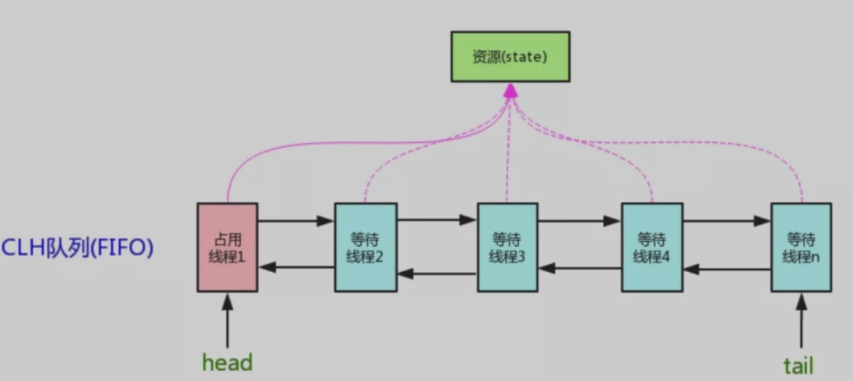

> 创建于 2021年6月16日
>
> 作者：[敖丙](https://mp.weixin.qq.com/s?__biz=MzAwNDA2OTM1Ng==&mid=2453142063&idx=2&sn=cbb98bf1591de954d053c8c3e310470c&scene=21#wechat_redirect)

[toc]

## 前言

​		谈到并发，我们不得不说 AQS（AbstractQueuedSynchronizer），所谓的 AQS 即是抽象的队列式的同步器、内部定义了很多锁相关的，我们熟知的 `ReentrantLock` 、`ReentrantReadWriteLock`、`CountDownLatch`、`Semaphore` 都是基于 AQS 来实现的 

# 一、AQS实现原理

​		AQS 中维护了一个 volatile int state（代表共享资源）和一个 FIFO 线程等待队列（多线程争用资源被阻塞时会进入次队列）。这里 volatile 能够保证多线程的可见，当 state =1 则代表当前对象已经被占用了，其他线程来加锁时则会失败，加锁失败的线程会被放入 FIFO 的等待队列中，比列会被 UNSAFE.park() 操作挂起，等待其他获取锁的线程释放锁才能够被唤醒，另外 state 的操作都是通过 CAS 来保证其并发修改的安全性

`AQS` 中提供了很多关于锁的实现方法，

- getState()：获取锁的标志state值
- setState()：设置锁的标志state值
- tryAcquire(int)：独占方式获取锁。尝试获取资源，成功则返回true，失败则返回false。
- tryRelease(int)：独占方式释放锁。尝试释放资源，成功则返回true，失败则返回false。

这里还有一些方法并没有列出来，接下来我们以`ReentrantLock`作为突破点通过源码和画图的形式一步步了解`AQS`内部实现原理。

## 1.1、目录结构

文章准备模拟多线程竞争锁、释放锁的场景来进行分析`AQS`源码：

**三个线程(线程一、线程二、线程三)同时来加锁/释放锁**

**目录如下：**

- **线程一**加锁成功时`AQS`内部实现
- **线程二/三**加锁失败时`AQS`中等待队列的数据模型
- **线程一**释放锁及**线程二**获取锁实现原理
- 通过线程场景来讲解**公平锁**具体实现原理
- 通过线程场景来讲解Condition中a`wait()`和`signal()`实现原理

这里会通过画图来分析每个线程加锁、释放锁后`AQS`内部的数据结构和实现原理