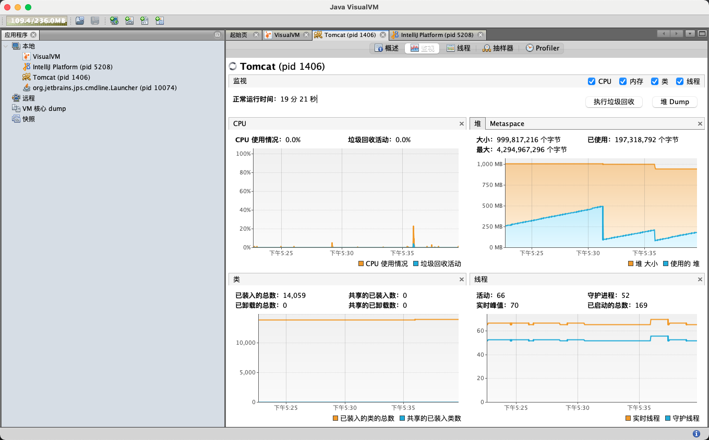
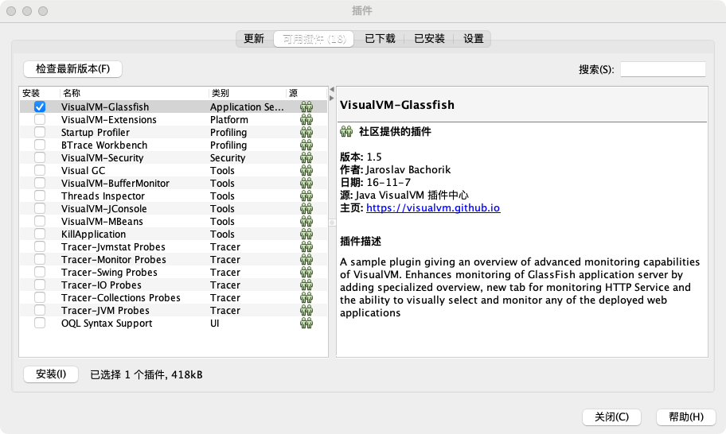
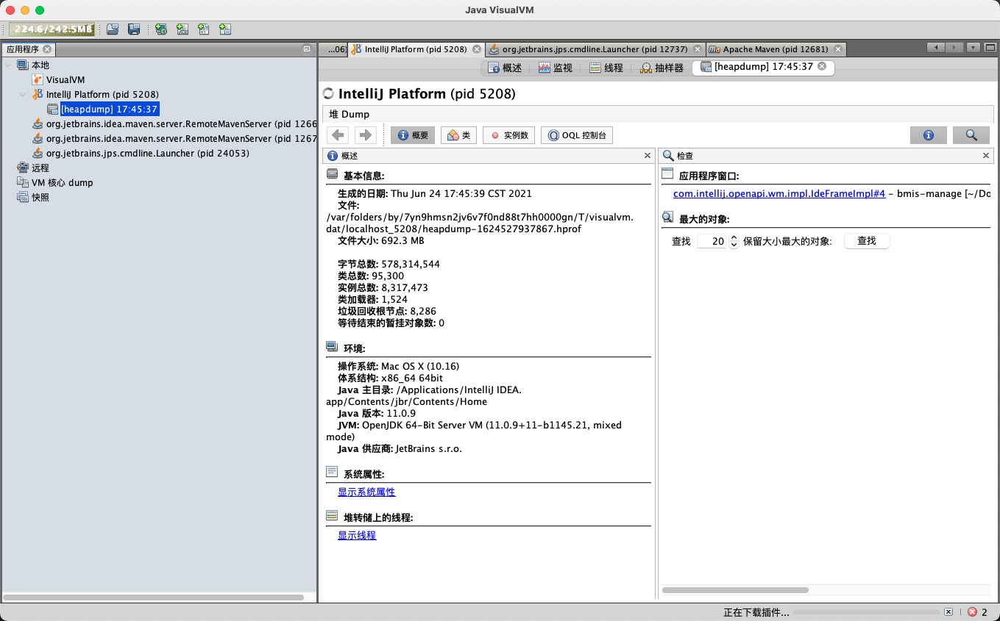
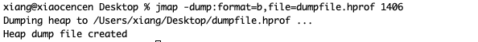

> 创建于 2021年6月24日
>
> 作者：想想

[toc]


## 打开虚拟机界面

​	mac 电脑输入这个就打开了

```sh
jvisualvm
```



在工具、插件 中找到这个插件，安装一下



通过 堆Dump 按钮，会生成一个 hprof 文件



下载 Mat 工具，对其进行分析，如果有内存泄漏情况，可以追踪到代码位置

> Mat 工具最低支持 jdk11

如果是服务器上，

可以通过这个命令生成 hprof 文件

```sh
jmap -dump:format=b,file=<dumpfile.hprof> <pid>
```



配置如下指令，当出现 OOM 的时候，就会自动 dump 到时候拿来分析就可以了！

```sh
-XX:+HeapDumpOnOutOfMemoryError
```

