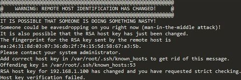
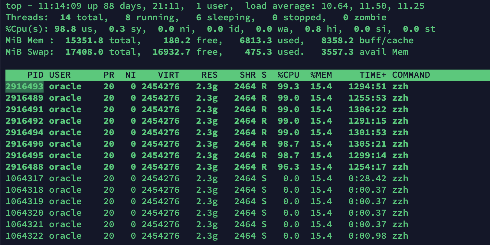

> 创建于 2021年 6月 28 日
>
> 作者：[敖丙](https://mp.weixin.qq.com/s?__biz=MzAwNDA2OTM1Ng==&mid=2453141817&idx=1&sn=fe240865992fad11612cac08e6940f5a&scene=21#wechat_redirect)

[toc]

## 排查 CPU 占满问题

### 连接 服务器

```sh
xiang@xiaocencen ~ % ssh root@192.144.233.95
root@192.144.233.95's password:
Activate the web console with: systemctl enable --now cockpit.socket

Last failed login: Mon Jun 28 10:41:19 CST 2021 from 102.37.0.204 on ssh:notty
There were 11 failed login attempts since the last successful login.
Last login: Mon Jun 28 10:39:18 2021 from 223.104.39.66
[root@Xiang ~]#
```

### 可能遇到的问题

​		在连接过程中，可能会出现的问题：比如 <span style="color:red">WARNING：REMOTE HOST IDENTIFICATION HAS CHANGED!</span>



​		ssh 会把访问过计算机的公钥（public key）放在 ~/.ssh/known_hosts 文件中，当下次访问同样计算机时，OpenSSH 会核对公钥 遇到这种情况，要么直接干掉 <span style="color:yellow">known_hosts</span> 文件，要么进入到文件内，删掉对应的 IP 信息

也可以通过命令清除

```sh
ssh-keygen -R 192.144.233.95
```

然后重新连接 🔗

### 排查问题

​		列出 CPU 使用率

```sh
top -c
```

​		按 P 按照 CPU使用率排序，找到占用 CPU 最高应用的 PID

```sh
top -Hp 1064317
```



```sh
jstack -l 2916493 > ./2916493.stack
```

对线程进行快照，看看线程干了什么

再使用 Grep 查询线程文件. `0x2C808D` 是 2916493 的十六进制

```sh
cat 2916493.stack | grep '0x2C808D' -C 8
```

可以定位到具体的 异常


