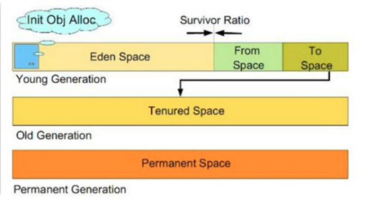

> 创建于 2021年6月28日
>
> 作者：想想

[toc]

## Full GC

> 在面试中我们会经常被问到 full GC 相关的问题，比如什么情况下会发生 full GC，如何排查频繁发生 full GC 的情况等，要想轻松回答这个问题，我们就必须充分的去理解 gc 的触发条件，gc回收的内容，gc具体的执行过程。

### GC 的定义

​		GC，即 Java 垃圾回收机制，目前主流的 JVM 采用分代收集法，与 C++ 不同的是，Java类型采用类似于树形结构的可达性分析法来判断对象是否还存在引用。从 根开始，把所有可搜索到的对象标记为存活对象。

### GC 的基础知识

​		要了解 GC 的触发条件，就要先对 JVM 的内存结构有一定调节，我们通常说的 GC 主要针对运行时数据区，作为程序员要关注的主要有五块

1. 方法区 （Method Area）

   和 Heap 一样，也是各个线程共享的内存域，这块区域主要是用来存储类加载器加载的类信息，常量、静态变量，通俗的讲就是编译后的 class 文件信息

2. Java栈（Java stack）

   JVM 栈，每个线程私有，它的生命周期和线程相同。虚拟机描述的是 Java 方法执行的内存模型，每个方法被执行的时候，都会同时创建一个栈帧，用于存储局部变量表、操作栈、动态链接、方法出口等信息。每个方法被调用直到执行完成的过程，就对应着一个栈帧在虚拟机中从入栈到出栈到过程

3. 本地方法栈（Native Method stack）

   与 JVM栈发挥作用相识，JVM栈为 虚拟机服务，本地栈为本地服务

4. 堆（Heap）

   是 JVM 管理的内存中最大的一块，程序的主要数据也都存在 堆内存中， 这一块区域所有线程是共享，通常出现线程问题一般都是这个区域的数据问题

5. 程序计数器（Program Counter Register）

   个人感觉是为多线程准备的，每个线程独立，所以可以说是线程安全的。

实际上 JVM 管理内存的时候，比这个分的更细致，只不过在做应用开发时，只需要关注这5块就够了

从图中我们可以看出 JVM heap 区域啥分代的，分为年轻代和老年代，

1. 对象优先在 Eden 区
2. 大对象直接进入老年代（-XX：PretenureSizeThreshold=3145728这个参数来定义多大的对象直接进入老年代）
3. 长期存活的对象将进入老年代
4. 动态对象年龄判定（虚拟机并不会永远地要求对象的年龄必须达到 MaxTenuringThreshold 才能晋升老年代，如果 Survivor 空间中相同年龄的所有对象大小总和大于 Survivor 的一半，年龄大于或等于改年龄的对象就可以直接进入老年代）
5. 空间分配担保
6. 只要老年代的连续空间大于（新生代所有对象的总大小或历次晋升的平均大小就会进行 minor GC 否则，full GC）

### GC 触发条件

从分了解了 JVM 的内存结构之后，下面我们就来说说什么情况下会触发 gc ，触发 full gc的情况主要有如下几种

1. System.gc（）方法的调用，此方法的调用时建议 JVM 进行 Full GC 虽然是建议而非一定，但是多数情况会触发 ful GC，从而增加 Full GC 的频率，也即增加了间歇性停顿的次数，强烈影响程序，建议不使用此方法，让虚拟机自己去管理他的内存，可以通过 -XX：+DisbaleExplictGC 来禁止 RMI（Java 远程方法调用）
2. 老年代空间不足，老年代空间只有新生代对象转入及创建为大对象、大数组才会出现不足的情况，当执行 Full GC 后仍然不足，则抛出 OutOfMemoryError（OOM）为了避免以上这两种情况下引起的 FullGC 调优时，尽量做到让对象在 Minor GC 阶段被回收，让对象在新生代存活一段时间及不要创建过大的对象及数组
3. Permanet Generation 空间满了，Permanet Generation（持久代）中存放些 class 的信息，当系统中要加载的类、反射的类和调用的方法较多时，Permanet Generation 可能会被占满，在未配置为采用 CMS GC的情况下 full GC，如果 Full GC 还回收不掉，就会OOM，为了避免Perm Gen占满造成的 Full GC现象，可采用的方法为增大 Perm Gen 空间转位使用 CMS GC
4. 通过 Minor GC 后进入老年代的评价大小大于老年代的可用内存，如果发现者统计数据说之前 Minor GC 的平均晋升大小比目前 old gen 剩余的空间大，则不会触发MinorGC 而是转位 full GC
5. 由 Eden 区、From Space 区向 To Space 区复制时，对象大小大于 To Space 可用内存，则把改对象转存老年代，且老年代的可用内存小于改对象大小。

### GC 回收的内容

​		知道触发 GC 条件后，我们就知道 GC 主要回收什么了，GC 主要回收堆中的对象，通过可达性分析对象是否存在，如果不存在，则被回收

1. 标记-清除
2. 标记-复制
3. 标记-整理
4. 分代收集

新生代中，每次垃圾收集时都有大批的对象死去，只有少量对象存活，就选用复制法。

老年代中，存活率较高，没有额外的空间对他进行分配担保，就是哟过 标记-整理 、标记-清除 回收

常用的垃圾回收器：

1. Serial 收集器
2. ParNew 收集器
3. Paraller Scavenge 收集器
4. CMS 收集器
5. G1 收集器