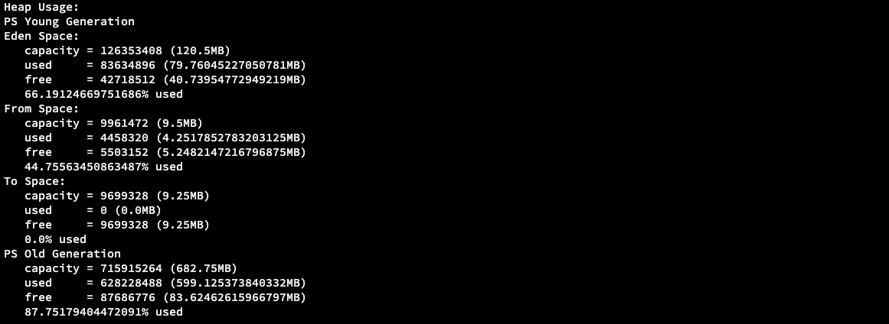
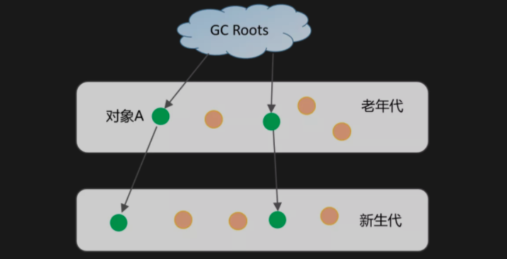
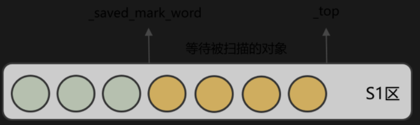

> 创建于 2021年6月28日
>
> 作者：[敖丙](https://mp.weixin.qq.com/s?__biz=MzAwNDA2OTM1Ng==&mid=2453144562&idx=2&sn=10f32918537893052c27ad7782d84b27&scene=21#wechat_redirect)

[toc]


### 排查问题

​		首先摘掉其中一个节点，通过 dump 堆文件保留线程

```sh
jmap -dump:format=b,file=heap pid
# jmap -dump:format=b,file=heap 1752979
```

### 确认 JVM 配置

```sh
ps aux | grep "applicationName=adsearch"
```

因为我们没有通过命令方式去启动服务，so 查不到任何东西...

我们可以通过  `jamp -heap pid` 查询到 Eden 区 120M S0 和 S1 都是 9.5M 老年代 682M



我们通过  `ps aux | grep "applicationName=adsearch"` 查询不到任何修改 JVM 参数的时候，就应该猜测大概率代码问题，否则就应该考虑参数问题了。

### 检查代码

YGC 主要包括两个步骤

1. 从 GC root 扫描到对象，对存活对象进行标注
2. 将存活对象复制到 S1 区或者 晋升到 Old 区

YGC 耗时和 Survivor 区的使用率成正比，判断 长生命周期的对象与来越多，导致标注和复制过程的耗时增加

### 分析 YGC 处理 Reference 的耗时

YGC Refernce 主要问题分为者俩类

1. 对存活对象标注时间过长，比如重载 Object 类的 Finalize 方法，导致标注 Final Reference 耗时过长，或者 String.intern 方法使用不当，导致 YGC 扫描 StringTable 时间过长
2. 长周期对象积累过多：比如本地缓存使用不当，积累了太多存活对象；或者锁竞争严重导致线程阻塞，局部变量的生命周期变长


> 进入正题

## YGC 相关知识点总结

YGC 问题其实比较难排查，相比 Full GC 、OOM ，YGC 的日志很简单，只知道新生代内存的变化和耗时，同时 dump 出来的堆内存必须要仔细检查才行。

另外，如果不清楚 YGC 的流程，排查起来会更困难，这里，我对 YGC 相关知识点再做下梳理，方便大家全面理解 YGC

### 1、重新认识新生代

YGC 在新生代中进行，首先要清楚新生代的堆结构划分，新生代 Eden 区和两个 Survivor区，其中 Eden:from:to = 8:1:1 （比例可以通过 -XX:SurrivorRatio 来设定）

#### 为什么会有新生代

如果不分区，所有对象在一个区域内，每次GC全盘扫描，存在效率问题，分代后，可分别控制频率回收，确保 GC 性能全局最优

#### 为什么新生代采用复制算法

新生代对象来的快，死的也快，复制算法，就是把活着的留下，死的通通不要，因为活着的少，控制尽量少的部分，比较简单。

#### 为什么新生代需要两个 Survivor 区

为了节省空间，传统的 复制算法，只有一个 survivor 区，空间占比 8:2 ，而两块 survivor 区，可以保证新对象始终在 Eden 区，两块 survivor 区相互存放，你来我往，只操作活着的，死的通通干掉。空间利用率更高

#### 新生代实际可用空间是多少

YGC 后，每一块 survivor 是空域的，就必定存在 to from 其中一个是空的，因此新生代可用内存空间是 90% 在YGC中的log 活着 jmap -heap pid 命令查看 新生代的空间，如果发现 capacity 只有90% 就不住为其了

#### Eden 区时如何加速内存分配的

HotSpot 虚拟机使用了两种技术来加速内存分配，分别是 bump-the-pointer 和 TLAB（Thread-Local-Allocation-Buffers）

由于 Eden 区时连续的，因此 bump-the pointer 在创建对象时，只需要检查最后一个对象是否有足够内存，从而加速内存分配速度，TLAB 技术针对多线程而言，Eden 中的每个线程分配一块区域，减少内存分配时的锁冲突，从而加速内存分配速度。

### 2、回收器

SerialGC（串行回收器）最古老的一种，单线程执行，适合单CPU场景

ParNew（并行回收器）将串行回收器多线程化，适合多CPU场景，需要搭配老年代 CMS 回收器一起使用

ParallelGC（并行回收器）和 ParNew 不同在于它关注吞吐量，可设置期望的停顿时间，它在工作时会自动调整堆内存大小和其他参数

G1（Gerage-First 回收器），JDK 9之后就是默认回收器了，兼顾新生代和老年代，将堆拆成 Region 不要求内存块连续，新生代仍然是并行收集

上述回收器均采用复制算法，都是独占式的，执行期间都会 Stop the world

### 3、YGC 的触发时机

当 Eden 区空间不足时，就会触发 YGC 结合新生代老的内存分配来看详细过程：

1. 新生代会尝试在栈上分配，如果不行则尝试 TLAB 分配，否则在看是否满足大对象条件在分配老年代，最后才考虑在 Eden 区申请空间
2. 如果Eden区没有合适的空间就粗发 YGC
3. YGC 时，对Eden 区和 From survivor区的存活对象进行处理，如果满足动态年龄判断的条件或 To survivor 区空间不够直接进入老年代，如果老年代空间也不足了，则会 promotion field ，触发老年代回收，否则将存活对象复制到 To Survivor 区
4. 此时 Eden 区和 From Survivor 区的剩余对象均为垃圾对象，可直接回收

此外，老年代如果上采用 CMS 回收器，为了减少 CMS Remark 阶段的耗时，也有可能会触发一次 YGC，这里不做展开

### 4、YGC 执行过程

YGC 采用的复制算法，主要分为以下两个步骤

1. 查找 GC Roots，将其引用的对象拷贝到 S1区
2. 递归遍历第一步骤，拷贝其引用对象到 S1区或晋升到 Old 区

上述过程都会暂停业务线程（STW）不过 ParNew 等新生代回收器可以多线程并行执行，提高效率

YGC 通过可达性分析算法，从 GC root 开始向下搜索，标记出当前存活到对象，那么剩下未标记的对象就要回收的。

可作为 YGC 的 GC Root 对象包括如下几种

1. 虚拟机栈引用对象
2. 方法区中静态属性、常量引用的对象
3. 本地方法栈引用对象
4. 被 Synchronized 锁持有对象
5. 记录当前被类加载的 SystemDictioary
6. 记录字符串常量引用的 StringTable
7. 存在跨代引用对象
8. 和 GC root 处同一 CardTable对象

其中 1-3 很容易想到， 4-8很容易被忽虑，却极有可能是分析 YGC 问题的入口

另外需要注意的是，针对下图跨代引用的情况，老年代的对象A也必须做为 GC root 一部分，如果每次YGC 都扫描老年代，肯定存在效率问题，在 HotSpot JVM 引入了 卡表（Card Table）来跨代引用的标记进行加速



​		Card Table 简单的理解一种空间换时间的思路，因为存在跨代引用，对象大概占比不到1%，因此可将堆内存分为大小 512 字节的卡页，如果卡页中有一个一些存在跨代引用，则可以用1个字节来表示改卡页书 dirty 状态，卡页状态进一步通过写屏障技术进行维护

​		遍历完 GC Root 后，便能找到第一批存活的对象，然后将其拷贝到 S1 区，接下来就是递归查找和拷贝的过程了。

S1 区为了方便维护内存区域，引入了两个指针对象，_save_mark_word 和 top ，其中 _save_mark_word 表示当前遍历对象的位置， _top 表示当前内存分配内存的位置，很显然 _save_mark_word 和 _top 之间的对象都是已拷贝但未扫描的对象



如上图所示，每次扫描完一个对象，_saved_mark_word会往前移动，期间如果有新对象也会拷贝到S1区，_top也会往前移动，直到_saved_mark_word追上_top，说明S1区所有对象都已经遍历完成。

有一个细节点需要注意的是：拷贝对象的目标空间不一定是S1区，也可能是老年代。如果一个对象的年龄（经历的YGC次数）满足动态年龄判定条件便直接晋升到老年代中。对象的年龄保存在Java对象头的mark word数据结构中（如果大家对Java并发锁熟悉，肯定了解这个数据结构，不熟悉的建议查阅资料了解下，这里不做展开）。

