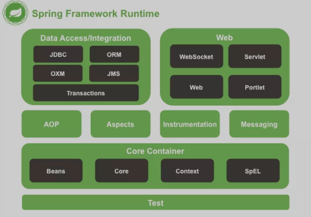
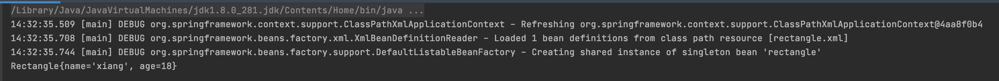

> 创建于 2021年7月2日
>
> 作者：[敖丙](https://mp.weixin.qq.com/s?__biz=MzAwNDA2OTM1Ng==&mid=2453142042&idx=2&sn=fa3a69d3dab043228426e33b1e00b540&scene=21#wechat_redirect)

[toc]

# Spring IOC

[Spring Framework 官方文档](https://docs.spring.io/spring-framework/docs/current/reference/html/)

## 一、IOC

### 1.1、什么是IOC

> IoC is also known as dependency injection (DI). It is a process whereby objects define their dependencies (that is, the other objects they work with) only through constructor arguments, arguments to a factory method, or properties that are set on the object instance after it is constructed or returned from a factory method. The container then injects those dependencies when it creates the bean. This process is fundamentally the inverse (hence the name, Inversion of Control) of the bean itself controlling the instantiation or location of its dependencies by using direct construction of classes or a mechanism such as the Service Locator pattern.
>
> IoC 也称为依赖注入 (DI)。这是一个过程，其中对象仅通过构造函数参数、工厂方法的参数或在对象实例被构造或从工厂方法返回后在对象实例上设置的属性来定义它们的依赖项（即，它们使用的其他对象） .然后容器在创建 bean 时注入这些依赖项。这个过程基本上是 bean 本身的逆过程（因此得名，控制反转），通过使用类的直接构造或诸如服务定位器模式之类的机制来控制其依赖项的实例化或位置。

> [`ApplicationContext`](https://docs.spring.io/spring-framework/docs/5.3.8/javadoc-api/org/springframework/context/ApplicationContext.html) is a sub-interface of `BeanFactory`
>
> ApplicationContext 是 BeanFactory 的子接口

​		ApplicationContext 是 BeanFactory 的子类，更好的补充和体现了 BeanFactory，BeanFactory 可以暴力的体现为 HashMap 其中 Key 是 bean-name Value 是 bean-object，但它只有简单的 put get 方法，所以称为 低级容器，而 ApplicationContext 就厉害了，实现了很多接口，称为高级容器

### 1.2、创建方法

> Several implementations of the `ApplicationContext` interface are supplied with Spring. In stand-alone applications, it is common to create an instance of [`ClassPathXmlApplicationContext`](https://docs.spring.io/spring-framework/docs/5.3.8/javadoc-api/org/springframework/context/support/ClassPathXmlApplicationContext.html) or [`FileSystemXmlApplicationContext`](https://docs.spring.io/spring-framework/docs/5.3.8/javadoc-api/org/springframework/context/support/FileSystemXmlApplicationContext.html).
>
> Spring 提供了 ApplicationContext 接口的几个实现。在独立应用程序中，通常创建 ClassPathXmlApplicationContext 或 FileSystemXmlApplicationContext 的实例。

ApplicationContext 有两个子类，用来读取配置文件 分别是：

+ ClassPathXmlApplicationContext 从 class Path 中加载配置文件（常用）
+ FileSystemXmlApplicationContext 从本地文件加载配置

### 1.3、深入理解 IOC

​		任意创建一个 实体类 Test

```java
public class Test{
  private String str;
  public String setStr(String str){
    this.str = str;
  }
}
```

​		模拟 Spring 使用 Test 类

```java
Test t1 = new Test();
t1.set("hello");
```

​		这就是 IoC 给属性赋值的实现方法，我们把「创建对象的过程」转移给了 Spring IoC，而不是我们自己手动去 new 

### 1.4、控制反转

+ 什么是控制？控制什么？ 

   控制 对象实例，对Test类的一个控制， 把 Test 对象看成是一个 Bean ，IoC 对 Bean 的创建、管理，控制 Bean 的整个生命周期

+ 什么是反转？

  把这个权利交给了 Spring 容器，而不是自己去控制，就是反转。由之前的自己主动创建对象，变成现在被动接收别人给我们的对象的过程，这就是反转。	自己炒股、选股票的人就是主动投资，主动权掌握在自己的手中；而买基金的人就是被动投资，把主动权交给了基金经理，除非你把这个基金卖了，否则具体选哪些投资产品都是基金经理决定的。

+ 依赖注入

  引用原话 `IoC is also known as dependency injection (DI)`  Ioc 就是 DI，程序运行需要依赖外部资源，提供程序内对象所需数据、资源

为什么要使用 IOC 呢？IOC 体现了什么好处？

​		IoC 方便统一管理，左 new 一个，又 new 一个，对象中可能又会存在共同点，这时想处理一部分的对象，又很麻烦，Ioc 做到了统一管理的作用，就好比 Maven 管理 jar 包一样，统一的管理运用到全局的项目中。

## 二、Spring 模块



一个绿框代表一个模块，如果要用这个模块，就需要导入黑色的包，「jar包」也就是说，至少要 Beans、Core、Context、SpEL 这四个jar，支撑 Core Container 模块

### 2.1、构建 Spring 项目

jar包下载地址：[https://repo.spring.io/artifactory/release/org/springframework/spring/](https://repo.spring.io/artifactory/release/org/springframework/spring/)

创建一个实体类 Rectange ，其中两个属性 String name，Integer age 给出 getter、Setter 、toString方法

在 resources 中配置 rectange.xml 文件

```xml
<bean id="rectangle" class="com.xiang.init.Rectangle">
        <property name="name" value="xiang"/>
        <property name="age" value="18"/>
</bean>
```

写 main 方法

```java
public static void main(String[] args) {
  ApplicationContext context = new ClassPathXmlApplicationContext("rectangle.xml");
  Rectangle rectangle = context.getBean("rectangle", Rectangle.class);
  String s = rectangle.toString();
  System.out.println(s);
}
```



### 2.2、作用范围

还是原来的配置

```java
ApplicationContext context = new ClassPathXmlApplicationContext("rectangle.xml");
Rectangle rectangle1 = context.getBean("rectangle", Rectangle.class);
Rectangle rectangle2 = context.getBean("rectangle", Rectangle.class);
System.out.println(rectangle1 == rectangle2);
```

输出结果为：`true`

在原先配置上 加    scope="prototype"

```xml
<bean id="rectangle" class="com.xiang.init.Rectangle">
        <property name="name" value="xiang"/>
        <property name="age" value="18"/>
</bean>
```

再去执行，就是 false 了

