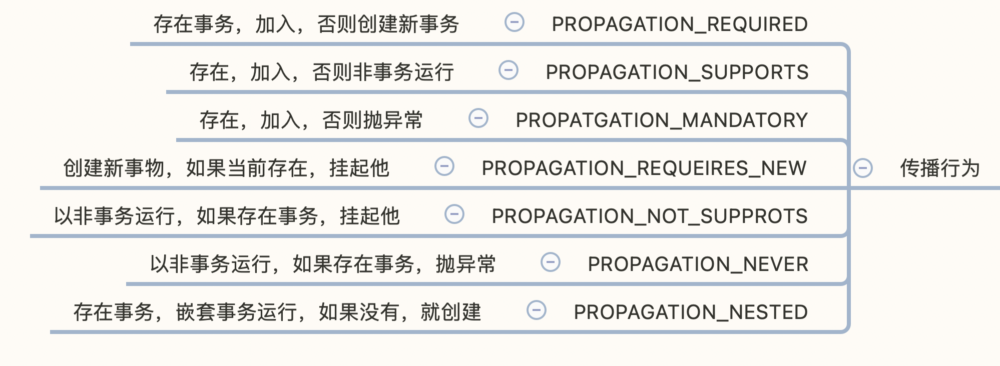
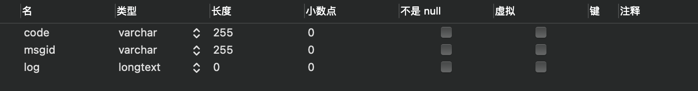

> 33333创建于 2021年 7月3日
>
> 作者：[敖丙](https://mp.weixin.qq.com/s?__biz=MzAwNDA2OTM1Ng==&mid=2453142012&idx=2&sn=239d190ab27024af39e51e7e21806e95&scene=21#wechat_redirect)

[toc]

# Spring 传播行为

## 一、基础概念

### 1.1、什么是事务传播行为

​		Spring 在 TranscationDefintion 接口中规定了 7 种类型的 事务传播行为，事务传播行为是 Spring 框架独有的事务增强传播特性，他不属于的事务实际提供方数据库行为，事务的传播描述由一个事物传播行为修饰的方法嵌套进另一个方法时事物进行传播

### 1.2、Spring 中事物的 7 种传播方式



## 二、代码演练

在 MySQL 数据库中存在一张 imas_log 表



搭建 SpringBoot + MybatisPlus 环境，我们主要是测试 Spring 的传播行为，持久层的代码就大致贴一些
LoggerMapper.xml

```xml
    <update id="insert" parameterType="com.xiang.entry.Log" >
        insert into bmis_log(code,msgid,log) values (#{code},#{msgid},#{log})
    </update>
```

抽象出 insert 方法 `LogMapper` 抽象类

```java
public interface LogMapper extends BaseMapper<Log> {
    @Override
    int insert(Log log);
}
```

### 2.1、创建事务 REQUIRED

如果当前存在事务，则加入，如果不存在，就创建事务！

Log1ServiceImpl

```java
@Transactional(propagation = Propagation.REQUIRED)
public void addRequired(Log log){
  logMapper.insert(log);
}

@Transactional(propagation = Propagation.REQUIRED)
public void addRequiredExeption(Log log){
  logMapper.insert(log);
  throw new RuntimeException();
}
```

Log2ServiceImpl

```java
@Transactional(propagation = Propagation.REQUIRED)
public void addRequired(Log log){
    logMapper.insert(log);
}

@Transactional(propagation = Propagation.REQUIRED)
public void addRequiredExeption(Log log){
  logMapper.insert(log);
  throw new RuntimeException();
}
```

#### 2.1.1、场景一 外围没有开启事务

```java
    @Test
    void requeires(){
        Log log1 = new Log();
        log1.setMsgid("require1");
        log1Service.addRequired(log1);

        Log log2 = new Log();
        log2.setMsgid("require2");
        log2Service.addRequired(log2);
        throw new RuntimeException();
    }
```

> 结论：两个都插入成功

#### 2.1.2、场景二 外围开启事务

​		外围开启事务，这个使用效率比较高

```java
    @Test
    @Transactional(propagation = Propagation.REQUIRED)
    void requeires(){
        Log log1 = new Log();
        log1.setMsgid("require1");
        log1Service.addRequired(log1);

        Log log2 = new Log();
        log2.setMsgid("require2");
        log2Service.addRequired(log2);
        throw new RuntimeException();
    }
```

> 结论：两个都失败！

#### 2.1.3、场景三 外围开启事务 第二个内部异常

```java
    @Test
    @Transactional(propagation = Propagation.REQUIRED)
    void requeires(){
        Log log1 = new Log();
        log1.setMsgid("require1");
        log1Service.addRequired(log1);

        Log log2 = new Log();
        log2.setMsgid("require2");
        log2Service.addRequiredExeption(log2);
    }
```

> 结论：两个都失败

#### 2.1.4、场景四 外围开启事务 第二个内部异常 捕捉异常并处理

```java
   @Test
    @Transactional(propagation = Propagation.REQUIRED)
    void requeires(){
        Log log1 = new Log();
        log1.setMsgid("require1");
        log1Service.addRequired(log1);

        Log log2 = new Log();
        log2.setMsgid("require2");
        try {
            log2Service.addRequiredExeption(log2);
        }catch (Exception e){
            log.info("log2 回滚");
        }
    }
```

> 结论：两个都失败，即使方法被 catch，不被外围方法所感知，整个事务依旧回滚

==总的结论：以上实验证明，我们在外围开启事务的情况下，Propagation.REQUIRED 修饰的内部方法会加入到外围方法的事务中，所有 Propagation.REQUIRED 修饰的内部方法和外围方法都属于同一个事务，只有有一个方法回滚，整个事务回滚==

### 2.2、创建新事物 REQUIRED_NEW

log1ServiceImpl

```java
    @Transactional(propagation =  Propagation.REQUIRES_NEW)
    public void addRequiresNew(Log log){
        logMapper.insert(log);
    }
```

Log2ServiceImpl

```java
@Transactional(propagation =  Propagation.REQUIRES_NEW)
public void addRequiresNew(Log log){
    logMapper.insert(log);
}

@Transactional(propagation = Propagation.REQUIRES_NEW)
public void addRequiresNewException(Log log){
    logMapper.insert(log);
    throw new RuntimeException();
}
```

#### 2.2.1、场景一 外围没有开启事务

测试案例一：

```java
@Test
void notransaction_requiresNew(){
    Log log1 = new Log();
    log1.setMsgid("requireNew1");
    log1Service.addRequiresNew(log1);

    Log log2 = new Log();
    log2.setMsgid("requireNew2");
    log1Service.addRequiresNew(log2);
    throw new RuntimeException();
}
```

> 结论：两个都插入成功，外围方法抛出异常回滚不影响内部方法

测试案例二：

```java
@Test
void notransaction_requiresNew_exception(){
    Log log1 = new Log();
    log1.setMsgid("requireNew1");
    log1Service.addRequiresNew(log1);

    Log log2 = new Log();
    log2.setMsgid("requireNew2");
    log2Service.addRequiresNewException(log2);
}
```

> 结论：第一个插入成功，外围没有开启事务，插入1任务 和 插入2 任务分别开启了自己的事务，插入2任务回滚，不影响其他事务

#### 2.2.2、场景二 外围开启事务

测试案例一：

```java
@Test
@Transactional(propagation = Propagation.REQUIRED)
void notransaction_requiresNew(){
    Log log1 = new Log();
    log1.setMsgid("requireNew1");
    log1Service.addRequired(log1);

    Log log2 = new Log();
    log2.setMsgid("requireNew2");
    log2Service.addRequiresNew(log2);

    Log log3 = new Log();
    log3.setMsgid("requireNew3");
    log2Service.addRequiresNew(log3);
    throw new RuntimeException();
}
```

> 结论： 第二个、第三个插入成功，第一个回滚。在外部开启事务的情况下，外部事务和第一个事务同为一个事务，2、3是单独的事务，外部事务回滚，影响插入1，不影响 任务 2、3

测试案例二：

```java
@Test
@Transactional(propagation = Propagation.REQUIRED)
void notransaction_requiresNew(){
    Log log1 = new Log();
    log1.setMsgid("requireNew1");
    log1Service.addRequired(log1);

    Log log2 = new Log();
    log2.setMsgid("requireNew2");
    log2Service.addRequiresNew(log2);

    Log log3 = new Log();
    log3.setMsgid("requireNew3");
    log2Service.addRequiresNewException(log3);
}
```

> 结论：第二个成功，第一、第三都失败。外围方法开启事务，插入1和外围方法同一个事务，插入2单独一个事务，插入3异常，首先，插入3回滚，异常抛出外围，外围感知后，插入1也回滚

测试案例三：

```java
@Test
@Transactional(propagation = Propagation.REQUIRED)
@Rollback(value = false)
void notransaction_requiresNew(){
    Log log1 = new Log();
    log1.setMsgid("requireNew1");
    log1Service.addRequired(log1);

    Log log2 = new Log();
    log2.setMsgid("requireNew2");
    log2Service.addRequiresNew(log2);

    Log log3 = new Log();
    log3.setMsgid("requireNew3");
    try{
        log2Service.addRequiresNewException(log3);
    }catch (Exception e){
        log.info("requireNew3 回滚");
    }
}
```

> 结论：插入1、插入2 执行成功，插入3 回滚，插入3 异常，抛出异常后， catch 处理了异常，所以只有 插入3回滚，插入1、插入2 都成执行

==总结论，在外围开启事务的情况下，Propagation.REQUIRES_NEW 修饰了内部方法依然会独立开启事务，且外围事务也独立，相互独立，互不干扰==

### 2.3、嵌套事务 PROPAGATION_NESTED

log1ServiceImpl

```java
    @Transactional(propagation = Propagation.NESTED)
    public void addNested(Log log){
        logMapper.insert(log);
    }
```

log2ServiceImpl

```java
    @Transactional(propagation = Propagation.NESTED)
    public void addNested(Log log){
        logMapper.insert(log);
    }

    @Transactional(propagation = Propagation.NESTED)
    public void addNestedException(Log log){
        logMapper.insert(log);
        throw new RuntimeException();
    }
```

#### 2.3.1、场景一 外围没有开启事务

测试案例一：

```java
@Test
void notransaction_exception_nested_nested(){
    Log log1 = new Log();
    log1.setMsgid("requireNew1");
    log1Service.addNested(log1);

    Log log2 = new Log();
    log2.setMsgid("requireNew2");
    log2Service.addNested(log2);
    throw new RuntimeException();
}
```

> 结论，log1、log2 插入成功，都在各自嵌套的事务中运行，不受外围异常影响

测试案例二：

```java
@Test
void notranscation_excpetion_nested_nestedException(){
    Log log1 = new Log();
    log1.setMsgid("requireNew1");
    log1Service.addNested(log1);

    Log log2 = new Log();
    log2.setMsgid("requireNew2");
    log2Service.addNestedException(log2);
}
```

>  结论：log1插入成功，log2回滚。log1、log2 都在独立的事务中运行，log2 异常回滚，不影响log1点插入

#### 2.3.2、场景二 外围开启事务

测试案例一：

```java
@Transactional
public void transcation_exception_nested_nested(){
  Log log1 = new Log();
  log1.setMsgid("requireNew1");
  log1Service.addNested(log1);

  Log log2 = new Log();
  log2.setMsgid("requireNew2");
  log2Service.addNested(log2);
  throw new RuntimeException();
}
```

> 结论：log1、log2 插入失败，内部事务为外围事务的子事务，外围方法回滚，内部方法也要回滚

测试案例二：

```java
@Transactional
public void transcation_nested_nested_exception(){
    Log log1 = new Log();
    log1.setMsgid("requireNew1");
    log1Service.addNested(log1);

    Log log2 = new Log();
    log2.setMsgid("requireNew2");
    log2Service.addNestedException(log2);
}
```

> 结论：log1、log2 插入失败，log2 为外围事务子事务，log2异常后，抛到外围事务，一块回滚

测试案例三：

```java
@Transactional
public void transcation_nested_nested_exception_try(){
    Log log1 = new Log();
    log1.setMsgid("requireNew1");
    log1Service.addNested(log1);

    Log log2 = new Log();
    log2.setMsgid("requireNew2");
    try {
        log2Service.addNestedException(log2);
    }catch (Exception e){
        log.info("log2 异常回滚");
    }
}
```

> 结论，log1 插入成功，log2 回滚，log2异常后，被外围捕捉，没有让异常抛到外围事务。所以 log1提交成功

### 2.4、REQUIRED、REQUIRES_NEW、NESTED 异同

​		NESTED 和 REQUIRED 修饰的内部方法都属于外围方法事务，如果外围方法抛出异常，这种放啊的事务都会被回滚，但是 REQUIRED 是加入外围方法事务，所以和外围事务同属于一个事务，一旦REQURED 事务抛出异常被回滚，外围事务也会回滚，二NESTED 是外围方法的子放啊，有单独的保存点，所以 NESTED 放啊抛出异常被回滚，不会影响到外围子事务。

​		NESTED 和 REQUREDS_NEW 都可以做到内部事务回滚而不影响外围事务，但是因为 NESTED 是嵌套事务，所以外围事务回滚后，作为子事务也会回滚，而REQURES_NEW通过开启了新的事务，内部事务和外围事务是两个事务，外围事务回滚不会影响到内部事务

## 三、模拟用例

​		假设我们有个组册方法，方法中调用添加积分的方法，如果我们希望添加积分不会影响注册流程（即使加积分执行失败回滚，不能使注册方法回滚），理解上来说就是，外围事务异常回滚，子事务不用回滚，我们这样写

```java
@Transacational
public void register(User user){
  try{
    pointService.addPoint(Point point);
  }catch(Exception e){
    // 省略....
  }
}
```

​		我们还规定组册失败要影响 addPoint() 方法，（组册方法回滚添加积分方法也需要回滚）那么 addPoint（）方法就需要这样实现

```java
@Transacational(propagation = Propagation.NESTED)
public void addPoint(Log log){
  try{
    recordService.addRecord(Record record);
  }catch(Exception e){
    // 省略....
  }
}
```

​		我们注意到了在 addPoint（）中还调用了 addRecord（）方法，这个方法用来记录日志

```java
@Transacational(propagation = Propagation.NOT_SUPPORTED)
public void addRecord(Log log){

}
```

​		addRecord() 方法中 propagation = Propagation.NOT_SUPPORTED 因为对于日志无所谓精确，可以多一条也可以少一条，所以 addRecord（）放啊本身和外围 addPoint（）方法抛出异常都不会使 addRecord（）方法回滚，并且 addRecord（）方法抛出异常也不会影响到外围 addPorint（）方法的执行