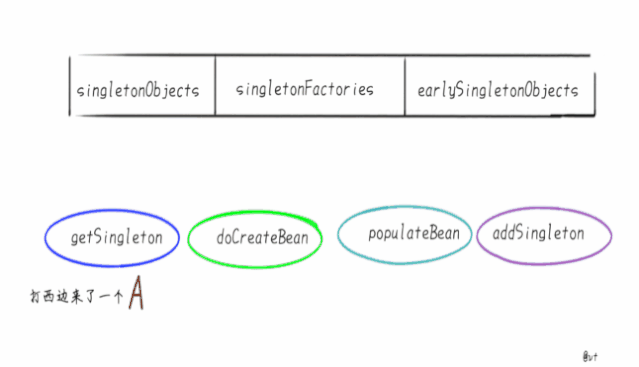
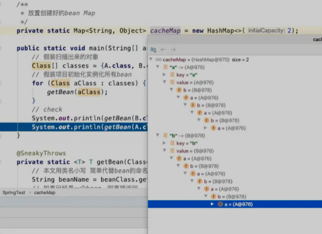

> 创建于2021年 7月10日
>
> 作者：[敖丙](https://mp.weixin.qq.com/s?__biz=MzAwNDA2OTM1Ng==&mid=2453143515&idx=1&sn=c15f40f4f45bf155fe7eddb7dc2c9080&scene=21#wechat_redirect)

[toc]

# Spring 循环依赖

​		如果面试官直接问一下 "框架源码题"  不能体现面试官的能力，有能力的面试官会问一些：如果注册的属性为 "null"  你会从几个方面去排查 这类的场景问题。

## 分析问题

​		通常来讲，如果问 Spring 内部如何解决循环依赖，一定是默认的 单例 情况，属性互相引用场景

比如：

```java
@Component
public class A{
  @Autowired
  private B b;
}

@Component
public class B{
  @Autowired
  private C c;
}

@Component
public class C{
  @Autowired
  private C c;
}
```

或者是

```java
@Component
public class A{
  @Autowired
  private A a;
}
```

提前说明，Prototype（原型）的场景是不支持循环依赖的，通常会走到 AbstractBeanFactory 类中下面判断，抛出异常

```
BeanCurrentlyInCreationException(beanName)
```

原因很好理解，创建新的 A 的时候，发现要注入原型字段B，又要创建 B 发现又要注入原型 A，这样就要套娃了，你猜是先 StackOverflow 还是 OutOfMenmory？Spring 怕你不好猜，就先抛出了 BeanCurrentlyInCreationException，基于构造器的循环依赖，就更不用说了，官方文档都摊牌了，你想让构造器注入支持循环依赖，是不存在的，不如把代码改改了，那么默认单例的属性注入场景。

## Spring 解决循环依赖

​		首先，Spring 内部维护了 三个 Map，也就是我们通常说的三级缓存，在 Spring 的 `DefaultSingletonBeanRegistory` 类中，你会发现类上挂着这三个 Map

```java

	/** Cache of singleton objects: bean name to bean instance. */
	private final Map<String, Object> singletonObjects = new ConcurrentHashMap<>(256);

	/** Cache of singleton factories: bean name to ObjectFactory. */
	private final Map<String, ObjectFactory<?>> singletonFactories = new HashMap<>(16);

	/** Cache of early singleton objects: bean name to bean instance. */
	private final Map<String, Object> earlySingletonObjects = new ConcurrentHashMap<>(16);

```

+ singletonObjects 它说我们最熟悉的朋友，俗称 "单例池" "容器"，缓存创建完成单例 Bean 的地方
+ singletonFactories 映射创建 Bean 的原始工程
+ earlySingletonObjects 映射 Bean 的早期引用，也就是说在这里 Map 里 Bean 不是完整的，甚至还不能称之为 Bean 只能说一个 Instance

后两个 Map 其实是 "垫脚石" 级别的，只说创建 Bean 的时候，用来借助里一些，创建完就清掉了。所以前文对"三级缓存"这个词还有些模糊，可能是因为注解都是以 Cache of 开头的，为什么后两个Map 是垫脚石呢？假设最终放在 singletonObjects 的 Bean 是你想要的凉白开，那么Spring 准备了两个杯子，在 singletonFactories 和 earlySingletonObjects 两边来回倒腾



## 循环依赖的本质

​		假设让你实现一个有以下特点的功能，你会怎么做

+ 将制定的一些类实例为单例
+ 类中的字段也都实例为单例
+ 支持循环依赖

举个例子，假设有类A：

```java
public class A{
  private B b;
}
```

类B：

```java
public class B{
  private A a;
}
```

说白了让你模仿 Spring 假装 A 和 B 是被 @Component 修饰，并且类中的字段假装是 @Autowired 修饰的，处理完放到 Map 中

```java
/**
 * 放置创建好的 bean Map
 */
private static Map<Sting,Object> cacheMap = new HashMap<>(2);
public static void main(String[] args){
  // 假装扫描出来的对象
  class[] classes = {A.class,B.class};
  // 假装项目初始化实例化所有bean
  for (Class aClass : classes){
    getBean(aClass);
  }
  // check
  System.out.println(getBean(B.class).getA() == getBean(A.class));
  System.out.printLn(getBean(A.class).getB() == getBean(B.class));
}

 @SneakyThrows
    private static <T> T getBean(Class<T> beanClass) {
        // 本文用类名小写 简单代替bean的命名规则
        String beanName = beanClass.getSimpleName().toLowerCase();
        // 如果已经是一个bean，则直接返回
        if (cacheMap.containsKey(beanName)) {
            return (T) cacheMap.get(beanName);
        }
        // 将对象本身实例化
        Object object = beanClass.getDeclaredConstructor().newInstance();
        // 放入缓存
        cacheMap.put(beanName, object);
        // 把所有字段当成需要注入的bean，创建并注入到当前bean中
        Field[] fields = object.getClass().getDeclaredFields();
        for (Field field : fields) {
            field.setAccessible(true);
            // 获取需要注入字段的class
            Class<?> fieldClass = field.getType();
            String fieldBeanName = fieldClass.getSimpleName().toLowerCase();
            // 如果需要注入的bean，已经在缓存Map中，那么把缓存Map中的值注入到该field即可
            // 如果缓存没有 继续创建
            field.set(object, cacheMap.containsKey(fieldBeanName)
                    ? cacheMap.get(fieldBeanName) : getBean(fieldClass));
        }
        // 属性填充完成，返回
        return (T) object;
    }
```

Debug 这段代码，cacheMap 中放的就是完整的 “Bean”了



这就是“循环依赖”的本质，而不是 “Spring 然后解决循环依赖”

## two sum

two sum 是 leetcode 第一题，问题内容是：给定一个数组，给定一个数字，返回数组中可以想家得到的数字的两个索引，

比如 nums[] = { 2, 7, 11, 15} , target = 9

返回 0 ， 1 ，因为 2+7=9

优解是一次遍历 HashMap

```java
class Solution{
  public int[] twosum(int[] nums,int target){
    Map<Integer,Integer> map = new HashMap<>();
    for(int i=0;i<nums.legth,i++){
      int complement = target - nums[i];
      if (map.continsKey(complement)){
        return new int[]{map.get(complement),i};
      }
      map.put(num[i],i)
    }
  }
}
```

循环依赖的解决办法是 先去 Map 中找到需要的数字，没有就将当前数字保存在Map中，如果找到需要的数字，就一起返回，=》 先去缓存中找 Bean，没有则实例化，放到Map中如果有需要依赖当前的 bean 就能从 Map 中取出来