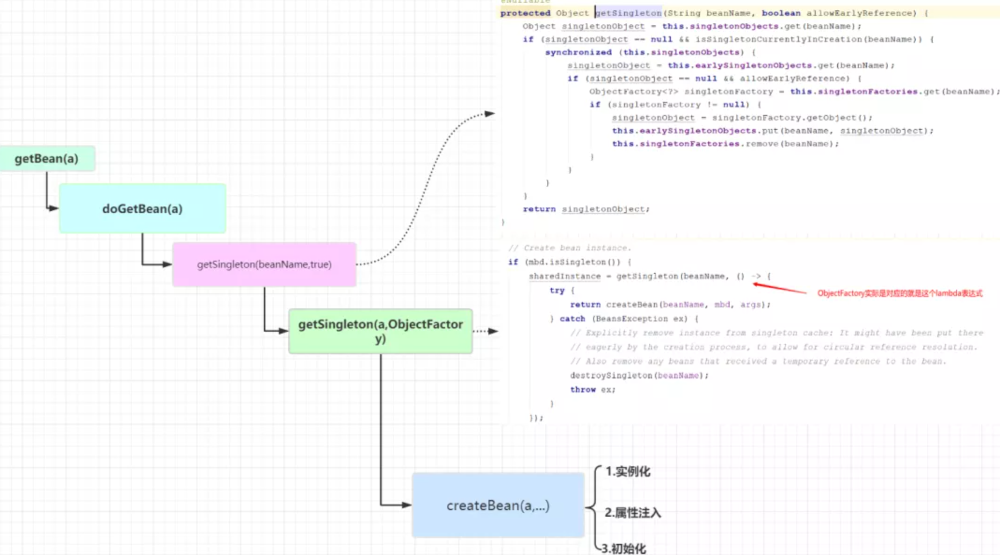
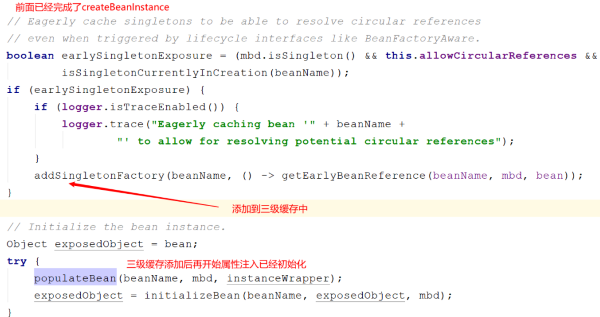
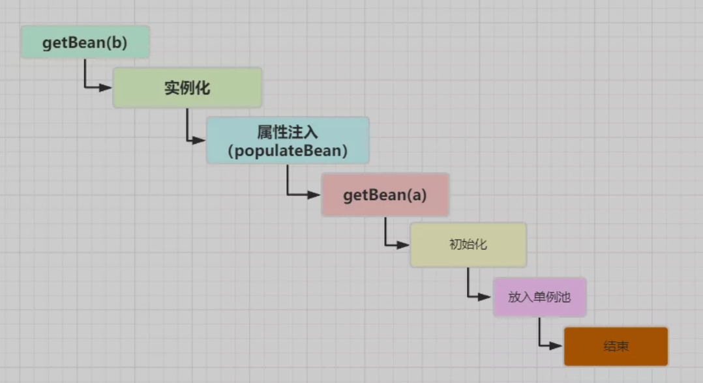
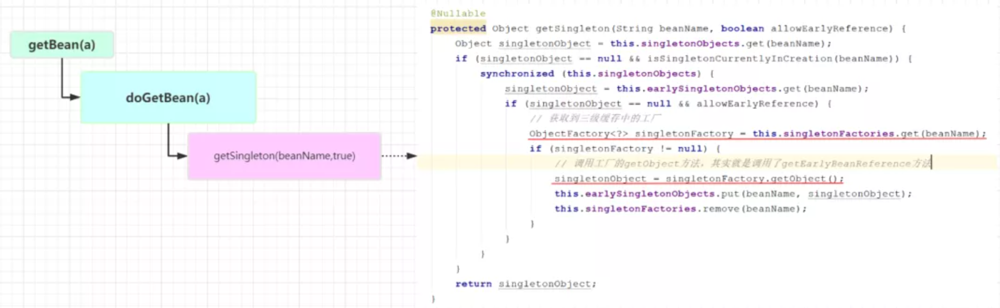
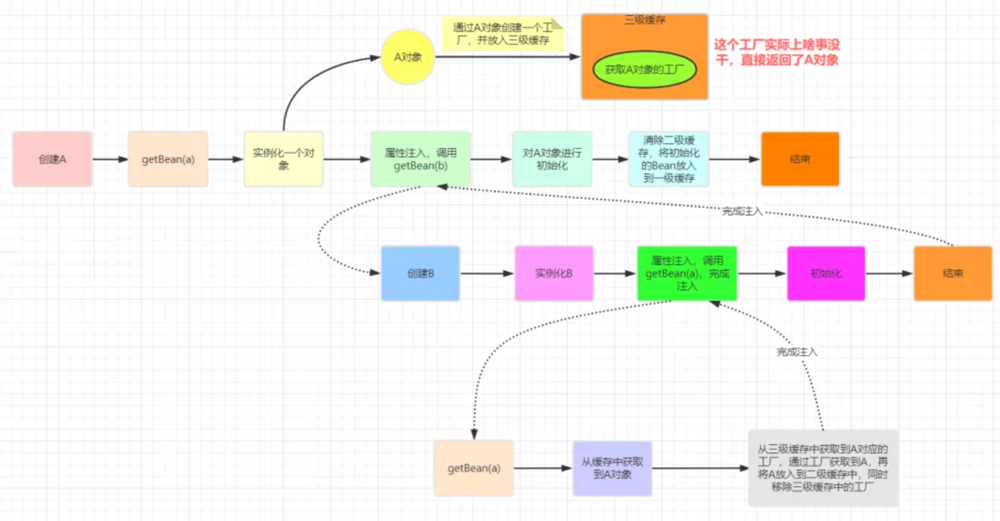

> 创建于 2021年7月20日
>
> 作者：Xiang想
> 		参考：[敖丙](https://mp.weixin.qq.com/s?__biz=MzAwNDA2OTM1Ng==&mid=2453145072&idx=1&sn=5d46d4294e48526a5a7496e9980d4319&scene=21#wechat_redirect)

[toc]

# Spring 循环依赖

​		Spring 中的循环依赖一直是 Spring 中一个很重要的话题，一方面是因为源码中为了解决循环依赖做了很多处理，另一方面是因为面试的时候，如果问到Spring 中比较高阶的问题，那么循环依赖必然逃不掉

主要从这几点来回答：

1. 什么是循环依赖

2. 什么情况下循环依赖可以处理

3. Spring 是如何解决循环依赖

   ​	

同时本文希望纠正几个循环依赖的错误说法；

1. 只有在 Setter 方法注入时，循环依赖才能解决（错❌）
2. 三级缓存的目的是为了提高效率（错误❌）

## 1、什么是循环依赖

这里 之前就已接提及过了，A依赖于B、B依赖于A

## 2、什么情况下依赖可以处理

回答这个问题前首先要明切一点，Spring 解决循环依赖上有前置条件的

1. 出现循环依赖的 Bean 必须上单例
2. 依赖注入的方式不能全是构造器注入的方式（很多博客上说，只能解决setter 方法的循环依赖，这是错误的）

其中第一点在之前的文章就可以找到答案，第二点：不能全是构造器注入是什么意思呢？我们用代码演示

```java
@Component
public class A {
// @Autowired
// private B b;
 public A(B b) {

 }
}


@Component
public class B {

// @Autowired
// private A a;

 public B(A a){

 }
}
```

在上面的例子中，A中注入B的方式是通过构造器，B中注入A的方式也是通过构造器，这个时候循环依赖是无法被解决，如果你的项目中有两个这样相互依赖的Bean，在启动时就会报出以下错误：

```
Caused by: org.springframework.beans.factory.BeanCurrentlyInCreationException: Error creating bean with name 'a': Requested bean is currently in creation: Is there an unresolvable circular reference?
```

为了测试循环依赖的解决情况跟注入方式的关系，我们做如下四种情况的测试

| 依赖情况               | 依赖注入方式                                       | 循环依赖是否被解决 |
| :--------------------- | :------------------------------------------------- | :----------------- |
| AB相互依赖（循环依赖） | 均采用setter方法注入                               | 是                 |
| AB相互依赖（循环依赖） | 均采用构造器注入                                   | 否                 |
| AB相互依赖（循环依赖） | A中注入B的方式为setter方法，B中注入A的方式为构造器 | 是                 |
| AB相互依赖（循环依赖） | B中注入A的方式为setter方法，A中注入B的方式为构造器 | 否                 |

具体的测试代码很简单，我就不放了。从上面的测试结果我们可以看到，不是只有在setter方法注入的情况下循环依赖才能被解决，即使存在构造器注入的场景下，循环依赖依然被可以被正常处理掉。

在测试的时候， 注释掉 构造函数 就相当于用了 setter 注入，注释 @AutoWrite 就相当于使用了构造函数

那么到底是为什么呢？Spring到底是怎么处理的循环依赖呢？不要急，我们接着往下看

## 3、Spring 是如何解决循环依赖？

关于循环依赖的解决方案应该要分为两种情况来讨论

1. 简单的循环依赖（没有 AOP）
2. 结合了 AOP 的循环依赖

简单的循环依赖（没有AOP）

```java
@Component
public class A {
    // A中注入了B
 @Autowired
 private B b;
}

@Component
public class B {
    // B中也注入了A
 @Autowired
 private A a;
}
```

通过上文我们已经知道了这种情况下的循环依赖说能够被解决的，那么具体的流程是什么呢？我们一步一步分析

首先，我们要知道 Spring 在创建 Bean 的时候默认是按照自然排序来进行创建的，所以第一步 Spring 会去创建 A。

​		与此同时，我们应该知道，Spring 在创建 Bean的过程中分为三步

1. 实例化，对应方法：AbstractAutowireCapableBeanFactory 中的 createBeanInstance 方法
2. 属性注入，对应方法：AbstractAutowireCapableBeanFactory 中的 populateBean 方法
3. 初始化，对应方法：AbstractAutowireCapableBeanFactory 中的 initializeBean 方法

这些方法，简单的解释就是，1、实例化，简单理解就是 new了一个对象，2、属性注入，为实例化中 new 出来的对象填充属性，3、初始化，执行 aware 接口方法，初始化方法，完成 AOP 代理。

创建 A 的过程实际上就是调用 getBean 方法，这个方法有两层含义

1. 创建一个新的 Bean
2. 从缓存中获取到已经被创建的对象

我们先分析第一层意思，因为缓存中还没有 A

调用 getSingletion（BeanName）



​		首先调用` getSingletion（a）`方法，这个方法又会调用` getSingletion（beanName，true）`这个方法实际上就是到缓存中尝试获取 Bean ，整个缓存分为三级

1. singletionObjects，一级缓存，存储的是所有创建好的单例Bean

2. earlySingletionObjects，完成实例化，但是还未进行属性注入及初始化对象

3. singletionFactoires，提前暴露的一个单例工程，二级缓存中存储的就是从这个工厂中获取到的对象

   ​	因为 A 是第一次被创建，所以不管那个缓存中必然都是没有的，因此会进入 getSingletion 的另一个重载方法 getSingleton(beanName,singletionFactory)

调用 getSingleton（beanName，singletonFacotry）

```java
public Object getSingleton(String beanName, ObjectFactory<?> singletonFactory) {
    Assert.notNull(beanName, "Bean name must not be null");
    synchronized (this.singletonObjects) {
        Object singletonObject = this.singletonObjects.get(beanName);
        if (singletonObject == null) {

            // ....
            // 省略异常处理及日志
            // ....

            // 在单例对象创建前先做一个标记
            // 将beanName放入到singletonsCurrentlyInCreation这个集合中
            // 标志着这个单例Bean正在创建
            // 如果同一个单例Bean多次被创建，这里会抛出异常
            beforeSingletonCreation(beanName);
            boolean newSingleton = false;
            boolean recordSuppressedExceptions = (this.suppressedExceptions == null);
            if (recordSuppressedExceptions) {
                this.suppressedExceptions = new LinkedHashSet<>();
            }
            try {
                // 上游传入的lambda在这里会被执行，调用createBean方法创建一个Bean后返回
                singletonObject = singletonFactory.getObject();
                newSingleton = true;
            }
            // ...
            // 省略catch异常处理
            // ...
            finally {
                if (recordSuppressedExceptions) {
                    this.suppressedExceptions = null;
                }
                // 创建完成后将对应的beanName从singletonsCurrentlyInCreation移除
                afterSingletonCreation(beanName);
            }
            if (newSingleton) {
                // 添加到一级缓存singletonObjects中
                addSingleton(beanName, singletonObject);
            }
        }
        return singletonObject;
    }
}
```

​		上面的代码我们主要抓住一点，通过 createBean 方法返回 Bean 最终被放到一级缓存中，也就是单例池中，那么到这里我们可以得到一个结论：一级缓存中存储的是已经完成创建好的单例 Bean

调用 `addSingletonFacotry（）`方法




在完成Bean的实例化后，属性注入之前Spring将Bean包装成一个工厂添加进了三级缓存中，对应源码如下：

```java
// 这里传入的参数也是一个lambda表达式，() -> getEarlyBeanReference(beanName, mbd, bean)
protected void addSingletonFactory(String beanName, ObjectFactory<?> singletonFactory) {
    Assert.notNull(singletonFactory, "Singleton factory must not be null");
    synchronized (this.singletonObjects) {
        if (!this.singletonObjects.containsKey(beanName)) {
            // 添加到三级缓存中
            this.singletonFactories.put(beanName, singletonFactory);
            this.earlySingletonObjects.remove(beanName);
            this.registeredSingletons.add(beanName);
        }
    }
}
```

​		这里只是添加一个工厂，通过这个工厂（ObjectFactory）的getObject 方法可以得到一个对象，而这个对象实际上是通过 getEarlyBeanReference 这个方法创建的，那么，什么时候会调用这个工厂呢的 getObject 方法呢？这个时候就要创建 B 的流程了

​		当 A 完成了实例化并添加进了三级缓存后，就要开始为 A 进行属性注入了，在注入时 发现A依赖了B，那么这个时候 Spring 又会去 getBean（b）然后反射调用 setter 方法完成属性注入



​		因为B需要注入A，所以在创建B的时候，又会去调用`getBean(a)`，这个时候就又回到之前的流程了，但是不同的是，之前的`getBean`是为了创建Bean，而此时再调用`getBean`不是为了创建了，而是要从缓存中获取，因为之前A在实例化后已经将其放入了三级缓存`singletonFactories`中，所以此时`getBean(a)`的流程就是这样子了



​		从这里我们可以看出，注入到B中的A是通过`getEarlyBeanReference`方法提前暴露出去的一个对象，还不是一个完整的Bean，那么`getEarlyBeanReference`到底干了啥了，我们看下它的源码

```java
protected Object getEarlyBeanReference(String beanName, RootBeanDefinition mbd, Object bean) {
    Object exposedObject = bean;
    if (!mbd.isSynthetic() && hasInstantiationAwareBeanPostProcessors()) {
        for (BeanPostProcessor bp : getBeanPostProcessors()) {
            if (bp instanceof SmartInstantiationAwareBeanPostProcessor) {
                SmartInstantiationAwareBeanPostProcessor ibp = (SmartInstantiationAwareBeanPostProcessor) bp;
                exposedObject = ibp.getEarlyBeanReference(exposedObject, beanName);
            }
        }
    }
    return exposedObject;
}
```

它实际上就是调用了后置处理器的`getEarlyBeanReference`，而真正实现了这个方法的后置处理器只有一个，就是通过`@EnableAspectJAutoProxy`注解导入的`AnnotationAwareAspectJAutoProxyCreator`。*也就是说如果在不考虑*`AOP`的情况下，上面的代码等价于：

```java
protected Object getEarlyBeanReference(String beanName, RootBeanDefinition mbd, Object bean) {
    Object exposedObject = bean;
    return exposedObject;
}
```

**也就是说这个工厂啥都没干，直接将实例化阶段创建的对象返回了！所以说在不考虑`AOP`的情况下三级缓存有用嘛？讲道理，真的没什么用**，我直接将这个对象放到二级缓存中不是一点问题都没有吗？如果你说它提高了效率，那你告诉我提高的效率在哪?

​		那么 三级缓存到底存在什么意义呢？在下文结合 AOP 分析缓存依赖的时候你就能体会到三级缓存的作用！




