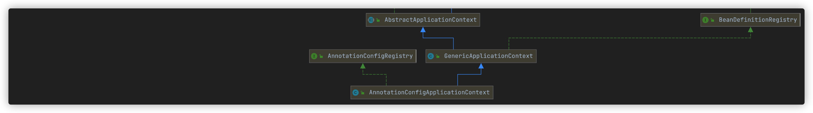
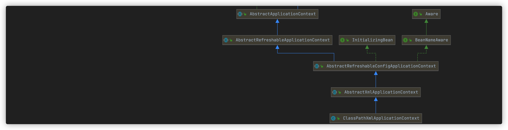
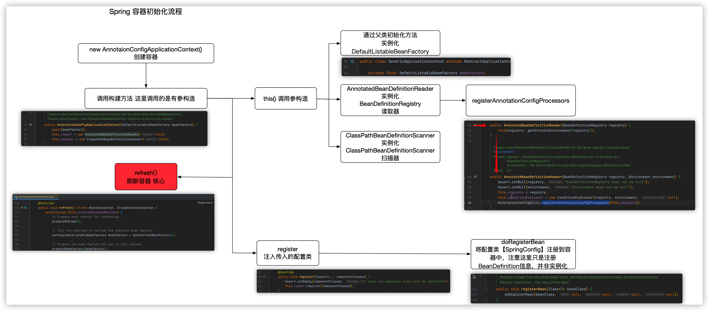

> 创建于2021年9月9日
>
> 作者：想想
> 		来源：[敖丙](https://mp.weixin.qq.com/s?__biz=MzAwNDA2OTM1Ng==&mid=2453148044&idx=1&sn=d3e184989f5db0dcdb6ee03b618f92f0&scene=21#wechat_redirect)

[toc]


### 前言

考虑直接看源码上一个非常枯燥无味的过程，而且Spring的代码设计的非常优秀规范，这会导致翻源码时，类与类之间跳跃会非常频繁，建议大家先通过流程图了解一下整体步骤，然后再对代码硬撸，这样能够降低不少难度。

## 1、初始化流程

我们基于 java-config 技术分析源码，入口是`AnnotationConfigApplicationContext`,如果是 xml 分析，则入口是 `ClassPathXmlApplicationContext`,他们两都继承了 `AbstractApplicationContext`类

AnnotationConfigApplicationContext

ClassPathXmlApplicationContext



看完流程图，我们应该思考一下，如果让我们去设计一个IOC容器，你会怎么做，首先肯定要提供一个入口 `AnnotationConfigApplicationContext` 给用户使用，然后去初始化系列工具

1. 如果想要生成 bean 对象，那么就需要一个 beanFactory 工厂`DefaultListableBeanFactory`
2. 如果想要对加了特定注解如 `@Service`、`@Repository` 的类进行转换 `BeanDefinition` 对象（`BeanDefinition` 是Spring中及其重要的概念，它存储了 bean 对象的所有特征信息，如是否单例、是否懒加载、factoryBeanName 等），那么就需要一个注解配置读取器 `AnnotatedBeanDefinitionReader`
3. 如果我想对用户指定的包目录进行扫描查找 bean 对象，那么还需要一个路径扫描器`ClassPathBeanDefinitionScanner`

`org.springframework.context.annotation.AnnotationConfigUtils#registerAnnotationConfigProcessors` 程序执行到这里，Spring容器基本已经构建完毕了，就可以为容器添加一些内置组件了，其中最重要的组件是`ConfigurationClassPostProcessor` 和`AutowiredAnnotationBeanPostProcessor`,前者是一个 beanFactory 的后置处理器，后者是一个 bean 后置处理器，用来完成 `@AutoWired` 自动注入

```java
org.springframework.context.annotation.AnnotationConfigUtils#registerAnnotationConfigProcessors(org.springframework.beans.factory.support.BeanDefinitionRegistry, java.lang.Object)
/**
  在给定的注册表中注册所有相关的注释后处理程序。
参数:
注册表-要操作的注册表
源—触发注册的配置源元素(已经提取)。可能是null。
返回:
一组beandefinitionholder，包含该调用实际注册的所有bean定义
*/
	public static Set<BeanDefinitionHolder> registerAnnotationConfigProcessors(
			BeanDefinitionRegistry registry, @Nullable Object source) {

		DefaultListableBeanFactory beanFactory = unwrapDefaultListableBeanFactory(registry);
		if (beanFactory != null) {
			if (!(beanFactory.getDependencyComparator() instanceof AnnotationAwareOrderComparator)) {
				beanFactory.setDependencyComparator(AnnotationAwareOrderComparator.INSTANCE);
			}
			if (!(beanFactory.getAutowireCandidateResolver() instanceof ContextAnnotationAutowireCandidateResolver)) {
				beanFactory.setAutowireCandidateResolver(new ContextAnnotationAutowireCandidateResolver());
			}
		}

		Set<BeanDefinitionHolder> beanDefs = new LinkedHashSet<>(8);
// 向 beanDefinitionMap 中注册【BeanFactoryPostProcessor】：【ConfigurationClassPostProcessor】
		if (!registry.containsBeanDefinition(CONFIGURATION_ANNOTATION_PROCESSOR_BEAN_NAME)) {
			RootBeanDefinition def = new RootBeanDefinition(ConfigurationClassPostProcessor.class);
			def.setSource(source);
			beanDefs.add(registerPostProcessor(registry, def, CONFIGURATION_ANNOTATION_PROCESSOR_BEAN_NAME));
		}
// 向 beanDefinitionMap 中注册【BeanPostProcessor】：【AutowiredAnnotationBeanPostProcessor】
		if (!registry.containsBeanDefinition(AUTOWIRED_ANNOTATION_PROCESSOR_BEAN_NAME)) {
			RootBeanDefinition def = new RootBeanDefinition(AutowiredAnnotationBeanPostProcessor.class);
			def.setSource(source);
			beanDefs.add(registerPostProcessor(registry, def, AUTOWIRED_ANNOTATION_PROCESSOR_BEAN_NAME));
		}

// 向 beanDefinitionMap 中注册【BeanPostProcessor】：【CommonAnnotationBeanPostProcessor】
		if (jsr250Present && !registry.containsBeanDefinition(COMMON_ANNOTATION_PROCESSOR_BEAN_NAME)) {
			RootBeanDefinition def = new RootBeanDefinition(CommonAnnotationBeanPostProcessor.class);
			def.setSource(source);
			beanDefs.add(registerPostProcessor(registry, def, COMMON_ANNOTATION_PROCESSOR_BEAN_NAME));
		}

// 向 beanDefinitionMap 中注册【BeanPostProcessor】：【PersistenceAnnotationBeanPostProcessor】，前提条件是在 jpa 环境下
		if (jpaPresent && !registry.containsBeanDefinition(PERSISTENCE_ANNOTATION_PROCESSOR_BEAN_NAME)) {
			RootBeanDefinition def = new RootBeanDefinition();
			try {
				def.setBeanClass(ClassUtils.forName(PERSISTENCE_ANNOTATION_PROCESSOR_CLASS_NAME,
						AnnotationConfigUtils.class.getClassLoader()));
			}
			catch (ClassNotFoundException ex) {
				throw new IllegalStateException(
						"Cannot load optional framework class: " + PERSISTENCE_ANNOTATION_PROCESSOR_CLASS_NAME, ex);
			}
			def.setSource(source);
			beanDefs.add(registerPostProcessor(registry, def, PERSISTENCE_ANNOTATION_PROCESSOR_BEAN_NAME));
		}
// 向 beanDefinitionMap 中注册【BeanFactoryPostProcessor】：【EventListenerMethodProcessor】
		if (!registry.containsBeanDefinition(EVENT_LISTENER_PROCESSOR_BEAN_NAME)) {
			RootBeanDefinition def = new RootBeanDefinition(EventListenerMethodProcessor.class);
			def.setSource(source);
			beanDefs.add(registerPostProcessor(registry, def, EVENT_LISTENER_PROCESSOR_BEAN_NAME));
		}
// 向 beanDefinitionMap 中注册组件：【DefaultEventListenerFactory】
		if (!registry.containsBeanDefinition(EVENT_LISTENER_FACTORY_BEAN_NAME)) {
			RootBeanDefinition def = new RootBeanDefinition(DefaultEventListenerFactory.class);
			def.setSource(source);
			beanDefs.add(registerPostProcessor(registry, def, EVENT_LISTENER_FACTORY_BEAN_NAME));
		}

		return beanDefs;
	}
```


```java
org.springframework.context.annotation.AnnotatedBeanDefinitionReader#doRegisterBean
/*
从给定的bean类注册一个bean，从类声明的注释派生它的元数据。
参数:
bean class—bean的类
名称——bean的显式名称
限定符——在bean类级别的限定符之外要考虑的特定限定符注释(如果有的话)
Supplier——用于创建bean实例的回调(可能为空)
customizer——一个或多个用于定制工厂的BeanDefinition的回调函数，例如设置一个lazy-init或主标志
自:5．0
*/
private <T> void doRegisterBean(Class<T> beanClass, @Nullable String name,
			@Nullable Class<? extends Annotation>[] qualifiers, @Nullable Supplier<T> supplier,
			@Nullable BeanDefinitionCustomizer[] customizers) {
// 解析传入的配置类，实际上这个方法既可以解析配置类，也可以解析 Spring bean 对象
		AnnotatedGenericBeanDefinition abd = new AnnotatedGenericBeanDefinition(beanClass);
// 判断是否需要跳过，判断依据是此类上有没有 @Conditional 注解
		if (this.conditionEvaluator.shouldSkip(abd.getMetadata())) {
			return;
		}

		abd.setInstanceSupplier(supplier);
		ScopeMetadata scopeMetadata = this.scopeMetadataResolver.resolveScopeMetadata(abd);
		abd.setScope(scopeMetadata.getScopeName());
		String beanName = (name != null ? name : this.beanNameGenerator.generateBeanName(abd, this.registry));
// 处理类上的通用注解
		AnnotationConfigUtils.processCommonDefinitionAnnotations(abd);
		if (qualifiers != null) {
			for (Class<? extends Annotation> qualifier : qualifiers) {
				if (Primary.class == qualifier) {
					abd.setPrimary(true);
				}
				else if (Lazy.class == qualifier) {
					abd.setLazyInit(true);
				}
				else {
					abd.addQualifier(new AutowireCandidateQualifier(qualifier));
				}
			}
		}
		if (customizers != null) {
			for (BeanDefinitionCustomizer customizer : customizers) {
				customizer.customize(abd);
			}
		}
// 封装成一个 BeanDefinitionHolder
		BeanDefinitionHolder definitionHolder = new BeanDefinitionHolder(abd, beanName);
// 处理 scopedProxyMode 
		definitionHolder = AnnotationConfigUtils.applyScopedProxyMode(scopeMetadata, definitionHolder, this.registry);
// 把 BeanDefinitionHolder 注册到 registry
		BeanDefinitionReaderUtils.registerBeanDefinition(definitionHolder, this.registry);
	}
```

## 刷新流程

