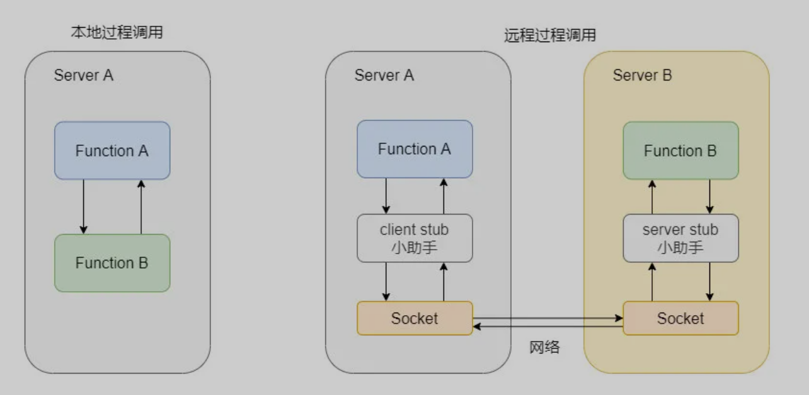

> 创建于2021年9月23日
> 作者：想想  
> 来源：[敖丙](https://mp.weixin.qq.com/s?__biz=MzAwNDA2OTM1Ng==&mid=2453145479&idx=1&sn=7acb47806794f0fda0eb42af09595df7&scene=21#wechat_redirect)

[toc]

### 前言

 Apache Dubbo 是一款高性能 Java RPC 框架，一般而言一个框架你要知道是做什么的，能解决那些痛点，核心模块是什么，大致运作流程是怎样，你一来就扎入细节之中无法自拔，一波 DFS 直接劝退 的可能高达 99.99% ，所以本文带大家过一遍 Dubbo 简介、总体分层、核心组件及大致调用流程


## 一、什么是RPC

​		RPC、Remote Procedure Call 即远程过程调用，远程过程调用其实对标的是本地过程调用,,,,  本地过程调用？？ 是个啥

简单的说，本地上哪部的方法调用都可以成为本地过程调用，而远程过程调用，指的是你本地调用了远程上的某个方法



所以说 RPC 对标的是本地过程调用，至于RPC 要如何 调用远程方法，可以走 HTTP 也可以走基于 TCP 自定义协议，所以说你讨论 RPC 和 HTTP 就不是一个层级的东西

而 RPC 框架就是要实现像小助手一样的东西，目的就是让我们使用远程调用像使用本地调用一样简单放心，并且解决一些远程调用会发生的事情，让用户用的无感知、舒心、放心、顺心，他好我也好，快乐没烦恼。


## 二、如何设计一个 RPC 框架

### 2.1、服务消费者

在明确了什么事 PRC，以及 PRC 框架的目的之后，咱们想想如果让你做一款 PRC 框架如何设计

我们先从消费者（也就是调用方）来看需要些什么，首先消费者面向借口编程，所以需要得知有哪些借口可以调用，可以通过公用 jar 包的方式来维护接口。知道了哪些接口可以调用之后，只有接口，具体的实现怎么来？这个必须框架处理了，所以还需要有代理类，让消费者尽管调，啥事别管，我代理帮你搞定！还需要告诉代理调用哪个方法，参数是什么来着，虽说代理帮你搞定但是代理也需要知道它到底调哪个机器上的远程服务，所以需要注册中心，这样调用方从组册中心可以知晓调用哪些服务提供方，一般而言提供方不止一个，毕竟只有一个挂了就没了。

​	所以提供方一般都是集群部署，那调用方需要通过负载均衡来选择一个调用，可以通过某些轮询策略优先调用啥的。当然还需要容错机制，毕竟是远程调用，网络是不可靠的，所以肯能需要重试什么的，还要和服务提供方约定一个协议，比如说 用HTTP来通信，序列化也是必不可少的，中间掺和一些 filiter 做统一处理，调用计数等

### 2.2、服务提供者

服务提供者肯定是要实现对应的接口这是毋庸置疑的。

然后需要把自己的接口暴露出去，向组册中心注册自己，暴露自己所能提供的服务，所有消费者请求过来都需要处理，提供者需要用和消费协议好的请求来完成处理，然后做好反序列化。序列化完的请求应该扔到线程池里做处理，某个线程接受到这个请求之后找到对应的请求调用，然后再将结果原路返回。

### 2.3、注册中心

上面其实我们都提到注册中心了，就相当于一个平台，大家都在上面暴露自己的服务，也在上面得知自己能调用哪些服务，还能做配置中心、将配置集中化处理，动态变更通知订阅者

### 2.4、监控运维

面对众多服务，精细化的监控和方便的运维必不可少

### 2.5、小结

通信协议、序列化格式、一些容错机制、负载均衡策略、监控运维和一个组册中心


## 三、实现一个简单的 RPC 框架

首先我们定义一个接口和一个简单实现。

```java
public interface AobingService {  
    String hello(String name);  
} 

public class AobingServiceImpl implements AobingService {  
    public String hello(String name) {  
        return "Yo man Hello，I am" + name;  
    }  
}
```

然后我们再来实现服务提供者暴露服务的功能。

```java
public class AobingRpcFramework { 
     public static void export(Object service, int port) throws Exception { 
          ServerSocket server = new ServerSocket(port);
          while(true) {
              Socket socket = server.accept();
              new Thread(new Runnable() {
                  //反序列化
                  ObjectInputStream input = new ObjectInputStream(socket.getInputStream()); 
                  String methodName = input.read(); //读取方法名
                  Class<?>[] parameterTypes = (Class<?>[]) input.readObject(); //参数类型
                  Object[] arguments = (Object[]) input.readObject(); //参数
                  Method method = service.getClass().getMethod(methodName, parameterTypes);  //找到方法
                  Object result = method.invoke(service, arguments); //调用方法
                  // 返回结果
                  ObjectOutputStream output = new ObjectOutputStream(socket.getOutputStream());
                  output.writeObject(result);
              }).start();
          }
     }
    public static <T> T refer (Class<T> interfaceClass, String host, int port) throws Exception {
       return  (T) Proxy.newProxyInstance(interfaceClass.getClassLoader(), new Class<?>[] {interfaceClass}, 
            new InvocationHandler() {  
                public Object invoke(Object proxy, Method method, Object[] arguments) throws Throwable {  
                    Socket socket = new Socket(host, port);  //指定 provider 的 ip 和端口
                    ObjectOutputStream output = new ObjectOutputStream(socket.getOutputStream()); 
                    output.write(method.getName());  //传方法名
                    output.writeObject(method.getParameterTypes());  //传参数类型
                    output.writeObject(arguments);  //传参数值
                    ObjectInputStream input = new ObjectInputStream(socket.getInputStream());  
                    Object result = input.readObject();  //读取结果
                    return result;  
               }
        });  
    }  
}
```

好了，这个 RPC 框架就这样好了，是不是很简单？就是**调用者传递了方法名、参数类型和参数值，提供者接收到这样参数之后调用对于的方法返回结果就好了**！这就是远程过程调用。

```java
  //服务提供者只需要暴露出接口
       AobingService service = new AobingServiceImpl ();  
       AobingRpcFramework.export(service, 2333);  

       //服务调用者只需要设置依赖
       AobingService service = AobingRpcFramework.refer(AobingService.class, "127.0.0.1", 2333);  
       service.hello(); 
```


