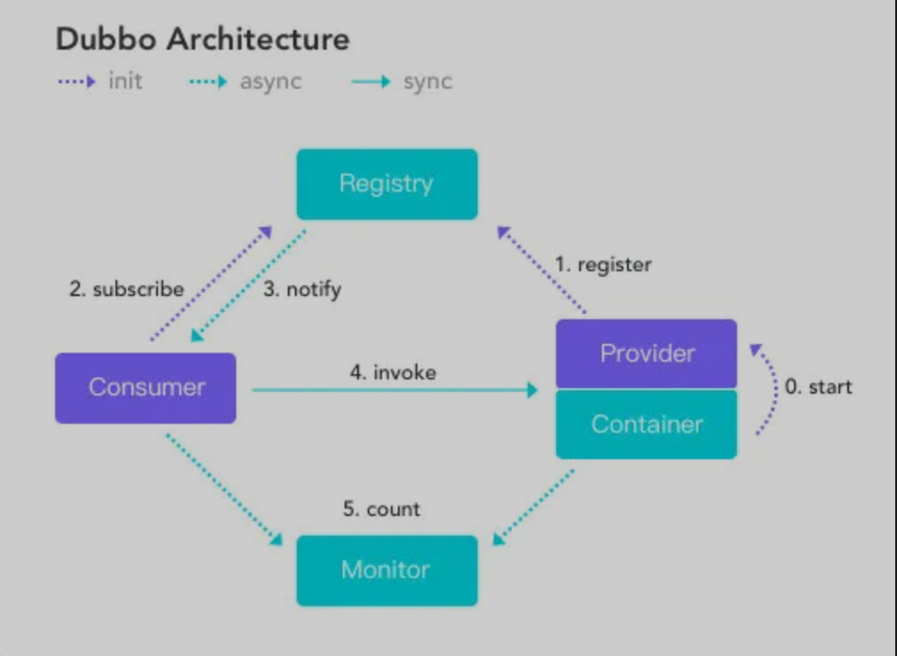
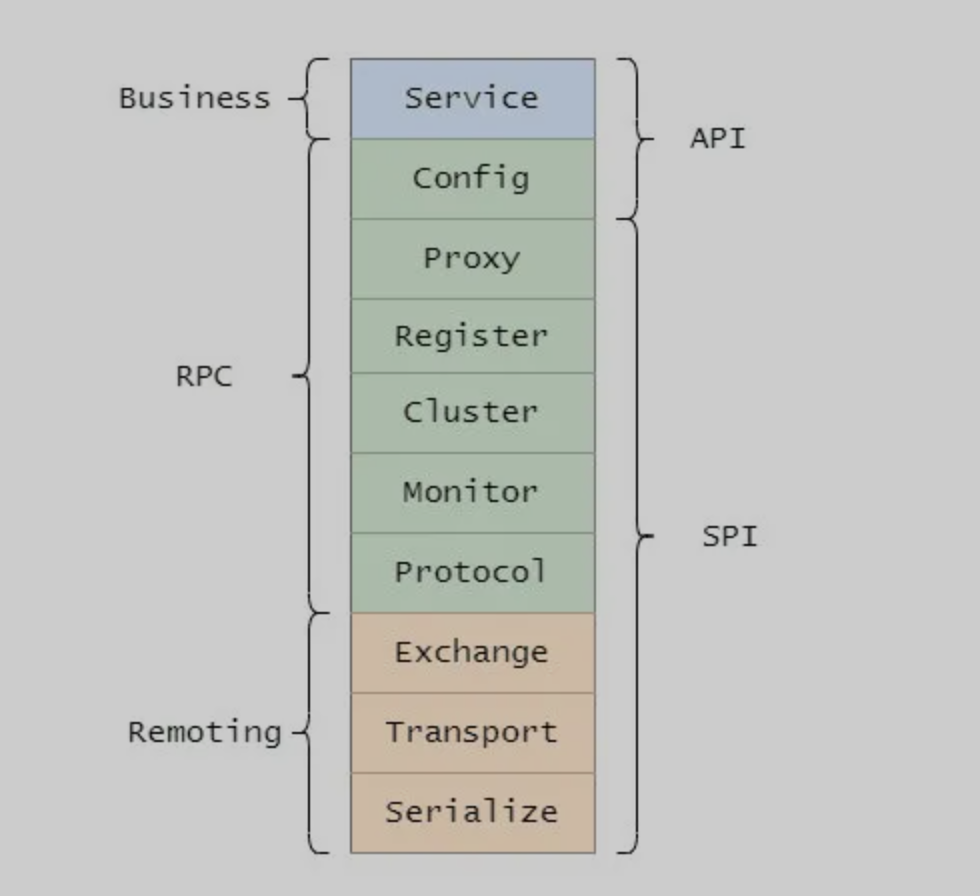
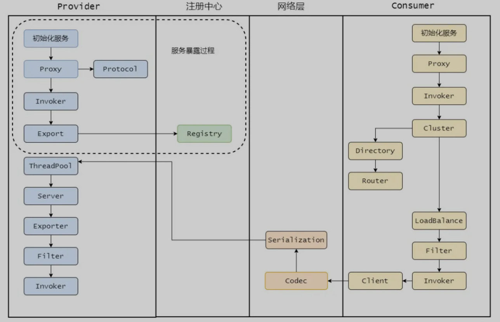

> 创建于 2021年9月23日
> 作者：想想
> 来源：[敖丙](https://mp.weixin.qq.com/s?__biz=MzAwNDA2OTM1Ng==&mid=2453145479&idx=1&sn=7acb47806794f0fda0eb42af09595df7&scene=21#wechat_redirect)

[toc]

## 一、简介

​	Dubbo  是阿里巴巴 2011 开源的一个基于 Java 的RPC 框架，中间沉寂了一段时间，不过其他企业也用 Dubbo 扩展，比如当当网的 Dubbox，网易考拉的 Dubbok，但是2017年 阿里巴巴重启了对 Dubbo 维护，在 2017年荣获开源中国2017最受欢迎开源软件 Top3，在 2018年和 Dubbox 进行合并，并且进入 Apache 孵化器，在2019年毕业正式成为 Apache 顶级项目。目前 Dubbo 社区主力维护的是 2.6.x 和 2.7.x 两大版本，2.6.x 版本主要是bug修复和能力增强为准，是稳定版本，2.7.x 主要是开发版，更新和新增的 feature 优化，并且 2.7.5 版本的发布被 Dubbo 认为是里程碑的发布

​	它实现了面向借口的代理 RPC 调用，并且可以配合 Zookeeper 等组件实现服务组册和发现功能，并且拥有负载均衡、容错机制等

Dubbo 总体架构图

| 节点      | 角色说明                     |
| --------- | ---------------------------- |
| Container | 服务运行的容器               |
| Provider  | 服务提供方                   |
| Registry  | 注册中心                     |
| Consumer  | 需要调用远程服务的服务消费方 |
| Monitor   | 监控中心                     |

服务提供者 Provider 启动然后向注册中心注册自己所在的服务，服务消费者 Consumer 向注册中心订阅自己所需的服务，然后注册中心将提供者元信息给 Consumer，之后 Consumer 因为从注册中心获取到提供者的地址，因此可以通过负载均衡选择一个 Provider 直接调用，

之后服务提供方元数据变更的化 注册中心会把变更信息推送给服务消费者

## 二、Dubbo分层架构

大的分三层，Business （业务层），RPC 层、Remoting ，并且分为 API、SPI，分为三大层其实就和我们知道的网络分层一个意思，只要层次分明，责任边界清晰才更好扩展

+ Service 业务层
+ Config 配置层，主要围绕 ServiceConfig 和 ReferenceConfig 初始化配置信息
+ Proxy 代理层，服务提供层还是消费者都会生成一个代理类，使得服务接口透明化，代理层做远程调用和返回解雇
+ Register 注册层，封装了服务组册和发现
+ Cluster 路由和集群容错层，负责选取具体调用的节点，处理特色的调用要求和负责远程调用失败和容错措施
+ Monitor 监控层，负责监控统计调用时间和次数
+ Portocol 远程调用层，主要封装 RPC 调用，主要负责管理 Invoke Invoke 代表一个抽象封装了执行体
+ Exchange 信息交换层，用来封装请求响应模型，同步转异步
+ Transport 网络传输层 抽象了网络的传输统一接口，这样用户想用 Netty 就用Netty 想用 Mina 就用 Main
+ Serialize 序列化层，将数据序列化进行二进制流，当然也做反序列化

### 2.1、SPI

SPI（Service Provider Interface）是JDK内置的一个服务发现机制，它使得接口和具体实现完全解耦，我们只声明接口，具体的实现类在配置中选择

具体的就是你定义的接口，然后在 META-INF/service 目录下放置一个接口同名的文件，文件的内容为接口的实现类，多个实现类用换行符分割，这样就能通过配置就能具体决定用哪个实现

## 三、Dubbo 调用过程

上面我已经介绍了每个层是干嘛的，我们现在在来串起来走一遍调用的过程，加深你对 Dubbo 的理解，让知识点串起来，由点及面来一波连连看。

首先，Provider 启动，通过 Proxy 组件根据具体的协议 Protocol 将需要暴露出去的接口封装成 Invoker，Invoker 是Dubbo 很核心的组件，代表一个执行体，然后再通过 Exporter 包装一下，者是为了注册中心暴露自己套了一层

再来看 消费者Consumer

首先消费者启动会向注册中心拉取提供者的元信息，然后调用流程从 Proxy开始，毕竟都需要代理才能感知，Proxy 持有一个 Invoker 对象，调用 invoke 之后需要通过 Cluster 先从 Directory 获取所有可调用的远程服务 Invoker 列表，如果配置了些路由规则，比如某个接口只能调用某个节点的那就再过滤一遍 Invoker 列表

剩下的Invoker 再通过 LoadBalance 做负载均衡选取一个，然后再经过Filter 做一些统计什么的，再通过 Client 做数据传输，比如用 Netty 来传输

传输需要经过 Codec 接口做协议构造，再序列化，最终发往对应的服务提供者

服务提供者接受到之后也会经过 Codec 协议处理，然后反序列化将请求扔到线程池处理，某个线程会根据请求找到对应 Exporter 而找到 Export 其实就是找到了 Invoker，但是还是会有一层层 Filter 经过一层层过滤链之后最终调用实现类然后原路返回结果，完成整个调用