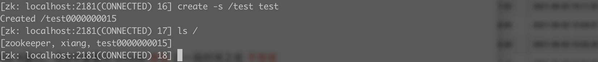

> 创建于2021年9月16日

[toc]

### 前言

锁，我不想多说了，大家都知道什么一回事，在多线程环境下，由于切换上下文，数据可能出现不一致的情况或者数据被污染，我们需要保证数据安全，所以想到加锁。

所谓的加锁机制，就是当一个线程访问该类的某个数据时，进数据保护，其他现场不能进行访问，直到该线程读取完。其他现场才可使用。还记得之前说过Redis在分布式情况下，需要对并发竞争对数据进行加锁，Redis是单线程的嘛，为什么需要加锁呢？

其实不加锁的情况也有，单台服务器，访问一个Redis。但现在哪里还会有单机，我们为了减少DB的压力，把库存预热到 KV，现在KV的库存是1

1. 服务器A去Redis查询发现库存是1，拿说明为能抢到这个商品对不对，那我就准备去减一，但是还没减
2. 同时服务器B也去拿，发现也是1，拿我也抢到了，我也减
3. C同理。。。。
4. 等所有服务器都判断完了，你发现，诶，怎么变成 -2了，超卖了，这下完了。

这个时候就需要分布式锁的介入，我们会分三个章节去分别介绍分布式锁的三种实现方式（Zookeeper、Redis、MySQL），说出他们的优缺点


## 相关面试题

> 正常线程进程同步的机制有哪些？

+ 互斥：互斥机制，保证同一时间只有一个线程可以操作共享资源，Synchronized、Lock等
+ 临界值：让多线程串行化去访问资源
+ 事件通知：通过事件等通知保证大家都有序访问贡献资源
+ 信号量：多个任务同时访问，同时限制数量，比如发令枪CDL、Semaphore等

> 分布式锁你了解哪些呢？

分布式锁主要以 Zookeeper、Redis、MySQL 为主

> Zookeeper 的常用场景

+ 服务注册语与订阅（共同节点）
+ 分布式通知（监听Znode）
+ 服务命名（znode特点）
+ 数据订阅、发布（watcher）
+ 分布式锁（临时节点）

> zookeeper 是啥

他是一个数据库，文件存储系统，并且有监听通知机制（观察者模式）

> 文件存储系统，他存了什么？

节点：

​	zk的节点有4大类：1、持久化节点（zk断开节点还在）2、持久化顺序编号目录节点 3、临时目录节点（客户端断开节点就删除）4、临时目录编号目录节点，节点名称都是唯一的

> 节点怎么创建

+ 创建永久节点    create /test nice

  

+ 创建临时节点 create -e /test beautiful

  

  临时节点创建成功后，断开此次链接，这个节点就消失了

  ==退出一定是 quit 退出，否则会假死30秒左右，在quit退出后，创建的临时节点，会立刻消失==


> 如何创建顺序节点呢？

+ 创建顺序节点 create -s /test  nice 创建顺序



+ 创建临时顺序节点 create -s -e /test test


## 模拟代码

模拟多个线程查询库存后，符合条件对库存进行删减

```java
/**
 * 模拟 先查询库存 后等所有人执行完 去扣除库存
 */
public class zkTest  implements Runnable{
    static int inventory = 1;
    private static final int NUM = 10;
    public static CountDownLatch cdl = new CountDownLatch(NUM);

    public static void main(String[] args) {
        for (int i = 0; i < NUM; i++) {
            new Thread(new zkTest()).start();
            cdl.countDown();
        }
    }

    @Override
    public void run() {
        try {
            cdl.await();
            if (inventory>0){
                Thread.sleep(5);
                inventory --;
            }
            System.out.println(inventory);
        } catch (InterruptedException e) {
            e.printStackTrace();
        }
    }
}
```


定义了一个库存为1，还用到了一个 CountDownLatch 发令枪，等10个线程都就绪准备去减库存，就发现减超了，出事故了

> 怎么解决？

sync、lock 只能保证当前机器的线程安全，这样分布式访问还是会有问题,

这时就可以用到我们讲过的 zookeeper ，zk节点有一个唯一性，就是创建过这个节点，在创建 zk 是会报错的，那我们就用唯一性去实现一下


> 怎么实现呢？

我们全部去创建，创建成功的第一个返回 true 他就可以继续下面的扣减库存操作，后续的节点访问就全部报错，扣减失败，我们就把他们丢到队列去排队

```xml
      <dependency>
            <groupId>com.101tec</groupId>
            <artifactId>zkclient</artifactId>
            <version>0.8</version>
        </dependency>
```

删除节点咯，删了再通知其他人过来加锁，以此类推

我们实现一下 ，zk 加锁的场景


这样，就能一个线程扣除成功后，其他都失败了。

> 加上锁之后，怎么释放呢？

在 finally 里写上哇

> 加锁我们真的，创建节点就行了，但是要实现阻塞效果，怎么整

死循环，递归不断尝试，直到成功！

> 那怎么知道前面老哥删掉了呢？

监听节点的删除事件


饼饼说，这样会造成死锁，我一开始也觉得不以为然，因为程序以每次减一的形式进行打印，第一次打印10次加锁失败，第二次打印9次，直到为0。但是目前是10个并发，那万一是10000的并发呢..... 慌了... 随时可能干掉机器，占用服务资源、带宽等等，这就是==羊群效应==

> 怎么解决呢？

用临时顺序节点，顺利解决这个问题，之前说了监听一个节点问题很大，那我们就监听我们的前一个节点，因为是顺序的，很容易找到自己的前后

... 

==这里我没有测试通过！==

[敖丙的源码](https://github.com/AobingJava/Thanos)  


### 个人总结

zk 通过临时节点，解决掉死锁问题，一旦客户端获取到锁子后突然挂掉，那么这个临时节点就会自动删除，其他客户端自动获取到锁

zk 通过节点排队监听到机制，也实现了阻塞的原理，其实就锁一个递归在那无限等待最小节点释放的过程。

我上面没实现锁的可重入，但是也很好实现，可以带上线程信息就可以了，或者机器信息的这样的唯一识别码，获取的时候好判断

zk 的集群也是高可用的，只要半数以上的活着，就可以对外提供服务了

