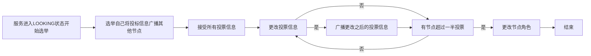
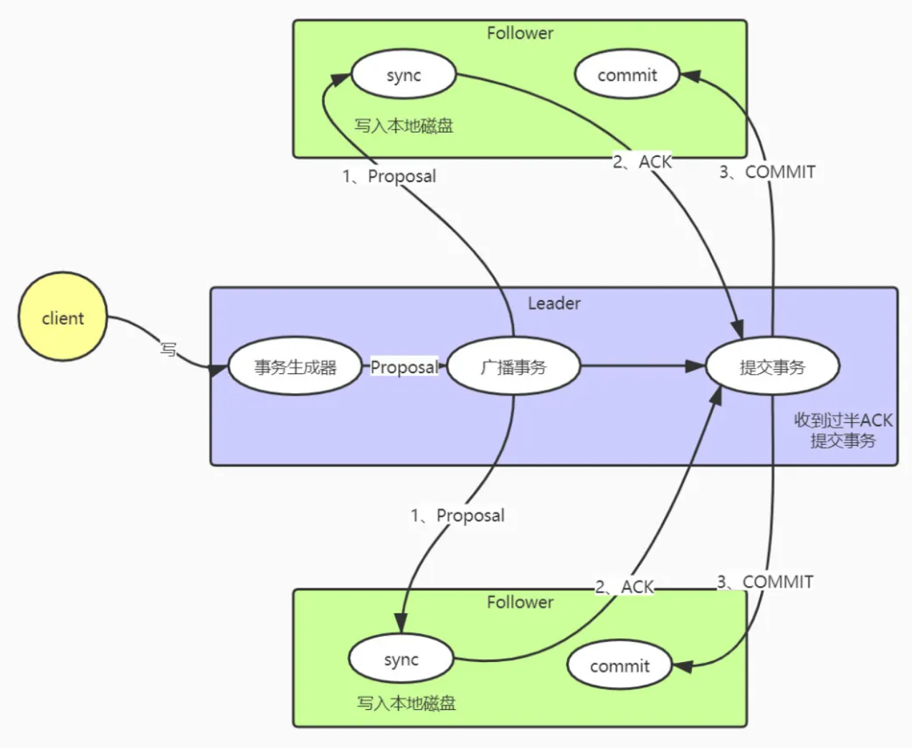
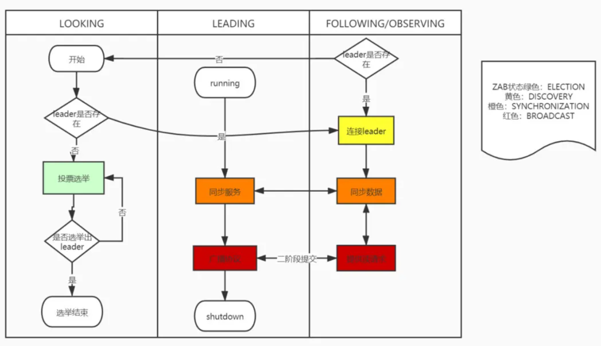

> 创建于 2021年9月17日
>
> [来源](https://mp.weixin.qq.com/s?__biz=MzAwNDA2OTM1Ng==&mid=2453142323&idx=1&sn=a5c4eebf76defa80e7472765d57524a6&scene=21#wechat_redirect)

[toc]

## 前言

Zab(Zookeeper Atomic Broadcast) 是为 Zookeeper 设计的崩溃恢复原子广播协议，它保证 Zookeeper 集群数据的一致性和命令的全局有序性


### 概念介绍

在介绍 Zab协议之前，首先了解一些 Zookeeper 相关的几个概念，才能更好的了解 zab 协议

+ 集群角色

1. Leader：同一时间集群只允许有一个 Leader，提供客户端的读写功能，负责将数据同步到各个节点
2. Follower：提供客户端==读==功能，写则转发给 Leader 处理，当然 Leader 崩溃失联后，参与 Leader 选举
3. Observer：与 Follower 不同的是，不能参与选举

+ 服务状态

1. LOOKING：当节点认为集群没有 Leader，服务器会进入 LOOKING 状态，目的是为了查找活着选举Leader
2. FOLLOWING：follower 角色
3. LEADING：leader角色
4. OBSERVING：observer角色

可以知道 Zookeeper 是通过自身的状态来区分自己所属的角色，来执行自己应该的任务


+ ==ZAB状态== zookeeper还给 ZAB 定义的4种状态，反映 Zookeeper 从选举到对外提供服务的过重的四个步骤

1. ELECTION：集群进入选举状态，此过程会选一个节点作为 Leader
2. DISCOVERY：连接上 leader ，响应leader 心跳，并检测 leader 的角色是否需要更改，通过此步骤之后选举出的 leader 才能执行真正职务
3. SYNCHRONIZATION：整个集群都确认 leader 之后，将会把 leader 的数据同步到各个节点，保证整个集群数据一致性
4. BROADCAST：过渡到广播模式，集群开始对外提供服务

+ ==ZXID==

Zxid 上极为重要的概念，它说一个 long 类型（64位）整数，分为两部分，纪元（epoch）部分和计时器（counter）部分，是一个全局有序的数字

epoch 代表当前集群所属的哪个 leader，leader 的选举就类型一个朝代的更替，你钱朝的剑不能斩本朝官，用epoch 代表当前命令的有效性，counter 是一个递增的数字


### 选举

基础概念说完了，下面介绍 zab 协议是怎么支持 leader 选举的。

进行 leader 有三个问题，什么时候进行？选举规则？选择流程？

一：什么时候选举

1. 选举发生的时机 Leader 发生选举有两个时机，一个是服务启动的时候当整个集群没有 leader 节点时，会进入选举状态，如果leader 已经存在就会告诉该节点的 leader 信息，自己连接上 leader 整个集群不用进入选举状态
2. 还有一个就是服务中，可能出现的服务宕机、断电、网络延迟很高的时候，leader 不能对外提供服务，所有当其他几点通过心跳检测到 leader 失联之后，集群也会进入选举状态

二：选举规则：

​	选举规则进入投票选举流程

zab协议是按照几个比较规则来进行投票的塞选，如果你的票比我好，就修改自身的投票信息，改投你当 leader

```java
 						/*
             * We return true if one of the following three cases hold:
             * 1- New epoch is higher
             * 2- New epoch is the same as current epoch, but new zxid is higher
             * 3- New epoch is the same as current epoch, new zxid is the same
             *  as current zxid, but server id is higher.
             */

        return ((newEpoch > curEpoch)
                || ((newEpoch == curEpoch)
                    && ((newZxid > curZxid)
                        || ((newZxid == curZxid)
                            && (newId > curId)))));
```

zxid 越大代表该节点的数据越完整。

如果最后 epoch 和 zxid 都相等，比较服务 serverId，这个 ID 是配置 zookeeper 集群所配置的，所以我们配置 zookeeper 集群的时候把性能更高的集群的 serverrId 配置大一些，能让新能更好的机器担任 leader 角色

三：选举流程



+ 所有节点，第一票先选自己当 leader，将投票信息广播出去，
+ 从队列中接受选票信息
+ 按照规则判断是否需要更改投票规则，将更改后的投票信息再次广播出去
+ 判断是否超过一半的投票选举同一个节点，如果是选举结束根据投票设置自己的服务状态，选举结束，否则继续投票流程

### 广播

集群在经过 leader 选举之后还会连接 leader 和同步两个步骤，这里就不具体分析，主要介绍集群对外提供服务如何保障各节点数据一致性

zab 在广播状态中保证以下特征

+ 可靠传递：如果消息 m 由一台服务器传递，那么它最终由所有服务器传递
+ 全局有序：如果一个消息a在消息b之前被一台服务器交付，那么所有服务器都交付了a和b，并且a先于b
+ 因果有序：如果消息a在因果上先于消息b并且二者都被交付，那么a必须排在b前面

有序性 上 zab协议必须保证的很重要的属性，因为 zookeeper 上类似于目录结构的数据结构存储数据的，必须要求命名有序性

比如一个名为 a 创建路径为 /test，然后命名b 创建路径 /test/123 如果不能保证有序性b命名在 a之前，b命名会因为福节点而不存在导致创建失败



当收到客户端的写请求会经历下几个步骤

1. Leader 收到客户端的写请求，生成一个事物（proposal）其中包含 zxid
2. Leader 开始广播该事物，需要注意的是所有节点的通讯都是由 FIFO 的队列维护的
3. Follower 接受到事务后，将事务写入本地磁盘，写入成功之后返回 Leader 一个ACK 
4. Leader 在接收到半数以上的 ACK 后，开始提交事物，并广播事物提交信息
5. 从节点开始提交事务

有以上流程可知，Zookeeper 通过二段提交来保证集群中的数据一致性，因为只要收到过半的ACK就可以提交事务，所以 zookeeper 的数据并不是强一致性，

zab 协议的有序性保证通过几个方面体现，第一，服务之前用 TCP 协议进行通讯，保证在网络传输中的有序性，第二，节点之前都维护了 FIFO 的队列，保证全局的有序性，第三，通过全局递增的 zxid 保证因果有序性


### 状态流转

​		前面介绍了 zookeeper 服务状态的 四种，ZAB 状态也有 4种，这里就简单介绍一下他们之间的状态流转，更能加深 zab 协议在 zookeeper 工作流程中的作用。



1. 服务在启动活着和leader 失联之后服务转化为 LOOKING
2. 如果 leader不存在选举 leader，如果存在则直接连接 leader ，此时 zab 协议状态为 ELECTION
3. 如果有半数的投票选择同一台 server ，则leader选举结束，被选举的 leader 和 server 服务状态为 LEADING，其他 server 服务状态为 FOLLOWER/OBSERVER
4. 所有 server 连接 leader，此时 zab 协议状态为 discover
5. leader 同步数据给 learner 使各个节点数据和 leader 保持一致，此时 zab 协议状态为 SYNCHRONIZATION
6. 同步超过半数 server 之后，集群对外提供服务，此时 zab 状态为 BROADCAST