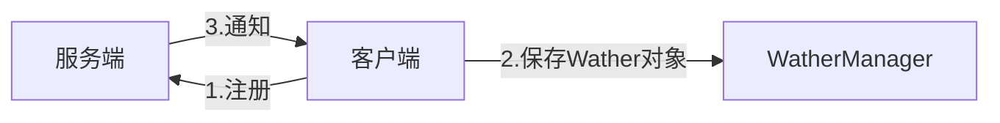

> 创建于 2021年9月17日
>
> [来源](https://mp.weixin.qq.com/s?__biz=MzAwNDA2OTM1Ng==&mid=2453150420&idx=2&sn=d497580addc7249999cc2c33dc70c160&scene=21#wechat_redirect)

[toc]

## Zookeeper 相关问题

### 1、Zookeeper 的理解

Zookeeper 是一个开源的分布式协调服务，由雅虎公司创建，最初雅虎公司的内部研究人员大部分都是以动物名字来命名的，所以后来以 zookeeper（动物管理员）来命名了，他的目的是解决提高性能、高可用和顺序访问控制的能力，同时也是为了解决分布式环境下数据一致性问题

####  1.1、集群

首先，zookeper 集群中有最关键的概念，Leader、Follower、Observer ，Zookeeper 通常只有 leader 节点可以吸入，Follower 和 Observer 都负责读，但是 Follower 会产于节点选举或过半写功能，Observer则不会，他只是单纯的提供读取数据功能

通常这样设置的话，为了避免太多节点参与过半写的过程，导致影响性能，这样zookeeper 只要你用几台机器的小集群就可以实现高性能，如果要横向扩展的话 只需要增加几台 Observer 就可以了

zookeeper 建议集群节点个位为基数，只要超过半数机器能正常提供服务，那么整个集群都是可用状态。

#### 1.2、数据节点Znode

Zookeeper 中数据存储于内存中，这个数据节点叫做 Znode 他说一个树型结构，比如 /a/b/c 类似，

而Znode 有分为持久节点、临时节点、顺序节点三种。持久不说了，临时节点的生命周期和 session 会话一样，会话小时，节点移除

还有就是临时顺序界定和持久顺序节点，除了基本的特性之外，子节点和名称还具有有序性

#### 1.3、会话Session

会话自然就是指的是 Zookeeer 客户端和服务端之间的通信，他们使用 TCP 长连接的方式保持通信，通常，肯定会有心跳检测的机制，同时他可用接受来自服务器的 Watch 事件通知。

#### 1.4、事件监听 Watcher

用户可以在指定的节点上注册 Wather ，这样在事件触发的时候，客户端就会收到来自服务端的通知

#### 1.5、控制权限 ACL

Zookeeper 使用 ACL 来进行权限的控制，包含以下5种

1. Create 创建子节点权限
2. Delete 删除子节点权限
3. Read 获取子节点数据和子节点列表权限
4. Write 更新节点权限
5. Admin 设置节点 ACL 权限

所以 ，Zookeeper 通过集群的方式来做高可用，通过内存数据节点 znode 来达到高性能，但是存储的数据量不能太大，通常适用于读多写少的场景。

### 2、zookeeper有哪些应用场景

1. 命名服务 Name Service ，依赖 Zookeeper 可以生成全局唯一的节点 ID 来分布式系统中的资源进行管理
2. 分布式协调，这是zookeeper 的核心使用，利用 Wathcer 的监听机制，一个系统的节点状态发生改变，另外系统可以得到通知
3. 集群管理，分布式集群中状态的监控和管理，使用 Zookeeper 来存储
4. Master 选举，利用 Zookeeper 节点的全局唯一性，同时只有一个客户端能创建成功的特点，可以作为 Master选举使用，创建成功的为 Master
5. 分布式锁，利用 Zookeeper 创建临时节点顺序节点的特性

### 3、说说 Wather 监听机制和它的原理？

Zookeeper 可以提供分布式数据的发布/订阅功能，依赖的就是 Watcher 监听机制。

客户端可以向服务端组册 Watcher 监听，服务端的指定事物事件触发之后，就会项客户端发送一个事件通知

他有几个特性：

1. 一次性，一旦一个Wather 触发后，zookeeper 就会从他的存储中移除
2. 客户端串行：客户端的 Wather 回调处理说串行同步的过程，不要因为一个 Wather 的逻辑阻塞整个客户端
3. 轻量：Wather 通知的单位是 WathedEvent ，只包含通知状态、事件类型和节点路径，不包含具体事件内容，具体的事件内容，需要客户端主动重新获取数据

主要流程如下：

1. 客户端向服务端组册 Wather 监听
2. 保存 Wather 对象到客户端本地的 WatherManager 中
3. 服务端 Wather 事物触发后，客户端收到服务端端通知，从 WatherManager 中取出对应 Wather 对象一下回调逻辑

### 4、Zookeeper 是如何保证数据一致性

Zookeeper 通过 ZAB 原子广播协议来数据的最终顺序一致性，他说一个类似于 2PC 两阶段提交过程

由于 Zookeeper 只有Leader 节点可以写入数据，如果说其他节点收到写入数据的请求，则会将之转发给 Leader 节点。

主要流程如下：

1. Leader 收到请求之后，将它转化为一个 proposal 提议，并且为每个提议分配一个全局唯一递增的事务ID：zxid，然后把提议提议放到 FIFO 队列中，按照 FIFO 的策略发送给所有 Follower
2. Follower 收到提议之后，以事务日志的形式写入到本地磁盘中，写入成功后返回 ACK 给 leader
3. leader 收到半数以上的 ACK后，即可用认为数据写入成功，就会发送 commit 命令给 Follower 告诉他们可用提交 Proposal 了

ZAB 包含两种基本模式，崩溃恢复和消息广播，

整个集群服务在启动、网络中断活着重启等异常情况的时候，首先会进入到崩溃恢复状态，此时会通过选举产生 Leader 节点，当集群过半到节点都和 Leader 状态同步之后，ZAB 就会退出恢复模式，之后，就会进入消息广播的模式

### 5、Zookeeper 是如何 leader 选举的

Leader选举可用分为两个方面，同时选举主要包含事务 zxid 和 myid，节点主要包含 LEADING\FOLLOWING\LOKING  这3个状态

1. 服务启动期间的选举
2. 服务运行期间的选举

服务启动期间的选举

1. 首先，每个节点都会对自己投票，然后把投票信息广播给集群中的其他节点
2. 节点接收其他节点的投票信息，然后和自己的投票进行比较，首先 zxid 较大的优点，如果zxid 相同则会选择myid 更大者，此时大家都是 LOOKING 状态
3. 投完票之后，开始统计投票信息，如果集群中过半的机器都选择了某个节点的机器作为 leader ，那么 选举结束
4. 最后，更新各个节点的状态，leader 更改为 LEADERING ，follower 更改为 FOLLOWING 状态

服务运行期间的选举

如果开始选举的leadr 宕机了，那么运行期间就会重新 leadr 的选举。

1. leader 宕机之后，非 observer 节点都会把自己的状态修改为 LOOKING 状态，然后重新进入选举流程
2. 生成投票信息（myid、zxid），同样，第一轮的投票大家都会把票投给自己，然后把投票信息广播出去
3. 接下来的流程和上面选举的一样，都会优先以 zxid 然后选择 myid 最后统计票数，修改节点状态，选举结束

### 6、那选举之后又怎么进行数据同步？

那实际上，Zookeeper 在选举之后，Follower 和 Observe （统称为 Leader）就会向leader注册，然后就会开始数据同步的过程。

数据同步包含3个主要值的4种形式

PeerLastZxid：leader 服务器最后处理 zxid

minCommittedLog：leader 提议缓存队列中最小的 zxid

maxCommittedLog：leader 提议缓存队列中最大的 zxid

直接差异化同步 DIFF 同步

如果PeerLastZxid 在 minCommittedLog 和 maxCommitteLog 之间，那么说明Leader 服务还没有完全同步最新的数据

1. 首先 leader 向 leader 发送 DIFF 指令，代表开始差异化同步，然后把差异数据 （从 PeerLastZxid 到 MaxCommitteLog 之间的数据）提议 proposal 发送给 leader
2. 发送完成之后发送一个 NEWLOEADER 命令给 leader 同时leader 返回 ACK表示已经完成了同步
3. 接着等待集群中过半的 leader 响应了 ACK 之后，就发送一个 UPTODATE 命令，LEADER 返回 ack 同步流程就结束

+ 先回滚再差异化同步 TRUNC+DIFF 同步

这个设置针对的是一个差异的场景，如果Leader 刚生成一个 Proposal ，还没来得及发送出去，此时 Leader宕机，重新选举后成为 Follower 但是新的 Leader 没有生成这个 Proposal 数据

假设 Leader A，minCommittedLog=1，maxCommittedLog=3，刚好生成 proposal 的zxid =4，A挂了
选举出来的 Leader B，B处理了2个事件，minCommittedLog =1 ，maxCommittedLog = 5，此时A的peerLastZxid=4，在 （1，5）之间

那么 A 要进行事务回滚，相当于抛弃这条数据，并且回滚到接近于 PeerLastZxid 的事务 也就是 PeerLastZxid =3，==可以理解为，只要老的leader 挂了，还在老leader准备未处理的数据都会被抛弃。所以验证一句话：zookeeper 并不是强一致性==

流程和 DIFF 一致，只是会线发一个TRUNC命令，然后再执行差异化 DIFF 同步，

+ 仅回滚同步 TRUNC 同步

针对 PeerLastZxid 大于 maxCommittedLog 的场景，流程和上述一致，事务将会被回滚到 maxCommittedLog 的记录，这个就相对简单，可以认为 TRUNC + DIFF 中的例子，新的 Leader B 没有处理提议，所以 B中 minCommitdLog =1，maxCommitedLog=3
所以，A的PeerLastZxid = 4 会大于maxCommittedLog ，也就是A只需要回滚就行，不需要执行差异同步化

+ 全量同步 SNAP 同步

适用于两个场景：

1. PeerLastZxid 小于 minCommittedLog
2. Leader 服务器上没有提议缓存队列，并且 PeerLastZxid 不等于 Leader 的最大 Zxid

这两种情况，Leader 会发送 SNAP 命令，将全量数据都发给  Leader 进行同步

### 7、有可能会出现数据不一致情况嘛？

==还是会存在的==

我们分三个场描述这个问题

+ 查询不一致

因为Zookeeper 过半成功即代表成功，假设我们有5个节点，如果 123 都写入成功，这个时候请求访问到4或者5节点，那么有可能读取不到数据，因为可能还没有同步到 4、5，可以认为数据不一致问题

解决方案：可以在读取之前使用 sync 命令

+ leader 未发送 proposal 宕机

这就是数据同步说过的问题

leader 刚生成一个 propossal，还没有来得及发送出去，此时leader 宕机，重新选举之后作为 follower，但是新的 leader 没有proposal，这种场景下的日志会被丢弃

+ leader 发送 proposa成功，但是commit 前宕机

如果 proposa 成功了，但是在 commit 前宕机，如果重新进行选举，还是会选择 zxid 最大的节点作为 leader ，因此，这个日志并不会丢弃，在选举出 leader 之后重新同步到其他节点中

### 8、作为注册中心、Zookeeper、Eureka、Consul、Nacos区别

|                 | Nacos                      | **Eureka**  | **Consul**        | **Zookeeper** |
| :-------------- | :------------------------- | :---------- | :---------------- | ------------- |
| 一致性协议      | CP+AP                      | AP          | CP                | CP            |
| 健康检查        | TCP/HTTP/MYSQL/Client Beat | Client Beat | TCP/HTTP/gRPC/Cmd | Keep Alive    |
| 负载均衡策略    | 权重/ metadata/Selector    | Ribbon      | Fabio             | —             |
| 雪崩保护        | 有                         | 有          | 无                | 无            |
| 自动注销实例    | 支持                       | 支持        | 不支持            | 支持          |
| 访问协议        | HTTP/DNS                   | HTTP        | HTTP/DNS          | TCP           |
| 监听支持        | 支持                       | 支持        | 支持              | 支持          |
| 多数据中心      | 支持                       | 支持        | 支持              | 不支持        |
| 跨注册中心同步  | 支持                       | 不支持      | 支持              | 不支持        |
| SpringCloud集成 | 支持                       | 支持        | 支持              | 不支持        |
| Dubbo集成       | 支持                       | 不支持      | 不支持            | 支持          |
| K8S集成         | 支持                       | 不支持      | 支持              | 不支持        |

### 9、CAP 理解

CAP 是分布式系统设计理念，包含3个部分，但最多满足其中两个

1. Consisency 一致性，因为一个分布式系统中，数据肯定需要在不同节点之间进行同步，就比如 zookeeper，所以一致性就是指的是数据在不同节点怎样保证一致性，对于纯理论的C而言，默认的规则是忽略掉演出，因为如果考虑延迟，数据同步过程中无论如何都会有延迟
2. Availablity 可用性，这个指的是对每个请求，节点总是可以在合理的时间范围内给出响应，比如 zookeeper 在进行数据同步时，无法提供读写服务时，不满足可用性要求，这里常有一个例子说 zookeeper 选举期间无法提供服务不满足 A，这个说法不准确， CAP 关注数据读写，选举可以认为不在考虑范围之内，所以，可以认为对数据的读写，无论响应超时还是返回异常都可认为不满足A
3. Partition-tolerance 分区容错性，因为一个分布式系统中，很有可能由于部分节点的网络问题导致整个集群的网络连接不同，所以就产生了分区网络，整个集群环境分割成不同的子网，所以，一般说网络不可能100%的不产生问题，P一定存在

