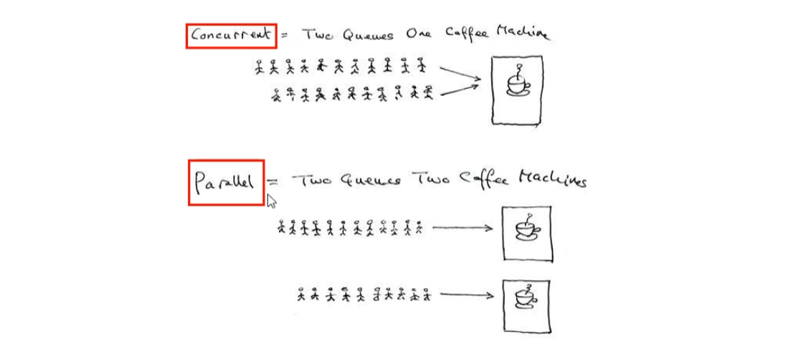

作者：Doug Lea

利：充分利用多核处理器、提高程序性能，提高吞吐率，异步+回调满足各类生产需求

弊：线程安全、集合类安全、锁问题、线程性能问题

#### 并发与并行概念

并发，多个队列一起使用同一个资源，存在竞争关系，多对一。

并行，多个队列，多对多关系。

#### 进程、线程、管程

进程 > 线程

管程，监视器概念，也就是我们平时说的锁。

在官方原话中：执行线程要先要求成功持有管程，然后才能执行方法。最后完成方法时释放管程，直接理解为锁就行了。

#### 用户线程、守护线程

不做配置说明，默认都是用户线程，是系统工作线程，会完成程序需要完成的任务。

守护线程，保证JVM存活。

