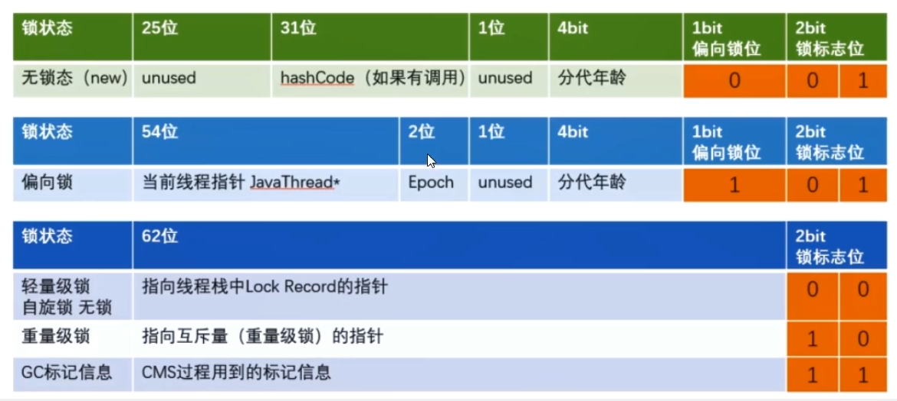

> 2024-08-22

1. 你怎么理解 java 多线程的，怎么处理并发，线程池有几个核心参数？
2. Java 加锁有哪几种锁
3. JVM 对 Java 的原生锁做了那些优化？

悲观锁：适合写操作多的场景，先加锁保证写操作数据正常

乐观锁：适合读操作多场景，如果这个数据没有被更新，当前线程将自己修改的数据写入成功，如果已经被其他线程更新了，则根据不同实现，比如放弃修改，重试抢锁等。

[案例](https://github.com/YuncenLiu/code-example/blob/master/thread/src/main/java/com/liuyuncen/juc/locks/Lock8Demo.java)

1. 一个对象里面如果有多个 synchronized 方法，某一个时刻内，只要有一个线程调用了其中的一个 synchronized 方法，其他线程都只能等待，换一句话说，某一时刻内，只能有唯一的一个线程去访问这些 synchrnoized 方法，锁的是当前对象 this，被锁定后，**其他线程都不能进入当前对象的其他 synchronize 方法**
2. 三种 synchronized 差别
	1. 普通同步方法， 锁的是当前势力对象，通常指 this，实例本身
	2. 静态同步方法，锁的是当前 class 对象，全局使用到这个类的对象
	3. 同步方法块，锁的锁 synchronized 括号内对象

反编译 javap -c xxx.class 如果需要更详细的信息，将 -c 替换为 -v

##### 同步方法块

可用发现 synchronized 使用 `monitorenter` 和 `monitorexit` 指令实现加减锁

一般情况下，应该 enter 配对2个 exit。极端情况也有 一对一情况。

##### 普通同步方法

会在方法上添加 `ACC_SYNCHRONZIED` 标识，调用指令检查方法是否存在该标识，如果设置了，执行线程会先持有 monitor 锁，执行完成后，再双层释放（正常释放、异常释放）

##### 静态同步方法

在普通同步方法中，除了会有  `ACC_SYNCHRONZIED` 还存在 `ACC_STATIC` 标识，由此决定是 类锁

> 为什么任意一个对象都可以是锁？

所有类都继承于 Object 类，通过阅读 Jdk8 的源码，也就是 C++源码中，所有对象都引入了 objectMonitor 对象，理解为每个创建的对象都继承这个对象的属性，这个对象存在属性 owner，用于指向当前对象所持有线程

1. _owner  指向持有锁线程
2. _waitset 处于wait状态的线程队列
3. _EntryList 处于等待锁状态的线程队列
4. _recursions 锁的重入次数
5. _count 记录锁访问次数

