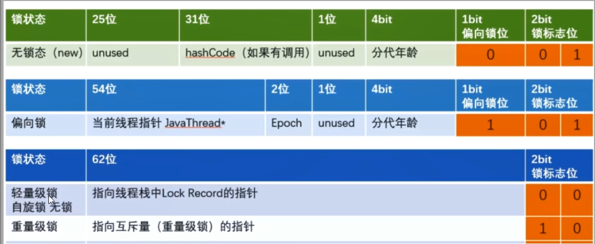
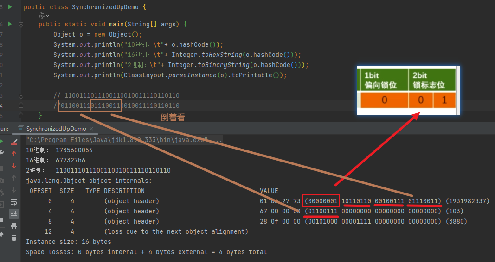

# Synchronized 锁升级

由对象头的 Mark Word 根据锁标志位的不同而被复用及锁升级策略

无锁：001

> hashCode 如果有调用才有值，如果没有调用，是没有值的。全是0

偏向锁：101

轻量锁：000

重量锁：010

Java5之前，用户态和内核态之间的切换

在早期版本，synchronized 属于重量级锁，效率低，因为监视器 monitor 是依赖于底层操作系统的 Mutex Lock 来实现的，挂起线程和恢复线程都需要转入内核态去完成，阻塞或唤醒一个 Java线程需要操作系统切换CPU状态来完成，这种切换需要耗费处理器时间，如果同步代码块中内容过于简单，这种切换的时间可能比用户代码执行时间更长，时间成本相对较高，这也是为什么早期的 synchronized 效率的原因，Java6之后，未来减少锁和释放锁带来的性能消耗，引入了轻量级锁和偏向锁

markOop.php

Monitor 可以理解为一个同步工具，也可以理解为同步机制，通常被描述为Java对象，Java对象天生的Monitor，每个Java对象都有成为 Monitor 的潜质。打从娘胎里就带了一把锁，叫内部锁也叫 monitor 锁

Monitor 本质依赖于底层操作系统 Mutex Lock 实现，操作系统实现线程之间切换，**需要从用户态到内核态的切换**，成本非常高

## 偏向锁

单线程竞争，当线程A第一次竞争到锁时，通过操作修改 Mark Word 中的偏向线程ID、偏向模式，如果不存在其他线程竞争，那么持有偏向锁的线程将永远不需要进行同步