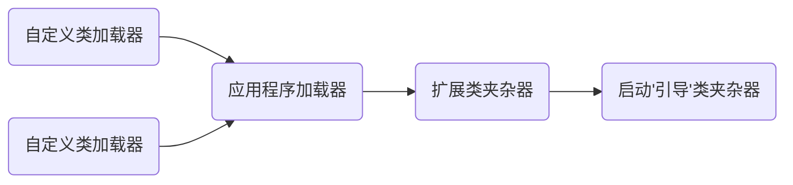

# 类加载全过程

+ 为什么研究类加载的全过程
     + 有助于了解 JVM 运行过程
     + 更深入了解 java 动态性，（解热部署，动态加载），提高程序的灵活性

类加载机制

+ JVM 把 class 文件加载到内存，并对数据进行校验、解析和初始化，最终形成JVM 可以直接使用的 Java 类型过程

+ 加载：将class 文件字节码内容加载到内存中，并将这些静态数据转换成方法区中运行数据结构，在堆中深处一个代表这个类的 java.lang.Class 对象，作为方法区类数据的访问入口
+ 链接：将java类的二进制代码合并到 jvm 的运行时之中的过程
     + 验证：确保加载的类信息符合 JVM 规范，没有安全方面的问题
     + 准备：正式为类变量（static 变量）分配内存并设置变量初始值的阶段，这些内容都将在方法区中进行分配
     + 解析：虚拟机常量内的符号引用替换为直接引用的过程
+ 初始化
     + 初始化阶段是执行类的构造器<clinit>() 方法的过程。类构造器<clinit>() 方法是由编译器自动收集类中的所有类变量的赋值动作和静态语句块（static 块）中的语句合并产生的。
     + 当初始化一个类的时候，如果发现其父类还没有进初始化、则需要先发出其父类的初始化
     + 虚拟机会保证一个类 <clinit>() 方法在多线程环境中被正确加锁和同步
     + 当访问一个java类的静态域时，只有正在声明这个域的类才会被初始化

类的主动引用（一定会发生类的初始化）

+ new 一个类的对象
+ 调用类的静态成员（除了 final 常量）和静态方法
+ 使用 java.lang.reflect 包的方法类进行反射调用
+ 当虚拟机启动 java hello, 则一定会初始化类 Hello 类，说白了就是启动 main 方法所在的类
+ 当初始化一个类，如果其父类没有被初始化，则先会初始化他的父类

类的被动引用（不会发生类的初始化）

+ 当访问一个静态域时，只有真正的声明这个域的类才会被初始化
     + 通过子类对象引用父类的静态变量，不会导致子类初始化
+ 通过数组定义类引用，不会触发此类的初始化
+ 引用常量不会触发此类的初始化（常量在编译阶段就存入调用类的常量池中了）

# 深入类加载器

## 类加载器

1. ==类加载器原理==
2. ==类加载器树状结构，双亲委托（代理）机制==
3. ==自定义类加载器(文化、网络、加密)==
4. ==线程上下文类加载器==
5. ==服务器类加载原理和 OSGI 介绍==

### 1、类加载器的作用

​	将class 文件字节码内容加载到内存中，并将这些静态数据转换为方法区中的运行时数据结构， 在堆中生成一个代表这个类 java.lang.Class 对象，作为方法去数据的访问入口

### 2、类缓存

​	标准的 Java SE 类加载器可以按要求查询类，但一旦某个类加载到类加载器中，它将维持加载（缓存）一段时间，不过 JVM 可以回收这些 Class 对象 

### 3、引导类加载器 （bootstrap class loader）

它用来加载Java 的核心（JAVA_HOME/jre/lib/rt.jar 、或 sun.boot.class.path 路径下的内容）是用原生代买来实现的，并不继承自 java.lang.ClassLoader

加载扩展类和引用程序类加载器。并指定他们的父类加载器

### 4、扩展类加载器（extensions class loader）

用来加载 java 的扩展库 （JAVA_HOME/jre/ext/*.jar、或 java.ext.dirs 路径下的内容） java 虚拟机的实现会提供一个扩展库目录，该类加载器会在此目录里查询并加载java类

由sun.misc.Launcher$AppClassLoader实现

### 5、应用程序类加载器（application class loader）

它根据 java 应用的类都是由它来完成加载的。

由 sun.misc.Launcher$AppClassLoader实现

### 6、自定义类加载器

开发人员可以通过继承 java.lang.ClassLoader 类的方式实现自己的类加载器，以满足一些特殊需求

## ClassLoader 类

作用：

+ java.lang.ClassLoader 类的基本职责就是根据一个指定的类的名称，知道或者生成其对应的字节码，然后从这些字节码中定义处一个java类，即java.lang.class 类的一个实例
+ 除此之外，ClassLoader 还负责加载 java 应用所需的资源，如图文文件和配置文件等

相关方法：

+ getParent() 返回该类加载器的父类加载器
+ loadClass（String name） 加载名称为name的类，返回的结果是 java.lang.Class 类的实例
+ findCLass（String name） 查找名称为 name的类，返回的结果是java.lang.Class 类的实例
+ findLoadedClass（String name） 查找名为 name 的已经被加载过的类，返回的结果是java.lang.Class 类的实例
+ defineClass（String name,byte[] b,int off, int len） 把字节数组 b 中的内容转换成java 类，返回的结果是java.lang.Class 类的实例，这个方法是被声明为final 的
+ resolveClass(Class<?> c)  链接指定的 java类
+ 对于以上给出的方法，表示类名称的 name 参数的值是类的二进制名称，需要注意的是内部类的表示，如 `com.example.Sample$1` 和 `com.example.Sample$Inner` 等表示方式

## 类加载器的代理模式

### 代理模式

+ 交代其他加载器来加载指定的类

### 双亲委托机制

+ 就是某个特定的类加载器在接到加载类的请求时，首先将加载任务委托给父类加载器，一次追溯，知道最高的爷爷辈的，如果父类加载器完成类加载任务，就返回成功；只有父类加载器福娃完成此加载任务时，才自己去加载。

+ 双亲委托机制就是为了保证java核心库的类型安全。

     + 这种机制就保证了不会出现用户自己能定义 java.lang.Object 类的情况

+ 类加载器除了用于加载类，也是安全的基本保障

     > 双亲委托机制是代理模式的一种  if else

     + 并不是所有类加载器都采用双亲委托机制
     + tomcat 服务器类加载器也使用代理模式，所不同的是它是首先尝试去加载某个类，如果找不到再代理给父类加载器，这与一般加载器的顺序是相反的。

### 自定义类加载器

+ 自定义加载器流程：

     + 继承：java.lang.ClassLoader

     + 首先检查请求的类型是否已经被这个加载器装载到命名空间中了，如果已经装载，直接返回

     + 委派类加载请求给父类加载器，如果父类加载器能够为完成，则返回父类加载器加载的Class实例

     + 调用本类加载器的findClass （。。。）方法，试图获取对应的字节码，如果获取的到，则调用 defineClass（。。。）导入类型到方法区；如果获取不到对应的字节码或者其他原因失败，则发货异常给 loadClass（。。。），loadClass(。。。)抛出异常，终止加载过程

     + > 注意：被两个类加载器加载的同一个类，JVM 不认为是相同的类

==**同一个类，被不同的加载器加载，JVM 认为也是不同的类**==

### 加密与解密操作

.....

