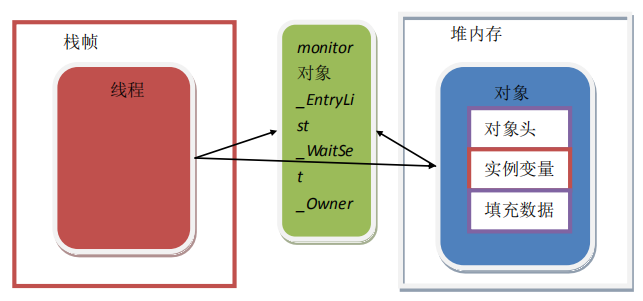
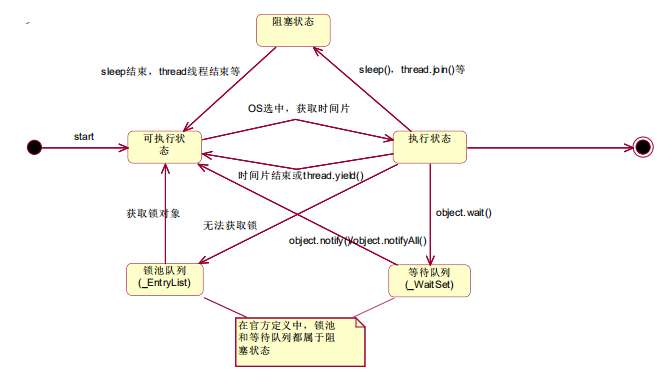

[TOC]

# Java 并发编程

## 一、同步

### 1、synchronized 关键字

synchronized 锁什么？锁对象。

可能锁对象包括：this  临界资源对象，Class 类对象

#### 1.1、同步方法

synchronized T methodName () {}

同步方法锁定的是当前对象。当多线程通过同一对象多次调用当前同步方法时，需要同步执行

#### 1.2、同步代码块

同步代码块的同步粒度更加细致，是商业开发中推荐的编程方式。可以定位到具体的同步位置，而不是简单的将方法整体实现同步逻辑。在效率上，相对更高

##### 1.2.1、锁定临界对象

```java
T methodName(){
    synchronized(Object){}
}
```

同步代码块在执行时，是锁定 object 对象。当多线程调用同一方法时，锁定对象不变的情况下，需同步执行。

##### 1.2.2、锁定当前对象

```java
T methodName(){
    synchronized(this){}
}
```

当锁定对象为 this 时， 相当于 同步方法


#### 1.3、锁的底层实现

Java虚拟机中的同步（Synchronization）基于进入和退出管程（Monitor)对象实现。同步方法，并不是由 monitor enter 和 monitor exit （这两个是C语言的）指令来实现。同步方法，并不是由 monitor enter 和 monitor exit 指令来实现同步，而是由方法调用指令读取运行时常量池的 ACC_SYNCHRONIZED 标志来隐式实现

##### 1.3.1、对象内存存储图



+ 对象头：存储对象 hashCode、锁信息或分代年龄或 GC标志，类型指针指向对象的类元数据，JVM通过这个指针确定该对象是哪个实例等信息。

+ 实例变量：存放类的属性数据信息，包括父类的属性信息

+ 填充数据：由于虚拟机要求对象起始地址必须是8字节的整数倍。填充数据不是必须存在的，仅仅是为了字节码对齐。

     当在对象上加锁时，数据是记录在对象头中的。当执行 synchronized 同步方法或同步代码块的时候，会在对象中记录锁标记，锁标记指向的是 monitor 对象（也称为管程或监视器锁）的起始地址，每个对象都存在一个 monitor与之关联，对象与其 monitor 之间的关系有多种实现方法，如 monitor 可以与对象一起创建销毁当线程试图获取对象锁时自动生成，但当一个 monitor 被某个线程持有后，它便处于锁定状态

>==一个Java栈，有若干个栈帧，一个栈帧，对应的一个Java 线程，一个线程创建成功，如果要执行同步，一定会对应着一个monitor，一个对象对应一个 monitor。一个对象要加锁，对象的对象头里会记录一个锁信息。是因为 线程锁定了对象，monitor 监控对象的锁信息。这时 还有线程想要访问这个对象的时候，就会发现 monitor里已经有看一个对象头信息。此时就访问不到，monior 是互斥的，一旦记录到了 对象的对象头信息的标记后，就不会分配给其他任何人了。进入等待队列==

> ==如果 该方法出现异常后，对象头的信息就会释放锁信息，这时其他线程就可以去争取这个对象==

在 Java 虚拟机（HotSpot）中，monitor 是由 ObjectMonitor实现的。monitor 是在栈里，但不是在栈帧里。

ObjectMonitor 中有两个队列，_WaitSet_ 和 _EntryList ,以及  _Owner_ 标记。其中 _WaitSet 是用于管理等待队列(Wait)线程的，EntryList 是用于管理锁池阻塞线程的，_Owner 标记用于记录当前执行线程。线程状态图如下。



​		当多线程并发访问同一个同步代码时，首先会进入 _EntryList ，当线程获取锁标记之后，monitor 中的 _Owner 记录此线程，并在 monitor 中的计数器执行行递增计算（+1），代表锁定，其他线程在  _EntryList 中继续阻塞。若执行线程调用  wait 方法，则monitor 中的计数器执行递减（-1），并将 _Owner 标记赋值为 null ，代表放弃锁，执行线程进入 _WaitSet 中阻塞。若执行线程调用 notify/notifyAll 方法， _WaitSet 中的线程被唤醒，进入ready（可执行）状态，再进入 _EntryList 中阻塞，等待获取锁标记。若执行线程的同步代码执行结束，同样会释放锁标记，monitor 中的 _Owner 标记为 null，且计数器自减计算 （-1）

#### 1.4、锁的种类

​		Java 中锁的种类大致分为 偏向锁、自旋锁、轻量级锁、重量级锁，锁的使用方式为，先提供偏向锁，如果不满足的时候，升级为轻量级锁，在不满足，升级为重量级锁。自旋锁是一个过渡的锁状态，不是一种实际的锁类型。

​		锁只能升级，不能降级

##### 1.4.1、重量级锁

在   [锁的底层实现](#### 1.3、锁的底层实现)  中解释了重量级锁

##### 1.4.2、偏向锁

是一种编译解释锁。如果代码中不可能出现多线程并发争抢同一个锁的时候，JVM 编译打码，解析执行的时候，会自动放弃同步信息。消除 synchronized 同步代码结果。使用锁标记的形式记录锁状态。在 monitor 中有变量 ACC_SYNCHRONIZED 。当变量值使用的时候，代表偏向锁锁定，可以避免锁的增强，和争抢和锁池状态的维护，提高效率

##### 1.4.3、轻量级锁

过渡锁，当偏向锁不满足，多线程并发访问，锁定同一个对象的时候，先提升为轻量级锁。也是使用标记 ACC_SYNCHRONIZED 标记记录的。就是只有两个线程争抢锁标记的时候，优先使用轻量级锁。


> A 线程拥有 Monitor ，拥有 对象，A 线程和  monitor 相互指向
>
> B 线程获取不到对象，没有 monitor ，但是 monitor 知道 B线程，所以 B 线程是阻塞状态
>
> 对象 和 monitor 绝对是相互引用的  ，当 monitor 放弃 A线程之后，B 线程才能找到 monior，
>
> 如果 有C线程再来，C 找不到 monitor，二十 monitor记录 C线程，等 B结束之后，C 才能找到  monitor

一个线程偏量锁，两个线程轻量锁（可能会出现重量锁），两个以上就是重量锁

##### 1.4.4、自旋锁

是一过渡锁，是偏向锁和轻量锁的过渡

当获取锁的过程中，未获取到，为了提高效率，JVM 自动执行若干次空循环，再次申请锁，而不是进入阻塞状态的情况，称为自旋锁，自旋锁提高效率，就是避免线程的变更。