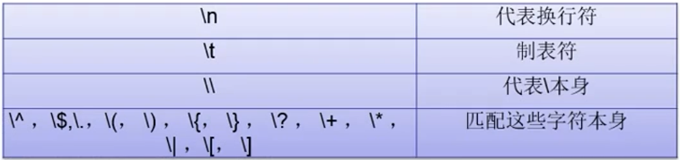
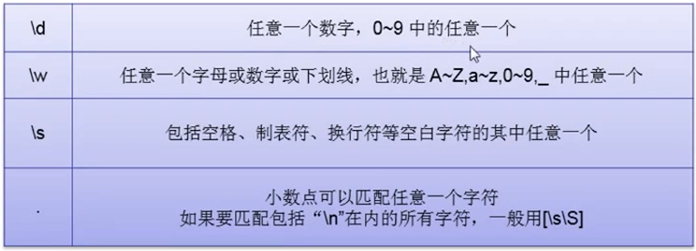
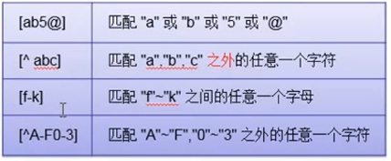
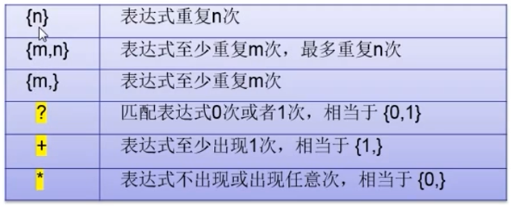
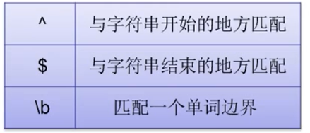
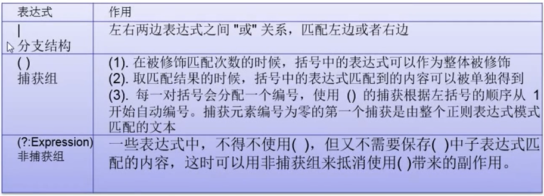
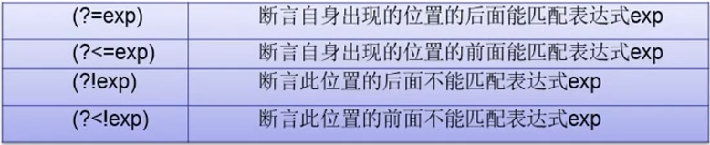
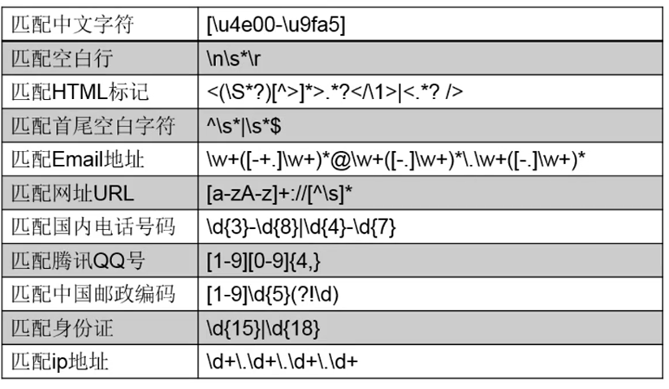

# 正则表达式

## 语法

正则表达式（Regular Expression）简介

+ 普通字符
     + 字母、数字、下划线、汉字，以及没有特殊定义的标点符号，都是普通字符，表达式中的普通字符，在匹配一个字符串的时候，匹配与之相同的字符
+ 简单的转译字符
     + 
+ 标准字符集合
     + 能够与‘多种字符’匹配的表达式
     + 注意区分大小写，大写是相反的意思
     + 
+ 自定义字符集合
     + 【】方括号匹配方法，能够匹配方括号中任意一个字符
     + 
     + 正则表达式的特殊符号，被包裹到中括号中，则失去特殊意义，除了^ , - 之外。
     + 标准字符集合，除小数点之外，如果被包含于中括号，自定义字符集合将包含该集合。比如：
          + [\d. \ -+]将匹配：数字、小数点、+、-

+ 量词（Quantifier）
     + 修饰匹配次数的特殊符号
     + 
     + 匹配次数中的贪婪模式（匹配字符越多越好，默认！）
     + 匹配次数中的非贪婪模式（匹配字符越少越好，修饰匹配次数的特殊符号再加上一个 “ ？ ”号
+ 字符边界
     + （本组标记匹配的不是字符而是位置，符合某种条件的位置）
     + 
     + \b 匹配这样的一个位置： 前面的字符和后面的字符不全是 \w

## 匹配模式

+ IGNORECASE 忽略大小写模式
     + 匹配时忽略大小写。
     + 默认情况下，正则表达式是要区分大小写的
+ SINGLELINE 单行模式
     + 整个文本看作一个字符串，只有一个开头，一个结尾
     + 使小数点 “." 可以匹配含换行符 （\n)  在内的任意字符
+ MULTILINE 多行模式
     + 每行都是一个字符串，都有开头和结尾。
     + 在指定了 MULTILINE 之后，如果需要仅匹配字符串和结束为止，可以使用 \A 和 \Z

## 选择符合分组



反向引用（\nnn）

+ 每一对（）会分配一个编号，使用（）的捕获根据左括号的顺序从1开始自动编号。
+ 通过反向引用，可以对分组已捕获的字符串进行引用。

## 预搜索（零宽断言）

+ 只进行子表达式的匹配，匹配内容不计入最终的匹配结果，是零宽度
+ 这个位置应该符合某个条件。判断当前位置的前后字符，是否符合指定的条件，但不匹配前后的字符。是对位置的匹配。
+ 正则表达式匹配过程中，如果子表达式匹配到的是字符内容，而非位置，并被保存到最终的匹配结果中，那么就认为这个子表达式是占有字符的；如果子表达式匹配的仅仅是位置，或者匹配的内容并不保存到最终的匹配结果中，那么就认为这个子表达式是零宽度的。占有字符还是零宽度，是针对匹配的内容是否保存到最终的匹配结果中耳炎的。
+ 

[a-z]+(?=ing) 匹配到所有以ing结尾的单词   比如：`go`ing   `do`ing    `eat`ing   匹配的括号本身不计入

[a-z]+(?!ing)匹配到必能以ing结尾的单词


## 相关案例

### 电话号码验证

+ 电话号码由数字和  ” - “ 构成
+ 电话号码为 7 到 8位
+ 如果电话号码中包含有区号，那么区号为 三位 或者四位，首位是0
+ 区号用 “ - ” 和其他部分隔开
+ 移动电话号码为11位
+ 11位移动电话号码的第一位和第二位是“13”  “15”  “18”

```
(0\d{2,3}-\d{7,9})|(1[35789]\d{9})
```

### 电子邮箱验证

+ 用户名：字母、数字、中划线、下划线组成
+ @
+ 网址：字母、数字组成
+ 小数点  
+ 组织域名：2-4 位字母组成
+ 不区分大小写

```
[\w\-]+@[a-z0-9A-Z]+(\.[A-Za-z]{2,4}){1,2 }
```

### 常用正则表达式



## java中使用正则

相关类位于 java.util.regex包下面

类 Pattern

+ 正则表达式的编译表示形式
+ Pattern p = Pattern.compile(r,int); //建立正则表达式，并启用相应模式

类 Matcher

+ 通过解释 Pattern 对 character sequence 执行匹配操作的引擎
+ Matcher m = p.matcher(str)  //  匹配str字符串