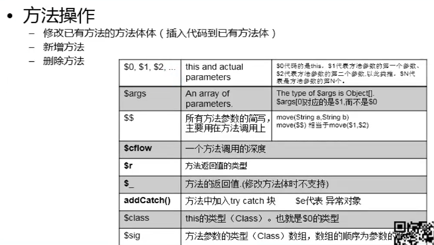

# Java的动态性之一：反射

## 1、reflection 反射

### 1.1、动态语言

程序运行时，可以改变程序结构或变量类型

Java 不是动态语言，Java算是个准动态语言，真正的动态语言有：Python、JavaScript、ruby等

```java
Class c = Class.forName("com.bjsxt.test.User");
```

+ 指的是可以在运行时加载、探知、使用编译期间完全未知的类。
+ 程序在运行状态中，可以动态加载一个只有名称的类，对于任意一个已加载的类，都能够知道这个类的所有属性和方法；对于任意一个对象，都能调用它的任意一个方法和属性
+ 加载完类之后，在堆内存中，就产生了一个Class类型的对象（一个类只有一个 Class 类对象），这个对象就包含了完整的类的结构信息。我们可以通过这个对象看到类的结构。这个对象就像一面镜子，透过这个镜子看到类的结构，所以我们形象的称之为：反射

### 1.2、动态操作

反射机制，动态操作，构造器、方法、属性

```java
String path = "com.bjsxt.test.reflection.bean.User";

Class<User> clazz = (Class<User>) Class.forName(path);

// 通过反射 API 调用构造方法，构造对象
User u = clazz.newInstance();
System.out.println(u);

Constructor<User> c = clazz.getDeclaredConstructor(int.class,int.class,String.class);
User u2 = c.newInstance(1001, 18, "你好");
System.out.println(u2);

// 通过反射 API 调用普通方法
User u3 = clazz.newInstance();
// u3.setUname("hello");
Method method = clazz.getDeclaredMethod("setUname", String.class);
method.invoke(u3,"hello");
System.out.println(u3);


// 通过反射API操作属性
User u4 = new User();
Field f = clazz.getDeclaredField("uname");
// 这个属性不需要安全检查了，可以直接访问
f.setAccessible(true);
f.set(u4,"你好呀");
System.out.println(u4);
```

### 1.3、性能问题

setAccessible

​	启动和禁用访问安全检查的开关，true 就是取消检查，false 开启检查
​	禁止安全检查，可以提高反射的运行速度

### 1.4、获取泛型

```java
public class Demo04 {

    public void test01(Map<String, User> map, List<User> list){
        System.out.println("Demo04.test01");
    }

    public Map<Integer,User> test02(){
        System.out.println("Demo04.test02");
        return null;
    }

    public static void main(String[] args) {
        try {
            Method m = Demo04.class.getMethod("test01", Map.class, List.class);
            Type[] t = m.getGenericParameterTypes();
            for (Type paramType : t) {
                System.out.println("#  "+paramType);
                if (paramType instanceof ParameterizedType){
                    Type[] genericTypes = ((ParameterizedType) paramType).getActualTypeArguments();
                    for (Type genericType : genericTypes) {
                        System.out.println("泛型类型: "+genericType);
                    }
                }
            }

            Method m2 = Demo04.class.getDeclaredMethod("test02",null);
            Type returnType = m2.getGenericReturnType();
            if (returnType instanceof ParameterizedType){
                Type[] genericTypes = ((ParameterizedType) returnType).getActualTypeArguments();
                for (Type genericType : genericTypes) {
                    System.out.println("返回值，泛型类型："+genericType);
                }
            }

        } catch (NoSuchMethodException e) {
            e.printStackTrace();
        }
    }
}
```

getGenericParameterTypes() 获取带参数的泛型类型

getGenericReturnType()		 获取返回值的泛型类型 

### 1.5、动态编译

Java 6.0引入了动态编译机制

动态编译的引用场景

​	可以做一个浏览器端编写 java代码，上传服务器编译和运行的在线评测系统
​	服务器动态加载某些类进行编译

动态编译的两种做法

​	通过Runtime调用 javac 启动新的进程去操作

```java
Runtime run = Runtime.getRuntime();
Process process = run.exe("javac -cp d:/myjava/ HelloWorld.java");
```

​	通过JavaCompile动态编译

## 2、脚本执行 JavaScript 代码

Rhino

```java
 // 获取脚本引擎对象
        ScriptEngineManager sem = new ScriptEngineManager();
        ScriptEngine engine = sem.getEngineByName("javascript");

        // 定义变量，存储到引擎的上下文
//        engine.put("msg","Hello");
        String str = "var user = {name:'hello',age:18,schools:['清华大学','北京大学']}; print(user.name);";
        engine.eval(str);

        engine.eval("msg='sxt is a good school';");
        System.out.println(engine.get("msg"));

        // 定义函数
        engine.eval("function add(a,b){var sum = a+b;return sum;}");
        // 执行js函数
        Invocable jsIncoke = (Invocable) engine;
        Object result1 = jsIncoke.invokeFunction("add",new Object[]{13,20});
        System.out.println(result1);

        // 导入其他java包，使用其他包中的java类，若需要深入谢姐了解，可以学习Rhino的语法
        String jsCode = "var list = java.util.Arrays.asList([\"清华大学\",\"北京大学\"]);";
        // jdk 1.8 以下是这样的：
//        String jsCode = "importPackage(java.util); var list=Arrays.asList([\"北京大学\",\"清华大学\"])";
        //"var list = java.util.Arrays.asList([\"清华大学\",\"北京大学\"]);";
        engine.eval(jsCode);

        List<String> list = (List)engine.get("list");
        for (String temp : list) {
            System.out.println(temp);
        }

        // 执行一个js 文件（我们将 a.js 至于项目的src即可）
        URL url = Demo01.class.getClassLoader().getResource("a.js");
        FileReader fr = new FileReader(url.getPath());
        engine.eval(fr);
        fr.close();     // 由于只是测试，所以就不要那么规范了，大家实际上要用 try catch finally
```

这里的话，出现了点 JDK1.7 和 JDK1.8版本区别的问题，都需要获取脚本引擎对象

## 3、Java字节码操作

Java 动态性的常见实现方式

+ 字节码操作
+ 反射

运行时操作字节码可以让我们实现以下功能

+ 动态生成新的类
+ 动态改变某个每个结构（添加/修改/删除 新的属性/方法）

优势

+ 比反射开销小，性能高
+ JAVAasist性能高于反射，低于ASM

### 3.1、字节类库

#### 3.1.1、BCEL

Byte Code Enginerring Libaray (BCEL) ,这是Apache SoftWare Founction 的Jakarta 项目的一部分，BCEL 是 JavaClassworking 广泛使用的一种框架，他可以让您深入JVM 汇编语言进行类的操作的细节，BCEL 与 Javassist 有不同的处理字节的方法，BCEL 在实际的 JVM 指令层次上进行操作（BCEL）拥有丰富的JVM 指令级自从，而Javassist所强调的是源代码级别的工作

#### 3.1.2、ASM

是一个轻量级Java字节码操作框架，直接涉及到 JVM底层的指令操作

#### 3.1.3、CGLIB

（Code Generation Libraray）是一个强大的，高性能，高质量的Code 生成库类，基于ASM的实现

#### 3.1.4、Javassist（讲解）

是一个开源的分析、编辑、和创建 Java字节码的类库，性能教ASM差，跟 cglib差不多，但是用简单，很多开源框架都使用它

### 3.2、Javassist 库

javassist的最外层 API 和 Java 反射包中的 API 颇为相似

它主要有 CtClass CtMethod,以及CtField 这几个类组成的，用以执行 JDK 反射 API 中的 java.lang.Class 、   java.lang.reflect.Method、   java.lang.reflect.Method.Field 相同的操作



#### 用法

```java
    /**
     * 简单的获取名称
        * @param 
        * @return void
        * @author Xiang想
        * @date 2020/6/2 18:12
    */
    public static void test01() throws Exception {
        ClassPool pool = ClassPool.getDefault();
        CtClass cc = pool.get("com.bjsxt.test.Emp");

        byte[] bytes = cc.toBytecode();
//        System.out.println(Arrays.toString(bytes));

        System.out.println(cc.getName());   // 获取类名
        System.out.println(cc.getSimpleName()); // 获取简要类名
        System.out.println(cc.getSuperclass()); // 获取父类
        System.out.println(cc.getInterfaces()); // 获取接口
    }

    /**
     * 生成新的有参方法，有返回值方法
        * @param
        * @return void
        * @author Xiang想
        * @date 2020/6/2 18:13
    */
    public static void test02() throws Exception {
        ClassPool pool = ClassPool.getDefault();
        CtClass cc = pool.get("com.bjsxt.test.Emp");

//        CtMethod m = CtNewMethod.make("public int add(int a,int b){return a+b;}",cc);

        // 这个和上面注释的效果一样
        CtMethod m = new CtMethod(CtClass.intType,"add",
                new CtClass[]{CtClass.intType,CtClass.intType},cc);
        m.setModifiers(Modifier.PUBLIC);
        m.setBody("{System.out.println(\"Hello\");return $1+$2;}"); // $1 占位符

        cc.addMethod(m);
        // 通过反射调用新生成的方法
        Class clazz = cc.toClass();
        Object obj = clazz.newInstance();   // 通过调用 Emp 无参构造器，创建新的  EMp 对象
        Method method = clazz.getDeclaredMethod("add",int.class,int.class);
        Object resoult = method.invoke(obj, 200, 200);
        System.out.println(resoult);
    }

    /**
     * 在指定地方添加语句，
     * 在指定语句前
     * cm.insertBefore("");
     * 在指定行数
     * cm.insertAt(int,"");
     * 在指定语句后
     * cm.insertAfter("");
        * @param
        * @return void
        * @author Xiang想
        * @date 2020/6/2 18:15
    */
    public static void test03() throws Exception {
        ClassPool pool = ClassPool.getDefault();
        CtClass cc = pool.get("com.bjsxt.test.Emp");

        CtMethod cm = cc.getDeclaredMethod("sayHello", new CtClass[]{CtClass.intType});
        cm.insertBefore("System.out.println($1);System.out.println(\"start!!!\");");

        cm.insertAt(15,"System.out.println(\"come on!!!\");");

        cm.insertAfter("System.out.println(\"end!!!\");");

        // 通过反射调用新生成的方法
        Class clazz = cc.toClass();
        Object obj = clazz.newInstance();   // 通过调用 Emp 无参构造器，创建新的  EMp 对象
        Method method = clazz.getDeclaredMethod("sayHello",int.class);
        Object resoult = method.invoke(obj, 200);
        System.out.println(resoult);
    }

    /**
     * 添加私有成员变量
     * 添加 set 和 get方法
        * @param
        * @return void
        * @author Xiang想
        * @date 2020/6/2 18:16
    */
    public static void test04() throws Exception {
        ClassPool pool = ClassPool.getDefault();
        CtClass cc = pool.get("com.bjsxt.test.Emp");

        // 加个新属性  int salary
        CtField f1 = new CtField(CtClass.intType,"salary",cc);
        f1.setModifiers(Modifier.PRIVATE);
        cc.addField(f1);

//        CtField ename = cc.getDeclaredField("ename");  // 获取指定的属性
//        System.out.println(ename);

        // 增加相应的 get 和 set 方法
        cc.addMethod(CtNewMethod.getter("getSalary",f1));
        cc.addMethod(CtNewMethod.getter("setSalary",f1));
    }

    /**
     * 构造方法操作
        * @param
        * @return void
        * @author Xiang想
        * @date 2020/6/2 18:55
    */
    public static void test05() throws Exception{
        ClassPool pool = ClassPool.getDefault();
        CtClass cc = pool.get("com.bjsxt.test.Emp");

        CtConstructor[] cs = cc.getConstructors();
        for (CtConstructor c : cs) {
            System.out.println(c.getLongName());
        }
    }

    /**
     * 获取 注解
        * @param
        * @return void
        * @author Xiang想
        * @date 2020/6/2 19:01
    */
    public static void test06() throws  Exception{
        ClassPool pool = ClassPool.getDefault();
        CtClass cc = pool.get("com.bjsxt.test.Emp");

        Object[] all = cc.getAnnotations();
        Author a = (Author)all[0];
        String name = a.name();
        int year = a.year();
        System.out.println("name:"+name+",year:" +
                year );
    }
```

### 3.3、Javassist 的局限性

+ jdk 5.0新语法不支持（包括泛型、枚举），不支持注解修改，但可以通过底层 javassist类来解决，具体参考：javassist.bytecode.annotation
+ 不支持数组参数，如`String[]("1","2")` ,除非只有数组的容量为1
+ 不支持内部类的匿名类
+ 不支持continue 和 break 表达式
+ 对于继承关系，有些不支持，例如
     + class A{}
     + class B extends A{}
     + class C extends B{}