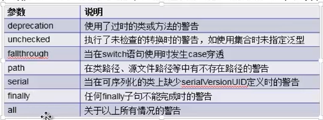
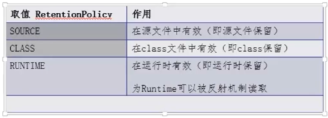

[TOC]

## 1、Annotation 注解

Annotation 是从 JDK 5.0 开始引入的新技术

+ comment

Annotation的作用：

+ 不是程序本身，可以对程序作出解释。（这一点，跟注释没什么区别
+ 可以被其他程序（比如：编译器等）读取。（注解信息处理流程，是注解和注释的重大区别。如果没有注解信息处理流程，则注解毫无意义）

Annotation的格式

+ 注解是以 `@注解名`  在代码中存在，还可以添加一些参数值，例如：  @SuppressWarning(value = "unchecked")

Annotation在哪里使用?

+ 可以附加package,class,method,filed等上面，相当于给他们添加了额外的辅助信息，我们可以通过反射机制编程实现对数据的访问


### 1.1、内置注解

@Override 方法重写

@Deprecated 遗弃废弃

@SuppressWarning（"参数"）  抑制警告信息



@SafeVarargs  忽略任何使用参数为泛型变量的方法或构造函数调用产生的警告。

@FunctionInterface  java 8 开始，标识一个匿名函数或函数式接口

@Repeatable   java 8开始。标识某注解可以在同一声明上使用多次

### 1.2、自定义注解

public @interface 注解名{ }

在此之上呢，还要加4个注解分别是  `@Target`      `@Retention`     前两个必须，  后面两个可选  `@Documented`   `@Inherited`

#### @Target

作用：描述注解的适用范围：

```java
@Target(value = ElementType.TYPE)
```

#### @Retention

作用：表示需要在什么级别保存该注释的信息，用于描述注解的生命周期



```java
package com.bjsxt.test.annotation;

import java.lang.annotation.ElementType;
import java.lang.annotation.Retention;
import java.lang.annotation.RetentionPolicy;
import java.lang.annotation.Target;

/**
 * @author Xiang想
 * @title: SxtAnnotation01
 * @projectName TestAnnotation
 * @description: TODO
 * @date 2020/6/1  16:54
 */
@Target(value = {ElementType.METHOD,ElementType.TYPE})
@Retention(RetentionPolicy.RUNTIME)
public @interface SxtAnnotation01 {

    String studentName() default "";
    int age() default 0;
    int id() default -1; //String indexOf("abc")

    String[] schools() default  {"清华大学","北京大学"};
}
```

### 1.3、什么是ORM（Object relationship Mapping)

类和表结构对应
属性和字段对应
对象和记录对应

学玩了反射机制后，我们可以定义注解处理流程读取这些注解，实现更复杂的功能

```java
Class clazz = Class.forName("com.bjsxt.test.annotation.SxtStudent");

// 获得所有类的有效注解
Annotation[] annotations = clazz.getAnnotations();
for (Annotation annotation : annotations) {
    System.out.println(annotation );
}

// 获得类的指定注解
SxtTable st = (SxtTable) clazz.getAnnotation(SxtTable.class);
System.out.println(st.value());

// 获得类的属性的注解
Field f = clazz.getDeclaredField("studentName");
SxtField sxtField = f.getAnnotation(SxtField.class);
System.out.println(sxtField.columnName()+"--"+sxtField.type()+"--"+sxtField.length());
```

