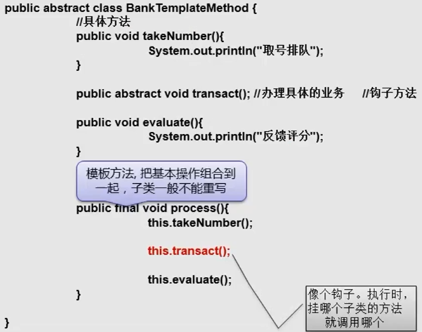

---

---

[TOC]

# 设计模式

> 设计模式，不是简单听两门课，看一些资料就能搞明白的，这是一种思维，只有融入到学习和工作中，才有更高的层次去思考

##### 创建型模式：

==单利模式==：保证每个类只有一个实例，并且提供一个访问该实例的全局访问点

==工厂模式==：

+ ==简单工厂模式==：用来生产同一等级结构中的任意产品（对于新增产品，需要修改已有代码） 
+ ==工厂方法模式==：用来生产同一等级结构中的固定产品。（支持增加任意产品） **实际上这个多一点**

==抽象工厂模式==：用来生产不同产品族的全部产品。（对于增加新的产品，无能为力；支持增加产品族）

==建造者模式==：分离了对象子组件的单独构造（由Builder来负责）和装配（有Director）负责。从而可以构造出复杂的对象

==原型模式==：通过new产生一个对象需要非常繁琐的数据准备或访问权限，则可以使用原型模式

##### 结构型模式：

适配器模式、桥接模式、装饰模式、组合模式、外观模式、享元模式、代理模式

##### 行为型模式：

模板方法模式、命令模式、迭代器模式、观察者模式、中介者模式、备忘录模式、解析器模式、状态模式、策略模式、职责链模式、访问者模式。

(Group of four) :四个大牛，创建的23种设计模式

## 1、单利模式

### 1.1、核心作用：

+ 保证一个类只有一个实例，并且提供了一个访问该实例的全局访问点


### 1.2、常用场景：

+ ==Windows 的 Task Manager （任务管理器）就是一个很典型的单利模式==
+ windows 的 Recycle Bin（回收站）也是个典型的单利模式，在整个系统运行过程中，回收站一直维护这仅有的实例
+ 项目中，读取配置文件的类，一般也只有一个对象，没有必要每次使用配置文件数据，每次new一个对象去读取
+ 网站计数器，采用单例模式，不然很难同步
+ 应用程序的日志应用，一般采用单利模式实现，这一般是由于共享的日志一直处于打开状态，因为只有一个实例去操作，否则内容不好追加
+ 数据库连接池设计也是采用单利模式
+ 操作系统的文件系统，也是单例模式实现，一个操作系统只能有一个文件系统
+ Application 也是单利典型应用
+ Spring 中，每个 Bean 默认就是单利的，这样做的优点是 Spring 容器可以管理
+ serlvet 编程中，每个Servlet 也是单利的
+ 在SpringMVC strut1 框架中，控制器也是单利的

### 1.3、优点：

+ 由于单利模式只生成一个实例，减少系统性能开销，当一个对象的产生需要比较多的资源，比如读取一个配置、产生其依赖对象时，则可以通过应用启动时直接产生单利对象，然后永久驻留内存的方式来解决
+ 单利 模式可以在系统设置全局的访问点，优化环共享资源访问，例如可以设计一个单利类，负责所有数据的映射处理

### 1.4、常见五种单利模式实现方式：

+ 主要

     #### 1.4.1、`饿汉式` （线程安全，调用效率高，但是，不能延迟加载）

     ```java
     public class SingletonDemo02{
     	private static /*final*/ SingletorDemo02 s = new SingletonDemo02();
     	private SingletonDemo02(){} // 私有构造器
     	public static /*synchronized*/ SingletonDemo02 getInstance(){
     		return s;
     	}
     }
     ```

     ```java
     public class Client{
     	public static void main(String[] args){
     		SingletonDemo02 s = SingletonDemo02.getInstance();
     		SingletonDemo02 s2 = SingletonDemo02.getInstance();
     		System.out.print(s==s2)		// 结果为true
     	}
     }
     ```

     ​			饿汉式单利模式代码中，static变量会在类加载时初始化，此时也不会涉及多个线程访问该对象的问题，虚拟机只会加载一次，肯定不会发生并发访问问题，因此，可以省略 synchronized关键字

     ​			如果只是加载本类，而不是调用 getInstance（），甚至永远没有调用，则会浪费太多的资源

     ### 1.4.2、`懒汉式`（线程安全，调用率不高，但是，可以延迟加载）

     ```java
      public class SingletonDemo2 {
         // 类初始化时，不初始化这个对象（延迟加载，真正用到时候再创建）
         private static SingletonDemo2 s;
     
         private SingletonDemo2(){} //私有化构造器
         // 方法同步，调用效率低
         public static synchronized SingletonDemo2 getInstance(){
             if (s == null){
                 s = new SingletonDemo2();
             }
             return s;
         }
     }
     ```

     + 要点：
          + lazy load!  	延迟加载，懒加载，真正用的时候才加载
     + 问题：
          + 资源利用率高了。但是，每次调用getInsetance 方法都要同步，并发效率较低。

+ 其他

     ### 1.4.3、`双重检测锁式`（由于JVM底层内部模型原因，偶尔会出问题，不建议使用）

     ```java
     public class SingletonDemo3 {
         private static SingletonDemo3 instance = null;
     
         public static SingletonDemo3 getInstance(){
             if (instance == null){
                 SingletonDemo3 sc;
                 synchronized (SingletonDemo3.class){    // 第一次检索
                     sc = instance;
                     if (sc == null){
                         synchronized (SingletonDemo3.class){    // 第二次检索
                             if (sc == null){
                                 sc = new SingletonDemo3();
                             }
                         }
                         instance = sc;
                     }
                 }
             }
             return instance;
         }
         private SingletonDemo3(){
     
         }
     }
     ```

     问题：会出问题，不建议使用

     ### 1.4.4、`静态内部类式`（线程安全，调用率高，但是，可以延迟加载）

     + 要点：

          + 外部没有 static 属性，则不会像饿汉式那样立即加载对象
          + 只有真正调用 getInstance（），才会加载静态内部类。加载类时是线程安全的，instacne 是 static final 类型，保证了内存中只有这样的实例存在，而且只能被赋值一次，从而保证了线程安全性
          + 兼备了并发搞笑调用和延迟加载的优势

          ```java
          public class SingletonDemo4 {
              private static class SingletonClassInstacne{
                  private static final SingletonDemo4 instacne = new SingletonDemo4();
              }
          
              public static SingletonDemo4 getInstance(){
                  return SingletonClassInstacne.instacne;
              }
          
              private SingletonDemo4(){
              }
          }
          
          ```

          ### 1.4.5、 `枚举单利`（线程安全，调用率高，不能延迟加载）

          + 优点：

               + 实现简单
               + 枚举本身就是单利模式，由JVM从根本上提供保障！避免通过反射和反序列化的漏掉！

          + 缺点

               + 无延迟加载

               ```java
               public enum SingletonDemo05 {
                    /**
                    * 定义一个枚举的元素，它就代表了Singleton的一个实例。
                    */
                   INSTANCE;
                   /**
                    * 单例可以有自己的操作
                    */
                   public void singletonOperation(){
                       //功能处理
                   }
               }
               ```


常见的五种单例模式在多线程环境下的效率测试

+ 大家只要关注相对值即可。在不同的环境下不同的程序测得值完全不一样

| **饿汉式**   | **22ms** |
| ------------ | -------- |
| 懒汉式       | 636ms    |
| 静态内部类式 | 28ms     |
| 枚举式       | 32ms     |
| 双重检查锁式 | 65ms     |

常见的五种单例模式实现方式

主要：
	饿汉式（线程安全，调用效率高。 但是，不能延时加载。）
	懒汉式（线程安全，调用效率不高。 但是，可以延时加载。）
其他：
	双重检测锁式（由于JVM底层内部模型原因，偶尔会出问题。不建议使用）
	静态内部类式(线程安全，调用效率高。 但是，可以延时加载)
	枚举式(线程安全，调用效率高，不能延时加载。并且可以天然的防止反射和反序列化漏洞！)
如何选用?
单例对象  占用  资源 少，不需要  延时加载：
枚举式   好于   饿汉式
单例对象  占用  资源 大，需要 延时加载：
静态内部类式   好于  懒汉式


## 工厂模式

+ 实现了创建者和建用者的分析
+ 详细分类
     + 简单工厂模式
     + 工厂方法模式
     + 抽象工厂模式

面向对象设计的原则：（有6大原则，这里只列3个）

+ OCP（开闭原则 Open-Closed Principle）：一个软件的实体应当对扩展开放，对修改关闭
+ DIP（依赖倒转原则 Dependence Inversion Principle）：要针对接口编程，不要针对实现编程
+ LoD（迪米特法则 Law of Demeter）：只与你直接的朋友通信，而避免和陌生人通信

### 2、简单工厂模式

要点：

+ 简单工厂模式也叫静态工厂模式，就是工厂类一般是使用静态方法，通过接收的参数的不同来返回不同的对象实例
+ 对于增加新产品无能为力！不修改代码的话，是无法扩展的

```java
public static Car createCar(String type){
        if ("奥迪".equals(type)){
            return new Audi();
        } else  if ("比亚迪".equals(type)){
            return new Byd();
        }else {
            return null;
        }
    }
```


### 3、工厂方法模式

要点：

+ 为了避免简单工厂模式的确定，不完全满足OCP
+ 工厂方法模式和简单工厂模式最大的不同在于，简单工厂模式只有一个（对于一个项目或者一个独立模块而言）工厂类，而工厂方法模式有一组实现了相同接口的工厂类。


> 简单工厂模式和工厂模式PK
>
> ​	结构复杂度：
> ​		从这个角度比较，显然简单工厂模式要占优。简单工厂模式只需一个工厂类，而工厂方法模式的工厂类随着产品类个数增加而增加，这无疑会使类的个数越来越多，从而增加了结构的复杂程度。
>
> ​	代码复杂度：
> ​		代码复杂度和结构复杂度是一对矛盾，既然简单工厂模式在结构方面相对简洁，那么它在代码方面肯定是比工厂方法模式复杂的了。简单工厂模式的工厂类随着产品类的增加需要增加很多方法（或代码），而工厂方法模式每个具体工厂类只完成单一任务，代码简洁。
>
> ​	客户端编程难度：
> ​		工厂方法模式虽然在工厂类结构中引入了接口从而满足了OCP，但是在客户端编码中需要对工厂类进行实例化。而简单工厂模式的工厂类是个静态类，在客户端无需实例化，这无疑是个吸引人的优点。
>
> ​	管理上的难度：
> ​		这是个关键的问题。我们先谈扩展。众所周知，工厂方法模式完全满足OCP，即它有非常良好的扩展性。那是否就说明了简单工厂模式就没有扩展性呢？答案是否定的。简单工厂模式同样具备良好的扩展性——扩展的时候仅需要修改少量的代码（修改工厂类的代码）就可以满足扩展性的要求了。尽管这没有完全满足OCP，但我们不需要太拘泥于设计理论，要知道，sun提供的java官方工具包中也有想到多没有满足OCP的例子啊。然后我们从维护性的角度分析下。假如某个具体产品类需要进行一定的修改，很可能需要修改对应的工厂类。当同时需要修改多个产品类的时候，对工厂类的修改会变得相当麻烦（对号入座已经是个问题了）。反而简单工厂没有这些麻烦，当多个产品类需要修改是，简单工厂模式仍然仅仅需要修改唯一的工厂类（无论怎样都能改到满足要求吧？大不了把这个类重写）。

==根据设计理论建议：工厂方法模式。但实际上，我们一般都用简单工厂模式。==

### 4、抽象工厂模式

要点：

+ 用来生产不同 `产品族` 的全部产品。（对于增加新的产品，无能为力；支持增加产品族）
+ 抽象工厂模式是工厂方法模式的升级版本，在有多个业务品种、业务分类时，通过抽象工厂模式产生需要的对象是一种非常好的解决方式。


+ 工厂模式要点：

简单工厂模式(静态工厂模式)
虽然某种程度不符合设计原则，但实际使用最多。
工厂方法模式
不修改已有类的前提下，通过增加新的工厂类实现扩展。
抽象工厂模式
不可以增加产品，可以增加产品族！

+ 应用场景

JDK中Calendar的getInstance方法
JDBC中Connection对象的获取
Hibernate中SessionFactory创建Session
spring中IOC容器创建管理bean对象
XML解析时的DocumentBuilderFactory创建解析器对象
反射中Class对象的newInstance()

## 5、建造者模式

+ 场景：
     + 我们要建造一个复杂的产品。比如：神州飞船,Iphone。这个复杂的产品的创建。有这样一个问题需要处理：
          + 装配这些子组件是不是有个步骤问题?
     + 实际开发中，我们所需要的对象构建时，也非常复杂，有很多步骤需要处理时。
+ 建造模式的本质：
     + 分离了对象子组件的单独构造(由Builder来负责)和装配(由Director负责)。 从而可以构造出复杂的对象。这个模式适用于：某个对象的构建过程复杂的情况下使用。
     + 由于实现了构建和装配的解耦。不同的构建器，相同的装配，也可以做出不同的对象；相同的构建器，不同的装配顺序也可以做出不同的对象。也就是实现了构建算法、装配算法的解耦，实现了更好的复用。


+ 开发中应用场景：
     + StringBuilder类的append方法
     + SQL中的PreparedStatement
     + JDOM中，DomBuilder、SAXBuilder

## 6、原型模式

+ 通过new产生一个对象需要非常繁琐的数据准备或访问权限，则可以使用原型模式

     + 就是java中克隆急速，以某个对象为原型，复制除新的对象，显然，新的对象具备原型对象的特点

     优势：效率高

+ 克隆类似于new ，但不同于new，new创建新的对象属性采用的是默认值。克隆出的对象的属性值完全和原型对象相同，并且克隆出的新对象改变不会影响原型对象，然后再修改克隆对象的值

原型模式实现：

+ Cloneable 接口 和 clone 方法
+ Prototype 模式中山西爱你起来最困难的地方就是内存复制操作，所幸在 Java 中提供了 clone（） 方法替我们做了绝大部分事情

==第一种是 继承 Cloneable 接口，重写 clone方法，调用clone方法实现克隆==

==第二种是 利用序列化和反序列化实现深度克隆==

```java
// 使用序列化和反序列化实现深度复制
ByteArrayOutputStream bos = new ByteArrayOutputStream();
ObjectOutputStream oos = new ObjectOutputStream(bos);

oos.writeObject(s1);
byte[] bytes = bos.toByteArray();

ByteArrayInputStream bis = new ByteArrayInputStream(bytes);
ObjectInputStream ois = new ObjectInputStream(bis);
Sleep s2 = (Sleep) ois.readObject();    // 克隆好的对象
```

使用场景：

​	通过new对象产生一个对象需要非常繁琐的数据准备和访问权限，可以使用原型模式

------

## 7、适配器模式

适配器  adapter 模式

+ 将一个类的接口转换成客户希望的另外一个接口，Adapter模式使得原本接口不兼容而不能一起工作的那些类可以在一起工作

模式中的目标

+ 目标接口（Target）：客户所期待的接口。目标可以是具体的或抽象的类，也可以是接口
+ 需要适配的类（Adaptee）：需要适配的类或者适配者类
+ 适配器（Adapter）：通过包装一个需要适配的对象，吧原接口转成目标接口。

```java
/* 需要适配的类 */
public class Adaptee {
    public void request(){
        System.out.println("可以完成客户需要的功能！");
    }
}
```

```java
/*  目标接口 */
public interface Target {
    void handleReq();
}
```

```java
/* 适配器本身 (类适配器) */
public class Adapter extends Adaptee implements Target{
    @Override
    public void handleReq() {
        super.request();
    }
}
```

```java
/*
 * 适配器 (对象适配器，使用了组合的方式跟被适配对象整合)
 * (USB 转 ps/2 的连接器)
 */
public class Adapter2 extends Adaptee implements Target{
    private Adaptee adaptee;
    @Override
    public void handleReq() {
        adaptee.request();
    }
    public Adapter2(Adaptee adaptee) {
        this.adaptee = adaptee;
    }
}
```

```java
/* 客户端，相当于例子中的笔记本，只有USB 接口 */
public class Client {
    public void test1(Target t){
        t.handleReq();
    }
    public static void main(String[] args) {
        Client c = new Client();
        Adaptee a = new Adaptee();
//        Target t = new Adapter();		使用适配器本身 (类适配器)
        Target t = new Adapter2(a);
        c.test1(t);
    }
}
```

## 8、代理模式

核心作用：

​	通过代理，控制对对象的访问

​	可以详细控制访问某个（某类）对象的方法，在调用这个方法前做前置处理，调用这个方法后做后置处理（即：AOP的微观实现）

代理模式（Proxy pattern）

核心角色：

+ 抽象角色
     + 定义代理角色和真实角色的公共对外方法
+ 真实角色
     + 实现抽象角色，定义真实角色所要实现的业务逻辑，供代理角色调用
     + ==关注真正的业务逻辑！==
+ 代理角色
     + 实现抽象角色，是真实角色的代理，通过真实角色的 业务逻辑方法来实现抽象方法，并可以附加自己的操作
     + ==将统一的流程控制放到代理角色中处理


应用场景：

+ 安全代理：屏蔽对真实角色的直接访问
+ 远程代理：通过代理类处理远程方法调用（RMI）
+ 延迟加载：先加载轻量级的代理对象，真正需要再加载真实对象。

分类：

### 6.1、静态代理

> 就是写个新的类，然后重写方法

```java
/* 接口 */
public interface Star {
	void sing();		// 唱歌
    void confer();		// 面试
}
```

```java
/* 真实类 继承明星接口 */
public class RealStar implements Star{
    @Override
    public void confer() {
        System.out.println("RealStar.confer()");
    }
    
    @Override
    public void sing() {
        System.out.println("RealStar(周杰伦).sing()");
    }
}
```

```java
/* 代理类 也是 继承他，但唯独 唱歌是调用真实类 */
public class ProxyStar implements Star {

    private Star star;

    public ProxyStar(Star star) {
        this.star = star;
    }
    
     @Override
    public void confer() {
        System.out.println("ProxyStar.confer()");
    }
    @Override
    public void sing() {
        star.sing();
    }
}
```

```java
/* 客户 Client */
 public static void main(String[] args) {
        Star real = new RealStar();
        Star proxy = new ProxyStar(real);

        proxy.confer();
        proxy.sing();
    }
```


### 6.2、动态代理

+ JDK自带的动态代理
     + java.lang.reflect.Proxy
          + 作用：动态生成代理类和对象
     + java.lang.reflect.InvocationHandler(处理器接口)
          + 可以通过invoke方法实现真实角色的代理访问
          + 每次通过Proxy生成代理类对象对象时都要指定对应的处理器对象
+ javaassist字节码操作库实现
+ CGLIB
+ ASM（底层使用指令，可维护性较差）

```java
/* 接口 */
public interface Star {
	void sing();		// 唱歌
    void confer();		// 面试
}
```

```java
/* 真实类 继承明星接口 */
public class RealStar implements Star{
    @Override
    public void confer() {
        System.out.println("RealStar.confer()");
    }
    
    @Override
    public void sing() {
        System.out.println("RealStar(周杰伦).sing()");
    }
}
```

==前面一样==

```java
public class StarHandler implements InvocationHandler {

    Star realStar;

    public StarHandler(Star realStar) {
        this.realStar = realStar;
    }

    @Override
    public Object invoke(Object proxy, Method method, Object[] args) throws Throwable {
        Object object = null;

        System.out.println("真正的执行方法");
        System.out.println("面谈，签合同，预付款，订机票");

        if (method.getName().equals("sing")){
            object = method.invoke(realStar,args);
        }

        System.out.println("真正的执行后");
        System.out.println("收尾款");

        return object;
    }
}
```

```java
public static void main(String[] args) {
    Star realStar  = new RealStar();
    StarHandler handler = new StarHandler(realStar);

    Star proxy =(Star) Proxy.newProxyInstance(ClassLoader.getSystemClassLoader(), new Class[]{Star.class}, handler);
    proxy.bookTicket();
    System.out.println("---------------------");

    proxy.sing();
}
```

> 继承接口，重写invoke方法，实现动态代理

## 9、桥接模式

场景：

+ 上次系统中常见的商品分类，以电脑为类，如何良好的处理分类问题

我们可以使用 ==多层继承结构== 实现

问题：

+ 扩展性问题：（类个数膨胀问题）
     + 如歌要增加一个新的电脑类型：智能手机，则要增加各个品牌下的类
     + 如歌要增加一个新的品牌，也要增加各个电脑类型的类
+ 违反单一原则


桥接模式核心要点：

+ 处理多层继承结构，处理多维度变化的场景，将各个维度设计成独立的基础结构，使各个维度可以独立的扩展在抽象层建立关联。


应用场景：

+ JDBC驱动程序
+ AWT中的Peer架构
+ 银行日志管理：
     + 格式分类：操作日志，交易日志，异常日志
     + 距离分类：本地记录日志，异地记录日志
+ 人力资源系统中的奖金计算模块
     + 奖金分类：个人奖金、团体奖金、激励奖金
     + 部门分类：人事部门、销售部门、研发部门
+ OA系统中的消息处理
     + 业务类型，普通消息、加急消息、特急消息
     + 发送消息方法：系统内消息、手机短信、邮件

> 多维度的思考问题，就是给类分组

## 10、组合模式

组合模式（coposite）

场景：

+ 吧部分和整体的关系用树状结构啦表示，从而死客户端可以使用统一的方式处理部分对象和整体对象

核心：

+ 抽象构件（Component）角色：定义了叶子和容器构件的共同点
+ 叶子（Leaf）构件角色：无子节点
+ 容器（Composite）构件角色：有容器特征，可以包含子节点 

```java
//抽象组件
public interface Component {
    void operation();
}

// 叶子组件
interface Leaf extends Component{

}
// 容器组件
interface Composite extends Component{
    void add(Component c);
    void remove(Component c);
    Component getChild(int index);
}
```

>三个组件之间的关系 

流程分析：

+ 组合模式为处理树形结构提供了完美的解决方案，描述了如何将容器和叶子进行递归组合，使得用户在使用时可以一致性的对待容器的叶子
+ 当容器对象的指定方法被调用时，讲遍历整个树形结构，寻找也包含这个方法的成员，并调用执行。其中，使用了递归调用的机制对整个结构进行处理

开发场景：

+ 操作系统的资源管理器
+ GUI中的容器层次图
+ XML文件解析
+ OA系统中，组织结构的处理
+ Junit单元测试框架
     + 底层设计就是典型的组合模式，TestCase（叶子）、TestUnite（容器）、Test接口（抽象）

```java
public interface AbstractFile {
    void killVirus();
}

class ImageFile implements AbstractFile{
    private String name;

    public ImageFile(String name) {
        this.name = name;
    }

    @Override
    public void killVirus() {
        System.out.println("--- 图像文件"+name +"，进行查杀");
    }
}

class VoidFile implements AbstractFile{
    private String name;

    public VoidFile(String name) {
        this.name = name;
    }

    @Override
    public void killVirus() {
        System.out.println("--- 视频文件"+name +"，进行查杀");
    }
}

class Folder implements AbstractFile{
    private String name;
    // 定义容器，用来存放本容器解构下的子节点
    private List<AbstractFile> list = new ArrayList<AbstractFile>();

    public Folder(String name) {
        this.name = name;
    }

    public void add(AbstractFile file){
        list.add(file);
    }

    @Override
    public void killVirus() {
        System.out.println("--- 文件夹"+name+",进行查杀");

        for (AbstractFile file : list) {
            file.killVirus();
        }
    }
}
```

```java
 public static void main(String[] args){
        AbstractFile f2,f4,f5;
        Folder f1 = new Folder("我的收藏");

        f2 = new ImageFile("老大的头像.jpg");
        f1.add(f2);

        f2.killVirus();
        f1.killVirus();
        System.out.println("--------------");
        Folder f11 = new Folder("电影");
        f4 = new VoidFile("笑傲江湖.avi");
        f5 = new VoidFile("神雕侠侣.avi");

        f11.add(f4);
        f11.add(f5);

        f11.killVirus();

 }
```

## 11、装饰模式

装饰模式（decorator）

职责：

+ 动态的为一个对象新增的功能。
+ 装饰模式是一种用于替代继承的技术，无须通过继承增加子类就能扩展对象的功能。使用对象的关联关系代替继承关系，更加灵活，同时避免类型体系的快速膨胀。

案例说明：


> 如果这个时候，我们要再给车加个会水上的功能.......     ==可想而知==  会有多复杂

对于装饰模式，我们只要写 飞、潜、人工智能 就可以了...

实现细节：

+ Component 抽象构件角色
     + 真实对象和装饰对象有相同的接口。这样，客户端对象就能够以真实相同的方式同装饰对象交互
+ ConcreteComponent 具体构件角色（真实对象）
     + io 流 中 FileInputStream、FileOutPutStream
+ Decorator 装饰角色：
     + 持有一个抽象构件引用。装饰对象接受所有的客户端请求，并把这些请求转发给真实对象
          + 这样，就能在真实独享调用前后增加新的功能
+ ConcreateDecorator具体装饰角色：
     + 负责给构件对象新增新的责任


```java
package com.bjsxt.decorator;

/**
 * 抽象组件
 * @author Xiang想
 * @title: ICar
 * @projectName pattern
 * @description: TODO
 * @date 2020/6/11  14:32
 */
public interface ICar {
    void move();
}

// ConcreteComponent 具体构件角色（真实对象）
class Car implements ICar{

    @Override
    public void move() {
        System.out.println("陆地上跑");
    }
}

// Decorator 装饰角色
class SuperCar implements ICar{
    private ICar car;
    public SuperCar(ICar car) {
        this.car = car;
    }
    @Override
    public void move() {
        car.move();
    }
}

// ConcreateDecorator具体装饰角色
class FlyCar extends SuperCar{
    public FlyCar(ICar car) {super(car);}
    public void fly(){System.out.println("天上飞");}
    @Override
    public void move() {
        super.move();
        fly();
    }
}

class AICar extends SuperCar{
    public AICar(ICar car) {super(car);}
    public void AI(){System.out.println("人工智能");}
    @Override
    public void move() {
        super.move();
        AI();
    }
}

class WaterCar extends SuperCar{
    public WaterCar(ICar car) {super(car);}
    public void swim(){System.out.println("水上游");}
    @Override
    public void move() {
        super.move();
        swim();
    }
}
```

```java
package com.bjsxt.decorator;

/**
 * @author Xiang想
 * @title: Client
 * @projectName pattern
 * @description: TODO
 * @date 2020/6/11  14:38
 */
public class Client {
    public static void main(String[] args) {
        Car car = new Car();
        car.move();

        System.out.println("增加新的功能，飞------");
        FlyCar flyCar = new FlyCar(car);
        flyCar.move();


        System.out.println("增加新的功能，游------");
        WaterCar waterCar = new WaterCar(car);
        waterCar.move();


        // 增加两个功能
        System.out.println("增加两个新的功能，飞行、游 -----");
        WaterCar waterCar2 = new WaterCar(new FlyCar(car));
        waterCar2.move();

        System.out.println("增加三个新的功能，飞行、游 -----");
        AICar aiCar = new AICar(waterCar2);
        aiCar.move();
    }
}
```

场景：

+ IO中输入流和输出流的设计
+ Swing包中图形界面构件功能
+ Servlet API 中提供了一个reuqest 对象的 Decorator 设计模式的默认实现类 HttpServltRequestWrapper，HttpServletReqeustWrapper类，增强了request对象的功能
+ Strut2中，request，request，response，session对象的处理

总结：

+ 装饰模式（Decorator）也叫包装器模式（Wrapper）
+ 装饰模式降低系统的耦合度，可以动态的增加或删减对象的职责，并使得需要装饰的具体构建类和具体装饰类可以独立变化，以便增加新的具体构建类和具体装类

优点：

+ 扩展对象的功能，比继承灵活，不会导致类的个数急剧增加
+ 可以对一个对象进行多次装饰，创造出不同行为的组合，得到功能更加强大的对象
+ 具体构建类和具体装饰类可以独立变化，用户可以根据需要自己的增加新的具体构件子类和装饰子类

缺点：

+ 产生很多小对象，大量小对象占据内存，一点程度上影响性能。
+ 装饰模式易出错，调试排查比较麻烦

==装饰模式和桥接模式的区别：==

​	两个模式都是为了解决过多子类对象问题，他们的原因不一样。桥接模式是对象自身现有机制沿着多个维度变化，是既有部分不稳定，装饰模式是为了增加新的功能

## 12、外观模式

也称为门面模式。

迪米特法则（最少知识原则）：

+ 一个软件实体应当尽可能少的与其他实体发生相互作用。


外观模式的核心：

​	为子系统提供统一的入口。封装子系统的复杂性，便于客户端调用。

## 13、享元模式

FlyWeight

场景：

+ 内存属于稀缺资源，不要随便浪费。如果有很多完全相同或相似的对象，我们可以通过襄垣模式，节省内存 ==会增加程序的运行时间==

核心：

+ 享元模式以共享的方式搞笑地支持大量细粒度对象的重用
+ 享元对象能做到共享的关键是区分了内部状态和外部状态
     + 内部状态：可以共享，不会随环境变化而改变
     + 外部状态：不能共享，会随之改变

享元模式实现：

+ FluweightFactory 享元工厂类
     + 创建并管理享元对象，享元池一般设计成键值对
+ FlyWeight抽象享元类
     + 通常是一个接口或抽象类，声明公共方法，这些方法可以向外界提供对象的内部状态，设置外部状态
+ ConcreateFlyWeitgh具体享元类
     + 为内部提供成员变量进行存储
+ UnsharedConcreteFlyWeight非共享享元类
     + 不能被共享的子类才能设计为非共享享元类

优点：

+ 极大减少内存中对象的数量
+ 相同或相似对象内存中只存一份，极大的节约资源，提高系统性能
+ 外部状态相对独立，不影响内部状态

缺点：

+ 模式较复杂，是程序逻辑复杂化
+ 为了节省内存，共享了内部状态，分离出外部状态，而读取外部状态使运行时间变长。==`用时间换取了空间`==


## 14、迭代器模式

场景：

+ 提供一种可以遍历聚合对象的方式，又称为：游标cursor模式
+ 聚合对象：存储数据
+ 迭代器：遍历数据

结构：

+ 聚合对象：存储数据
+ 迭代器：遍历数据

> 就是迭代器

## 15、中介者模式

Mediator

本质：解耦多个同事对象之间的相互关系，每个对象都持有中介者对象的引用，只跟中介者对象打交道。我们通过中介者对象统一管理这些交互关系

由多对多的关系，转化为一对多的关系

## 16、命令模式

command

介绍：将一个请求封装为一个对象，从而使我们可用不同的请求对客户进行参数化；请求排列或者记录请求日志，以及支持可撤销的操作。也称为：动作Action模式，事务transaction模式

结构：

+ Command抽象命令类
+ ConcreteCommand具体命令类
+ Invoker调用者/请求者
     + 请求的发送者，它通过命令对象执行请求。一个调用者不需要在设计时确定其接受者，因此它只与抽象命令类之前存在关联。在程序运行时，将调用命令对象execute（），间接调用接受者的相关操作
+ Receiver 接受者
     + 接收者执行与请求相关的操作，具体实现对业务的处理
     + 未抽象前，实际执行操作内容的对象
+ Client 客户类
     + 在客户类中需要创建调用者对象、具体命令类对象，在创建具体命令对象时指定对应的接收者。发送者和接收者之间没有直接关系，都通过命令对象间接调用。

开发中场景：

+ Struts2中，action的整个调用过程中就有命令模式
+ 数据库机制的底层实现
+ 命令的撤销和恢复

## 17、解释器模式

Interpreter

介绍：

+ 是一种不常用的设计模式
+ 用于描述如何构成一个简单的语言解释器，主要用于使用面向对象语言开发的编译器和解释器设计
+ 当我们需要开发一种新语言时，可以考虑使用解释器模式
+ 尽量不要使用解释器模式，后期维护会有很大麻烦。在项目中，可以使用Jruby、Groovy、java 的js引擎来替代解释器的作用，弥补java语言的不足

开发中常见：

+ EL 表达式解析器
+ 正则表达式解析器
+ SQL语句解析器

 

## 18、访问者模式

+ 模式动机：

     + 对于存储在一个集合中的对象，他们可能具有不同的类型（即使有一个公共的接口，对于该集合中的对象，可以接受一类称为访问者的对象来访问，不同的访问者其访问方式也有所不同）
+ 定义：

     + 表示一个作用于某对象结构中的元素各类的操作，它使我们可以在不改变这个元素类的前提下定义作用于这些元素的新操作
+ 开发中的场景（应用范围非常狭窄，了解即可）
     + XML 文档解析器设计
     + 编译器设计
     + 复杂集合对象的处理


## 19、策略模式

straeqy

针对不同的业务，有不同的设计方案

策略模式应对与解决某个问题的算法族，允许用户从该算法族中任意算一种算法解决完entity，同时可以方便的更换算法或者增加新的算法。并且由客户端决定调用哪个算法。或者增加新的算法，并且由客户端决定调用哪个算法。


 本质：分离算法，选择实现。

开发常用的场景：

+ javaSE 中的GUI 编程中，布局管理
+ Spring 框架中，Resource 接口，资源访问策略
+ javax.servlet.httpServlet#Serivce();

## 20、模板方法模式

template method

模板方法模式介绍：

+ 模板介绍是编程中经常用到的模式。它定义了一个操作中的算法骨架，将某些步骤延迟到了子类中实现。这样，新的子类可以在不改变一个算法结构的前提下重新定义该算法的某些特定步骤。

核心

+ 处理某个流程的代码已经都具备，但是其中某个节点的代码暂时不能确定，因此，我们采用工厂方法模式，将这个节点的代码实现转移给子类完成    ==即：处理步骤父类中定义好，具体实现延迟到子类中定义。==



 ```mermaid
graph LR
	A(步骤A) --> B(步骤B)
	B --> C(步骤C)
	M[模板] --> B
	O[1] -->M
	N[2] -->M
	P[3] -->M
 ```

固定了业务的具体流程后，只要改写模板就可以实现不同的业务功能

+ 方法回调（钩子方法）
     + 好莱坞原则   "Don't  call me,we'll  call you back"
     + 在好莱坞，当==艺人==把简历交给好莱坞的==娱乐公司==时，所能做的就是等待，整个过程由娱乐公司控制，演员只能被动的服务安排，在需要的时候再由公司具体安排流程
+ 在软件开发中，我们可以将call 翻译为调用。==子类==不能调用==父类==，而通过父类调用子类。这些调用步骤已经在父类中写好了，完全由父类控制整个过程

什么时候用到模板方法模式：

+ ==实现一个算法时，整体步骤很固定，但是，某些部分易变。易变部分可以抽象出来，供子类实现。==

开发中非常常见：数据库访问的封装，Junit单元测试，servlet中关于doGet/doPost方法调用，Hibernate中模板程序，sping中JDBCTemplate，HibernateTemplate等

## 21、状态模式

state

场景：

+ 电梯的运行
     + 维修、正常、自动关门、自动开门、向上运行、向下运行、消防状态
+ 红绿灯
     + 红、黄、绿

核心：

+ 用于解决系统中复杂对象的切换状态以及不同状态下行为的封装问题

结构：

+ Context环境类

     + 环境中维护一个State对象，他是定义了当前的状态

     State抽象状态类

     ConcreteState具体状态类

     ​	每一个类封装了一个状态对应的行为

     

 

## 22、观察者模式

Observer

核心：

+ 观察者模式主要用于  1对多 的通知，当一个对象（目标对象Subject或Objservable）的状态变化时，他需要及时告知一些列对象（观察者对象，Observer），令他们做出相应
+ 通知观察者的方式：
     + 推
          + 每次都会把通知以广播方式发生给所有观察者，所有的观察者都只能被动接收
     + 拉
          + 观察者只要知道有情况即可。至于什么时候获取，获取什么内容，都可以自主决定


## 23、备忘录模式

memento

核心：

+ 保存某个对象内部状态的拷贝，这样以后就可以将该对象恢复到原先状态

结构

+ 源发器类 Originator： 保存对象内部的状态
+ 备忘录类 Memento ： 存储拷贝
+ 负责人类 CarTake：     存储备忘录


备忘录点较多的话

​	将备忘录压栈

```java
public class CareTaker{
    private Memento memento;
    private Stack<Memento> stack = new Stack<Memento>();
}
```

将多个备忘录对象，序列化和持久化

开发场景：

+ 数据库软件中，事务管理中，回滚操作
+ 撤销操作