## 1、[登录阿里云账号](https://account.aliyun.com/)

1. 进入控制台

     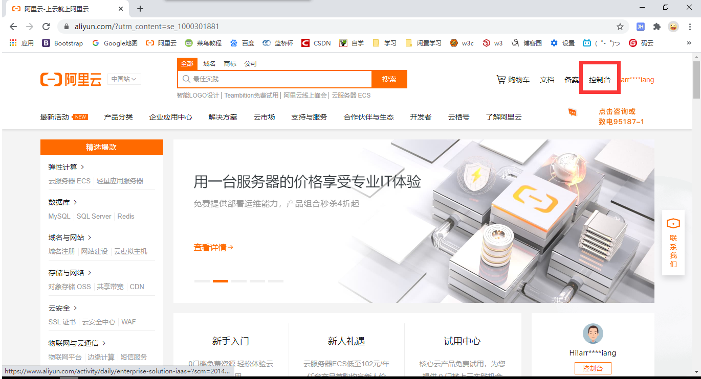

2. 点击左边菜单栏，进入产品与服务，搜索短信服务

     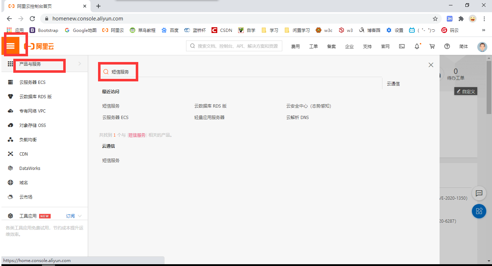

3. 进入新手指导

     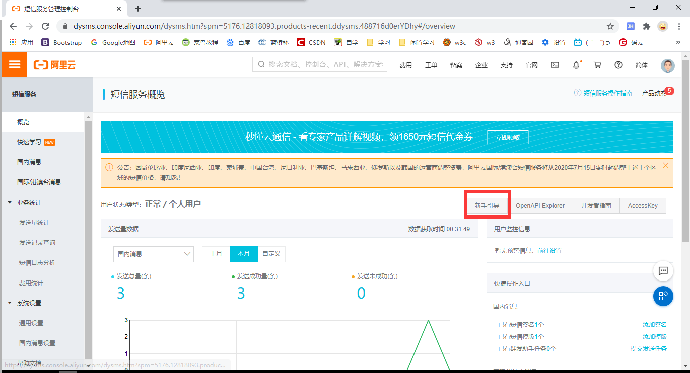

4. 申请国内短信签名

     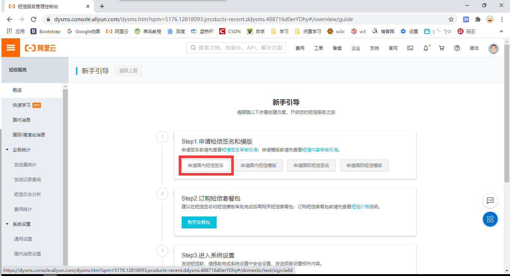

5. 填写相关内容

     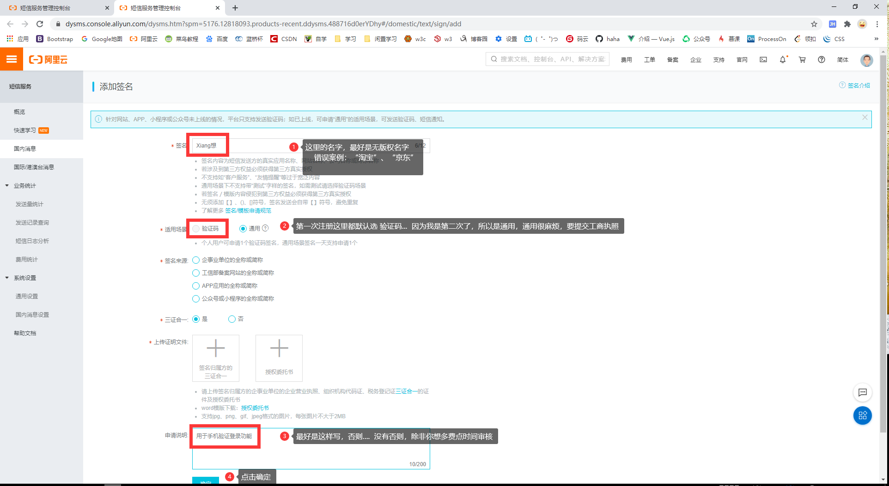

6. 返回上一步，进入  ==申请国内短信模板==

     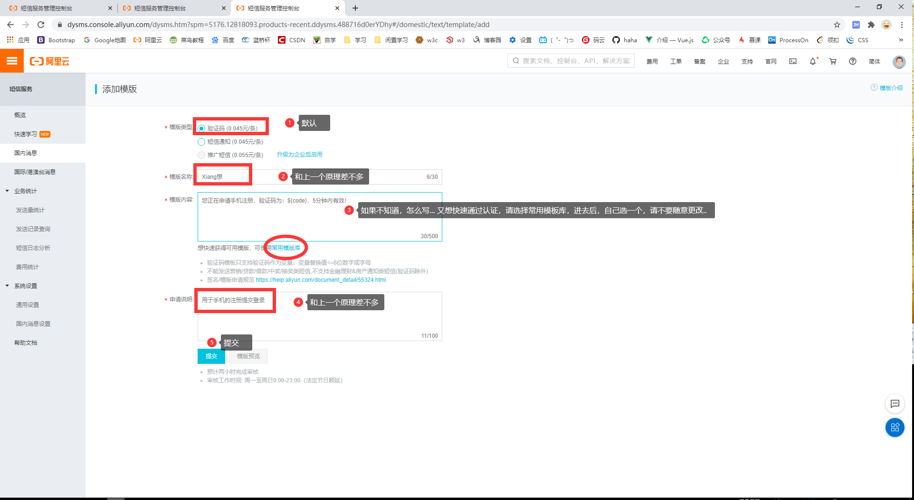

7. 退出来，进入安全设置

     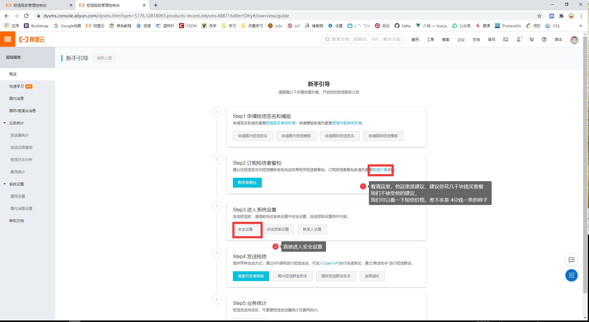

8. 设置每日条数，以防万一

     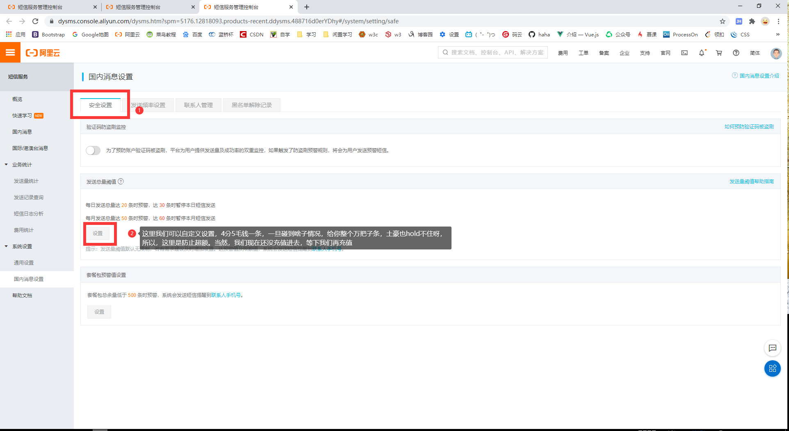

## 2、充值 1 元

1. 返回主页，充值1元，这里我就不教了吧，再不会，我建议你不要从事软件了

     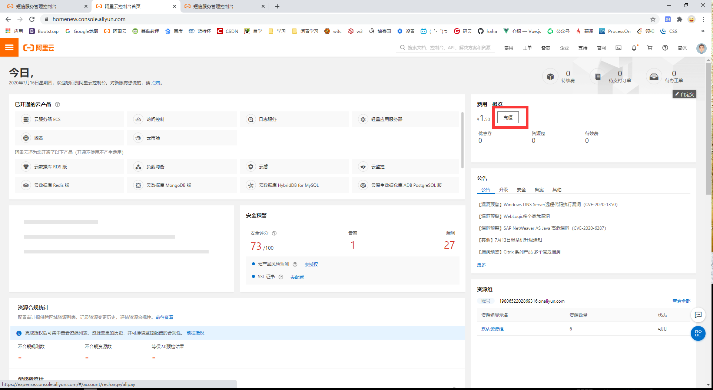

## 3、测试

1. 进入短信控制台的新手指导，从这个框框进去

     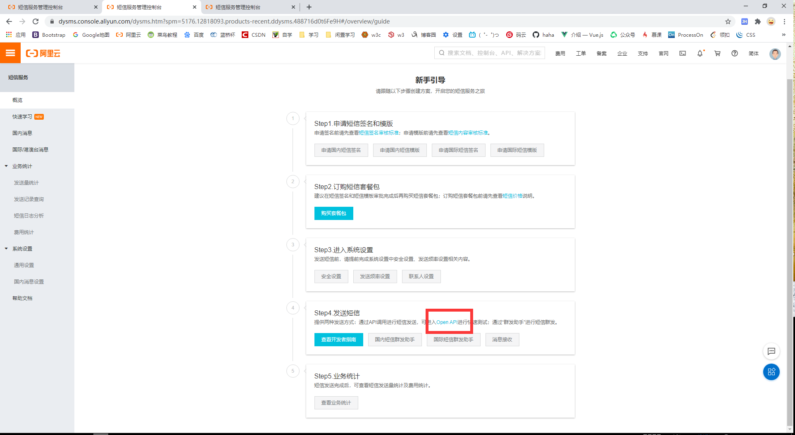

2. 直接下一步

     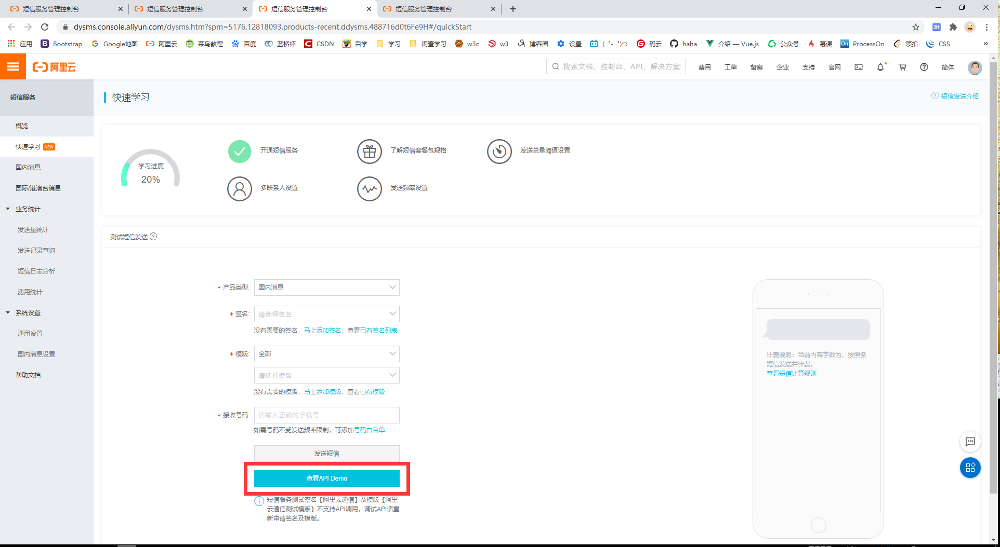

3. 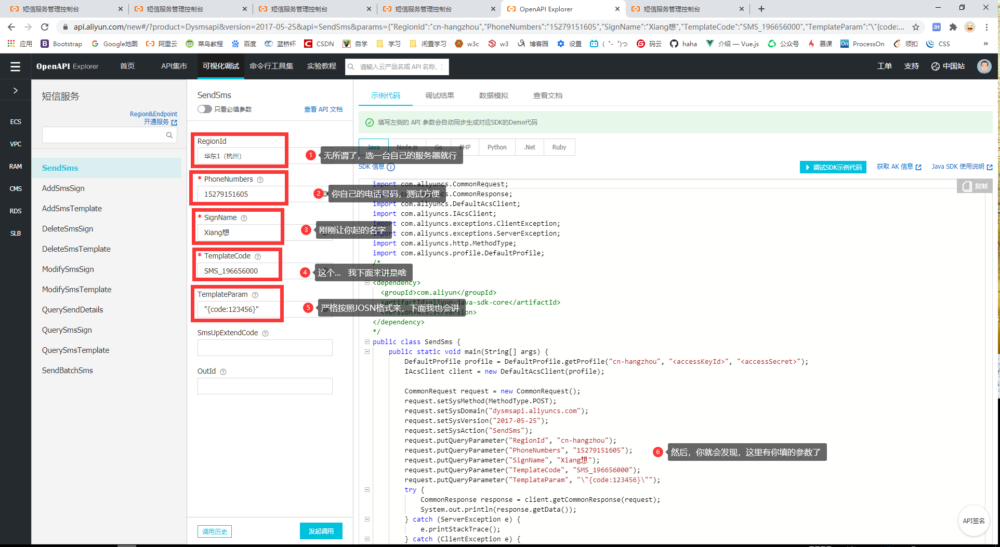

## 4、测试讲解

### 1、SignName

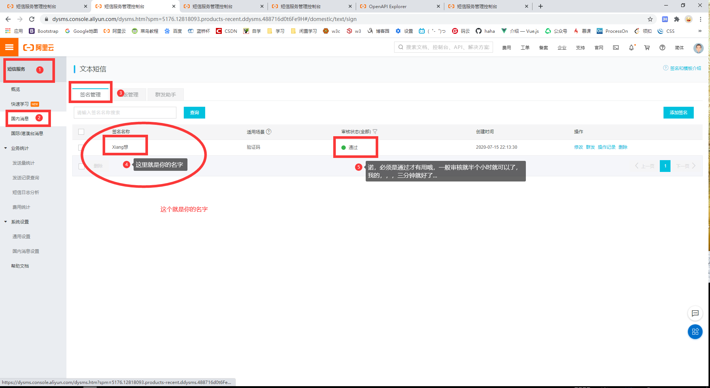

### 2、TemplateCode

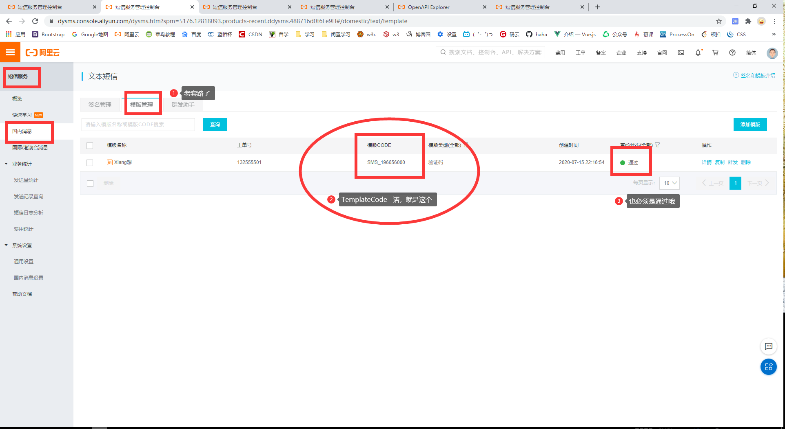

### 3、TemplateParam

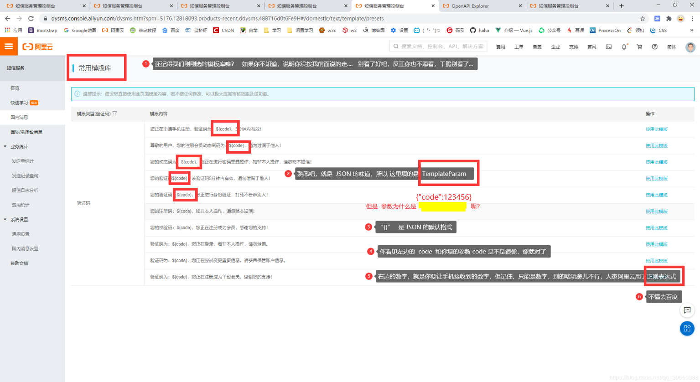

### 4、执行！！！

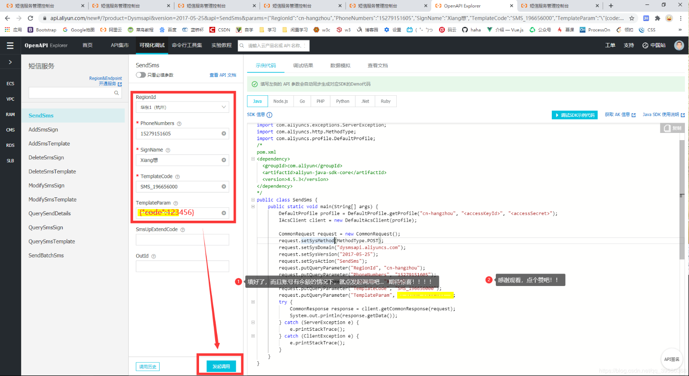

### 5、结果:haircut:

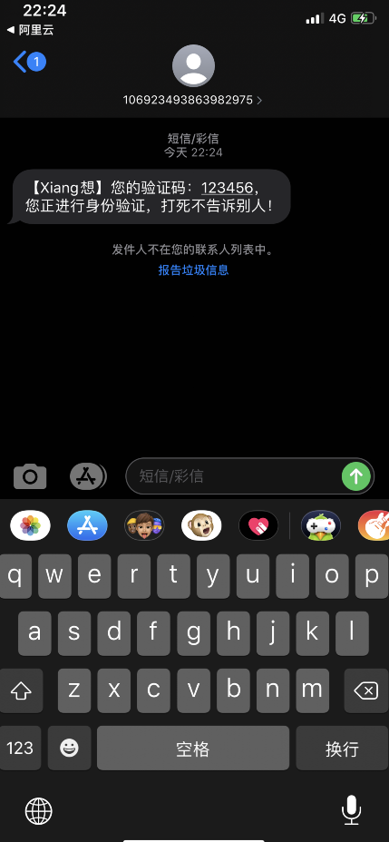

> 如果想看如何在 本地的 IDEA 中获取验证码的话！可以催更哟！！ ！（点赞—.—！）