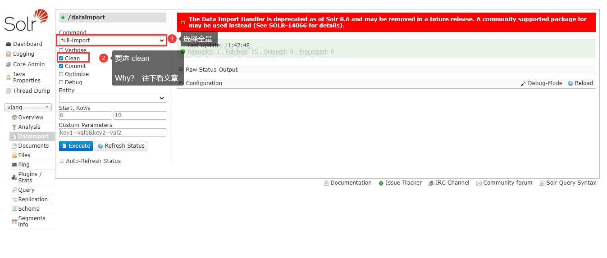
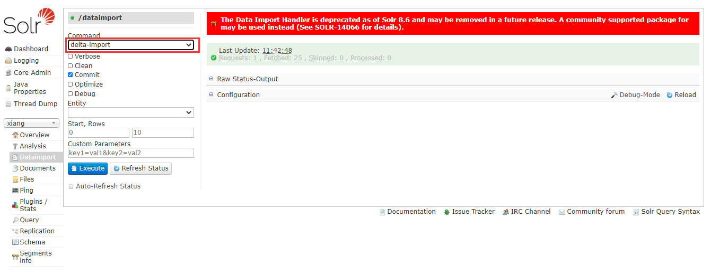

## 1、全量更新

> 数据库   -->     solr库       ==      更新
>
> 把数据库里的数据，放入更新到 solr 中，我认为这个过程就是更新  全部放进去= ==全量更新==    更新部分数据 = ==增量更新==

全量更新可以看我的另一篇博客 ，重点在第六章、第六章、第六章（重要的说三遍）

[https://blog.csdn.net/qq_39550368/article/details/108256510](https://blog.csdn.net/qq_39550368/article/details/108256510)



在最后这一步，我们要选择  全量更新，然后下面要选择 clean

+ clean ： 删除原先的数据，

> 我们可以这么理解，把原来里面的东西，全部删掉，把自己的东西全塞进去，好了，你就我的全部，这就是全量更新。

## 2、增量更新

### 2.1.参数解释

```
  <!--  transformer 格式转化：HTMLStripTransformer 索引中忽略HTML标签   --->
  <!--  query:查询数据库表符合记录数据   --->
  <!--  deltaQuery:增量索引查询主键ID    --->    注意这个只能返回ID字段
  <!--  deltaImportQuery:增量索引查询导入数据  --->
  <!--  deletedPkQuery:增量索引删除主键ID查询  ---> 注意这个只能返回ID字段
```

### 2.2.注意事项

1.如果只涉及添加，与修改业务，那么数据库里只需额外有一个timpstamp字段就可以了，默认值为当前系统时间，CURRENT_TIMESTAMP
2.如果还涉及删除业务，那么数据里就需额外再多添加一个字段isdelete，int类型的用0,1来标识，此条记录是否被删除

### 2.3.dataimporter.properties

这个配置文件很重要，它是用来记录当前时间与上一次修改时间的，通过它能够找出，那些，新添加的，修改的，或删除的记录标识，此条记录是否被删除\*的记录

### 2.4、更新 solr-data-config.xml

```
<?xml version="1.0" encoding="UTF-8" ?>
<dataConfig> 
    <!--数据源-->
    <dataSource type="JdbcDataSource"
                driver="com.mysql.jdbc.Driver"
                url="jdbc:mysql:///xiang"
                user="root"
                password="root"/>
    <document> 

        <entity name="solrTest" 
        query="SELECT fid,ftime,fcontent,ftitle,flastupdatetime FROM solrTest where flag = '0'"
        deltaImportQuery = "SELECT fid,ftime,fcontent,ftitle,flastupdatetime FROM solrTest where fid = '${dataimporter.delta.fid}'"
        deltaQuery = "SELECT fid FROM solrTest where flastupdatetime > '${dataimporter.last_index_time}' and flag = '0'"
        deletedPkQuery = "SELECT fid FROM solrTest where flag = '1'"
        >
            <!--查询的数据和数据库索引意义对应column 是查询的字段name 是solr索引对应的字段-->
            <field column="fid" name="fid"/>
            <field column="ftitle" name="ftitle"/>
            <field column="fcontent" name="fcontent"/>
            <field column="flastupdatetime" name="flastupdatetime"/>
            <field column="ftime" name="ftime"/>
        </entity>
        
    </document> 
</dataConfig>
```

==要记得在 managed-schema 中添加字段==

重启服务器后，在网页端：



1. Command 选  delta-Import ,增量更新
2. 这时，可不能再选 `clean` 哟，如果clean了的话......  那就变成了？？（你猜！）