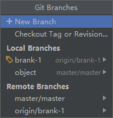

## 1、Git

​	Git 是一个开源的分布式版本控制系统，可以有效、高速的处理很小到非常大的项目管理，Git 是 Linux Torvalds 为了帮助管理 Linux 内核而开发的一个开放源码的版本控制软件

### 1.1、Git 特点

​	分布式相比于集中式的最大区别在于开发者可以提交到本地，每个开发者通过克隆（git clone）在本地机器上拷贝一个完整的 Git 仓库

从一般开发者的角度来看，Git 有以下功能：从服务器上克隆的完整的 Git仓库（包括代码和版本信息）到单价上，在自己的机器上根据不同的开发目的，创建分支，修改代码，在单机上创建的分支上提交代码、在单机上合并分支、把服务器上最新版的代码 fetch 下来，然后跟自己的主分支合并等

+  优点：

​	适合分布式开发，强调个体。公共服务器压力和数据都不会太大。速度快、灵活。任意两个开发者之间可以很容易的解决冲突。离线工作。

+  缺点：

   资料少（起码中文资料很少）。学习周期相对而言比较长，不符合常规思维。代码保密性差，一旦开发者把整个库克隆下来就可以完全公开所有代码和版本信息。

因其资料的公开性，导致大型商业工程几乎不会使用 Git 来托管工程版本信息（除非搭建企业私服）

### 1.2、GItHub 简介

平台地址：https://github.com

​	GitHub 是一个面向开源及私有软件项目的托管凭条，因为只支持 git，作为唯一版本库格式进行托管，顾名 github ....

注册、使用、链接IDEA、上传、下载、提交......  自己学去吧

### 1.3、分支管理

​	分支管理，是 Git 开发中一个非常有效的团队开发策略，多个程序员并行开发，每个程序员可以定义各自的分支，在自己的分支上开发工程。再开发结束测试完毕后，再合并到主干工程中，一次性提交到远程。由其他程序员使用。

### 1.4、创建分支、删除分支

## 2、Ant

1. Ant 和 Maven 都是项目构建工具，
     1. 在项目的运行编辑打包等过程都需要依赖于 ant 构建工具