### 1、搭建Maven

> 进入 Nexus 管理页面，https://www.xiang.press:8081

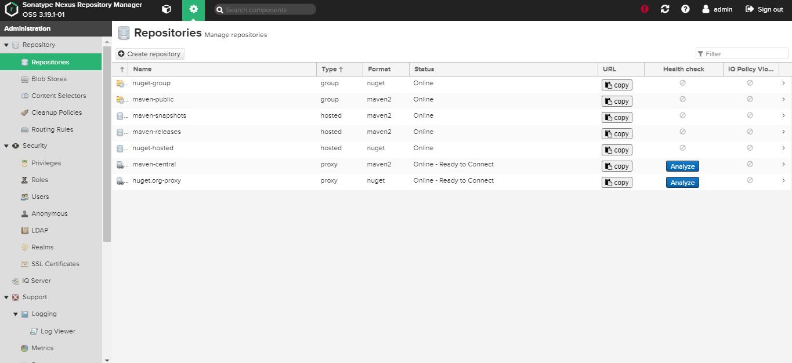

上面提到的一点，不管nexus版本是怎么样的，至少，repository的类型是一样的。

先看一下大概的目录结构：

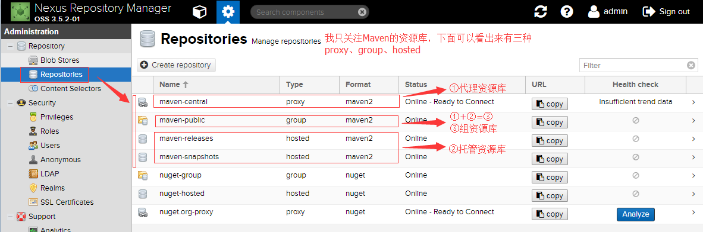

根据多方的文档和别人的博客，再综合官网的解释，我就这样理解得出：

资源库也就是这么三种，如上图中 【代理资源库】【托管资源库】【组资源库】，其实名字就是我自己瞎起的。

具体解释一下：

【代理资源库】：就是配置了外网的maven远程仓库地址的资源库，本地找不到，就会通过代理资源库中的地址，找到远程仓库，从远程仓库中下载所需要的jar。

【托管资源库】：就是放在本地的资源库，零零散散的jar，从远程仓库中下不到，只能自己在网上找，找到jar下载下来，放在托管资源库中，交给nexus统一管理。不然哪天想去用连接数据库的jar包，还得自己翻磁盘，多麻烦。

【组资源库】　：从上面①+②看出来，其实组资源库中并没有jar包，而是把代理资源库和托管资源库统一配置到组资源库中，然后组资源库作为一个唯一的public提供给所有人使用。就像工人1+工人2把自己的账单统一给包工头，让包工头去跟老板结账是一个道理。

 

好，明确了这一点，开始往下看吧。

\------------------------------------------------------------------------------------------------------------------------------------------------------------------------------------------------------

 

## 如果你想直入主题，往下看。

### ①在创建 repository之前，还是需要先设定一个指定的文件存储目录，便于统一管理。

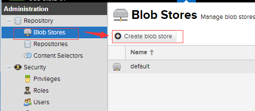

 由下面新建的完成的，可以看出，

 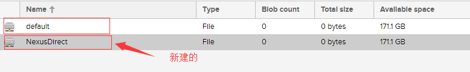

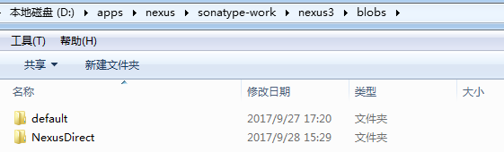

 

### ②第二步，创建Proxy Repository　　代理资源库

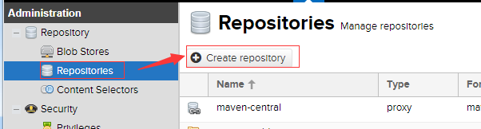

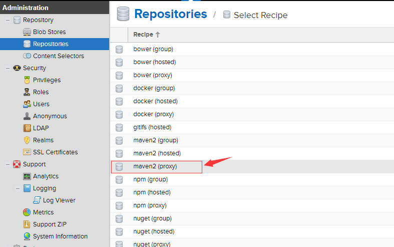

创建页面出来之后，页面上有三个input框是必填的：

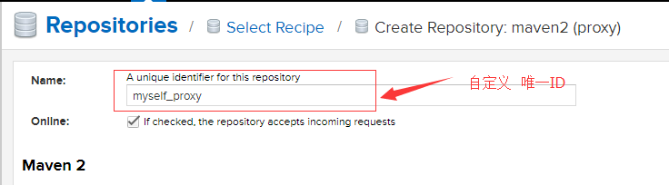

 远程Maven地址：https://repo1.maven.org/maven2/

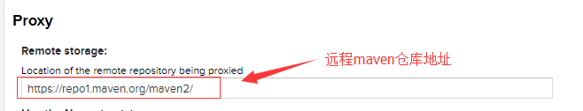

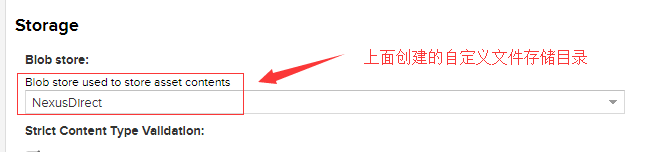

其他的不用更改了。保存就好了。

 

**【注意】：我想建好几个proxy repository，以便于我可以加入更多的远程maven仓库到我的group 资源库中**

唯一一点，就是你看你加入的proxy资源库哪个使用的是国内的maven仓库地址，哪个是国外的。

当然国内的要放在国外的之前。

这样的加入group资源库的顺序就是 hosted资源库>国内proxy资源库>国外proxy资源库

下面给出一些maven远程仓库的地址：

jboss的maven中央仓库地址：http://repository.jboss.com/maven2/

阿里云的maven中央仓库地址：http://maven.aliyun.com/nexus/content/groups/public/

apache的maven中央仓库地址：http://repo.maven.apache.org/maven2/

 

 

 

### ③第三步，创建hosted repository 托管资源库

Hosted有三种方式，Releases、SNAPSHOT、Mixed
Releases: 一般是已经发布的Jar包
Snapshot: 未发布的版本
Mixed：混合的

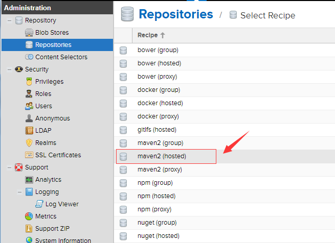

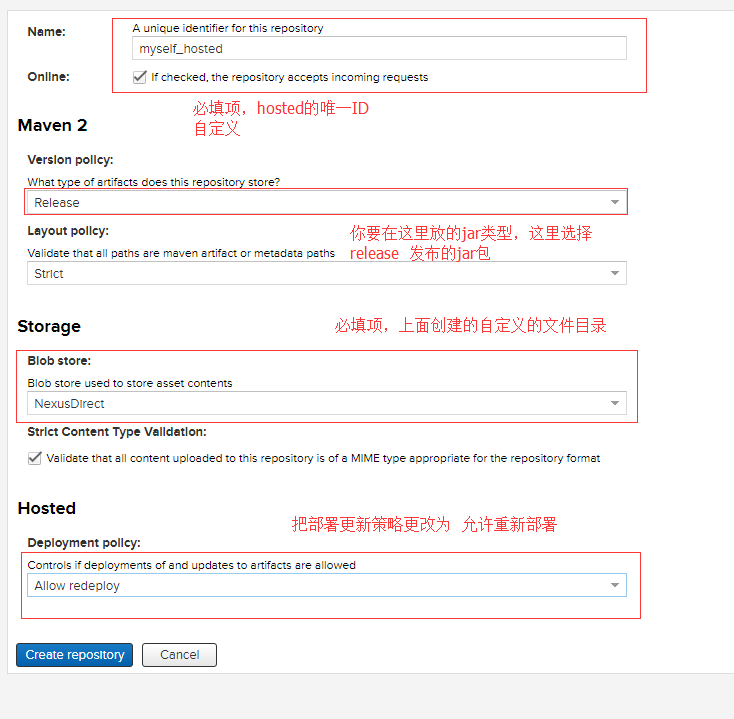

==Allow redeploy 改成运行部署之后，就可以对同一项目不同版本实现重新部署==

 

### ④第四步，创建group repository 组资源库

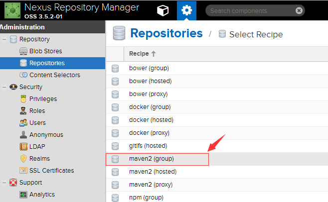

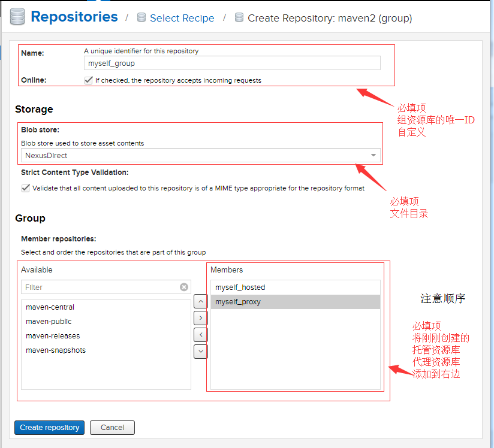

**为什么要注意顺序？？**

官方文档中建议：

 It is recommended practice to place hosted repositories higher in the list than proxy repositories. For proxy repositories, the repository manager needs to check the remote repository which will incur more overhead than a hosted repository lookup.

希望将hosted repositories【托管资源库】的顺序放在proxy repositories【代理资源库】之前，因为一个group【组资源库】中可以涵括这些托管资源库和代理资源库。而一整个的group是作为一个public，一个接口给别人使用的。所以当查找架包的时候，如果代理资源库在前面，那就是先从远程去查找jar，而不是先从托管资源库（本地仓库）去查找是否有jar。这样访问外网的消耗比起来在本地查找，当然是将托管资源库放在代理资源库之前的优先位置了。

 

 

### ⑤第五步，比较nexus中默认提供的

好吧，从命名上也可以看出来，系统自带的命名可以看出来这个资源库是什么类型中的什么类型的。【没有创建未发布的资源库，那以后咱们自己想去创建的，自行创建，再加入到group中就行了】

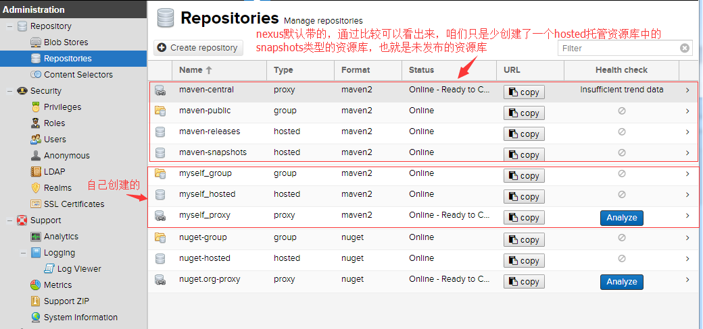

 

如果你想，可以自己去创建一个新的admin，新的用户名，新的密码，新的权限。供下面使用。