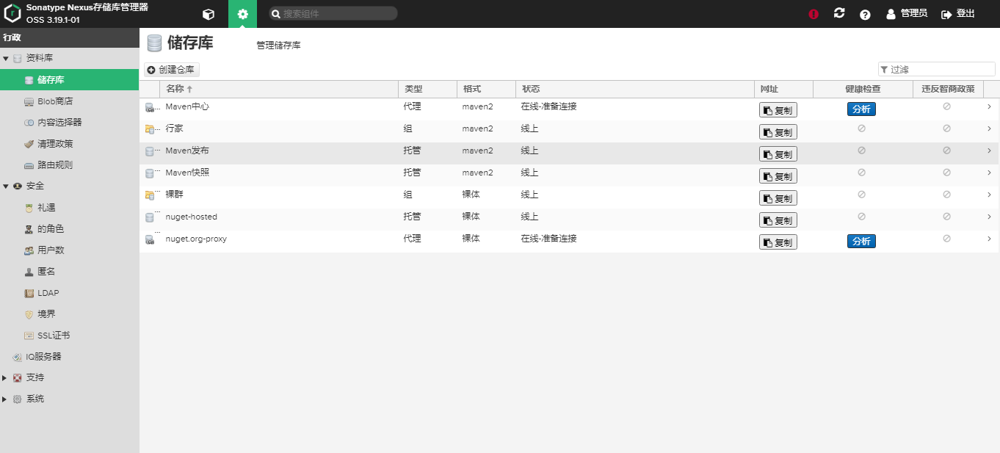

## 1、私服

### 1.1、什么是私服

​		私服是一种特殊的远程仓库，它是架设在局域网的仓库服务，私服代理广域网上的远程仓库，供局域网使用，在企业开发中，私服的建设是必要的

+ 节省资金、外网带宽
     + 利用私服代理外部仓库后，对外的重复构件下载便得以简化，降低外网宽带压力  （银行项目，不允许连接外网）
+ 加速 Maven 构建
     + 不停的连接请求外部仓库是相当损耗时长的，但是 maven 的一些内部机制（加快更新检查）要求 Maven 在执行构建的时候不停地检查远程仓库数据，因此，当项目配置了很多外部远程仓库的时候，构建速度会降低。使用私服解决这问题，因为 Maven 只需要检查局域网私服的数据，构建速度便有明显的提高
+ 提高稳定性，增强控制
     + 对于远程仓库来说，当外网不可用时，Maven 构建有可能因为依赖没有下载而不可行，搭建并应用私服后，即使没有外网，如果该构件之前被其它人下载过就会存在私服上，此时再次依赖构建就可以不用连接外网直接可以从私服上下载到。同时私服软件（nexus）还提供了额外的管理功能。
+ 降低中央仓库的负荷
     + 中央仓库是有限的，如果所有 Maven 工程开发工程中，都通过中央仓库实现构件的 依赖 和管理，那么中央仓库的负载过高，也会严重影响到工程构件的效率，如果使用私服，可以分散中央仓库的负荷，只有在私服中没有需要依赖的构件时才会失去连接中央仓库

### 1.2、nexus 私服搭建

#### 1.2.1、搭建环境

CentOS 7.5、JDK8、Sonatyoe Nexus、Maven

#### 1.2.2、搭建步骤

+ JDK 资源包下载

     + [http://www.oracle.com/technetwork/java/javase/downlods/index.html](http://www.oracle.com/technetwork/java/javase/downlods/index.html)

+ JDK 资源包解压

     + 在 Linux 中安装应用，一般都是 /opt  或者  /usr/local 目录，

     + 宝塔面板默认是安装在  /usr/java，我这里是 1.8.0_121 版本的

     + 解压的话，

          ```
          tar -zxvf jdk-xxx-linux-x64.tar.gz  -C /usr/local
          ```

     + 重命名 JDK 目录

          ```
          mv /usr/local/jdk-xxx-linux-x64  /usr/local/java
          ```

+ 环境变量配置

     + 修改 /etc/profile 配置文件，增加环境变量配置

          ```
          export JAVA_HOME=/usr/local/java    java的路径
          export CLASSPATH=$JAVA_HOME/lib/dt.jar:$JAVA_HOME/lib/tools.jar:.
          export PATH=$JAVA_HOME/bin:$PATH
          ```

     + 配置环境变量后， 执行  ==source /etc/profile==  刷新配置文件 ，不想执行这个的话，重启服务器也可以生效

### 1.3、安装私服

#### 1.3.1、Nexus 资源包下载

Nexus 官方下载地址为：

[https://www.sonatype.com/nexus-reposity-oss](https://www.sonatype.com/nexus-reposity-oss)

我这里是  nexus-3.19.1-01

解压到  usr/local/nexus 下去，会有两个文件夹   nexus-3.19.1-01  sonatype-work

> Nexus 是 java  编写的

服务器开放 **==8081==** 端口   nexus.properties   文件里有  application-port=8081  可以修改端口

#### 1.3.2、修改 Nexus 运行用户

Nexus 私服在启动后，私服应用需要访问 Linux 的文件系统，所以需要有足够的权限，Nexus 的启动脚本文化中，可以指定私服应用的访问用户，此信息在 nexus-XXX/bin/nexus 脚本定义文件中，需要修改的文件如下：

```
484|  run_as_user=root
```

#### 1.3.3、启动 Nexus

> /usr/local/nexus/nexus-3.19.1-01/bin   路径下

```
[root@Xiang bin]# ./nexus start
WARNING: ************************************************************
WARNING: Detected execution as "root" user.  This is NOT recommended!
WARNING: ************************************************************
Starting nexus
```

说明启动成功了

```
[root@Xiang bin]# ./nexus status
WARNING: ************************************************************
WARNING: Detected execution as "root" user.  This is NOT recommended!
WARNING: ************************************************************
nexus is running.
```

检测是否正在运行， 说明运行成功

**==./nexus stop==**  即关闭命令

开启之后，

==先关掉本地电脑的防火墙，或者开启8081端口的入口==

再访问  [http://xiang.press:8081/](http://xiang.press:8081/)  这个链接


#### 2、私服配置

#### 2.1、登录

Nexus 默认提供管理员，用户名为 amdin，密码在 sonatype-work/nexus3 下，有个 adminpassword.key  文件夹，cat 查看，登录进去就ok

我的密码为  ==admin==



可以通过 用户，去修改用户信息

+ group  组仓库
+ hosted 数组仓库
+ proxy 代理仓库
+ virtual 虚拟仓库

最常用仓库为  hosted 和 proxy

#### 2.1.1、group

仓库组：Nexus 通过仓库组来统一管理多个仓库，这样访问仓库组就相当于访问仓库组管理多个仓库

#### 2.1.2、hosted

宿主仓库：主要用于发布内部项目构建或第三方的项目构件（如购买商业的构建）以及无法从公共仓库获取的构建（如 oracle 和 JDBC 驱动）

##### 2.1.2.1、releases

发布内部的 releases 模块的仓库，所有非快照版本工程都发布到此仓库中

##### 2.1.2.2、snapshots

发布内部的快照模板仓库，所有工程版本以 SNAPSHOT 结尾的都发布到此仓库中，以 snapshots 结尾的都是快照

##### 2.1.2.3、3rd party

第三方依赖的仓库，这个数据通常是由内部人员自行下载之后发布上去

#### 2.1.3、Proxy

代理仓库：代理公共的远程仓库


> 在访问 Nexus 后，登录账号，可以在  lsof -:8081  查看到连接的  IP 地址


### 1.4、配置  Maven

 在搭建好私服之后，在本地构建 Maven 的 setting.xml 上配置	

```xml
<profiles>
		<profile>
			<id>sxt</id>
			<activation>
				<activeByDefault>false</activeByDefault>
				<jdk>1.8</jdk>
			</activation>
            <repositories>
                <!-- 私有本地 -->
                <repository>
                    <id>myself</id>
                    <url>http://47.107.189.111:8081/repository/xiang_group/</url>
                    <releases> <!-- 是否发布库 -->
                        <enabled>true</enabled>
                    </releases>
                    <snapshots> <!-- 是快照库 -->
                        <enabled>true</enabled>
                    </snapshots>
                </repository>
            </repositories>  
			<pluginRepositories>
                <!-- 插件库地址 -->
                <pluginRepository>
                    <id>myself</id>
                    <name>local private nexus</name>
                    <url>http://47.107.189.111:8081/repository/xiang_group/</url>
                    <releases>
                        <enabled>true</enabled>
                    </releases>
                    <snapshots>
                        <enabled>true</enabled>
                    </snapshots>
                </pluginRepository>
            </pluginRepositories>            
		</profile>
</profiles>
```

私服配置好，不是立即生效的，我们可以继续在下面配置一个参数

```xml
<!-- 激活profile -->
<activeProfiles>
    <!-- 这里的名字和上面相同 -->
	<activeProfile>myself</activeProfile>
</activeProfiles>
```

### 1.4、创建项目

创建maven 项目，创建 修改 pom 文件

在我们的 Maven Setting.xml 文件中，上部分有个这个配置

```xml
<servers>
  	<id>nexus-releases</id>
    <username>deployment</username>
    <password>deployment123</password>
</servers>
```
在我们写 pom 的时候，一定要指定

```xml
<distributionManagement>
	<repository>
    	<id>xiang_hosted</id>
        <name>Nexus Release Repository</name>
        <url>http://47.107.189.111:8081/repository/xiang_hosted/</url>
    </repository>
</distributionManagement>
```

这里的意思是，如果要访问远程仓库需要 ==密码==  的时候，我们的用户名和密码分别是什么