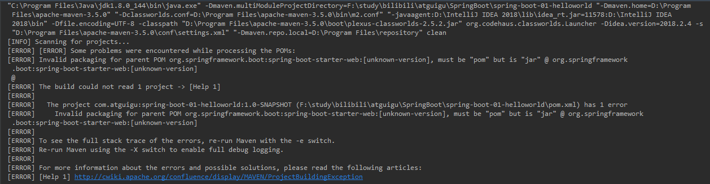
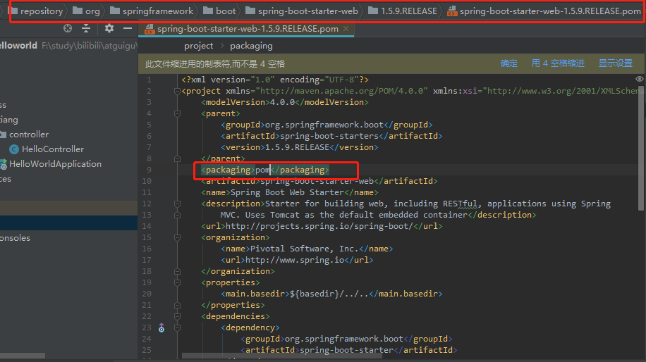

### [ERROR] [ERROR] Some problems were encountered while processing the POMs:

SpringBoot 项目可以正常启动运行

当想要部署时，执行 Maven 中的 Install 命令对SpringBoot 项目打包时候，异常

当我们去点 clean 和其他命令时，均发送这样的错误



==解决办法==

1.更改Maven的 settings文件

2.进入到 Parents 内的父工程pom项目中

这种方法直接更改了 仓库中的 pom 项目，会导致其他工程引用时，出现问题。不推荐使用




3.第三种方法，

此方法是根据  初始化 springboot 项目而来的

```xml
<dependencyManagement>
        <dependencies>
            <dependency>
                <groupId>org.springframework.boot</groupId>
                <artifactId>spring-boot-dependencies</artifactId>
                <version>${spring-boot.version}</version>
                <type>pom</type>
                <scope>import</scope>
            </dependency>
        </dependencies>
    </dependencyManagement>
```

没有经过测试

==期待测试结果==

