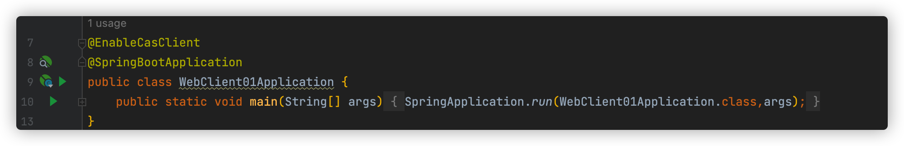
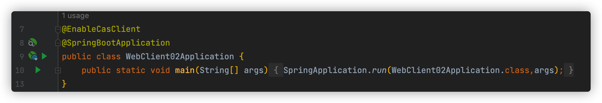
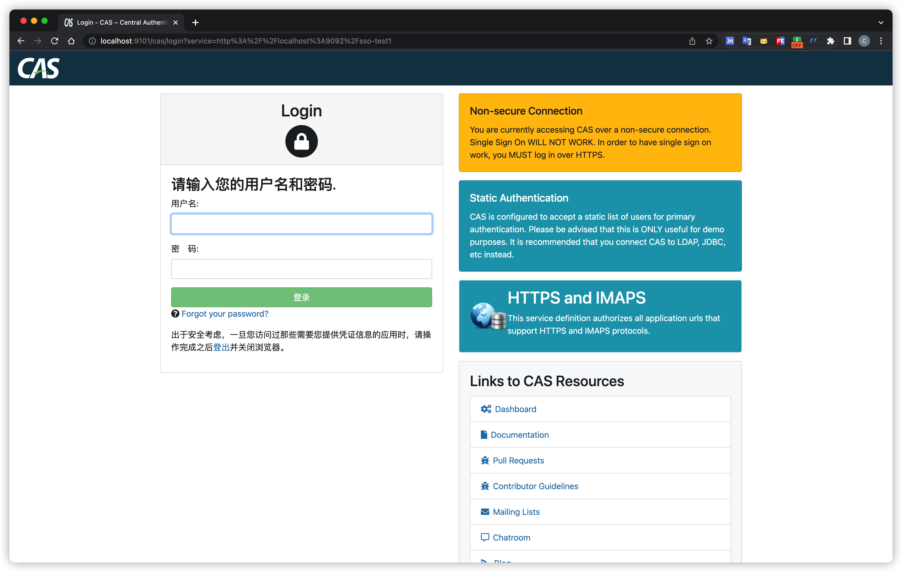
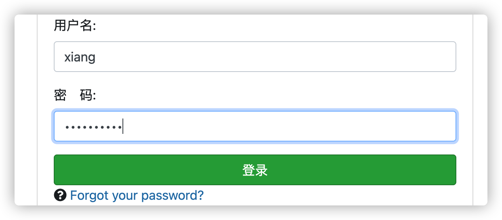
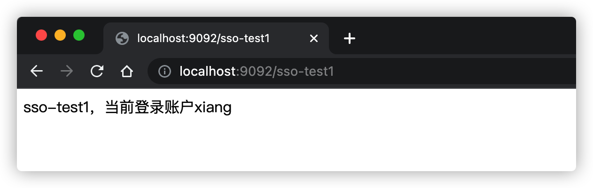
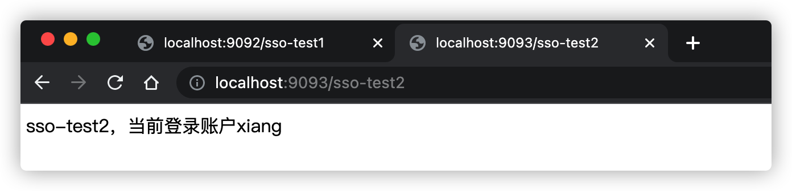
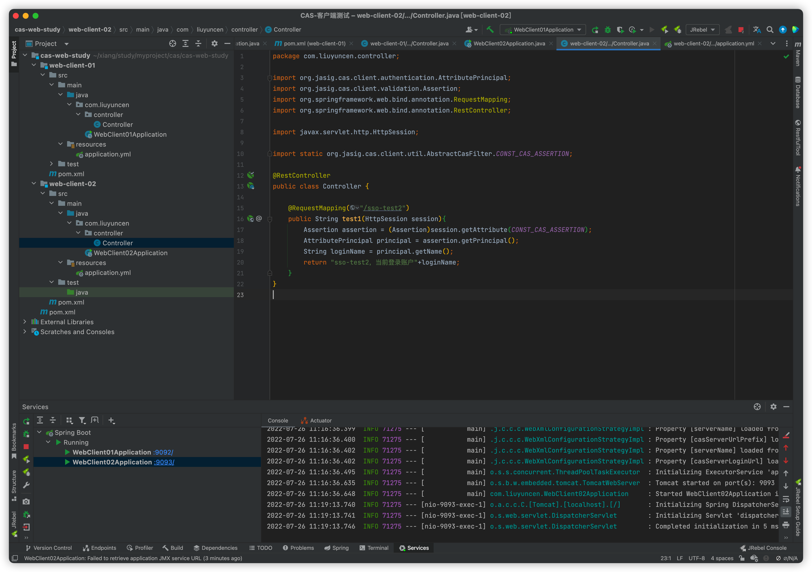

[toc]

# 基于CAS的SSO单点客户端配置

创建完了服务端，接着创建客户端，对服务端进行测试

## 1、初始化SpringBoot 项目

初始化的时候，勾选`spring web`服务，也可以直接搭建 `maven` 服务

```xml
        <dependency>
            <groupId>net.unicon.cas</groupId>
            <artifactId>cas-client-autoconfig-support</artifactId>
            <version>2.3.0-GA</version>
        </dependency>

        <dependency>
            <groupId>org.springframework.boot</groupId>
            <artifactId>spring-boot-starter-web</artifactId>
        </dependency>
```

maven 基础不够扎实的朋友们，还是建议使用 IDEA 上自带的 spring 初始化工具，创建两个项目，分别是 `web-client-01` 和 `web-client-02` 

## 2、编写代码

在 SpringBoot 启动类上添加 `@EnableCasClient` 开启 CAS





分别是 `webClient01Application`、`webClient02Application` 

为了节省篇幅，后面的配置我只列出一份例子，大家仔细阅读文字

### 1、添加配置信息

```yml
server:
  port: 9093
cas:
  server-login-url: http://localhost:9101/cas/login # CAS 服务登录地址
  server-url-prefix: http://localhost:9101/cas      # CAS 服务
  client-host-url: http://localhost:9093						# 本地服务
  validation-type: cas3															# 加密类型
```

两个服务分别使用 `9092`、`9093` 端口，CAS 服务登录地址、CAS服务和加密类型都是一致的，也就是之前我们配置的那个端口地址，跳转地址：，只有本地服务端口要灵活配置

### 2、添加Controller

两个服务均添加此 controller

```java
import org.jasig.cas.client.authentication.AttributePrincipal;
import org.jasig.cas.client.validation.Assertion;
import org.springframework.web.bind.annotation.RequestMapping;
import org.springframework.web.bind.annotation.RestController;

import javax.servlet.http.HttpSession;

import static org.jasig.cas.client.util.AbstractCasFilter.CONST_CAS_ASSERTION;

@RestController
public class Controller {

    @RequestMapping("/sso-test1")
    public String test1(HttpSession session){
        Assertion assertion = (Assertion)session.getAttribute(CONST_CAS_ASSERTION);
        AttributePrincipal principal = assertion.getPrincipal();
        String loginName = principal.getName();
        return "sso-test1，当前登录账户"+loginName;
    }
}
```

到这里就配置完了

## 3、启动客户端服务

访问地址：

```
http://localhost:9092/sso-test1
```

会发现页面直接跳转到了登录页面



我们填入配置的服务端用户名和密码



点击登录后



我们再测试单点效果，访问

```
http://localhost:9093/sso-test2
```



不出所料，单点登录模拟成功！最后展示一下 客户端的代码结构



客户端代码太简单了，我就不上传 GitHub 了，有想要的小伙伴可以联系本Up🐷。最后祝愿大家找到心仪的工作