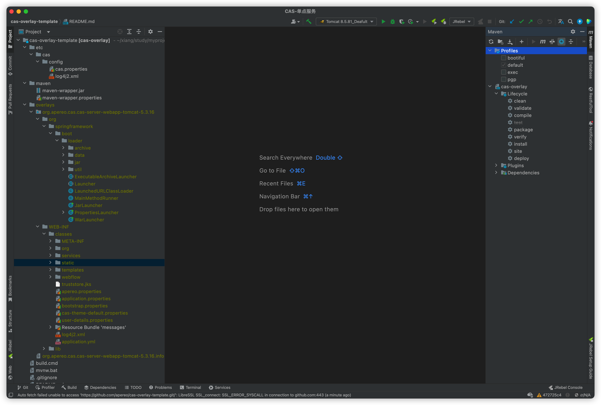
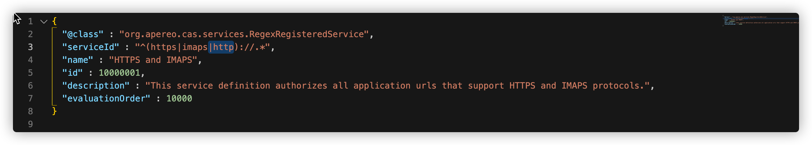
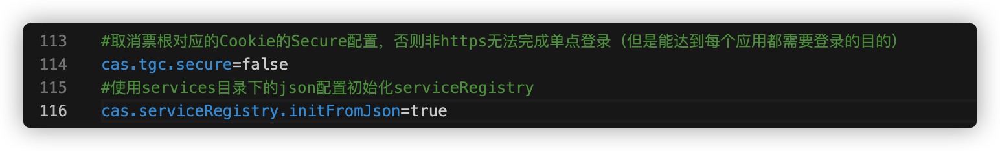
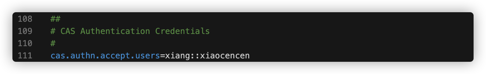
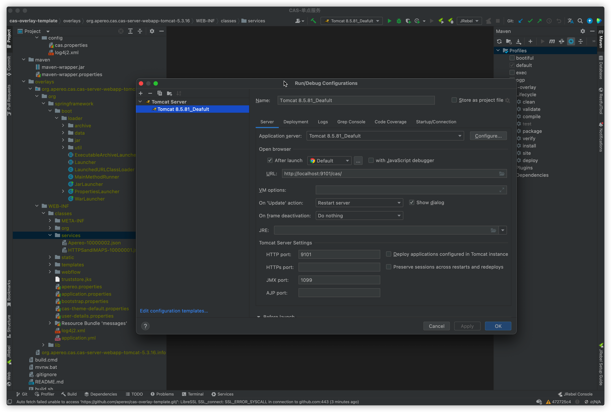
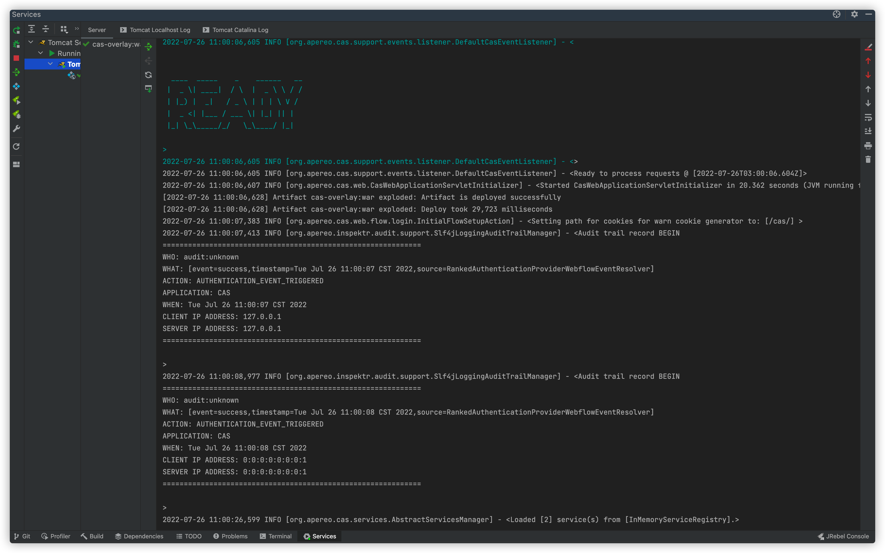
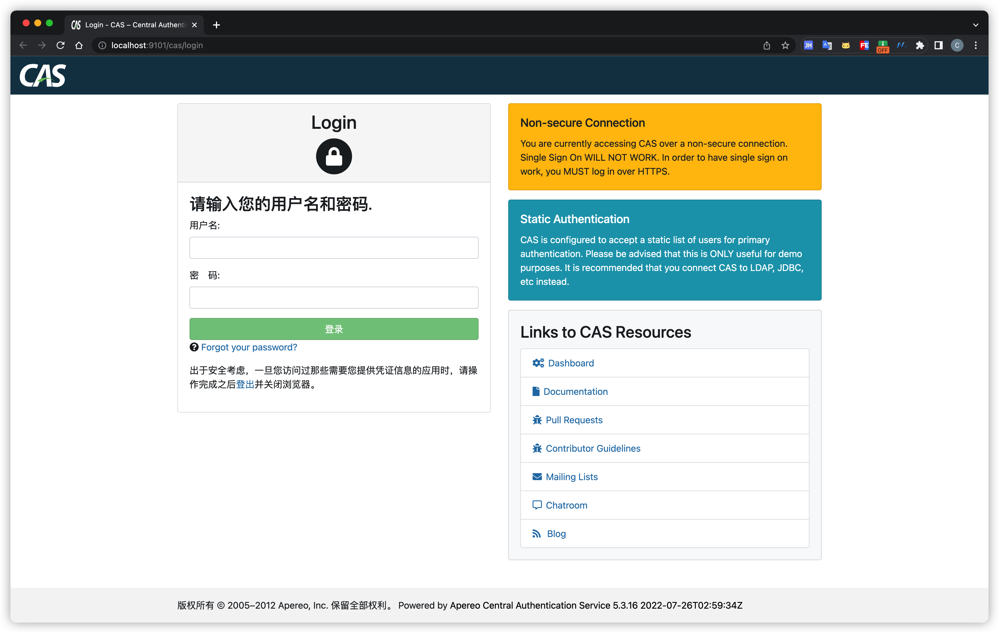

> 2022-06-23

[toc]

# 基于CAS的SSO单点服务端配置

> 前言：在此之前，我们已经搭建了 CAS 服务，并可以成功访问到

基于上一期而言，我们已经可以成功的利用 `mvn package` 打出的 `cas.war` 启动页面了，这一期，我们模拟两个登录的客户端进行单点登录

## CAS服务端配置

通过上一期下拉的 `cas-overlay-template` 项目，通过 IDEA 打开可以看到如下结构

需要注意的是，启动前需要为其配置 Tomcat，IDEA 不会配Tomcat的朋友可以向作者催更！嘻嘻

### 1、去除https认证

`CAS` 默认使用 HTTPS 协议，如果对安全要求不高，可以使用 HTTP 协议，这里通过配置修改为 HTTP 协议

修改 `/WEB-INF/classes/services`  中添加标记处 `|http`

添加 `http` 协议支持，另外还需要编辑 `application.properties` 在最下面添加如下配置

### 2、配置登录账号

可以自定义登录账号和密码

这样后续登录就可以用  `xiang` `xiaocencen` 进行登录了

### 3、启动 Tomcat

我这里是 `9101` 端口，当出现如下日志输出时候，就OK了

访问 `localhost:9101/cas`

这里注意的是，我们可以直接对这个项目进改造，覆盖其登录页面，也可以从数据库中获取登录用户名密码。

最后通过 `mvn package` 部署到服务器中，这样一个基于 CAS 的 SSO 单点服务就配置好了。