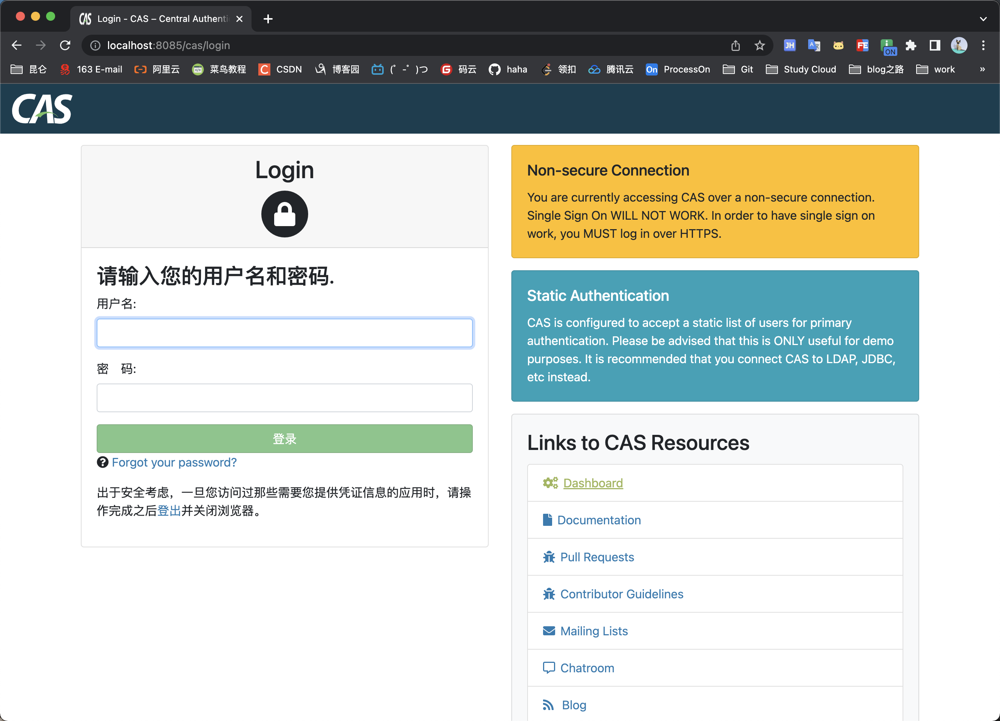
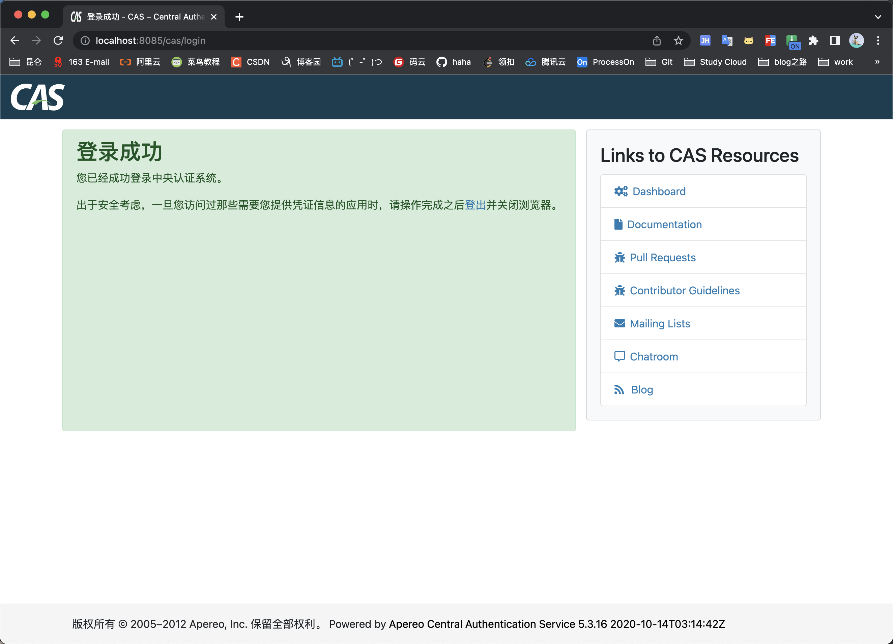
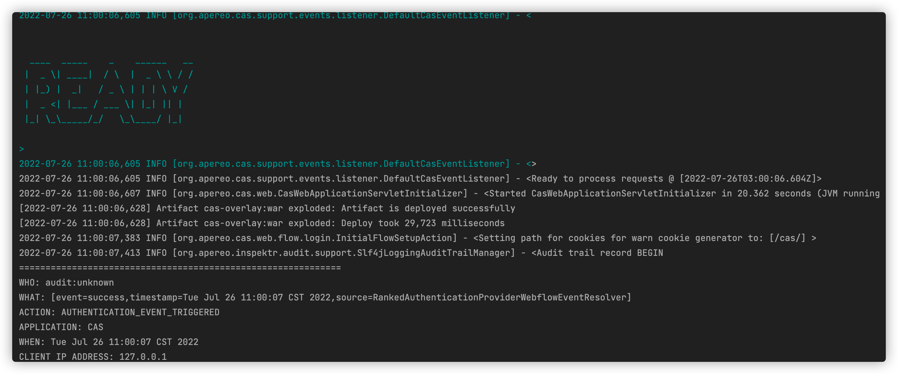

[toc]

# 基于CAS的SSO单点登录

## 环境搭建

官网下载页面：https://apereo.github.io/cas/6.5.x/index.html

下拉源码

```sh
git clone https://github.com/apereo/cas-overlay-template.git
```

`git branch -a` 查看版本，切换到 `remotes/origin/5.3` 版本，master 是 grade 版，不能使用mvn工具

```sh
git checkout remotes/origin/5.3
mvn clean package
... SUUCESS
```

在 `target/` 目录下就生成了  `cas.war` 文件

### 启动环境

准备一个全新的 `Tomcat` 我这里设置成 `8085` 端口



```properties
用户名：casuser
密码：Mellon
# 在 cas.war\WEB-INF\classes\application.properties 中配置有如下：
cas.authn.accept.users=casuser::Mellon
```



👍🏻 成功！

也可以用IDEA直接启动`cas-overlay-template`项目

当看到如下日志表示启动成功

```
2022-07-26 11:00:06,605 INFO [org.apereo.cas.support.events.listener.DefaultCasEventListener] - <


  ____  _____    _    ______   __
 |  _ \| ____|  / \  |  _ \ \ / /
 | |_) |  _|   / _ \ | | | \ V / 
 |  _ <| |___ / ___ \| |_| || |  
 |_| \_\_____/_/   \_\____/ |_|  
                                 
>
2022-07-26 11:00:06,605 INFO [org.apereo.cas.support.events.listener.DefaultCasEventListener] - <>
2022-07-26 11:00:06,605 INFO [org.apereo.cas.support.events.listener.DefaultCasEventListener] - <Ready to process requests @ [2022-07-26T03:00:06.604Z]>
2022-07-26 11:00:06,607 INFO [org.apereo.cas.web.CasWebApplicationServletInitializer] - <Started CasWebApplicationServletInitializer in 20.362 seconds (JVM running for 31.259)>
[2022-07-26 11:00:06,628] Artifact cas-overlay:war exploded: Artifact is deployed successfully
[2022-07-26 11:00:06,628] Artifact cas-overlay:war exploded: Deploy took 29,723 milliseconds
2022-07-26 11:00:07,383 INFO [org.apereo.cas.web.flow.login.InitialFlowSetupAction] - <Setting path for cookies for warn cookie generator to: [/cas/] >
2022-07-26 11:00:07,413 INFO [org.apereo.inspektr.audit.support.Slf4jLoggingAuditTrailManager] - <Audit trail record BEGIN
=============================================================
WHO: audit:unknown
WHAT: [event=success,timestamp=Tue Jul 26 11:00:07 CST 2022,source=RankedAuthenticationProviderWebflowEventResolver]
ACTION: AUTHENTICATION_EVENT_TRIGGERED
APPLICATION: CAS
WHEN: Tue Jul 26 11:00:07 CST 2022
CLIENT IP ADDRESS: 127.0.0.1
SERVER IP ADDRESS: 127.0.0.1
=============================================================
```


