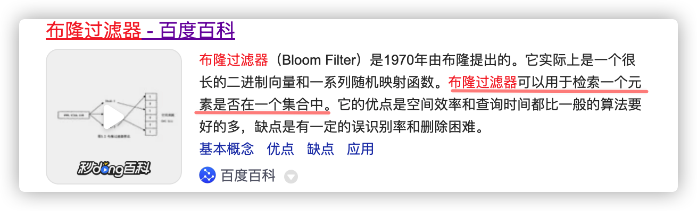
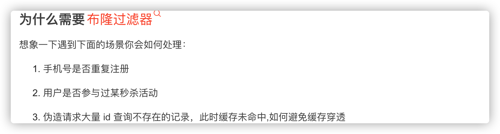
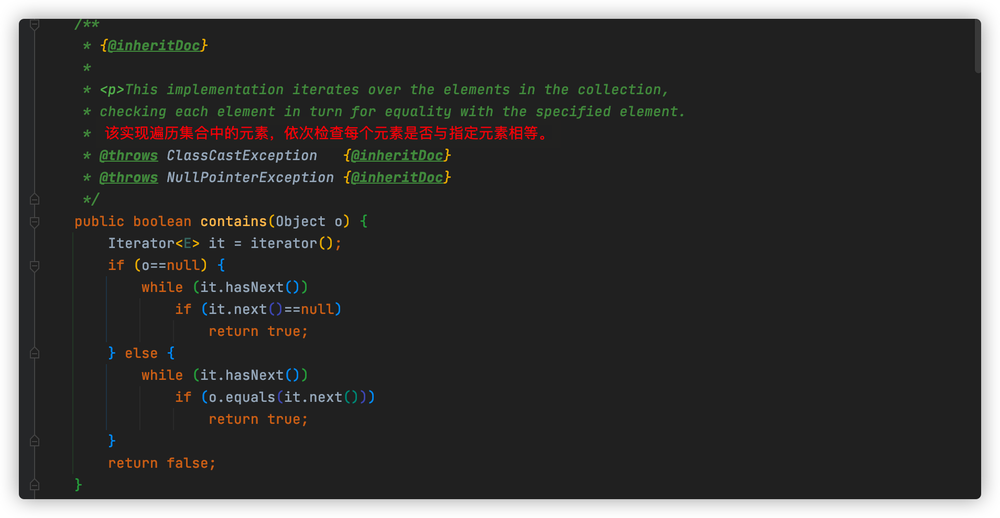
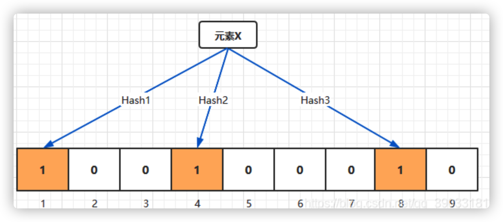
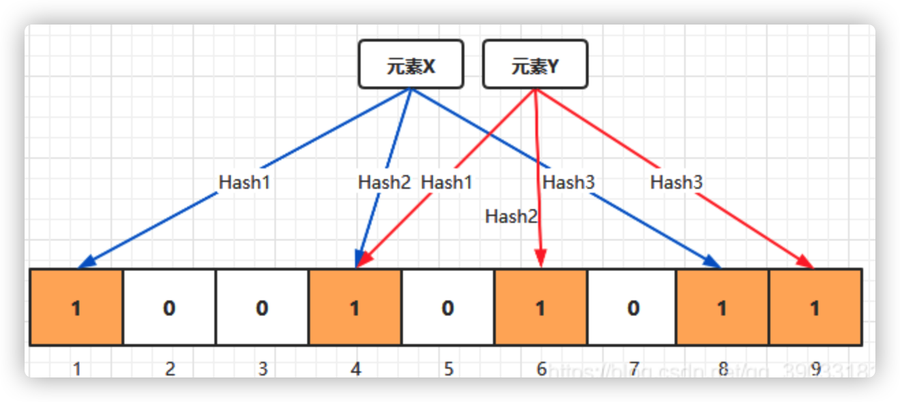

## 布隆过滤器

用途，判断一个元素是否存在于一个集合中

原理：利用到哈希碰撞，以最小空间复杂度得出结论。内部细致的原理将数据哈希后再取模，三次以上操作，得到三个不同的k值，放到集合中，后续数据重复操作，判断三个k值是否存在集合中，如果都存在，则可能存在，如果没有，那就一定没有。

特点：有，可能会有，没有，那就一定没有。

是一种空间效率高，时间效率低的数据结构，通过哈希碰撞，快速判断元素是否存在，由于本身不存储元素本身，在大规模数据时具有高效率，但如果已经有一份完整的元素集合在Redis中，我认为没有太大的必要再设计一个布隆过滤器来抵挡高并发的请求。


今天我们来聊一聊布隆过滤器，了解他之前，我们先看一看是干什么用的



百度百科解释他可以判断一个元素是否在集合中，后面还说了他的效率呀什么的都很好，那既然如此，我们再想象一下为什么需要它！



针对上述问题，如果我们直接任由请求访问数据库，问题1、2 还行，如果是问题3，那数据库大抵要说栓Q了。既然如此，我们结合刚刚看到的 布隆过滤器 正好是用来判断一个元素是否存在集合中。而且它的优点就是 空间效率、查询时间都比别人要好的多。那不得看看他到底是咋好的撒。

别急！先骗一波关注！骗不到也没事，咱也不小心眼，接着往下说；

如何实现高效率的判断一个元素在不在集合中呢！有的小伙伴立刻就联想到了 `List.contains()` 方法。如果光靠这个方法，在数据量较大的情况，还是会存在效率问题



根据源码我们可以看到他是挨个遍历的，意味每次都要遍历全量的集合。那既然每次都要遍历整个集合，那有什么办法呢？

把集合长度变短！对！布隆过滤器就是这样干的，那元素怎么放呢？

我们可以把任意一个需要比较的元素，通过函数，生成2个或3个甚至更多个整数。道理大致和 hash 差不多，只不过这里是生成多个整数

我们假如二进制向量的长度为9，散列函数的个数为3的布隆过滤器，针对**元素X**，三个不同的散列函数分别生成的哈希值为1，4，8。则上图转变为：



同理，我们再存一个**元素Y**，如果散列函数返回 4，6，9 的话，图变为：



假设，我们要判断元素Z，此时通过计算哈希返回 1，4，5 的话，发现其中 5 为 0，就可以判断 元素 Z 不存在此容器中。

由此我们可以客观的判断出其优缺点：

**优点：**

1. 空间占用极小，因为本身不存储数据而是用比特位表示数据是否存在，某种程度有保密的效果。
2. 插入与查询时间复杂度均为 O(k)，常数级别，k 表示散列函数执行次数
3. 散列函数之间可以相互独立，可以在硬件指令层加速计算。

**缺点：**

1. 误差（假存在性）
2. 无法删除

布隆过滤器可以 100% 的判断元素不在集合中，但是当集合元素非常多都为1时，此时散列函数凑巧又生成了存在的值，就可以判断为 假性存在（假阳性）


> 如何解决误差问题

在创建布隆过滤器时我们为了找到合适的 m 和 k ，可以根据预期元素数量 n 与 *ε* 来推导出最合适的 m 与 k 

- 位数组长度 m
- 散列函数个数 k
- 预期元素数量 n
- 期望误差 ε 


算法实现：

```java
// 计算哈希次数
@VisibleForTesting
static int optimalNumOfHashFunctions(long n, long m) {
    // (m / n) * log(2), but avoid truncation due to division!
    return Math.max(1, (int) Math.round((double) m / n * Math.log(2)));
}
 
// 计算位数组长度
@VisibleForTesting
static long optimalNumOfBits(long n, double p) {
    if (p == 0) {
        p = Double.MIN_VALUE;
    }
    return (long) (-n * Math.log(p) / (Math.log(2) * Math.log(2)));
}
```

这样我们就可以科学的确定数组长度、散列个数。

我们来看下一个问题

> 无法删除！

布隆过滤器判断一个元素存在就是判断对应位置是否为`1`来确定的，但是如果要删除掉一个元素是不能直接把`1`改成`0`的，因为这个位置可能存在其它元素，所以如果要支持删除，那我们应该怎么做呢？

最简单的做法就是加一个计数器，就是说位数组的每个位如果不存在就是`0`，存在几个元素就存具体的数字，而不仅仅只是存`1`。那么这就有一个问题，本来存`1`就是一位就可以满足了，但是如果要存具体的数字比如说`2`，那就需要`2`位了，所以**带有计数器的布隆过滤器会占用更大的空间**。

> 参考资料:
>
> [布隆过滤器如何删除](https://www.kancloud.cn/zatko/redis/2274392)-https://www.kancloud.cn/zatko/redis/2274392
>
> [布隆过滤器原理实现](https://blog.csdn.net/jfwan/article/details/121810096)-https://blog.csdn.net/jfwan/article/details/121810096
>
> [百度百科https://baike.baidu.com/item/%E5%B8%83%E9%9A%86%E8%BF%87%E6%BB%A4%E5%99%A8/5384697](https://baike.baidu.com/item/%E5%B8%83%E9%9A%86%E8%BF%87%E6%BB%A4%E5%99%A8/5384697)-https://baike.baidu.com/item/%E5%B8%83%E9%9A%86%E8%BF%87%E6%BB%A4%E5%99%A8/5384697

关注 『**Xiang想**』公众号