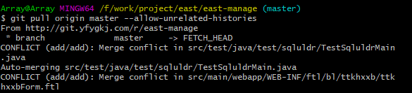
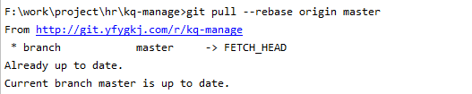

### Git 常用命令

> [IDEA 中操作详解](https://www.yuque.com/geren-t8lyq/ncgl94/wff74bltu8i9rxko)


#### 1、查看

```
    git status        // 查看所处分支的文件的变动
    git branch        // 查看本地所有分支名,带*表示当前所处分支
    git branch -r     // 查看远程所有分支
    git branch -a     // 查看本地和远程所有的分支名称
```

#### 2、删除

```
git branch -d zl_optimize        // 删除本地分支zl_optimize   
git push origin -d zl_optimize   // 删除远程分支zl_optimize 
```

#### 3、不跟踪某个文件

```sh
# 文件
git rm --cached <filename>
# 目录
git rm -r --cached <foldername>
```

#### 4、切换分支

```sh
# 查看当前使用的分支
git branch
# 切换分支
git checkout 分支名
```

### 5、修改远程分支

```sh
git remote set-url origin <$url>
# 提交到master
git push -u origin "master"
```


### Git 常用问题


#### 1、下拉错误  refusing to merge unrelated histories

> Git 下拉代码
>
> ==Error merging: refusing to merge unrelated histories==
> ==取消更新==

解决方案：

​	**git pull origin master --allow-unrelated-histories**

```
git pull origin master --allow-unrelated-histories
```




再重新下拉代码，需要合并很多文件，逐一合并即可

（注意）：合并完后，代码会自动 commit 到本地 Git仓库


#### 2、本地创建代码再上传至远程Git中，无法提交

>我们已经在远程上创建好了，在本地搭建好工程后，开始向远程拉取提交
>开始会出现无法上传、下拉的问题。
>==原因是；远程在创建的时候，自动搭建了 README.md  和  .gitignore 文件，此时远程和本地版本不得一致==

解决办法；

**git pull --rebase origin master**

```sh
git pull --rebase origin master
```



此时，远程和本地建立连接后，即可实现正常的上传、下拉动作！


#### 2、新增远程仓库地址

如果直接set-url 设定远程git地址，是绑定不了的

> git remote set-url origin https://gitee.com/Array_Xiang/saber.git        
> fatal: No such remote 'origin'

解决办法 `git remote add origin <url>`


```sh

git remote add  origin https://gitee.com/Array_Xiang/jenkins-test.git

```

然后需要push上去

```
git push -u origin master
```

执行完这两行语句之后 就可以使用IDEA工具中的 push 按钮提交分支了

有关资料：[git将本地代码提交到远程仓库](https://blog.csdn.net/weixin_40098405/article/details/103327945)


#### 3、修改远程仓库地址

> 19:41	Fetch failed: unable to access 'http://git.yfygkj.com/r/index-manage.git/': Failed to connect to git.yfygkj.com port 80: Timed out

解决办法：`git remote set-url origin <url>`

```
git remote set-url origin https://e.coding.net/insure/zaibaoxianxitong/liframe.git
```


#### 4、跟踪不到主分支

>10:52	Can't Update
>		No tracked branch configured for branch master or the branch doesn't exist.
>		To make your branch track a remote branch call, for example,
>		git branch --set-upstream-to=origin/master master (show balloon)


### 5、强行下拉分支

```
git fetch --all

git reset --hard origin/master

git pull
```

舍弃本地仓库记录，强行使用远程仓库代码改动量不大的情况下使用此方法


### 6、git永久记录账户信息

```sh
git config --global credential.helper store
```


### 7、 强制切换到一处

```sh
git -c core.quotepath=false -c log.showSignature=false reset --hard ab27fe3aa84e5d1d4764dbab52ebe487322315a3
```


### 8、git取消跟踪

```sh
git rm --cached example.txt

git rm -r --cached folder
```


git 使用代理

```sh
git config --global http.proxy 127.0.0.1:7890
git config --global https.proxy 127.0.0.1:7890

git -c http.proxy=http://127.0.0.1:7890 -c https.proxy=http://127.0.0.1:7890 push origin master
```


### 9、git回退一个提交

```sh
git reset --hard HEAD~1
```

