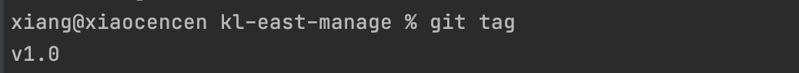
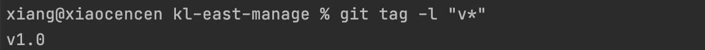
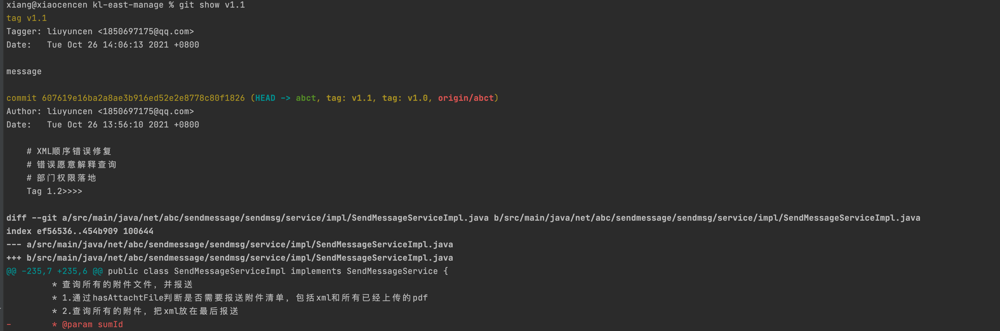

> 创建于2021年10月26日
> 作者：想想

[toc]

## Git打Tag

列出已有的 tag

```sh
git tag
```



可以加 `-l` 命令可以使用通配符过滤 tag



### 1、新建 Tag

1. 使用 `git tag` 命令跟上 tag 名字，直接创建一个tag

```sh
git tag v1.0
```

2. 加上 `-a` 参数来创建一个带备注的tag，备注消息由 `-m` 则创建系统回自动打开编辑信息让你填写

```sh
git tag -a v1.1 -m "message"
```


### 2、查看tag详细信息

`git show` 命令可以查看tag的详细信息，包括 commit 号等等

```sh
git show v1.1
```



### 3、给指定的 commit 号加 tag

打tag不必要在head上，也可以在之前版本打

```sh
git tag -a v1.2 9fceb02 -m "my tag"
```

### 4、将tag同步到远程服务器

提交代码后，使用 `git push` 来推送远程服务器，`tag` 也需要推送到远程服务器，使用`git push origin [tagName]` 推送单个分支

```sh
git push origin v1.0
```

推送本地所有 tag

```sh
git push origin --tags
```

### 5、切换到某个 tag

跟分支一样，可以直接切换到某个 tag 去，这个时候不需要任何分支，处于游离状态，也可以基于这个tag创建分支

```sh
git checkout v1.0
```

### 6、删除某个tag

+ 本地删除

```sh
git tag -d v1.0
```

+ 远程删除

`git push origin :refs/tags/<tagName>`

```sh
git push origin :refs/tags/v1.2
```


