[toc]

# 远程服务器搭建SVN

## 1、环境准备

​		需要先准备一台远程服务器，配置如下即可

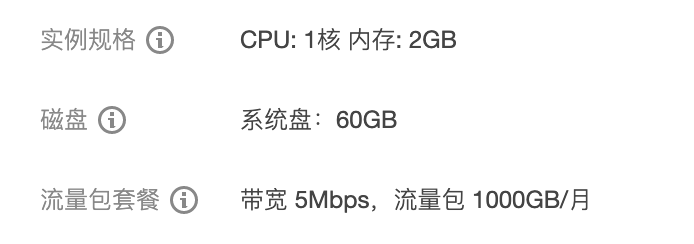

​		镜像信息为：CentOs 8.0 64bit

​		开放 3690 端口，这个端口是 SVN 服务端的默认端口

​		检查环境中是否已经存在 svnserve 服务

```sh
svnserve --version
```

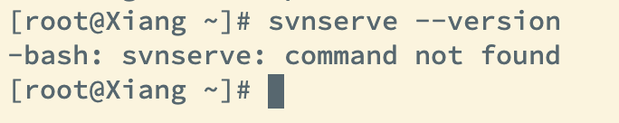

​		发现没有服务，在执行下述操作

	## 2、搭建环境

### 2.1、查看安装包

```sh
yum -y list subversion
```

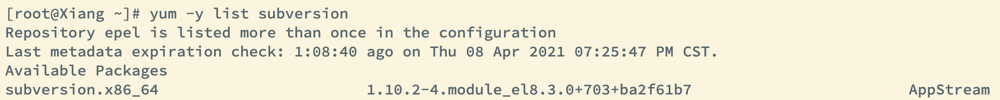

### 2.2、在线安装

```sh
yum -y install subversion
```

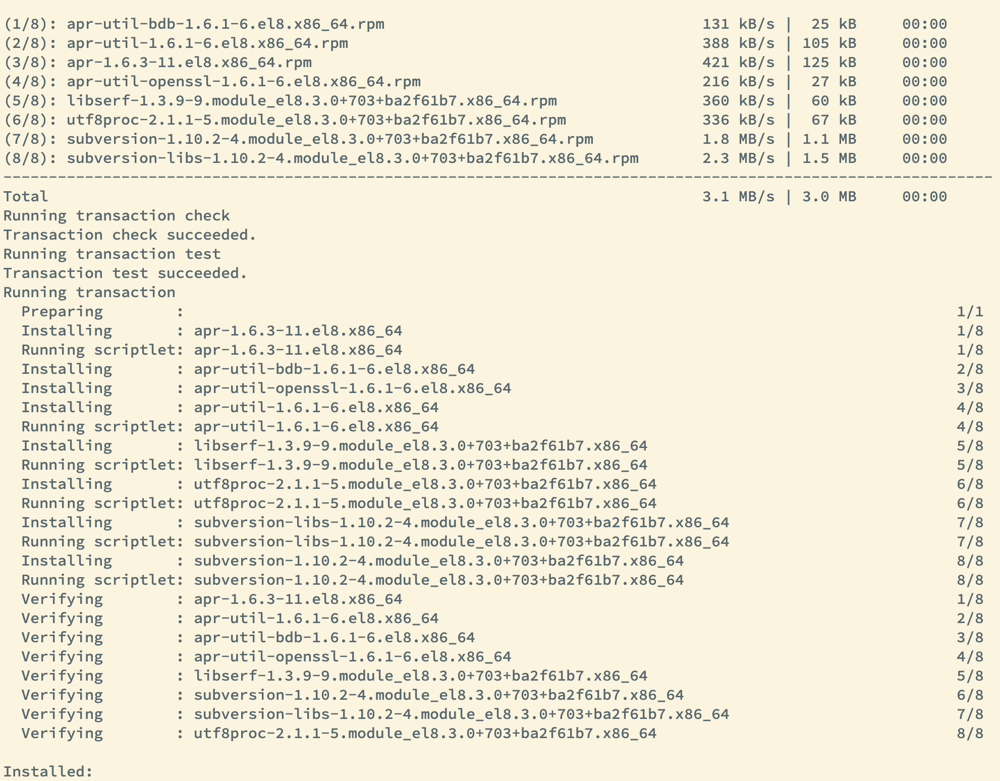

当出现 		Complete！ 时就说明成功了！

### 2.3、查看

```sh
svnserve --version
```

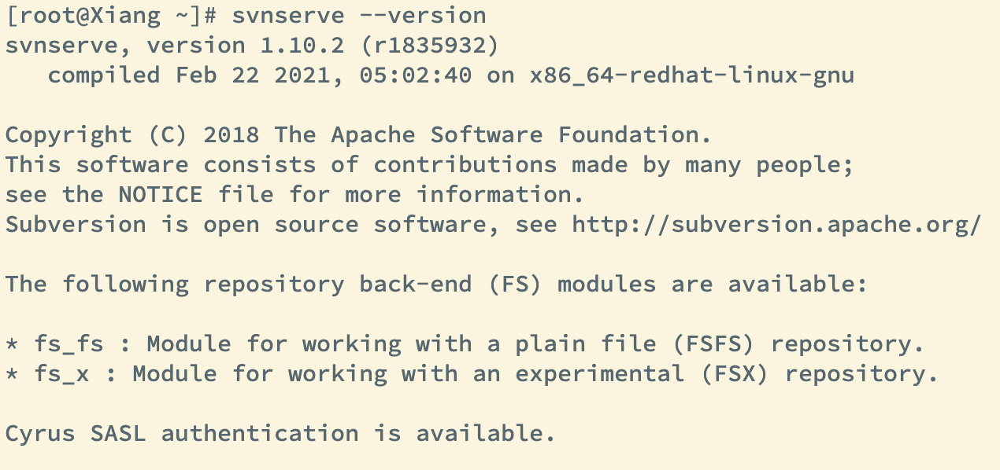

这样就安装成功了

## 3、创建资源版本库

> 创建目录，改目录一般放在opt 目录下或者是 home 目录下都可以，我这里选择放在home 目录下，并把这个目录都权限交给 xiang 用户 

```sh
# 切换到 xiang 用户
su - xiang
# 展示目录
pwd
# 创建 svn/repoistory/ 二级目录
mkdir -p svn/repoistory/
# 创建名为 Typora 的资源版本仓库
svnadmin create /home/xiang/svn/repoistory/Typora
```

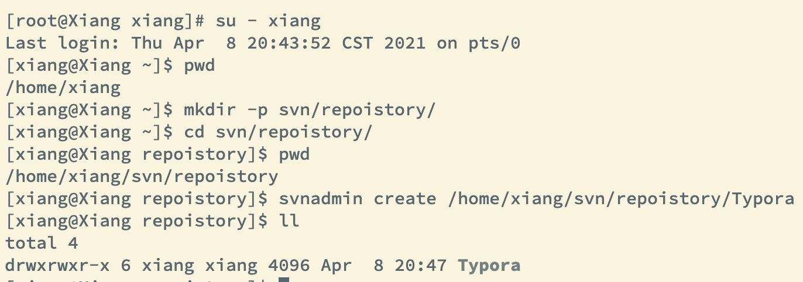

这时会创建 Typora 文件夹

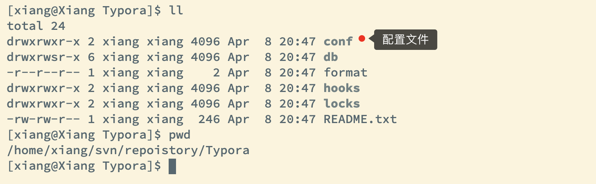

## 4、配置版本库

我们进入 conf 配置文件中，可以看到 authz    passwd.     svnserve.conf  这三个文件，这三个文件是用于配置资源版本库的

+ authz		授权文件
+ passwd    配置用户名和密码
+ svnserve.conf 资源仓库配置文件

### 4.1、配置  svnsreve.conf 文件

```sh
vim svnserve.conf
```

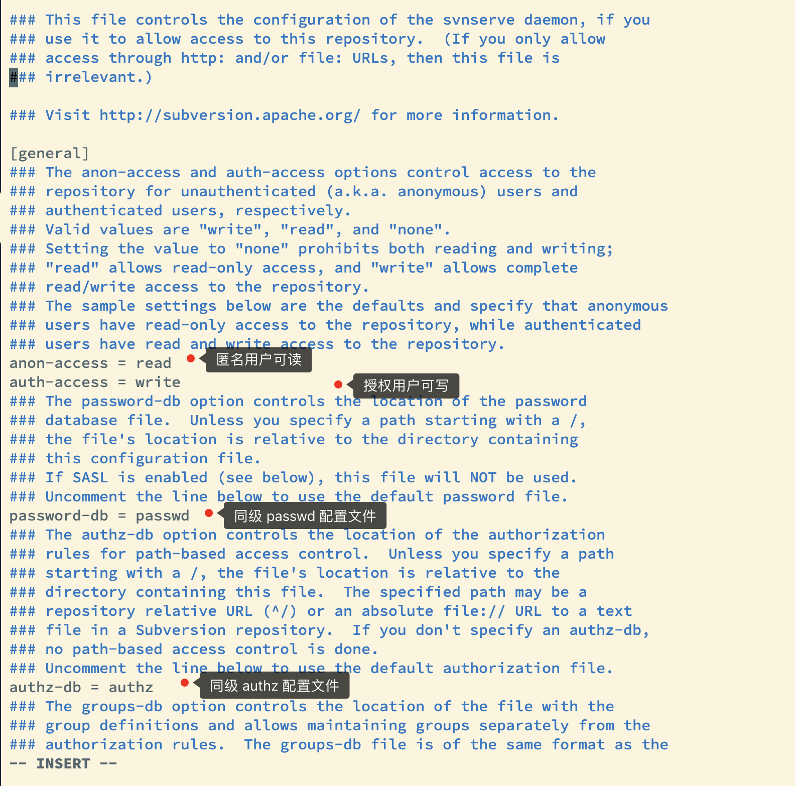

### 4.2、配置用户密码

```sh
vim passwd
```

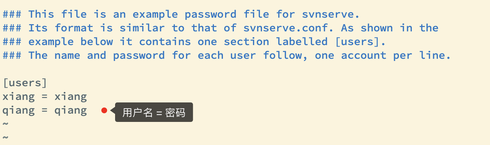

### 4.3、配置权限

```sh
vim authz
```


## 5、启动 svn 服务

```sh
svnserve -d -r /home/xiang/svn/repoistory/
```

> -d. 后台运行
>
> -r 运行目录

## 6、检查进程

```sh
ps -aux|grep svn
```

结果如下，就表示安装成功了！

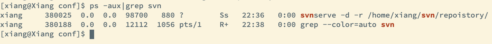

```sh
svn co svn://101.201.81.193/Xmind
```

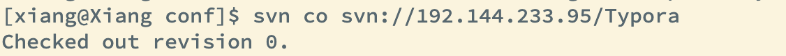


