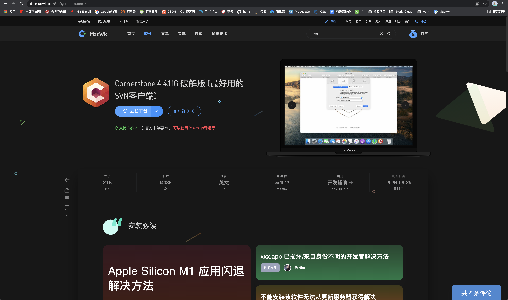
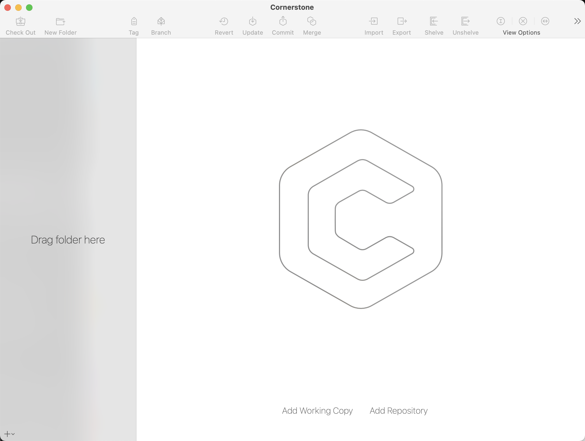
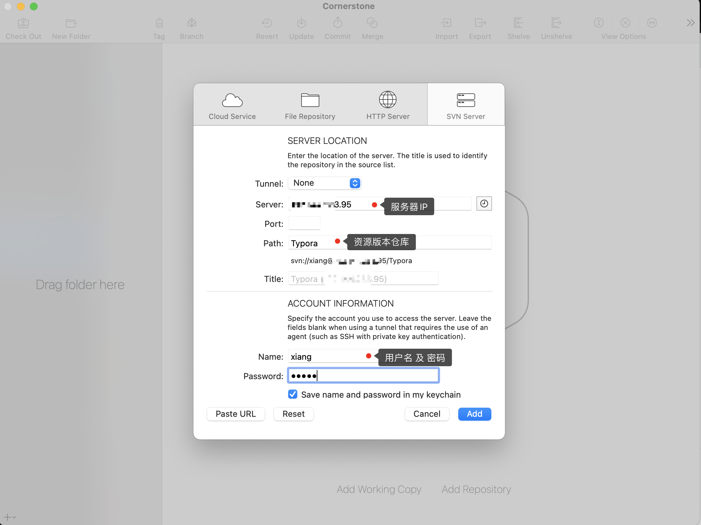
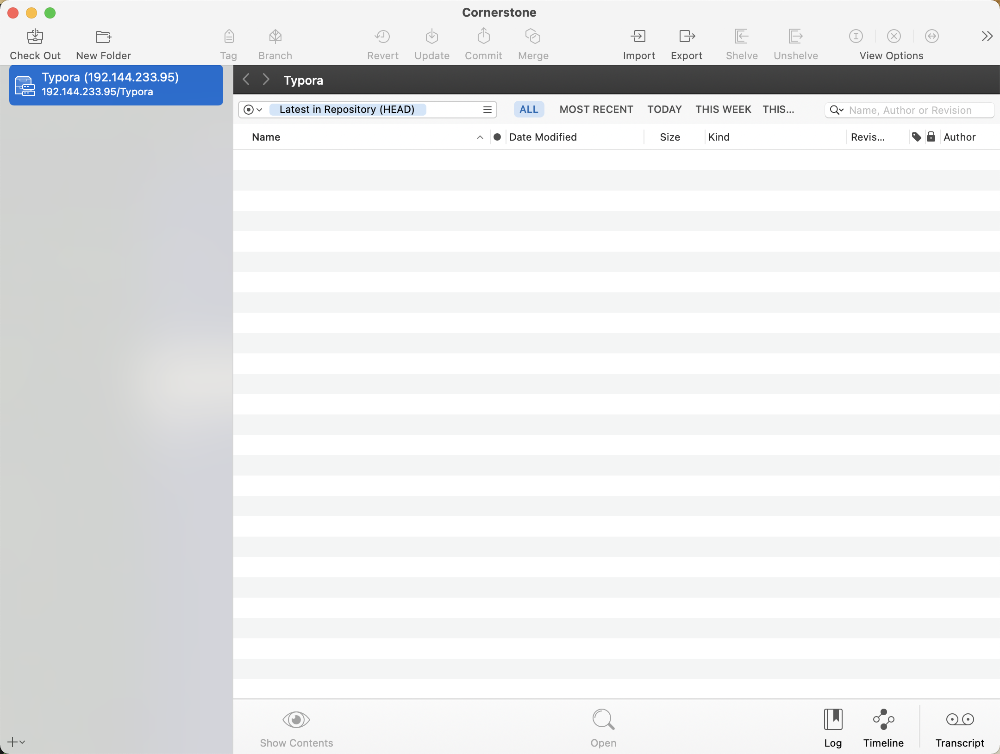
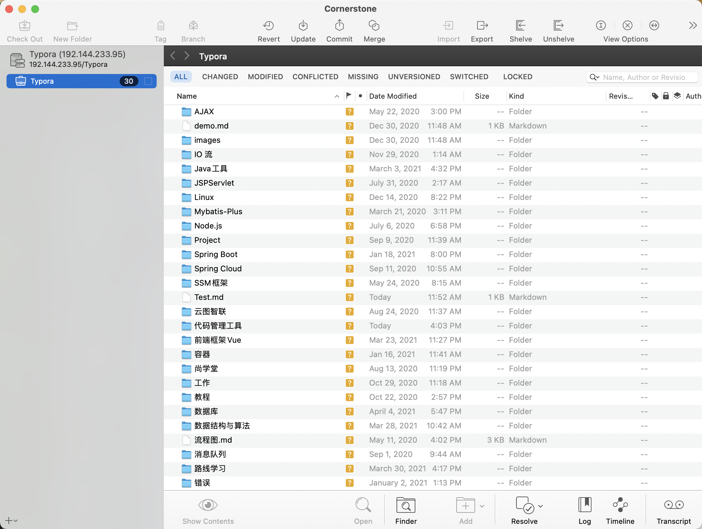
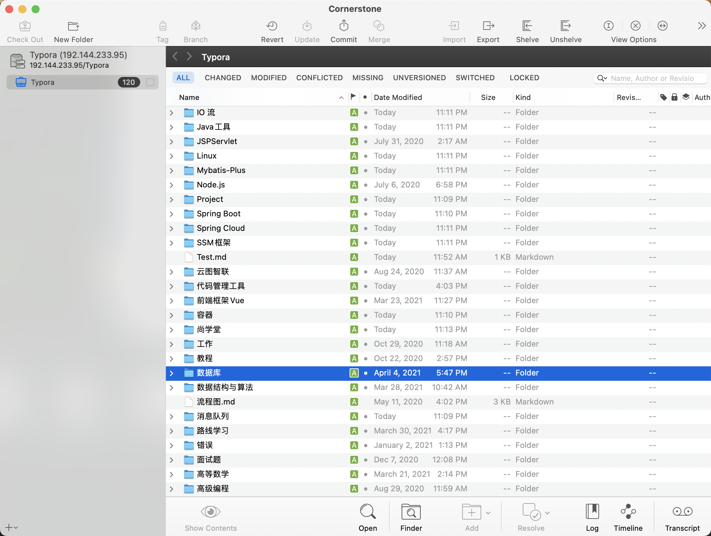

[toc]

# MacOS搭建SVN客户端

[安装 Cornerstone](https://www.macwk.com/soft/cornerstone-4)

安装完成后！

界面很优雅！

点击 中间下面部分的 Add Repository

此时，就连接成功了！

点击左上角的 CheckOut 将资源与本地文件夹进行关联，

然后再将自己想要上传到 svn 到文件上复制到改文件夹即可

全选文件 点击 下面的 Add   再  Commit 即可

