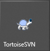
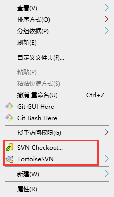
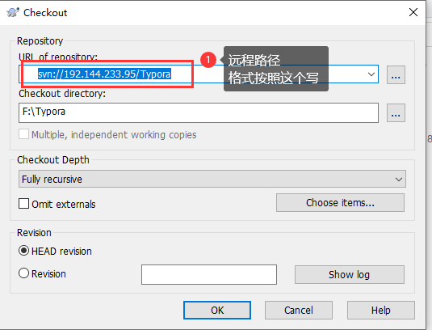
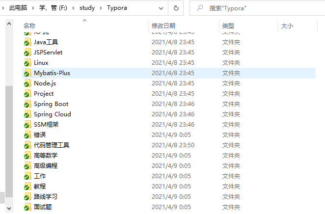
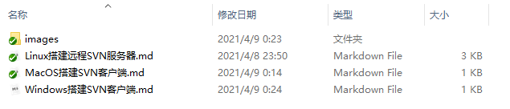
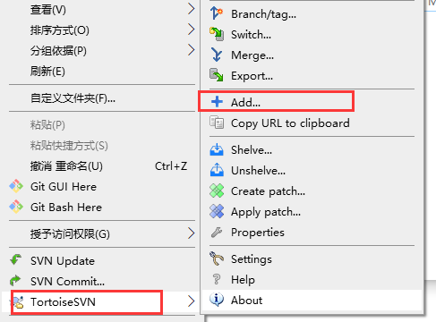
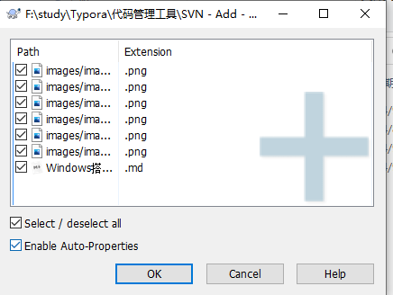
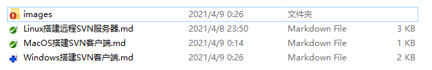
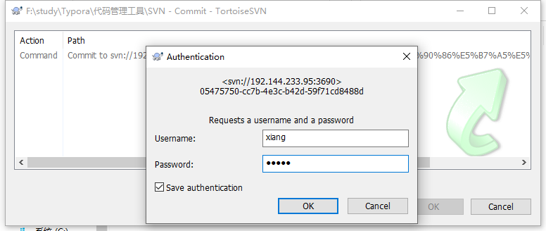
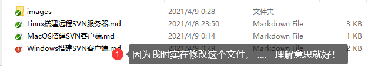

[TOC]

# Windows 搭建SVN客户端

## 1、下载小乌龟

```file
在 \尚学堂\互联网架构\SVN\file 路径下 有小乌龟的安装包
```

小乌龟长这个样子：  安装完小乌龟之后，右键任意文件夹能看到 这两个选项


直接点击  SVN CheckOut

## 2、下拉资源仓库




点击确定，就好自动下拉文件



这样文件就下拉成功了！

## 3、提交

我们新建了一个 叫 “Windows 搭建 SVN” 的文件，可以看到，这个文件没有 绿色的钩子



点击右键 TortoiseSVN 再选中 Add



所有新建的文件都会展示在这里



点击确定后，文件会改变图标，  颜色图标这里不再讲解，自己科普去吧



最后  commit 就可以了，这里需要权限验证的



最后！ success

