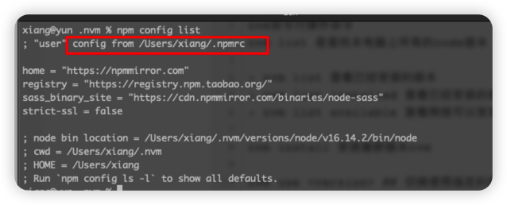

## Node 版本控制器

nvm 常用命令


查看本地 NVM 配置

```sh
npm config list
```



配置文件在：/Users/xiang/.npmrc

Mac版本配置文件在 /usr/local/Cellar/nvm/0.39.7/settings.txt


```sh
nvm off                     // 禁用node.js版本管理(不卸载任何东西)
nvm on                      // 启用node.js版本管理
nvm install <version>       // 安装node.js的命名 version是版本号 例如：nvm install 8.12.0
nvm uninstall <version>     // 卸载node.js是的命令，卸载指定版本的nodejs，当安装失败时卸载使用
nvm ls                      // 显示所有安装的node.js版本
nvm list available          // 显示可以安装的所有node.js的版本
nvm use <version>           // 切换到使用指定的nodejs版本
nvm v                       // 显示nvm版本
nvm install stable          // 安装最新稳定版
```


```
nvm命令行操作命令
nvm list 是查找本电脑上所有的node版本
 
- nvm list 查看已经安装的版本
- nvm list installed 查看已经安装的版本
- nvm list available 查看网络可以安装的版本
 
nvm install 安装最新版本nvm

nvm use <version> ## 切换使用指定的版本node

nvm ls 列出所有版本

nvm current显示当前版本

nvm alias <name> <version> ## 给不同的版本号添加别名

nvm unalias <name> ## 删除已定义的别名

nvm reinstall-packages <version> ## 在当前版本node环境下，重新全局安装指定版本号的npm包

nvm on 打开nodejs控制

nvm off 关闭nodejs控制

nvm proxy 查看设置与代理

nvm node_mirror [url] 设置或者查看setting.txt中的node_mirror，如果不设置的默认是 https://nodejs.org/dist/　　nvm npm_mirror [url] 设置或者查看setting.txt中的npm_mirror,如果不设置的话默认的是： https://github.com/npm/npm/archive/.
 
nvm uninstall <version> 卸载制定的版本

nvm use [version] [arch] 切换制定的node版本和位数

nvm root [path] 设置和查看root路径

nvm version 查看当前的版本
```


