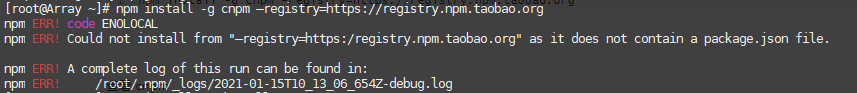

### 1、npm 基础

查看 npm 版本

```
npm -v
```

默认安装最新版本

```
npm install -g npm  
```

查看当前的版本信息

```
npm  updated -d 
```

查看模块的所有版本

```
npm view npm versions 
```

更新指定的版本

```
npm -g install npm@版本号  
```


安装 淘宝 镜像

```
npm install -g cnpm --registry=https://registry.npm.taobao.org
```

如果存在无法安装淘宝镜像的情况：



重新更新下npm即可，执行

```
npm install -g install
```

如果还不行，在安装时指定地址

```
npm i node-sass --sass_binary_site=https://npm.taobao.org/mirrors/node-sass
```

查看 cnpm

```
cnpm -v
```


解决 sass-loader问题

```sh
npm install sass-loader node-sass --save-dev
```


==cnpm 会出现无反应的现象==

查看 npm 源

```
npm config get registry
```

==如果现实 淘宝源 说明没问题==


### 2、vue-cli

全局安装vue-cli

```
npm install --global vue-cli
```

#### 3、单次使用 npm

```sh
npm install --registry=https://registry.npm.taobao.org
```

#### 4、永久使用

```sh
npm config set registry https://registry.npm.taobao.org
```

虽然 npm 改变淘宝镜像源后，但使用比 cnpm 要慢哦
