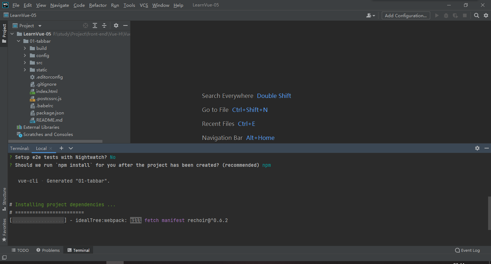

> 创建于 2022年3月3日
>
> 作者：想想

[toc]

## 项目初始化

采用 Vue 2

```sh
PS F:\study\Project\front-end\Vue-H\Vue-B\LearnVue-05> vue init webpack 01-tabbar

? Project name 01-tabbar
? Project description A Vue.js project
? Author Array_Xiang <array_xiangxiang@163.com>
? Vue build runtime
? Install vue-router? No
? Use ESLint to lint your code? No
? Set up unit tests No
? Setup e2e tests with Nightwatch? No
? Should we run `npm install` for you after the project has been created? (recommended) npm

   vue-cli · Generated "01-tabbar".


# Installing project dependencies ...
# ========================
```

==项目初始化中ing .....==



