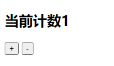
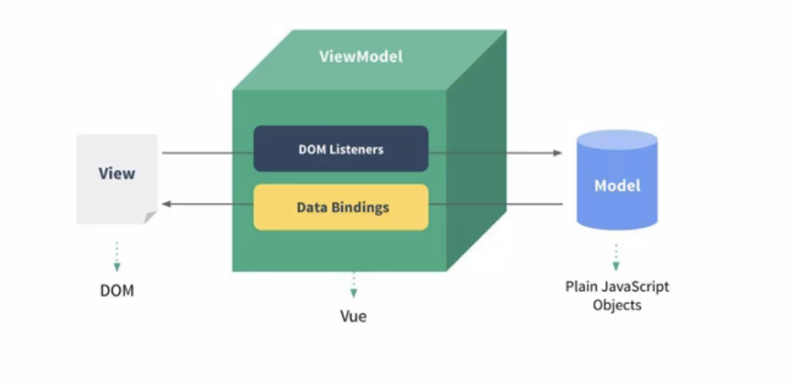
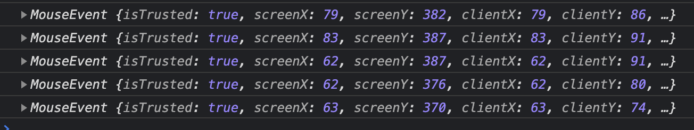
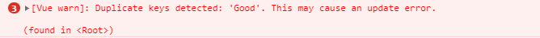
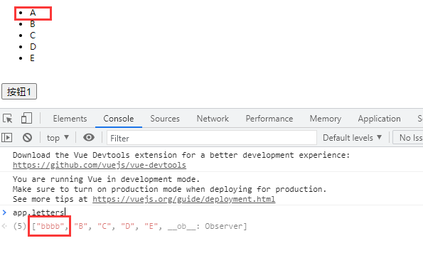
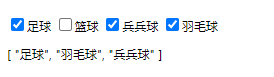

---
https://www.bilibili.com/video/BV15741177Eh
---

[TOC]


## 1、Vue.js 安装

+ 方式一；直接CDN引入

     + 我们可以选择生成环境或者是开发环境

          ```xml
          <!-- 开发环境版本，包含了有帮助的命令行警告 -->
          <script src="https://cdn.jsdelivr.net/npm/vue/dist/vue.js"></script>
          <!-- 生成环境版本，优化了尺寸和速度-->
          <script src="https://cdn.jsdelivr.net/npm/vue"></script>
          ```

+ 方式二：下载和引入

     + 在开发环境中，频繁使用外网资源对测试不利

          ```
          开发环境
          https://vuejs.org/js/vue.js
          生产环境
          https://vuejs.org/js/vue.min.js
          ```

+ 方式三：NPM安装

     + 后续通过 webapack 和 CLI 的使用，我们使用该方法


## 2、Hello Vue

### 1、爱的初体验

#### 1、列表

> ==v-for==  ==用于遍历循环数据==
>
> ```
> <p v-for="i in datas">{{i}}</p>
> ```

```html
<div id="app">
    <ul>
        <li v-for="item in movies" >{{item}}</li>
    </ul>
</div>
```

```javascript
// 创建 Vue 实例，得到 ViewModel
    var vm = new Vue({
        el: '#app',
        data: {
            message :'你好',
            movies :['A','B','C','D']
        },
        methods: {}
    })
```

"movies" 是vue 中的data，item 充当遍历后的元素 将movies挨个遍历，并赋值给item

#### 2、计数器

> ==v-on:click=""==   ==点击事件绑定==
>
> ==@:click==   ==点击事件绑定==



```html
<div id="app">
    <h2>当前计数{{count}}</h2>
    <button v-on:click="add">+</button>
    <button v-on:click="sub">-</button>
</div>
```

```javascript
 var vm = new Vue({
        el: '#app',
        data: {
            count:0
        },
        methods: {
            add:function () {
                this.count++;
            },
            sub:function () {
                this.count--;
            }
        }
    })
```

### 2、Vue 中的 MVVM



==Data Bindings== 数据绑定：将数据绑定到视图中，在视图中展示

==Dom Listeners==  数据监听：当DOM发生一些事件（点击、滚动、touch等）时，可以监听到，并在需要的情况下改变对应的Data

### 3、总结

目前掌握的选项：

+ el:
     + 类型：String | HTMLElement
     + 作用：决定之后Vue实例会管理哪个DOM
+ data：
     + 类型：Object | Function
     + 作用：Vue实例对应的数据对象
+ methods：
     + 类型：{[key：String]：function}
     + 作用：定义属于Vue的方法，可以在其他地方被调用，也可以在指令中使用


## 3、Vue生命周期

```js
new Vue({
  data: {
    a: 1
  },
  created: function () {
    // `this` 指向 vm 实例
    console.log('a is: ' + this.a)
  }
})
```

生命周期： 生命周期也称钩子函数 ==hook ：钩子==

+ beforeCreated
+ created     通常：创建网络请求
+ beforeMount
+ mounted
+ beforeUpdate
+ update
+ beforeDestory
+ Destory


## 4、动态绑定

### 1、Mustache

Mustache语法就是双括号语法 

==Mustache ： 胡须==


### 2、v-bind

用于绑定属性 还可以绑定 src、href、class等元素

==小扩展：href -> hypertext reference 超文本引用==

```html


vue 部分--
data: {
	imgUrl: "https://cn.vuejs.org/images/logo.png"
}
```

> v-bind 语法糖
>
> ```
> 
> ```
>
> 用 : 替换 v-bind: 


#### 对象语法 

通过对象方式 根据布尔值来渲染class

```html
<h2 :class="{active:isActive,line:isLine}">Hello</h2>
```

```html
<style>
     .active{
         color:red;
     }
</style>
```

```vue
data: {
    isActive:true,
    isLine:true
}
```

这个是可以和普通 class 共存的

#### 数组语法 

```html
<h2 :class="[active,line]">Hello</h2>
```

```vue
data: {
    active: 'aaa',
    line: 'bbb'
}
```

对style进行绑定

```html
<!-- <h2 :style="{key(属性值):value(值)}">{{message}}</h2>-->
    <h2 :style="{fontSize:'50px'}">{{message}}</h2>
```

这里的 50px 要注意两点

+ 要加引号，不加引号，否则当做变量解析，vue 不允许数字开头为变量
+ 加上引号后，要加px ，单独一个50他不认识


### 3、v-on

```html
    <h2>{{counter}}</h2>
    <button v-on:click="increment">+</button>
    <button @click="decrement">-</button>
```

vue

```js
const app = new Vue({
        el: "#app",
        data: {
            counter: 1
        },
        methods: {
            increment(){
                this.counter ++;
            },
            decrement(){
                this.counter--
            }
        }
    })
```

V-on 事件监听，语法糖🍬 是 `@` 

#### 参数问题

> 参数问题，如果在 v-on中添加了参数，即可将参数传到方法中

```html
    <button @click="increment(2)">+2</button>
```

vue

```js
methods :{
            increment(value) {
                this.counter += value
            }
        }
```

> 如果在 v-on 参数中，没有添加（），也就代表我们不会手动传参，但是在方法接收的时候，添加了参数，此时的参数，则是浏览器给我们的，Event 对象，用于监听当前页面鼠标或者其他拖拽行为的事件
>
> 
>
> 如果存在多个参数，event 会放在默认的第一个参数中

如果想手动拿到 event 事件时，传 `$event` 

#### 修饰符

==stop== 阻止冒泡事件

```html
<div @click="divClick">
        <button @click="btnClick">按钮</button>
</div>
```

当点击 按钮时，既会触发  btnClick 也会触发 divClick，那么要如何解决这个方法呢？ 修改为 `@click.stop` 阻止冒泡行为

```html
<button @click.stop="btnClick">按钮</button>
```

==prevent== 阻止默认事件

```html
    <form action="baidu">
        <input type="submit" value="提交" @click.prevent="submitClick">
    </form>
```

阻止提交 否则会跳转页面

==@keyup== 监听键盘抬起， 除此还有 keydown 是用于监听键盘按下

```html
<input type="text" @keyup.enter="keyUp">
```

只监听键盘Enter 回车键的抬起事件， 后面的 enter 可以通过查询键盘编号，监听键盘上任意一个键帽

==.native== 监听主键根元素的原生事件

==.once== 只触发一次回调

==.blur== 监听input框焦点消失事件


### 4、v-if

```html
<h2 v-if="flag">{{message}}</h2>
```

根据 flag 的值，true/false 来展示 message 的值，true 则展示

```html
<h2 v-if="isYes">{{message}}</h2>
<h2 v-else=>else{{message}}</h2>
```

如果 isYes 为 true 第一张展示，为false 第二行展示

```html
<h2 v-if="score>=90">优秀</h2>
<h2 v-else-if="score>=60">及格</h2>
<h2 v-else-if="score<=90">不及格</h2>
```

> 案例
>
> ```html
> <span v-if="flag">
>     <label for="username">用户账号</label>
>     <input id="username" type="text" placeholder="用户账户" key="username"/>
> </span>
> <span v-else>
>     <label for="email">用户邮箱</label>
>     <input id="email" type="text" placeholder="用户邮箱" key="email"/>
> </span>
> <button @click="flag = !flag">切换</button>
> ```
>
> label 标签中的 for 和 input id 绑定后，点击 label 标签，输入框聚焦到 input 框中
>
> ==复用问题  key 标签==

### 5、v-show

当 `v-show` 条件为 false 时，只是添加了一个 style="display:none" 的属性。

当 `v-if` 条件为 false 时，这个om不会被渲染到页面上

区别：如果频繁的切换 v-if  表示这个dom会被频繁的渲染和删除，v-show 只是改变 style 的属性而已，频繁切换建议使用 v-show

### 6、v-for

```html
<li v-for="item in names">{{item}}</li>
```

在遍历对象的过程中，如果只是获取一个值，那么获取到的是value

> 遍历对象：
>
> ```html
> <li v-for="(value,key,index) in info">{{index}} --> {{value}} -- {{key}}</li>
> ```
>
> - 0 --> why -- name
> - 1 --> 18 -- age
> - 2 --> 1.88 -- height


​		带下标进行遍历

```html
<li v-for="(item,index) in names">{{index+1}}  {{item}}</li>
```

#### 插入问题

在 vue 的数组中，使用 `splice` 插入元素，会像 java 中的 Array数组插入一样，目标后的元素下标均会+1，==如果绑定了 ：key 时，则会解决这个问题，直接插入此元素==

```html
<li v-for="item in letters " :key="item">{{item}}</li>
```

<span style="color:blue">Key的作用主要是为了高效的更新虚拟DOM，注意，如果使用了 :key 中的 item 一定要是唯一的</span >



利用控制台对 vue data进行新增元素 ==app.letters.push('F')==

#### 响应式问题

​		针对数组、对象，如果操作数组、对象中的元素，Vue 会帮我们动态响应数据，立刻渲染到页面中，但并不是所有方法都响应

支持响应式的有：

+ push 添加一个或多个元素

  ```js
  this.letters.push('Good','Hello','World')
  ```

+ pop 删除最后一个元素

  ```js
  this.letters.pop()
  ```

+ shift 删除第一个元素

  ```js
  this.letters.shift()
  ```

+ unshift 在数组前面添加一个或多个元素

  ```js
  this.letters.unshift('unshift');
  ```

+ splice 删除、替换、修改

  splice元素有三种用法，他可以传入三个参数

  + 第一个参数：操作元素的起始位置
  + 第二个参数：==关键点== 如果没有第二个、第三个参数，表示从 第一个参数开始，删除后面所有元素。如果第二个参数有数n，表示删除n个参数
  + 第三个参数：如果存在第三个参数，表示从第一个参数开始，删除第二个参数的元素，再添加

  ```js
  // 6.splice 删除元素、插入元素、替换元素
  // splice(start，end)
  // start 从第n个参数中 删除、插入、替换
  // end 要删除、插入、替换 n个元素
  
  /* 删除功能 */
  // 如果只传入一个参数，代表 删除元素， 传入两个元素 表示从n-n 个元素的删除
  // 如果不传参数，删除所有元素
  this.letters.splice(1,2);
  
  /* 替换元素 */
  // 也可以理解为 先删除 1-3给参数，在添加 m n l p
  this.letters.splice(1,3,'m','n','l','p')
  
  /* 插入元素 */
  // 第二个参数传入 0 表示一个不删，在后面追加 good
  this.letters.splice(1,0,'good')
  ```

+ sort 排序

+ reverse 翻转所有元素

+ Vue.set()

  ```js
  Vue.set(this.letters,0,'aaa')
  // letters 第0个 修改为 aaa
  ```

不支持响应式

```js
this.letters[0] = 'bbbb';
```



解决办法:

```js
this.letters.splice(0,1,'bbb')
```


### 7、v-model

表单绑定 v-model

v-on + v-bind 实现

```html
  <input type="text" :value="message" @input="valueChange">
<!-- 直接实现 -->
  <input type="text" :value="message" @input="$even.target.value">

<!--等同于-->
 <input type="text" v-model="message">
```

vue

```js
methods:{
            valueChange(event){
                this.message =  event.target.value;
            }
        }
```

==radio==

表单中，使用 input type为 radio 标签时，当单选情况下，我们会用 name=''同一个值，使得有单选效果，如果使用 v-model 可以忽略这个问题

```html
<label for="man">
    <input type="radio" id="man" value="男" v-model="sex">男
</label>
<label for="woman">
    <input type="radio" id="woman"  value="女" v-model="sex">女
</label>
```

==checkbox==

```html
<input type="checkbox" v-model="hobbes" value="足球">足球
<input type="checkbox" v-model="hobbes" value="篮球">篮球
<input type="checkbox" v-model="hobbes" value="兵兵球">兵兵球
<input type="checkbox" v-model="hobbes" value="羽毛球">羽毛球
{{hobbes}}
```



==select==

```html
<select name="abc"  v-model="fruit">
        <option value="苹果" >苹果</option>
        <option value="香蕉" >香蕉</option>
</select>
<p>您选的是:{{fruit}}</p>
```

