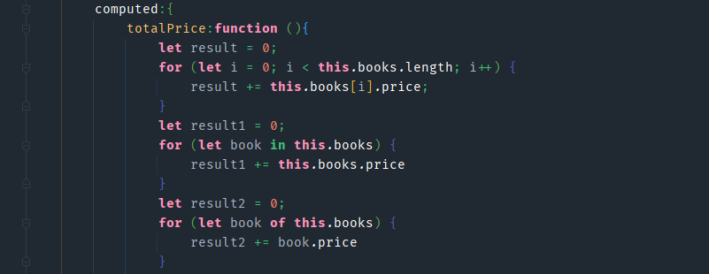
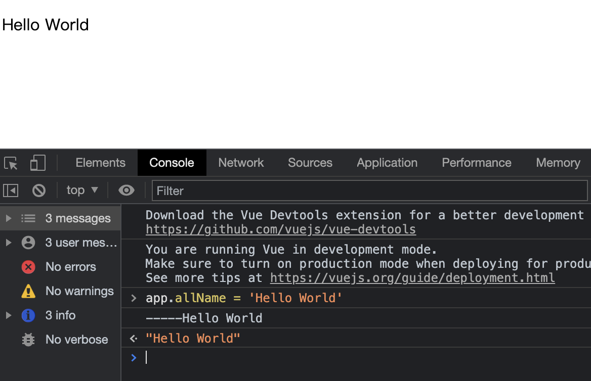

> 创建 2021年6月4日
>
> 作者：想想

[toc]


# Vue 基本语法

## 1、计算属性

### 1.1、计算属性的基本使用

```html
<p>{{firstName + ' ' + lastName}}</p>
<p>{{firstName}} {{lastName}}</p>
<p>{{getFullName()}}</p>
<p>{{fullName}}</p>
```

vue

```vue
	const app = new Vue({
        el: "#app",
        data: {
            firstName :'Lebron',
            lastName:'James'
        },
        methods:{
            getFullName(){
                return this.firstName + ' ' + this.lastName;
            }
        },
        computed:{
            fullName: function (){
                return this.firstName + ' ' + this.lastName
            }
        }
    })
```

计算属性不需要加 括号 直接写成 `{{fullName}}` 即可


### 1.2、计算属性的复杂使用

```html
<p>书的总价：{{totalPrice}}</p>
```

```js
data: {
    message: '你好啊',
        books: [
            {id:110,name:'Linux编程',price:119},
            {id:111,name:'代码大全',price:106},
            {id:112,name:'深入理解计算机原理',price:87},
            {id:113,name:'现代操作系统',price:89},
        ]
},
    computed:{
        totalPrice:function (){
            let result = 0;
            for (let i = 0; i < this.books.length; i++) {
                result += this.books[i].price;
            }
            return result;
        }
    }
```

> computed 会将计算结果存储到 缓存中，methods 则是触发一次计算一次，在计算方面，computed 效率高于 methods

for 还有以下两种写法：



### 1.3、计算属性的 getter 和 setter

```html
<p>{{allName}}</p>
```

vue

```js
computed:{
            allName: {
                // 计算属性，一般没有set方法，只读属性
                get: function (){
                    return this.firstName + ' ' + this.lastName
                },
                set: function (newValue){
                    console.log("-----"+newValue)
                    const names = newValue.split(' ');
                    this.firstName = names[0]; 	//	上面 data 中定义了 firstName 和 lastName
                    this.lastName = names[1];
                }
            }
        }
```

计算属性一般事不用 set 的，但是你非用不可的话，也行，写好 set 之后，在控制台输出 app.allName = 'Hello World'




## 2、过滤器

```html
<p>总价：{{sumPrice | showPrice}}</p>
```

vue

```js
data: {
    sumPrice:0
},
filters:{
    showPrice(price){
        return '￥' + price.toFixed(2);
    }
}
```

> output：
>
> ​			总价：￥0.00

## 3、修饰符

`v-model` 动态绑定后添加

1、懒加载 v-model.layz 

```html
<input type="text" v-model.lazy="message">
```

只有在失去焦点和回车后，才会绑定

2、number 数字

```html
<input type="number" v-model.number="age">
```

Input 框特性就是将输入的值转为String类型，加上 v-model.number 后，input 的值才会是 number 类型

3、trim 去除左右两端的空格