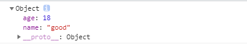
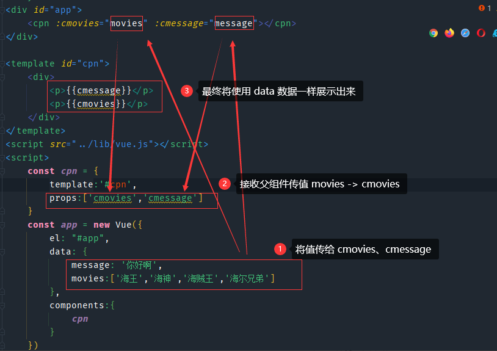

> 创建于2021年6月11日
>
> 作者：想想

[toc]


# 组件化开发

## 1、组件的基本使用

### 1.1、小demo

```html
<div id="app">
<!--  3、使用组件 -->
    <my-cpn></my-cpn>
    <my-cpn></my-cpn>
    <my-cpn></my-cpn>
    <my-cpn></my-cpn>
</div>
```

```js
/* 1、创建组件构造器 */
    const cpnC = Vue.extend({
        template:`
            <div>
                <h2>世界你好</h2>
            <div>
        `
    });
/* 2、组装组件 */
    Vue.component('my-cpn',cpnC);
```

Vue.extend（）创建的是一个组件构造器

Vue.component（）组册组件

### 1.2、局部组件

直接使用 Vue.component 组册组件，无论当前实例是否是在app内还是在 app1 内，只要是在 vue 的管理范围，都能使用，我们不建议直接使用 `Vue.component` ，我们可以在实例中去组册组件

```js
const app = new Vue({
  el: "#app",
  data: {
    message: '你好啊'
  },
  components:{
    cpn: cpnC
  }
})
```

这样注册后，才是局部组件， 只有在 app 内才可以使用，在真实开发中，常用的是局部组件，而且在一般的开发中，只会有一个实例。

### 1.3、父子组件

```js
    const cpnC2 = Vue.extend({
        template:`
            <div>
                <p>你好</p>
                <cpn1></cpn1>
            </div>
        `,
        components:{
            cpn1: cpnC1
        }
    });
```

在前面定义了 cpnC1 子组件，在 cpnC2 中调用 子组件，这样直接注册 cpnC2 时，父子组件都将会展示

​		模版的分离写法：

```html
<template id="cpn">
    <div>
        <p>Hello World</p>
    </div>
</template>
```

### 1.4、组件的数据存放

```js
    Vue.component('cpn',{
        template: '#cpn',
        data(){
            return{
                title : 'Hello'
            }
        }
    })
```

使用 `data` 函数后，在 `template` 标签中，可以使用 Mustache（胡子）语法 或者可以使用其他方法获取

> 这里的 data 为什么一定要是个函数？
>
> 在 js 中，一个实例对象被多次调用后，每次调用的都是同一个实例，操作时，会修改所有的对象，用函数返回 才能避免这个问题
>
> ```js
> const obj = {
>     name: 'hello',
>     age: 18
> }
> function abc() {
>     return obj
> }
> let obj1 = abc();
> let obj2 = abc();
> obj1.name='good';
> console.log(obj2)
> ```
>
> 
>
> 如何避免呢？
>
> ```js
> function abc() {
>     return {
>         name: 'hello',
>         age: 18
>     }
> }
> ```
>
> 这样就能避免了，这也就是 为什么 data 一定要是个函数

### 1.5、父传子

props 属性



props 的其他几种写法

```js
props:{
    cmovies:Array,
        message: {
            type:[String,Number],// 运行两种类型
                default: 'ABC'
        }
}
```

校验数据还支持：

String、 Number、Boolean、Object、Data、Function、Symbol、自定义类型

如果是 Array/Object 类型时，默认数据必须以函数返回

```js
props:{
    cmovies: {
        type:Array,
            default(){
                return []
            }
    }
}
```

### 1.6、子传父

```html
<div id="app">
    <cpn @item-click="cpnClick"></cpn>
</div>

<template id="cpn">
    <div>
        <button v-for="item in categories" @click="btnClick(item)">{{item.name}}</button>
    </div>
</template>
```

```js

    const cpn = {
        template: '#cpn',
        data(){
            return {
                categories: [
                    {
                        id:'001',
                        name:'热门推荐'
                    },
                    {
                        id:'002',
                        name:'手机数码'
                    },
                    {
                        id:'003',
                        name:'电脑办公'
                    }
                ]
            }
        },
        methods:{
            btnClick(item){
                // 发射事件
                console.log('发送',item.id)
                this.$emit('item-click',item.id);
            }
        }

    }

    const app = new Vue({
        el: "#app",
        data: {
            message: '你好啊',
        },
        components: {
            cpn
        },
        methods:{
            cpnClick(id){
                console.log('接收到',id);
            }
        }
    })
```

通过  this.$emit('item-click',item.id); 注册一个 v-on 指令 指令为 `item-click` 

#### 1.3.1、watch 语法

```javascript
        props:{
            name:String
        },
        data(){
            return{
                name:'Hello'
            }
        },
        watch:{
            name(newValue,oldValue){
                console.log(newValue,oldValue)
            }
        }
```

​		监听 name 的值，一旦发生改动，就触发 watch 中的 name 的值 打印 newValue 和 oldValue

### 1.7、父访子

通过 `this.$children` 访问子组件信息

在子主键中增加data() ->  name：'hello'

```js
data(){
    return{
        name:'hello'
    }
},
```

在父组件中 直接打印 `this.$children[0].name` 即可输出 hello，==注意：== 这样存在缺陷，因为我们是用`【0】` 数组的方式去取子组件的信息，如果此组件之前使用了其他组件，就需要修改 数组的下标，很不方便，因此引出另一个函数 `$refs`

```html
    <cpn ref="aaa"></cpn>
```

需要在使用组件的时候，添加这个属性

再使用 `this.$refs.aaa` 直接获取到这个子组件的信息，也可以通过 `this.$refs` 看到所有使用 ref 属性的子组件

### 1.8、子访问父

`this.$parent`,`this.$root`