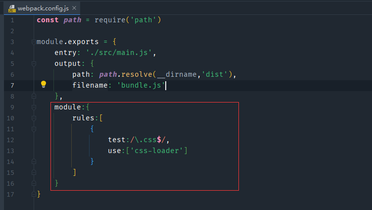

> 创建2021年6月17日
>
> 作者：想想

[toc]


## webpack安装

在此之前必须安装 node ，检查node版本

```sh
C:\Users\Array>node -v
v16.3.0
```

检查 webpage 版本

```sh
C:\Users\Array>webpack --version
'webpack' 不是内部或外部命令，也不是可运行的程序
或批处理文件。
```

==安装 webpage==

```sh
C:\Users\Array>npm install webpack@3.6.0 -g
npm notice
npm notice New minor version of npm available! 7.15.1 -> 7.17.0
npm notice Changelog: https://github.com/npm/cli/releases/tag/v7.17.0
npm notice Run npm install -g npm@7.17.0 to update!
npm notice
npm WARN deprecated resolve-url@0.2.1: https://github.com/lydell/resolve-url#deprecated
npm WARN deprecated fsevents@1.2.13: fsevents 1 will break on node v14+ and could be using insecure binaries. Upgrade to fsevents 2.
npm WARN deprecated chokidar@2.1.8: Chokidar 2 will break on node v14+. Upgrade to chokidar 3 with 15x less dependencies.

added 378 packages in 44s

C:\Users\Array>webpack --version
webpack 5.38.1
webpack-cli 4.7.0
webpack-dev-server 3.11.2
```


### 打包

```js
// main.js

const {add,mul} = require('./mathUtils.js')
```

这是引入 mathUtils.js 中的文件，这样直接引入后，直接在html里引入 main.js 时，add、mul 是不能使用的，此时可以使用 webpack 进行打包

```sh
webpack ./src/main.js ./dist/bundle.js
```

无论 main.js 引入了多少个文件，都会递归的进行查找，然后汇总到 bundle.js 中

我们可以创建一个 webpack.config.js 文件

```js
const path = require('path')

module.exports = {
    entry: './src/main.js',
    output: {
        path: path.resolve(__dirname,'dist'),
        filename: 'bundle.js'
    }
}
```

这样只要在项目中直接执行 `webpack` 即可将实现上面 webpack ./src/main.js ./dist/bundle.js  一样的效果。

### npm init

一般情况下，我们都会创建 package.json	用来示意这是一个npm工程， 执行 npm init  回车使用默认给的提示（建议不要使用中文）

执行完 npm init 会自动构建一个 package.json

```
{
  "name": "meetwebpack",
  "version": "1.0.0",
  "description": "",
  "main": "index.js",
  "scripts": {
    "test": "echo \"Error: no test specified\" && exit 1",
    "build": "webpack"
  },
  "author": "",
  "license": "ISC"
}
```

在 scripts 对象中，默认有 test ，我们可以直接执行 `npm run test` ，对此我们也可以添加 build 对象，执行`npm run build` 这时npm会自动帮我们执行 webpack 命令，

> 注意：如果是在终端中执行的 webpack 默认使用的是全局变量，除非到 node_module/webpack 中执行 `webpack` 才是使用本地，只有使用 `npm run  buld` 时，也只会优先使用本地

### loader

​		webpack 帮我们处理js之间相关的依赖，但是 webpack 仅仅能处理js 不能处理 图片、vue 等文件，这时，就要用到 loader 了。

```js
// main.js 中打包 normal.css 文件
require('./css/normal.css')
```

Error：==You may need an appropriate loader to handle this file type.==

[webpack 中文文档官网](https://www.webpackjs.com/)

安装 loader

```sh
npm install --save-dev css-loader
added 94 packages in 18s # 成功
```

我们可以看到再 package.json 中多了这一段

```js
"devDependencies": {
    "css-loader": "^5.2.6"
  }
```

然后我们在 webpack.config.js 文件中配置如下



```js
module:{
    rules:[
        {
            test:/\.css$/,
            use:['css-loader']
        }
    ]
}
```

安装、配置完成后，再次运行 npm run build  #成功运行#

打开浏览器后发现 先前写的 normal.css 文件并没有任何效果，原因是 css-loadr 只负责将css文件进行加载

安装 style-loader

```js
npm install style-loader --save-dev
```

修改 webpack.config.js 添加 style-loader 模块

```js
module:{
    rules:[
        {
            test:/\.css$/,
            use:['style-loader','css-loader']
        }
    ]
}
```

> 注意 style-loader 必须在 css-lodaer 前面

安装 less

```sh
npm install --save-dev less-loader less
```


如果要将 ES6 语法转成 ES5 ，那么就需要用到 babel

```sh
npm install --save-dev babel-loader@7 babel-core babel-preset-es2015
```


安装 vue-loader

```sh
npm install vue-loader vue-template-compler --save-dev
```


### 构建Vue

先安装vue模块

```sh
npm install vue --save
```

在 main.js 中直接引用

```js
import Vue from 'vue'

const app = new Vue({
    el:'#app',
    data:{
        message:'helloGood'
    }
})
```

使用 `npm install build` 重新 webapck 打包，发现不出效果，原因是 vue 在发布的时候有两个状态，分别是 runtime-only 和 runtime-complie，only模式中没有编译环境，==解决办法：在 webpack.config.js中添加如下代码== 再重新 npm install build 即可

```js
module.exports = {
    ...
	resolve:{
        alias:{
            'vue$':'vue/dist/vue.esm.js'
        }
    }
}
```

以上实现了 js 代码通过 webpack 加载 vue 模块，其 vue-cli 的模型已经实现

html 作为入口页面，其 document 一般不进行改动

```html
<body>
<div id="app">
</div>
<script src="dist/bundle.js"></script>
</body>
```

通过 main.js  `webpack` 生成的 bundle.js 使用 vue 模块

```js
import Vue from 'vue'
import App from './vue/app.vue'


new Vue({
    el:'#app',
    template: '<App/>',
    components:{
        App
    }
})
```

app.vue

```vue
<template>
  <div>
    <h2 class="title">{{message}}</h2>
    <button @click="btnClick">按钮</button>
    <h2>{{name}}</h2>
  </div>
</template>

<script>
export default {
  name: "app",
  data(){
    return{
      message: 'Hello world',
      name: 'Xiang'
    }
  },
  methods:{
    btnClick(){
      console.log('good');
    }
  }
}
</script>

<style scoped>
  .title{
    color: green;
  }
</style>
```

利用 webpack 实现 vue-cli 的模型就这样告一段落了


### plusings 版权

还是修改 webpack.config.js 

```js
module.exports = {
    ...
	plugins: [
        new webpack.BannerPlugin('最终版权归 Xiang 所有')
    ]
}
```

重新打包后，在 bundle.js 就有 “最终版权归 Xiang 所有” 这一段注释了


#### 自动添加Html文件

因为我们启动浏览器始终要用到 html 文件，但是 `npm install build` 只能帮我们处理 js 文件，这是需要借助新的插件 `HtmlWebpackPlugin` 插件，这个插件会自动生成 index.html （可以指定模板），自动会插入 script 标签

```sh
npm install html-webpack-plugin --save-dev
```

在 webpack.config.js 中

```js
const HtmlWebapckPlugin = require('html-webpack-plugin')

module.exports = {
    ...
	plugins: [
        ...
        new HtmlWebapckPlugin({
            // 作为模板进行生成，里面只需要保存 <div id="app"></div> 即可，scirpt 会自动插入
            template: 'index.html'	
        })
    ]
}
```

#### 丑化代码

```sh
npm install uglifyjs-webpack-plugin@1.1.1 --save-dev
```

在 webpack.config.js 中

```
const uglifyJsPlugin = require('uglifyjs-webpack-plugin')

module.exports = {
    ...
	plugins: [
        ...
        new uglifyJsPlugin()
    ]
}
```


### 搭建本地服务器

```sh
npm install --save-dev webpack-dev-server@2.9.1
```

在 webpack.config.js 中

```js
module.exports = {
    ...
	devServer:{
        // 当前根目录文件
        contentBase: './dist',
        // 是否事实监听
        inline:true,
        port:8080,
		// 在SPA页面中，依赖 HTML5 的 history 模式
        // historyApiFallback
    }
}
```


执行 .\node_modules\\.bin\webpack-dev-server 命令

或者可以修改 package.json 

```js
"scripts": {
    ...
    "dev":"webpack-dev-server --open"
    // 加上 --open 后，启动服务器会自动打开浏览器
  },
```

再执行

```sh
webpack-dev-server
```

> 这种热部署的形式，只是监听文件，如果出现修改，则放到内存中进行编译，并不会放进磁盘里。如果要想放到磁盘里，只能通过 `npm install build` 打包部署


### webpack 分离

对配置进行分离....  90集 有点复杂.. 自己看吧